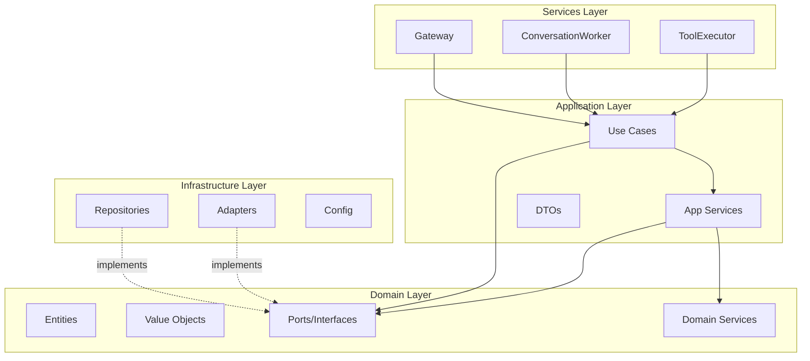

# Design Document: Architecture Refactor

## Overview

This design transforms the SomaAgent01 codebase from a collection of monolithic modules into a Clean Architecture implementation with clear separation of concerns. The refactor applies Domain-Driven Design (DDD) principles, the Repository pattern, and Use Case pattern to create a maintainable, testable, and extensible system.

**CRITICAL**: This refactor PRESERVES and BUILDS UPON existing production infrastructure. We do NOT duplicate existing implementations - we create domain ports (interfaces) that wrap them.

## Existing Infrastructure to Preserve

The following production-ready components MUST be preserved and wrapped with domain ports:

| Component | Location | Status |
|-----------|----------|--------|
| `SessionStore`, `SessionCache`, `PostgresSessionStore`, `RedisSessionCache` | `services/common/session_repository.py` | Production-ready |
| `KafkaEventBus`, `KafkaSettings` | `services/common/event_bus.py` | Production-ready |
| `PolicyClient`, `PolicyRequest` | `services/common/policy_client.py` | Production-ready |
| `SecretManager` | `services/common/secret_manager.py` | Production-ready |
| `ToolRegistry`, `ToolDefinition` | `services/tool_executor/tool_registry.py` | Production-ready |
| `ExecutionEngine`, `ExecutionResult` | `services/tool_executor/execution_engine.py` | Production-ready |
| `SomaBrainClient` | `python/integrations/somabrain_client.py` | Production-ready |
| `MemoryReplicaStore` | `src/core/domain/memory/replica_store.py` | Production-ready |
| `cfg` configuration facade | `src/core/config/` | Production-ready |

## Architecture

### Target Directory Structure

```
src/
├── core/
│   ├── domain/
│   │   ├── entities/           # Business entities (Session, Message, Tool, Memory)
│   │   ├── value_objects/      # Immutable value types (SessionId, MessageContent)
│   │   ├── services/           # Domain services (MessageValidator, ToolMatcher)
│   │   └── ports/              # Interfaces for external dependencies
│   │       ├── repositories/   # Data access interfaces
│   │       ├── adapters/       # External service interfaces
│   │       └── events/         # Event bus interfaces
│   │
│   ├── application/
│   │   ├── use_cases/          # Business operations
│   │   │   ├── conversation/   # ProcessMessage, BuildContext
│   │   │   ├── tools/          # ExecuteTool, ValidateToolRequest
│   │   │   ├── memory/         # StoreMemory, RecallMemory, ConsolidateMemory
│   │   │   └── session/        # CreateSession, GetSession, UpdateSession
│   │   ├── services/           # Application services
│   │   │   ├── context_builder.py
│   │   │   ├── tool_orchestrator.py
│   │   │   └── response_generator.py
│   │   └── dto/                # Data transfer objects
│   │
│   └── infrastructure/
│       ├── adapters/           # External service implementations
│       │   ├── somabrain/      # SomaBrain client adapter
│       │   ├── llm/            # LLM provider adapters
│       │   ├── policy/         # OPA policy adapter
│       │   └── telemetry/      # Telemetry adapter
│       ├── repositories/       # Data access implementations
│       │   ├── postgres/       # PostgreSQL repositories
│       │   ├── redis/          # Redis cache implementations
│       │   └── kafka/          # Kafka event bus
│       └── config/             # Configuration (existing, refined)
│
├── services/                   # Thin service entry points
│   ├── gateway/               # HTTP API (< 100 lines main.py)
│   ├── conversation_worker/   # Kafka consumer (< 150 lines main.py)
│   ├── tool_executor/         # Tool execution (< 150 lines main.py)
│   └── delegation_worker/     # Task delegation (< 100 lines main.py)
│
└── shared/                    # Cross-cutting concerns
    ├── logging/               # Structured logging
    ├── tracing/               # OpenTelemetry
    └── errors/                # Error types and handlers
```

### Layer Dependencies



## Components and Interfaces

### 1. Domain Ports (Interfaces) - Wrapping Existing Infrastructure

The domain ports define interfaces that wrap existing production implementations. This allows the domain layer to remain independent of infrastructure while reusing battle-tested code.

```python
# src/core/domain/ports/repositories/session_repository.py
"""Port interface wrapping services.common.session_repository implementations."""
from abc import ABC, abstractmethod
from typing import Any, Optional, List

class SessionRepositoryPort(ABC):
    """Abstract interface for session persistence.
    
    Implementations:
        - services.common.session_repository.PostgresSessionStore (production)
    """
    @abstractmethod
    async def get_envelope(self, session_id: str) -> Optional[Any]: ...
    
    @abstractmethod
    async def append_event(self, session_id: str, event: dict[str, Any]) -> None: ...
    
    @abstractmethod
    async def list_events(self, session_id: str, limit: int = 100) -> List[dict[str, Any]]: ...
    
    @abstractmethod
    async def delete_session(self, session_id: str) -> dict[str, int]: ...


class SessionCachePort(ABC):
    """Abstract interface for session caching.
    
    Implementations:
        - services.common.session_repository.RedisSessionCache (production)
    """
    @abstractmethod
    async def get(self, key: str) -> Optional[dict[str, Any]]: ...
    
    @abstractmethod
    async def set(self, key: str, value: dict[str, Any], ttl: int = 0) -> None: ...
    
    @abstractmethod
    async def delete(self, key: str) -> None: ...
```

```python
# src/core/domain/ports/adapters/memory_adapter.py
"""Port interface wrapping python.integrations.somabrain_client."""
from abc import ABC, abstractmethod
from typing import Any, Dict, List

class MemoryAdapterPort(ABC):
    """Abstract interface for memory operations.
    
    Implementations:
        - Adapter wrapping python.integrations.somabrain_client.SomaBrainClient
    """
    @abstractmethod
    async def build_context(self, payload: Dict[str, Any]) -> List[Dict[str, Any]]: ...
    
    @abstractmethod
    async def get_weights(self) -> Dict[str, Any]: ...
    
    @abstractmethod
    async def publish_reward(self, payload: Dict[str, Any]) -> Dict[str, Any]: ...
```

```python
# src/core/domain/ports/adapters/policy_adapter.py
"""Port interface wrapping services.common.policy_client."""
from abc import ABC, abstractmethod
from typing import Any, Optional

class PolicyAdapterPort(ABC):
    """Abstract interface for policy evaluation.
    
    Implementations:
        - Adapter wrapping services.common.policy_client.PolicyClient
    """
    @abstractmethod
    async def evaluate(
        self,
        tenant: str,
        persona_id: Optional[str],
        action: str,
        resource: str,
        context: dict[str, Any],
    ) -> bool: ...
```

```python
# src/core/domain/ports/events/event_bus.py
"""Port interface wrapping services.common.event_bus."""
from abc import ABC, abstractmethod
from typing import Any, Callable, Optional
import asyncio

class EventBusPort(ABC):
    """Abstract interface for event publishing/consuming.
    
    Implementations:
        - services.common.event_bus.KafkaEventBus (production)
    """
    @abstractmethod
    async def publish(self, topic: str, payload: Any, headers: dict[str, Any] | None = None) -> None: ...
    
    @abstractmethod
    async def consume(
        self,
        topic: str,
        group_id: str,
        handler: Callable[[dict[str, Any]], Any],
        stop_event: Optional[asyncio.Event] = None,
    ) -> None: ...
    
    @abstractmethod
    async def close(self) -> None: ...
```

### 2. Use Cases (Orchestrating Existing Infrastructure)

Use cases orchestrate existing infrastructure through ports. They contain NO infrastructure code - only business logic coordination.

```python
# src/core/application/use_cases/conversation/process_message.py
"""Process message use case - orchestrates existing infrastructure."""
from dataclasses import dataclass
from typing import Any, Optional

from src.core.domain.ports.repositories.session_repository import SessionRepositoryPort
from src.core.domain.ports.adapters.memory_adapter import MemoryAdapterPort


@dataclass
class ProcessMessageInput:
    session_id: str
    message: str
    persona_id: Optional[str]
    tenant: str
    metadata: dict[str, Any]


@dataclass
class ProcessMessageOutput:
    response: str
    session_id: str
    tool_calls: list[dict[str, Any]]
    metadata: dict[str, Any]


class ProcessMessageUseCase:
    """Orchestrates message processing through existing infrastructure.
    
    This use case coordinates:
        - Session retrieval via SessionRepositoryPort (wraps PostgresSessionStore)
        - Context building via MemoryAdapterPort (wraps SomaBrainClient)
        - Event persistence via SessionRepositoryPort
    """
    
    def __init__(
        self,
        session_repo: SessionRepositoryPort,
        memory_adapter: MemoryAdapterPort,
    ):
        self._session_repo = session_repo
        self._memory_adapter = memory_adapter
    
    async def execute(self, input_data: ProcessMessageInput) -> ProcessMessageOutput:
        # 1. Get session envelope from existing PostgresSessionStore
        envelope = await self._session_repo.get_envelope(input_data.session_id)
        
        # 2. Build context using existing SomaBrainClient
        context_payload = {
            "session_id": input_data.session_id,
            "message": input_data.message,
            "persona_id": input_data.persona_id,
            "tenant": input_data.tenant,
        }
        context = await self._memory_adapter.build_context(context_payload)
        
        # 3. Store event using existing PostgresSessionStore
        event = {
            "role": "user",
            "content": input_data.message,
            "session_id": input_data.session_id,
            "persona_id": input_data.persona_id,
            "metadata": input_data.metadata,
        }
        await self._session_repo.append_event(input_data.session_id, event)
        
        return ProcessMessageOutput(
            response="",  # Response generated by LLM in conversation worker
            session_id=input_data.session_id,
            tool_calls=[],
            metadata={"context_size": len(context)},
        )
```

### 3. Infrastructure Adapters (Wrapping Existing Implementations)

Adapters implement domain ports by delegating to existing production infrastructure. They add NO new functionality - only interface compliance.

```python
# src/core/infrastructure/adapters/somabrain/adapter.py
"""Adapter wrapping existing python.integrations.somabrain_client."""
from typing import Any, Dict, List

from src.core.domain.ports.adapters.memory_adapter import MemoryAdapterPort
from python.integrations.somabrain_client import (
    build_context_async,
    get_weights_async,
    publish_reward_async,
)


class SomaBrainMemoryAdapter(MemoryAdapterPort):
    """Implements MemoryAdapterPort using existing SomaBrainClient functions.
    
    This adapter delegates ALL operations to the existing production
    implementation in python.integrations.somabrain_client.
    """
    
    async def build_context(self, payload: Dict[str, Any]) -> List[Dict[str, Any]]:
        return await build_context_async(payload)
    
    async def get_weights(self) -> Dict[str, Any]:
        return await get_weights_async()
    
    async def publish_reward(self, payload: Dict[str, Any]) -> Dict[str, Any]:
        return await publish_reward_async(payload)
```

```python
# src/core/infrastructure/adapters/policy/adapter.py
"""Adapter wrapping existing services.common.policy_client."""
from typing import Any, Optional

from src.core.domain.ports.adapters.policy_adapter import PolicyAdapterPort
from services.common.policy_client import PolicyClient, PolicyRequest


class OPAPolicyAdapter(PolicyAdapterPort):
    """Implements PolicyAdapterPort using existing PolicyClient.
    
    Delegates to services.common.policy_client.PolicyClient.
    """
    
    def __init__(self, client: Optional[PolicyClient] = None):
        self._client = client or PolicyClient()
    
    async def evaluate(
        self,
        tenant: str,
        persona_id: Optional[str],
        action: str,
        resource: str,
        context: dict[str, Any],
    ) -> bool:
        request = PolicyRequest(
            tenant=tenant,
            persona_id=persona_id,
            action=action,
            resource=resource,
            context=context,
        )
        return await self._client.evaluate(request)
```

```python
# src/core/infrastructure/repositories/session/adapter.py
"""Adapter wrapping existing services.common.session_repository."""
from typing import Any, List, Optional

from src.core.domain.ports.repositories.session_repository import (
    SessionRepositoryPort,
    SessionCachePort,
)
from services.common.session_repository import (
    PostgresSessionStore,
    RedisSessionCache,
)


class PostgresSessionRepositoryAdapter(SessionRepositoryPort):
    """Implements SessionRepositoryPort using existing PostgresSessionStore.
    
    Delegates ALL operations to services.common.session_repository.PostgresSessionStore.
    """
    
    def __init__(self, store: Optional[PostgresSessionStore] = None):
        self._store = store or PostgresSessionStore()
    
    async def get_envelope(self, session_id: str) -> Optional[Any]:
        return await self._store.get_envelope(session_id)
    
    async def append_event(self, session_id: str, event: dict[str, Any]) -> None:
        await self._store.append_event(session_id, event)
    
    async def list_events(self, session_id: str, limit: int = 100) -> List[dict[str, Any]]:
        return await self._store.list_events(session_id, limit)
    
    async def delete_session(self, session_id: str) -> dict[str, int]:
        return await self._store.delete_session(session_id)


class RedisSessionCacheAdapter(SessionCachePort):
    """Implements SessionCachePort using existing RedisSessionCache.
    
    Delegates ALL operations to services.common.session_repository.RedisSessionCache.
    """
    
    def __init__(self, cache: Optional[RedisSessionCache] = None):
        self._cache = cache or RedisSessionCache()
    
    async def get(self, key: str) -> Optional[dict[str, Any]]:
        return await self._cache.get(key)
    
    async def set(self, key: str, value: dict[str, Any], ttl: int = 0) -> None:
        await self._cache.set(key, value, ttl)
    
    async def delete(self, key: str) -> None:
        await self._cache.delete(key)
```

### 4. Service Entry Points (Thin)

```python
# services/conversation_worker/main.py (< 150 lines)
"""Conversation worker - thin Kafka consumer entry point."""
import asyncio
from src.core.config import cfg
from src.core.application.use_cases.conversation import ProcessMessageUseCase
from src.core.infrastructure.adapters.somabrain import SomaBrainAdapter
from src.core.infrastructure.repositories.postgres import PostgresSessionRepository
from services.common.event_bus import KafkaEventBus

class ConversationWorker:
    def __init__(self):
        # Wire up dependencies
        self._session_repo = PostgresSessionRepository(dsn=cfg.settings().database.dsn)
        self._memory_adapter = SomaBrainAdapter(...)
        self._process_message = ProcessMessageUseCase(
            session_repo=self._session_repo,
            memory_adapter=self._memory_adapter,
            ...
        )
        self._bus = KafkaEventBus(...)
    
    async def start(self):
        await self._bus.consume(
            topic=cfg.env("CONVERSATION_INBOUND"),
            group=cfg.env("CONVERSATION_GROUP"),
            handler=self._handle_event,
        )
    
    async def _handle_event(self, event: dict):
        result = await self._process_message.execute(
            ProcessMessageInput(**event)
        )
        await self._publish_response(result)

async def main():
    worker = ConversationWorker()
    await worker.start()

if __name__ == "__main__":
    asyncio.run(main())
```

## Data Models

### Domain Entities

```python
# src/core/domain/entities/session.py
from dataclasses import dataclass, field
from datetime import datetime
from typing import List, Optional
from ..value_objects import SessionId, TenantId

@dataclass
class Session:
    id: SessionId
    tenant_id: TenantId
    persona_id: Optional[str]
    created_at: datetime
    updated_at: datetime
    metadata: dict = field(default_factory=dict)

@dataclass
class SessionEvent:
    id: str
    session_id: SessionId
    event_type: str  # "user", "assistant", "tool", "system"
    content: str
    timestamp: datetime
    metadata: dict = field(default_factory=dict)
```

### Value Objects

```python
# src/core/domain/value_objects/identifiers.py
from dataclasses import dataclass

@dataclass(frozen=True)
class SessionId:
    value: str
    
    def __post_init__(self):
        if not self.value or len(self.value) < 8:
            raise ValueError("Invalid session ID")

@dataclass(frozen=True)
class TenantId:
    value: str
    
    def __post_init__(self):
        if not self.value:
            raise ValueError("Tenant ID cannot be empty")
```

## Correctness Properties

*A property is a characteristic or behavior that should hold true across all valid executions of a system-essentially, a formal statement about what the system should do. Properties serve as the bridge between human-readable specifications and machine-verifiable correctness guarantees.*

### Property 1: File Size Limits
*For any* Python file in the codebase, the line count SHALL be less than 500 lines, with service entry points (main.py) limited to 150 lines.
**Validates: Requirements 1.7, 2.6, 3.6, 14.1, 14.2**

### Property 2: Repository Pattern Consistency
*For any* data access operation (Postgres, Redis, Kafka), the operation SHALL go through a repository or adapter interface defined in `core/domain/ports/`.
**Validates: Requirements 11.1, 11.2, 11.3, 11.4**

### Property 3: Use Case Isolation
*For any* business operation, the operation SHALL be encapsulated in a use case class that receives dependencies via constructor injection.
**Validates: Requirements 12.1, 12.2, 12.3, 12.4**

### Property 4: Configuration Single Source
*For any* configuration access in the codebase, it SHALL import from `src.core.config` and not from any other configuration module.
**Validates: Requirements 4.1, 4.2**

### Property 5: Adapter Pattern for External Services
*For any* external service call (SomaBrain, LLM providers, OPA), the call SHALL go through an adapter implementing a port interface.
**Validates: Requirements 1.3, 3.2, 4.4**

### Property 6: Service Entry Point Thinness
*For any* service main.py file, it SHALL contain only dependency wiring and event loop setup, with business logic delegated to use cases.
**Validates: Requirements 1.7, 3.6, 8.5**

### Property 7: No Direct Infrastructure Imports in Domain
*For any* module in `core/domain/`, it SHALL NOT import from `core/infrastructure/` or external libraries (except standard library and typing).
**Validates: Requirements 11.4, 12.4**

### Property 8: Import Path Canonicalization
*For any* import statement, it SHALL use the canonical module path without going through re-export shims.
**Validates: Requirements 13.1, 13.2, 13.3**

## Error Handling

### Error Hierarchy

```python
# src/shared/errors/base.py
class SomaError(Exception):
    """Base error for all SomaAgent errors."""
    def __init__(self, message: str, code: str, details: dict = None):
        self.message = message
        self.code = code
        self.details = details or {}
        super().__init__(message)

class DomainError(SomaError):
    """Errors from domain logic."""
    pass

class ApplicationError(SomaError):
    """Errors from application/use case layer."""
    pass

class InfrastructureError(SomaError):
    """Errors from infrastructure (DB, external services)."""
    pass
```

### Error Handling Strategy

1. **Domain Layer**: Raise `DomainError` for business rule violations
2. **Application Layer**: Catch domain errors, wrap infrastructure errors in `ApplicationError`
3. **Infrastructure Layer**: Catch external errors, wrap in `InfrastructureError`
4. **Service Layer**: Catch all errors, log, and return appropriate HTTP/event responses

## Testing Strategy

### Dual Testing Approach

This design requires both unit tests and property-based tests:

- **Unit tests**: Verify specific examples, edge cases, and error conditions
- **Property-based tests**: Verify universal properties that should hold across all inputs

### Property-Based Testing Framework

We will use **Hypothesis** for Python property-based testing.

### Test Organization

```
tests/
├── unit/
│   ├── domain/           # Entity and value object tests
│   ├── application/      # Use case tests with mocked ports
│   └── infrastructure/   # Adapter tests with real/fake backends
├── integration/
│   ├── repositories/     # Repository tests against real DB
│   └── adapters/         # Adapter tests against real services
└── properties/
    ├── test_file_sizes.py           # Property 1
    ├── test_repository_pattern.py   # Property 2
    ├── test_use_case_isolation.py   # Property 3
    ├── test_config_source.py        # Property 4
    ├── test_adapter_pattern.py      # Property 5
    ├── test_service_thinness.py     # Property 6
    ├── test_domain_isolation.py     # Property 7
    └── test_import_paths.py         # Property 8
```

### Property Test Examples

```python
# tests/properties/test_file_sizes.py
from hypothesis import given, strategies as st
import ast
from pathlib import Path

@given(st.sampled_from(list(Path("src").rglob("*.py"))))
def test_file_size_limit(filepath: Path):
    """
    **Feature: architecture-refactor, Property 1: File Size Limits**
    **Validates: Requirements 1.7, 2.6, 3.6, 14.1, 14.2**
    """
    content = filepath.read_text()
    line_count = len(content.splitlines())
    
    if "main.py" in filepath.name:
        assert line_count <= 150, f"{filepath} exceeds 150 lines ({line_count})"
    else:
        assert line_count <= 500, f"{filepath} exceeds 500 lines ({line_count})"
```

```python
# tests/properties/test_repository_pattern.py
from hypothesis import given, strategies as st
import ast
from pathlib import Path

@given(st.sampled_from(list(Path("src/core/application").rglob("*.py"))))
def test_no_direct_db_access(filepath: Path):
    """
    **Feature: architecture-refactor, Property 2: Repository Pattern Consistency**
    **Validates: Requirements 11.1, 11.2, 11.3, 11.4**
    """
    content = filepath.read_text()
    tree = ast.parse(content)
    
    forbidden_imports = {"asyncpg", "redis", "aiokafka"}
    for node in ast.walk(tree):
        if isinstance(node, ast.Import):
            for alias in node.names:
                assert alias.name not in forbidden_imports
        elif isinstance(node, ast.ImportFrom):
            assert node.module not in forbidden_imports
```

```python
# tests/properties/test_config_source.py
from hypothesis import given, strategies as st
import ast
from pathlib import Path

@given(st.sampled_from(list(Path("src").rglob("*.py"))))
def test_config_single_source(filepath: Path):
    """
    **Feature: architecture-refactor, Property 4: Configuration Single Source**
    **Validates: Requirements 4.1, 4.2**
    """
    content = filepath.read_text()
    tree = ast.parse(content)
    
    forbidden_config_imports = {
        "python.helpers.settings",
        "services.common.admin_settings",
        "services.common.registry",
    }
    
    for node in ast.walk(tree):
        if isinstance(node, ast.ImportFrom) and node.module:
            assert node.module not in forbidden_config_imports
```
