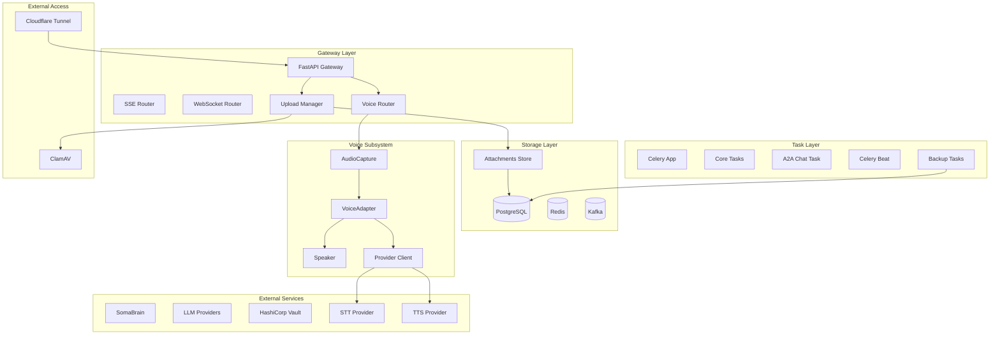
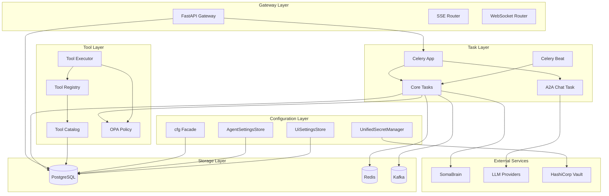
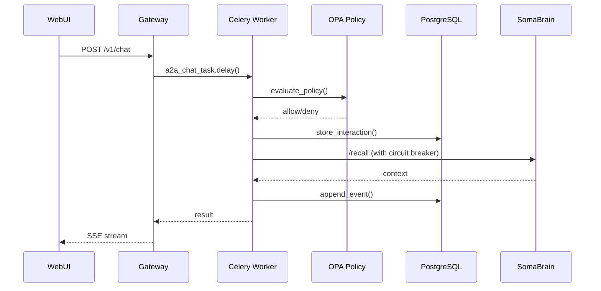
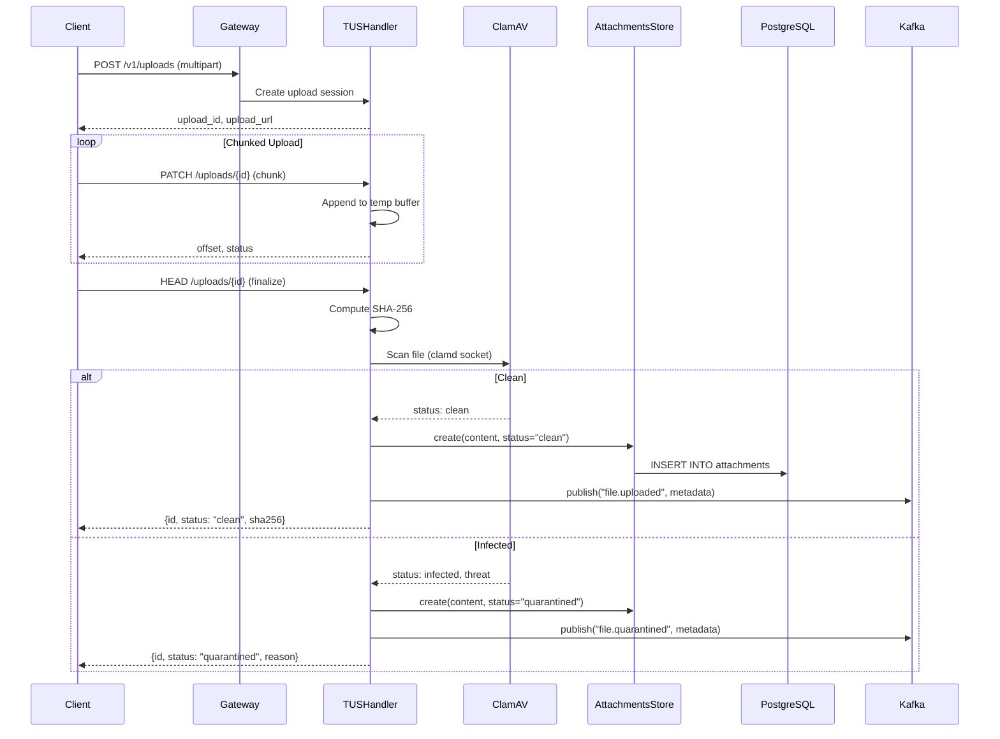
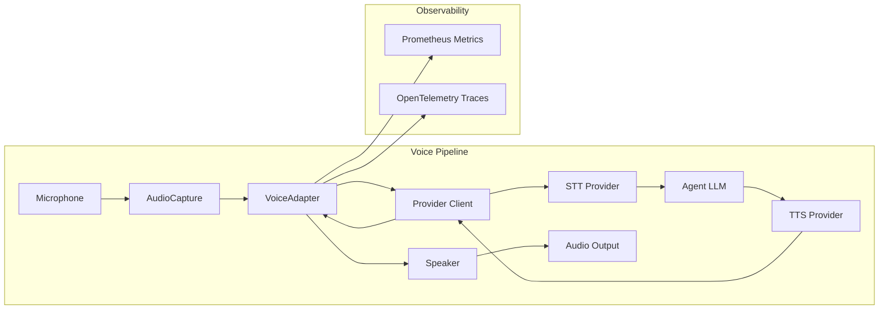
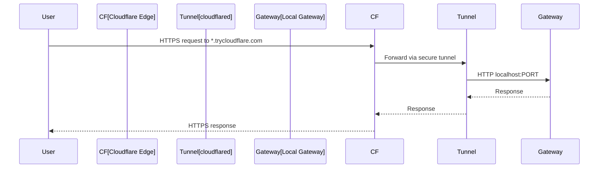
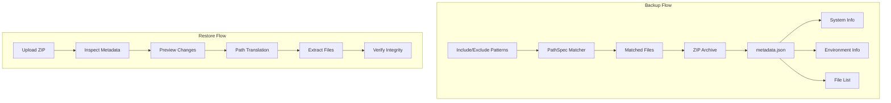
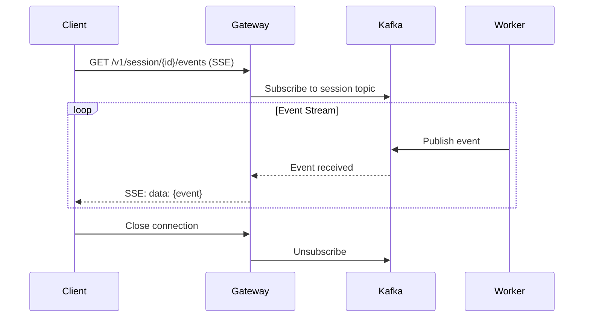
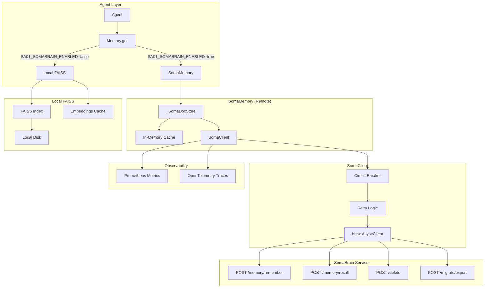
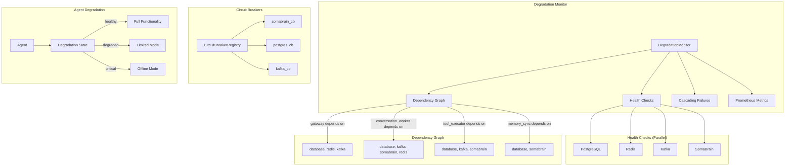

# Design Document: Canonical Architecture Cleanup

## Overview

This design document specifies the technical architecture for completing the canonical architecture cleanup and full Celery-Only Architecture integration for SomaAgent01. The implementation will eliminate all VIBE violations, consolidate 5 settings systems into 1, migrate from file-based to PostgreSQL-backed storage, and establish production-grade patterns for task execution, tool management, and degradation handling.

### Goals

1. Achieve 100% VIBE Coding Rules compliance
2. Remove all 8 persist_chat import violations
3. Consolidate settings into canonical `cfg` facade
4. Implement Celery Canvas patterns with OPA integration
5. Establish unified tool repository with permission control
6. Implement production-grade degradation mode

### Non-Goals

- Changing the core agent conversation loop
- Modifying LLM provider integrations
- Altering the SomaBrain API contract
- Changing the WebUI framework (Alpine.js)

---

## Extended Architecture Components (Added December 9, 2025)

The following sections document additional subsystems that integrate with the canonical architecture.

### High-Level Extended Architecture



## Architecture

### High-Level Architecture Diagram



### Component Interaction Flow



## Components and Interfaces

### 1. Configuration Facade (`src/core/config/`)

The canonical configuration system consolidates 5 existing systems into a single facade.

```python
# src/core/config/__init__.py
class ConfigFacade:
    """Singleton configuration facade - SINGLE SOURCE OF TRUTH."""
    
    def env(self, key: str, default: Any = None) -> Any:
        """Get configuration value with SA01_ prefix priority."""
        # Priority: SA01_* env → Raw env → YAML/JSON → Defaults
        pass
    
    def flag(self, key: str) -> bool:
        """Get boolean feature flag."""
        pass
    
    def opa_url(self) -> Optional[str]:
        """Get OPA policy URL."""
        pass

cfg = ConfigFacade()  # Singleton instance
```

**Migration Path:**
| Current System | Action | Target |
|----------------|--------|--------|
| `SA01Settings` | DEPRECATE | `cfg.env()` |
| `BaseServiceSettings` | DEPRECATE | `cfg.env()` |
| `ADMIN_SETTINGS` | REFACTOR | `cfg.env()` |
| `python/helpers/settings.py` | SPLIT | UI conversion stays, config → `cfg` |
| `env.py` | DEPRECATE | `cfg.env()` |
| `ServiceRegistry` | DEPRECATE | `cfg` ConfigRegistry |

### 2. Session Persistence (`services/common/session_repository.py`)

PostgreSQL-backed session storage replacing file-based persistence.

```python
class PostgresSessionStore:
    """Canonical session persistence - NO FILE STORAGE."""
    
    async def append_event(self, session_id: str, event: SessionEvent) -> None:
        """Append event to session timeline."""
        pass
    
    async def delete_session(self, session_id: str) -> None:
        """Delete session and cascade to attachments."""
        pass
    
    async def update_metadata(self, session_id: str, metadata: dict) -> None:
        """Update session envelope metadata (for rename)."""
        pass
    
    async def health_check(self) -> None:
        """Verify database connectivity."""
        pass
```

### 3. Celery Task Architecture (`python/tasks/`)

Consolidated task module with Canvas patterns and OPA integration.

```python
# python/tasks/core_tasks.py
from celery import shared_task, chain, group, chord
from prometheus_client import Counter, Histogram

TASK_COUNTER = Counter('celery_tasks_total', 'Total tasks', ['task'])
TASK_DURATION = Histogram('celery_task_duration_seconds', 'Task duration', ['task'])

@shared_task(
    bind=True,
    max_retries=3,
    autoretry_for=(Exception,),
    retry_backoff=True,
    retry_jitter=True,
    soft_time_limit=300,
    time_limit=600,
    rate_limit='10/m'
)
def build_context(self, session_id: str, tenant_id: str) -> dict:
    """Build conversation context from session history."""
    pass

@shared_task(bind=True, max_retries=3)
def evaluate_policy(self, tenant_id: str, action: str, resource: str) -> bool:
    """Evaluate OPA policy for authorization."""
    pass

@shared_task(bind=True, max_retries=3)
def store_interaction(self, session_id: str, interaction: dict) -> None:
    """Store interaction in PostgreSQL."""
    pass

@shared_task(bind=True, max_retries=3)
def feedback_loop(self, session_id: str, feedback: dict) -> None:
    """Process feedback and send to SomaBrain."""
    pass

@shared_task(bind=True, max_retries=3)
def rebuild_index(self, tenant_id: str) -> None:
    """Rebuild search index for tenant."""
    pass

@shared_task(bind=True, max_retries=1)
def publish_metrics(self) -> None:
    """Publish Prometheus metrics."""
    pass

@shared_task(bind=True, max_retries=1)
def cleanup_sessions(self, max_age_hours: int = 24) -> int:
    """Cleanup expired sessions."""
    pass
```

**Beat Schedule Configuration:**
```python
# python/tasks/celery_app.py
app.conf.beat_schedule = {
    'publish-metrics-every-minute': {
        'task': 'python.tasks.core_tasks.publish_metrics',
        'schedule': 60.0,
    },
    'cleanup-expired-sessions-hourly': {
        'task': 'python.tasks.core_tasks.cleanup_sessions',
        'schedule': 3600.0,
        'kwargs': {'max_age_hours': 24},
    },
}
app.conf.beat_scheduler = 'celery.beat:DatabaseScheduler'
```

**Task Queue Routing:**
```python
app.conf.task_routes = {
    'python.tasks.core_tasks.build_context': {'queue': 'default'},
    'python.tasks.core_tasks.evaluate_policy': {'queue': 'fast_a2a'},
    'python.tasks.a2a_chat_task.*': {'queue': 'fast_a2a'},
    'python.tasks.core_tasks.rebuild_index': {'queue': 'heavy'},
}
```

### 4. Tool Repository (`services/common/tool_catalog.py`)

Unified tool catalog with OPA permission control.

```python
class ToolCatalogStore:
    """PostgreSQL-backed tool catalog with tenant isolation."""
    
    async def is_enabled(self, tool_name: str, tenant_id: str = None) -> bool:
        """Check if tool is enabled for tenant."""
        # Check tenant_tool_flags first, fallback to global catalog
        pass
    
    async def register_tool(self, tool: ToolCatalogEntry) -> None:
        """Register tool in catalog with JSON schema."""
        pass
    
    async def set_tenant_flag(self, tenant_id: str, tool_name: str, enabled: bool) -> None:
        """Set tenant-specific tool flag."""
        pass
    
    async def get_tools_for_tenant(self, tenant_id: str) -> List[ToolCatalogEntry]:
        """Get all enabled tools for tenant."""
        pass
```

**OPA Policy Integration:**
```rego
# policy/tool_policy.rego
package somaagent.tools

default allow = false

allow {
    input.action == "tool.request"
    tool_enabled_for_tenant
    not tool_in_deny_list
}

tool_enabled_for_tenant {
    data.tenant_tool_flags[input.tenant][input.resource].enabled == true
}

tool_enabled_for_tenant {
    # Fallback to global catalog
    not data.tenant_tool_flags[input.tenant][input.resource]
    data.tool_catalog[input.resource].enabled == true
}

tool_in_deny_list {
    input.resource == data.deny_list[_]
}
```

### 5. Circuit Breaker (`src/core/clients/somabrain.py`)

Enhanced circuit breaker with half-open state and metrics.

```python
class SomaBrainClient:
    """SomaBrain client with production-grade circuit breaker."""
    
    def __init__(self):
        # Configurable via cfg.env()
        self._cb_threshold = int(cfg.env("SA01_SOMA_CB_THRESHOLD", "5"))
        self._cb_cooldown_sec = int(cfg.env("SA01_SOMA_CB_COOLDOWN_SEC", "30"))
        self._cb_half_open_max_calls = int(cfg.env("SA01_SOMA_CB_HALF_OPEN_CALLS", "3"))
        
        # State: closed, open, half-open
        self._cb_state = "closed"
        self._cb_failures = 0
        self._cb_open_until = 0.0
        
        # Prometheus metrics
        self._cb_state_gauge = Gauge('somabrain_circuit_breaker_state', 'CB state')
        self._cb_failures_counter = Counter('somabrain_circuit_breaker_failures_total', 'CB failures')
    
    async def _request(self, method: str, url: str, **kwargs):
        """Request with circuit breaker protection."""
        # State machine: closed → open → half-open → closed
        pass
```

## Constitution-Centric Prompt Builder (New)

- **ConstitutionPromptProvider**: Fetches signed Constitution from SomaBrain/constitution service; verifies signature/hash; caches in memory with short TTL; exposes reload hook; fail-closed on invalid/missing artifact. Exposes `constitution_version`.
- **PersonaProvider**: Loads per-tenant/agent persona prompt fragments + tool preferences; OPA-guarded updates; versioned; cached in memory.
- **PromptBuilder**: Per-request composition (RAM only): Constitution base → persona overlay → planner priors (from SomaBrain `plan_suggest`) → health/safety banners → analysis glue. Injects `constitution_version` & `persona_version` into metadata/feedback. No filesystem reads or baked-in defaults. Cache invalidates on Constitution/persona reload.
- **Tool Exposure**: Tools presented to LLM are filtered by Constitution allow/deny + OPA; tool prompts tagged with constitution/persona scope.
- **Failure Mode**: If Constitution verification/fetch fails, return 503/`constitution_unavailable`; no fallback prompt.

## Planner Priors Integration (New)

- Conversation worker requests priors via SomaBrain `plan_suggest` using tenant/persona/session/intent/tags.
- Priors injected as a concise system block; prompt assembly continues without priors on miss; metric `planner_priors_miss`.
- Events/feedback tagged with priors metadata for recall/learning.


### 6. File Upload System (`services/gateway/routers/uploads_full.py`)

TUS protocol implementation with antivirus scanning.

```python
class TUSUploadHandler:
    """Resumable file uploads with integrity verification."""
    
    async def create_upload(self, metadata: dict) -> str:
        """Create upload session, return upload_id."""
        pass
    
    async def append_chunk(self, upload_id: str, chunk: bytes, offset: int) -> int:
        """Append chunk, return new offset."""
        pass
    
    async def finalize_upload(self, upload_id: str) -> AttachmentRecord:
        """Finalize upload: hash verification, AV scan, store."""
        # 1. Compute SHA-256 hash
        # 2. Scan with ClamAV via pyclamd
        # 3. Store in PostgreSQL BYTEA
        # 4. Return attachment record
        pass
```

### 7. Degradation Manager (`services/common/degradation_manager.py`)

Cascading failure prevention with service dependency graph.

```python
from enum import Enum
from dataclasses import dataclass
from typing import Dict, List, Optional

class ServiceState(Enum):
    HEALTHY = "healthy"
    DEGRADED = "degraded"
    FAILED = "failed"
    UNKNOWN = "unknown"

@dataclass
class ServiceStatus:
    name: str
    state: ServiceState
    last_check: float
    error_message: Optional[str] = None
    latency_ms: Optional[float] = None

class DegradationManager:
    """Manages system-wide degradation and cascading failure prevention."""
    
    # Service dependency graph - VIBE: NO HARDCODING without justification
    # Justification: These are architectural dependencies, not configuration
    DEPENDENCY_GRAPH = {
        "conversation_worker": ["postgres", "kafka", "somabrain"],
        "tool_executor": ["postgres", "kafka"],
        "gateway": ["postgres", "redis"],
        "memory_sync": ["postgres", "somabrain"],
    }
    
    LATENCY_THRESHOLDS_MS = {
        "postgres": 1000,
        "redis": 100,
        "kafka": 500,
        "somabrain": 2000,
    }
    
    def __init__(self):
        self._services: Dict[str, ServiceStatus] = {}
    
    def update_service_status(
        self, 
        service: str, 
        state: ServiceState, 
        error: str = None,
        latency_ms: float = None
    ) -> None:
        """Update service status and evaluate cascading effects."""
        self._services[service] = ServiceStatus(
            name=service,
            state=state,
            last_check=time.time(),
            error_message=error,
            latency_ms=latency_ms
        )
        
        if state == ServiceState.FAILED:
            self._propagate_failure(service)
    
    def _propagate_failure(self, failed_service: str) -> None:
        """Propagate failure to dependent services."""
        for dependent, deps in self.DEPENDENCY_GRAPH.items():
            if failed_service in deps:
                current = self._services.get(dependent)
                if current and current.state == ServiceState.HEALTHY:
                    self.update_service_status(
                        dependent,
                        ServiceState.DEGRADED,
                        f"Dependency {failed_service} failed"
                    )
    
    async def check_all_parallel(self) -> Dict[str, ServiceStatus]:
        """Execute all health checks in parallel."""
        checks = [
            self._check_postgres(),
            self._check_redis(),
            self._check_kafka(),
            self._check_somabrain(),
        ]
        await asyncio.gather(*checks, return_exceptions=True)
        return self._services
    
    def get_system_health(self) -> Dict[str, any]:
        """Get overall system health status."""
        failed = [s for s in self._services.values() if s.state == ServiceState.FAILED]
        degraded = [s for s in self._services.values() if s.state == ServiceState.DEGRADED]
        
        if failed:
            overall = "failed"
        elif degraded:
            overall = "degraded"
        else:
            overall = "healthy"
        
        return {
            "overall_state": overall,
            "services": {s.name: s.state.value for s in self._services.values()},
            "failed_services": [s.name for s in failed],
            "degraded_services": [s.name for s in degraded],
        }
```

## Data Models

### Session Event Schema

```python
class SessionEvent(BaseModel):
    """Event in session timeline."""
    event_id: UUID
    session_id: str
    event_type: Literal["message", "tool_call", "tool_result", "attachment", "metadata"]
    timestamp: datetime
    payload: dict
    
class SessionEnvelope(BaseModel):
    """Session metadata container."""
    session_id: str
    tenant_id: str
    persona_id: str
    created_at: datetime
    updated_at: datetime
    title: Optional[str]
    metadata: dict
```

### Tool Catalog Schema

```sql
CREATE TABLE tool_catalog (
    name TEXT PRIMARY KEY,
    enabled BOOLEAN NOT NULL DEFAULT TRUE,
    description TEXT,
    params JSONB NOT NULL DEFAULT '{}'::jsonb,
    source TEXT DEFAULT 'builtin',  -- builtin, mcp, dynamic
    updated_at TIMESTAMPTZ NOT NULL DEFAULT now()
);

CREATE TABLE tenant_tool_flags (
    tenant_id TEXT NOT NULL,
    tool_name TEXT NOT NULL REFERENCES tool_catalog(name),
    enabled BOOLEAN NOT NULL,
    updated_at TIMESTAMPTZ DEFAULT NOW(),
    PRIMARY KEY (tenant_id, tool_name)
);
```

### A2A Data Contract

```python
class A2ARequest(BaseModel):
    """A2A request contract."""
    message: str
    metadata: A2AMetadata
    data: Optional[dict]
    subagent_url: str

class A2AMetadata(BaseModel):
    """A2A metadata."""
    tenant_id: str
    request_id: str
    persona_id: Optional[str]

class A2AResponse(BaseModel):
    """A2A response contract."""
    status: Literal["ok", "error"]
    data: Optional[dict]
    errors: Optional[List[str]]
```

## Correctness Properties

*A property is a characteristic or behavior that should hold true across all valid executions of a system-essentially, a formal statement about what the system should do. Properties serve as the bridge between human-readable specifications and machine-verifiable correctness guarantees.*

Based on the prework analysis, the following correctness properties must be validated:

### Property 1: No persist_chat imports
*For any* Python file in the codebase, it SHALL NOT contain imports from the deleted `persist_chat` module.
**Validates: Requirements 1.1-1.8**

### Property 2: PostgresSessionStore for all session operations
*For any* session operation (save, rename, delete, tool results, screenshots), it SHALL use `PostgresSessionStore` methods exclusively.
**Validates: Requirements 2.1-2.5**

### Property 3: Celery task decorator compliance
*For any* Celery task in `python/tasks/`, it SHALL use `@shared_task` decorator with proper configuration including `bind=True`, `max_retries`, `autoretry_for`, `retry_backoff`, `soft_time_limit`, and `time_limit`.
**Validates: Requirements 3.9, 22.1-22.5**

### Property 4: Configuration access via cfg
*For any* configuration access in the codebase, it SHALL use `cfg.env()` from `src.core.config` instead of direct environment variable access or deprecated settings modules.
**Validates: Requirements 8.1-8.7**

### Property 5: TUS protocol for file uploads
*For any* file upload operation, it SHALL use TUS protocol with SHA-256 integrity verification and return appropriate status after ClamAV scanning.
**Validates: Requirements 17.1-17.8**

### Property 6: Celery task queue routing
*For any* task submission, it SHALL route to the appropriate queue based on task type: `delegation` → delegation queue, `browser` → browser queue, `code` → code queue, `heavy` → heavy queue, `a2a` → fast_a2a queue.
**Validates: Requirements 21.1-21.6**

### Property 7: OPA policy enforcement for tools
*For any* tool request, it SHALL be authorized via OPA policy before execution, and SHALL fail-closed (deny) when OPA is unavailable.
**Validates: Requirements 23.1-23.4, 33.1-33.5**

### Property 8: Prometheus metrics for tasks
*For any* task execution, it SHALL emit Prometheus metrics: increment `celery_tasks_total` on start, increment `celery_tasks_success` or `celery_tasks_failed` on completion, and record duration in `celery_task_duration_seconds` histogram.
**Validates: Requirements 24.1-24.5**

### Property 9: Task deduplication
*For any* task submission with a `request_id`, if a task with the same `request_id` is already in progress or completed within TTL, the duplicate submission SHALL return `{"status": "duplicate"}` without re-execution.
**Validates: Requirements 25.1-25.4**

### Property 10: A2A data contract compliance
*For any* A2A request, it SHALL include `message`, `metadata` (with `tenant_id`, `request_id`), `data`, and `subagent_url`. *For any* A2A response, it SHALL include `status` (ok|error), `data`, and `errors` fields.
**Validates: Requirements 27.1-27.3**

### Property 11: Tool schema validation
*For any* tool call, arguments SHALL be validated against the tool's `input_schema()`. If validation fails, the tool SHALL NOT execute and SHALL return a clear error message.
**Validates: Requirements 37.1-37.5**

### Property 12: Tenant tool flag inheritance
*For any* tenant checking tool availability, the system SHALL check `tenant_tool_flags` first, then fall back to global `tool_catalog.enabled` if no tenant-specific flag exists.
**Validates: Requirements 36.1-36.5**

### Property 13: Tool execution tracking
*For any* tool execution, it SHALL call `_track_tool_execution_for_learning()` with tool name, arguments, response, success/failure status, and duration. If SomaBrain is unavailable, the tracking event SHALL be queued.
**Validates: Requirements 35.1-35.5**

### Property 14: LLM provider configuration
*For any* LLM provider configuration (Chat, Utility, Embedding, Browser models), settings SHALL be stored in `AgentSettingsStore` and API keys SHALL be retrieved via `UnifiedSecretManager`.
**Validates: Requirements 44.1-44.7**

### Property 15: No legacy fallbacks in configuration
*For any* configuration access in `src/core/config/loader.py`, it SHALL NOT use legacy `SOMA_` prefix fallbacks. Configuration SHALL use only `SA01_` prefix or explicit defaults.
**Validates: Requirements 46.1-46.4**

### Property 16: Circuit breaker three-state machine
*For any* SomaBrain circuit breaker, it SHALL support exactly three states (closed, open, half-open) with deterministic transitions: closed→open after threshold failures, open→half-open after cooldown, half-open→closed on success or half-open→open on failure.
**Validates: Requirements 47.1-47.5**

### Property 17: Cascading failure propagation
*For any* service failure (PostgreSQL, SomaBrain, Kafka), the `DegradationManager` SHALL evaluate and update dependent service states according to the dependency graph.
**Validates: Requirements 48.1-48.5**

### Property 18: Parallel health check execution
*For any* health check request, all component checks (PostgreSQL, Redis, Kafka, SomaBrain) SHALL execute in parallel using `asyncio.gather()`, and latency thresholds SHALL trigger degraded state.
**Validates: Requirements 49.1-49.5**

## Error Handling

### Circuit Breaker States

| State | Behavior | Transition |
|-------|----------|------------|
| **Closed** | Normal operation, requests pass through | → Open after `_cb_threshold` failures |
| **Open** | All requests fail immediately with `CircuitBreakerOpenError` | → Half-Open after `_cb_cooldown_sec` |
| **Half-Open** | Limited requests allowed (`_cb_half_open_max_calls`) | → Closed on success, → Open on failure |

### Error Response Patterns

```python
# OPA Policy Denial
raise PermissionError(f"OPA denied: {action} on {resource}")

# Circuit Breaker Open
raise CircuitBreakerOpenError(f"SomaBrain circuit breaker open for {remaining}s")

# Task Deduplication
return {"status": "duplicate", "request_id": request_id}

# Tool Validation Failure
raise ToolValidationError(f"Invalid arguments: {validation_errors}")

# File Upload Quarantine
return {"status": "quarantined", "reason": "AV scan failed"}
```

### Graceful Degradation

When SomaBrain is unavailable:
1. Circuit breaker opens after 5 failures
2. UI shows "Somabrain Offline" banner
3. Agent continues with chat history only
4. Memory operations are queued for later sync
5. Circuit breaker transitions to half-open after 30s cooldown

## Testing Strategy

### Dual Testing Approach

This implementation uses both unit tests and property-based tests:

- **Unit tests**: Verify specific examples, edge cases, and error conditions
- **Property-based tests**: Verify universal properties that should hold across all inputs

### Property-Based Testing Framework

**Library**: `hypothesis` (Python)

**Configuration**:
```python
from hypothesis import settings, given, strategies as st

@settings(max_examples=100)
@given(st.text(), st.text())
def test_property(input1, input2):
    # Property assertion
    pass
```

### Test Categories

| Category | Framework | Coverage |
|----------|-----------|----------|
| Unit Tests | pytest | Specific examples, edge cases |
| Property Tests | hypothesis | Universal properties (100+ iterations) |
| Integration Tests | pytest-asyncio | Component interactions |
| Contract Tests | pact | A2A data contracts |

### Property Test Annotations

Each property-based test MUST be annotated with:
```python
# **Feature: canonical-architecture-cleanup, Property 1: No persist_chat imports**
# **Validates: Requirements 1.1-1.8**
@given(st.sampled_from(python_files))
def test_no_persist_chat_imports(file_path):
    """Property 1: No file imports persist_chat."""
    content = Path(file_path).read_text()
    assert "from python.helpers import persist_chat" not in content
    assert "from python.helpers.persist_chat import" not in content
```

### Test File Structure

```
tests/
├── unit/
│   ├── test_session_store.py
│   ├── test_tool_catalog.py
│   └── test_circuit_breaker.py
├── property/
│   ├── test_prop_no_persist_chat.py
│   ├── test_prop_session_operations.py
│   ├── test_prop_task_routing.py
│   ├── test_prop_opa_enforcement.py
│   └── test_prop_tool_validation.py
└── integration/
    ├── test_celery_tasks.py
    └── test_a2a_contract.py
```

## Dynamic Task Registry & Runtime APIs (Added Dec 2, 2025)

### Purpose
Enable LLM/delegate-created tasks to be registered, listed, reloaded, and executed at runtime with full governance, observability, and VIBE compliance.

### Data Model
- PostgreSQL tables `task_registry` and `task_artifacts` (hash, signed_blob, schema, queue, rate_limit, dedupe_key_ttl, tenant_scope, persona_scope, soma_tags, enabled, created_by, created_at).
- Redis cache (`task_registry:{name}`) for hot lookup; invalidated on write/reload.

### Control Plane APIs
- `POST /v1/tasks/register` — validate JSON Schema, verify artifact hash/signature, persist, publish reload signal.
- `GET /v1/tasks` — list filtered by tenant/persona, include schema/queue/rate limits/enabled.
- `POST /v1/tasks/reload` — triggers Celery control/Redis pubsub to reload registry into workers.
- All endpoints gated by OPA actions `task.view`, `task.register`, `task.reload`; audit events on allow/deny.

### Worker Load Path
1. Worker boot → preload static tasks → load registry rows → import callable via safe loader → register with `app.tasks.register()`.
2. Reload signal → invalidate Redis cache → repeat import/register only for changed rows.
3. Execution wrapper enforces dedupe (Redis SETNX), per-row rate limit, OPA `task.run`, Prometheus counters/histograms, and SomaBrain feedback emission.

### Observability
- Prometheus: `task_registry_entries`, `task_registry_reload_total`, `task_exec_duration_seconds{task,tenant,persona}`, `task_exec_total{status}`.
- Flower: dynamic tasks appear with queue/route metadata (verified via loader hook).
- Audit: register/reload/deny events routed to outbox → Kafka → SIEM.

### Failure Modes
- Import failure → mark row `disabled=true`, emit audit + metric, continue boot.
- OPA unreachable → fail closed.
- SomaBrain unreachable for feedback → outbox retry, DLQ after N attempts.

### Interfaces to SomaBrain
- On successful/failed execution send `task_feedback` (task_name, session_id, persona_id, tenant_id, success, latency_ms, error_type, score, tags).
- Planner uses SomaBrain priors (`/recall` tagged memories) to bias tool/task selection.


---

## Extended Subsystem Designs (Added December 9, 2025)

The following sections document subsystems that were analyzed for VIBE compliance and architectural harmony.

---

## 8. Upload Manager (`services/gateway/routers/uploads_full.py`)

### Overview

The Upload Manager handles file uploads with integrity verification and storage in PostgreSQL BYTEA via `AttachmentsStore`. The current implementation provides basic multipart upload; the target architecture includes TUS protocol for resumable uploads and ClamAV for antivirus scanning.

### Architecture



### Component Interface

```python
# services/gateway/routers/uploads_full.py

class TUSUploadHandler:
    """TUS protocol handler for resumable uploads.
    
    Implements tus.io v1.0.0 protocol with extensions:
    - creation: Create new uploads
    - termination: Cancel incomplete uploads
    - checksum: SHA-256 verification
    """
    
    def __init__(
        self,
        store: AttachmentsStore,
        clamd_socket: str = "/var/run/clamav/clamd.sock",
        max_size: int = 100 * 1024 * 1024,  # 100MB
    ) -> None:
        self._store = store
        self._clamd_socket = clamd_socket
        self._max_size = max_size
        self._uploads: Dict[str, UploadSession] = {}  # Redis-backed in production
    
    async def create_upload(
        self,
        filename: str,
        size: int,
        mime_type: str,
        tenant_id: str,
        session_id: Optional[str] = None,
    ) -> UploadSession:
        """Create TUS upload session."""
        pass
    
    async def append_chunk(
        self,
        upload_id: str,
        chunk: bytes,
        offset: int,
        checksum: Optional[str] = None,
    ) -> int:
        """Append chunk to upload, return new offset."""
        pass
    
    async def finalize_upload(self, upload_id: str) -> AttachmentRecord:
        """Finalize upload: hash, scan, store."""
        pass
    
    async def _scan_with_clamav(self, content: bytes) -> Tuple[str, Optional[str]]:
        """Scan content with ClamAV via clamd socket.
        
        Returns:
            Tuple of (status, threat_name)
            status: "clean" | "infected" | "error"
        """
        pass


class AttachmentRecord(BaseModel):
    """Attachment metadata returned after upload."""
    id: UUID
    filename: str
    mime_type: str
    size: int
    sha256: str
    status: Literal["clean", "quarantined", "pending"]
    quarantine_reason: Optional[str]
    created_at: datetime
    tenant_id: str
    session_id: Optional[str]
    download_url: str
```

### Data Model

```sql
-- Attachments table (existing, enhanced)
CREATE TABLE attachments (
    id UUID PRIMARY KEY DEFAULT gen_random_uuid(),
    filename TEXT NOT NULL,
    mime_type TEXT NOT NULL,
    size BIGINT NOT NULL,
    sha256 TEXT NOT NULL,
    status TEXT NOT NULL DEFAULT 'pending',  -- clean, quarantined, pending
    quarantine_reason TEXT,
    content BYTEA NOT NULL,
    tenant_id TEXT NOT NULL,
    session_id TEXT,
    created_at TIMESTAMPTZ NOT NULL DEFAULT NOW(),
    updated_at TIMESTAMPTZ NOT NULL DEFAULT NOW()
);

CREATE INDEX idx_attachments_tenant ON attachments(tenant_id);
CREATE INDEX idx_attachments_session ON attachments(session_id);
CREATE INDEX idx_attachments_sha256 ON attachments(sha256);

-- TUS upload sessions (Redis-backed, schema for reference)
-- Key: tus:upload:{upload_id}
-- TTL: 24 hours
-- Fields: filename, size, mime_type, offset, tenant_id, session_id, created_at
```

### Configuration

```python
# Via cfg.env()
SA01_UPLOAD_MAX_SIZE = "104857600"  # 100MB
SA01_UPLOAD_CHUNK_SIZE = "5242880"  # 5MB
SA01_CLAMAV_SOCKET = "/var/run/clamav/clamd.sock"
SA01_CLAMAV_ENABLED = "true"
SA01_UPLOAD_QUARANTINE_ON_ERROR = "true"  # Quarantine if ClamAV unavailable
```

### Correctness Property

**Property 19: Upload integrity and scanning**
*For any* file upload, the system SHALL compute SHA-256 hash, scan with ClamAV (if enabled), and store with appropriate status. If ClamAV is unavailable and `SA01_UPLOAD_QUARANTINE_ON_ERROR=true`, the file SHALL be quarantined.
**Validates: Requirements 17.1-17.8**

---

## 9. Voice Subsystem (`src/voice/`)

### Overview

The Voice Subsystem provides real-time speech-to-text and text-to-speech capabilities using a clean pipeline architecture. It integrates with external STT/TTS providers while maintaining VIBE compliance through lazy imports and proper error handling.

### Architecture



### Component Interfaces

```python
# src/voice/audio_capture.py
class AudioCapture:
    """Capture microphone audio as async byte stream.
    
    Uses sounddevice (PortAudio) for cross-platform audio capture.
    Lazy import to avoid hard dependency.
    """
    
    def __init__(self, config: AudioConfig) -> None:
        self._config = config
        # Lazy import of sounddevice
    
    async def capture(self) -> AsyncGenerator[bytes, None]:
        """Yield PCM audio chunks (16-bit, mono)."""
        pass
    
    def close(self) -> None:
        """Release PortAudio resources."""
        pass


# src/voice/speaker.py
class Speaker:
    """Play PCM audio to system speaker.
    
    Mirrors AudioCapture but for output direction.
    """
    
    def __init__(self, config: AudioConfig) -> None:
        self._config = config
    
    async def play(self, data: AsyncGenerator[bytes, None]) -> None:
        """Consume audio chunks and play to speaker."""
        pass
    
    def close(self) -> None:
        """Release PortAudio resources."""
        pass


# src/voice/voice_adapter.py
class VoiceAdapter:
    """High-level orchestrator for voice interaction session.
    
    Wires together capture, provider client, and speaker.
    Thin adapter - delegates all logic to components.
    """
    
    def __init__(
        self,
        capture: AudioCapture,
        client: _BaseClient,
        speaker: Speaker,
    ) -> None:
        pass
    
    async def run(self) -> None:
        """Execute end-to-end audio pipeline."""
        pass


# src/voice/service.py
class VoiceService:
    """Top-level service for voice sessions.
    
    Records metrics and tracing, manages component lifecycle.
    """
    
    def __init__(self, config: Config) -> None:
        pass
    
    async def start(self) -> None:
        """Initialize components, increment session counter."""
        pass
    
    async def run(self) -> None:
        """Execute voice pipeline with metrics/tracing."""
        pass
```

### Configuration

```python
# src/core/config/models.py
class AudioConfig(BaseModel):
    """Audio capture/playback configuration."""
    sample_rate: int = 16000
    chunk_ms: int = 100
    input_device_index: Optional[int] = None
    output_device_index: Optional[int] = None

class VoiceConfig(BaseModel):
    """Voice subsystem configuration."""
    audio: AudioConfig = AudioConfig()
    provider: str = "openai"  # openai, local, whisper
    stt_model: str = "whisper-1"
    tts_model: str = "tts-1"
    tts_voice: str = "alloy"
```

### Metrics

```python
# src/voice/metrics.py
from prometheus_client import Counter, Histogram

VOICE_SESSIONS_TOTAL = Counter(
    "voice_sessions_total",
    "Total voice sessions started"
)

VOICE_SESSION_DURATION_SECONDS = Histogram(
    "voice_session_duration_seconds",
    "Voice session duration",
    buckets=[1, 5, 10, 30, 60, 120, 300]
)

VOICE_ERRORS_TOTAL = Counter(
    "voice_errors_total",
    "Voice processing errors",
    ["component"]  # capture, adapter, speaker, provider
)
```

### Error Handling

```python
# src/voice/exceptions.py
class VoiceProcessingError(Exception):
    """Base exception for voice subsystem.
    
    All voice errors are wrapped in this class for consistent handling.
    """
    
    def __init__(
        self,
        command: str,
        exit_code: int,
        stderr: str,
    ) -> None:
        self.command = command
        self.exit_code = exit_code
        self.stderr = stderr
        super().__init__(f"{command} failed ({exit_code}): {stderr}")
```

### Correctness Property

**Property 20: Voice pipeline error handling**
*For any* voice processing error, it SHALL be wrapped in `VoiceProcessingError` with command, exit_code, and stderr. The `VOICE_ERRORS_TOTAL` metric SHALL be incremented with the appropriate component label.
**Validates: Voice subsystem requirements**

---

## 10. Cloudflare Tunnel (`python/helpers/cloudflare_tunnel._py`)

### Overview

The Cloudflare Tunnel provides secure public access to the local Gateway without port forwarding or firewall configuration. It auto-downloads the `cloudflared` binary and creates a temporary tunnel via `trycloudflare.com`.

### Architecture



### Component Interface

```python
# python/helpers/cloudflare_tunnel.py
class CloudflareTunnel:
    """Manages cloudflared tunnel for public access.
    
    Auto-downloads appropriate binary for platform.
    Creates temporary tunnel via trycloudflare.com.
    """
    
    def __init__(self, port: int) -> None:
        self.port = port
        self.bin_dir = "tmp"
        self.cloudflared_path: Optional[str] = None
        self.tunnel_process: Optional[subprocess.Popen] = None
        self.tunnel_url: Optional[str] = None
        self._stop_event = threading.Event()
    
    def download_cloudflared(self) -> str:
        """Download cloudflared binary for current platform.
        
        Supports: macOS (amd64, arm64), Linux (amd64, arm64, arm, 386), Windows
        Downloads from: github.com/cloudflare/cloudflared/releases/latest
        
        Returns:
            Path to downloaded binary
        """
        pass
    
    def start(self) -> None:
        """Start cloudflare tunnel.
        
        Spawns cloudflared process and extracts tunnel URL from output.
        URL extraction runs in background thread.
        """
        pass
    
    def stop(self) -> None:
        """Stop cloudflare tunnel.
        
        Terminates cloudflared process and cleans up.
        """
        pass
    
    @property
    def url(self) -> Optional[str]:
        """Get current tunnel URL (*.trycloudflare.com)."""
        return self.tunnel_url
```

### Configuration

```python
# Via cfg.env() or runtime args
SA01_TUNNEL_ENABLED = "false"  # Enable cloudflare tunnel
SA01_TUNNEL_PORT = "21016"     # Port to tunnel (Gateway port)

# Runtime args (python/helpers/runtime.py)
--tunnel  # Enable cloudflare tunnel
--port    # Override tunnel port
```

### Integration with Gateway

```python
# run_tunnel.py
def run():
    """Start tunnel server with Flask API."""
    tunnel_api_port = runtime.get_tunnel_api_port()
    tunnel = Tunnel(app, lock)
    
    @app.route("/", methods=["POST"])
    async def handle_request():
        return await tunnel.handle_request(request=request)
    
    server = make_server(host, tunnel_api_port, app)
    server.serve_forever()
```

### Security Considerations

**🔒 Security Auditor Notes:**
1. Binary downloaded from GitHub releases — should verify SHA-256 checksum
2. Tunnel URL is temporary and changes on restart
3. No authentication on tunnel by default — Gateway auth still applies
4. Tunnel traffic is encrypted end-to-end via Cloudflare

### Correctness Property

**Property 21: Cloudflare tunnel lifecycle**
*For any* tunnel start operation, the system SHALL download the appropriate binary (if not present), spawn the cloudflared process, and extract the tunnel URL within 30 seconds. *For any* tunnel stop operation, the process SHALL be terminated and resources released.
**Validates: Tunnel subsystem requirements**

---

## 11. Backup Module (`python/helpers/backup.py`)

### Overview

The Backup Module provides comprehensive backup and restore functionality for Agent Zero data. It uses ZIP archives with JSON metadata and supports pattern-based file selection via `pathspec`.

### Architecture



### Component Interface

```python
# python/helpers/backup.py
class BackupService:
    """Core backup and restore service.
    
    Features:
    - JSON-based metadata with user-editable path specifications
    - Comprehensive system information collection
    - Checksum validation for integrity
    - Cross-system path translation for restore
    """
    
    def __init__(self) -> None:
        self.agent_zero_version = self._get_agent_zero_version()
        self.agent_zero_root = files.get_abs_path("")
    
    def get_default_backup_metadata(self) -> Dict[str, Any]:
        """Get default backup patterns and metadata."""
        pass
    
    async def test_patterns(
        self,
        metadata: Dict[str, Any],
        max_files: int = 1000,
    ) -> List[Dict[str, Any]]:
        """Test backup patterns and return matched files."""
        pass
    
    async def create_backup(
        self,
        include_patterns: List[str],
        exclude_patterns: List[str],
        include_hidden: bool = False,
        backup_name: str = "agent-zero-backup",
    ) -> str:
        """Create backup archive and return path."""
        pass
    
    async def inspect_backup(self, backup_file) -> Dict[str, Any]:
        """Inspect backup archive and return metadata."""
        pass
    
    async def preview_restore(
        self,
        backup_file,
        restore_include_patterns: Optional[List[str]] = None,
        restore_exclude_patterns: Optional[List[str]] = None,
        overwrite_policy: str = "overwrite",
        clean_before_restore: bool = False,
    ) -> Dict[str, Any]:
        """Preview which files would be restored."""
        pass
    
    async def restore_backup(
        self,
        backup_file,
        restore_include_patterns: Optional[List[str]] = None,
        restore_exclude_patterns: Optional[List[str]] = None,
        overwrite_policy: str = "overwrite",
        clean_before_restore: bool = False,
    ) -> Dict[str, Any]:
        """Restore files from backup archive."""
        pass
```

### Default Backup Patterns

```python
# Updated patterns (persist_chat cleanup applied)
DEFAULT_PATTERNS = """
# Agent Zero Knowledge (excluding defaults)
{agent_root}/knowledge/**
!{agent_root}/knowledge/default/**

# Agent Zero Instruments (excluding defaults)
{agent_root}/instruments/**
!{agent_root}/instruments/default/**

# Memory (excluding embeddings cache)
{agent_root}/memory/**
!{agent_root}/memory/**/embeddings/**

# Configuration (CRITICAL)
{agent_root}/.env

# NOTE: tmp/chats/** REMOVED - sessions now in PostgreSQL
"""
```

### Metadata Schema

```python
class BackupMetadata(BaseModel):
    """Backup archive metadata."""
    agent_zero_version: str
    timestamp: str
    backup_name: str
    include_hidden: bool
    include_patterns: List[str]
    exclude_patterns: List[str]
    system_info: Dict[str, Any]
    environment_info: Dict[str, Any]
    backup_author: str
    files: List[FileInfo]
    total_files: int
    backup_size: int
    directory_count: int

class FileInfo(BaseModel):
    """File entry in backup."""
    path: str
    size: int
    modified: str
    type: Literal["file"]
```

### Path Translation

The backup module supports cross-system restore by translating paths:

```python
def _translate_restore_path(
    self,
    archive_path: str,
    backup_metadata: Dict[str, Any],
) -> str:
    """Translate file path from backed up system to current system.
    
    Example:
        Backed up on: /home/user1/agent-zero/knowledge/custom.md
        Restoring to: /home/user2/a0/knowledge/custom.md
        
        backed_up_agent_root = "/home/user1/agent-zero"
        current_agent_root = "/home/user2/a0"
        
        Result: /home/user2/a0/knowledge/custom.md
    """
    pass
```

### Correctness Property

**Property 22: Backup round-trip integrity**
*For any* backup operation followed by restore, the restored files SHALL have identical content (verified by SHA-256) to the original files. Path translation SHALL correctly map backed-up paths to current system paths.
**Validates: Backup subsystem requirements**

---

## 12. Message Streaming (`services/gateway/routers/`)

### Overview

Message streaming provides real-time event delivery to clients via Server-Sent Events (SSE) and NDJSON streaming. It integrates with Kafka for event sourcing and supports session-scoped event streams.

### Architecture



### Component Interfaces

```python
# services/gateway/routers/sse.py
@router.get("/v1/session/{session_id}/events")
async def sse_session_events(session_id: str) -> StreamingResponse:
    """Stream session events via SSE.
    
    Headers:
        Cache-Control: no-cache
        Connection: keep-alive
        Content-Type: text/event-stream
    
    Event format:
        data: {"type": "message", "payload": {...}}
        
        data: {"type": "tool_call", "payload": {...}}
    """
    pass


# services/gateway/routers/sessions.py
@router.get("/v1/sessions/{session_id}/events")
async def session_events(
    session_id: str,
    stream: bool = Query(False),
) -> StreamingResponse | dict:
    """Get session events, optionally as SSE stream."""
    pass


# services/gateway/routers/memory_exports.py
@router.get("/v1/memory/exports")
async def list_exports() -> StreamingResponse:
    """List memory exports as NDJSON stream."""
    pass
```

### Configuration

```python
# Via cfg.env()
SA01_GATEWAY_DISABLE_SSE = "false"  # Disable SSE endpoints
SA01_SSE_HEARTBEAT_INTERVAL = "20"  # Seconds between keepalive
SA01_SSE_MAX_CONNECTIONS = "1000"   # Max concurrent SSE connections
```

### Metrics

```python
# Prometheus metrics for SSE
gateway_sse_connections = Gauge(
    "gateway_sse_connections",
    "Active SSE connections",
    ["session_type"]
)

gateway_sse_events_total = Counter(
    "gateway_sse_events_total",
    "Total SSE events sent",
    ["event_type"]
)
```

### Correctness Property

**Property 23: SSE event ordering**
*For any* SSE stream, events SHALL be delivered in the order they were published to Kafka. Heartbeat events SHALL be sent at `SA01_SSE_HEARTBEAT_INTERVAL` intervals to maintain connection.
**Validates: Streaming subsystem requirements**

---

## Summary of Extended Properties

| # | Property | Subsystem | Status |
|---|----------|-----------|--------|
| 19 | Upload integrity and scanning | Upload Manager | To implement |
| 20 | Voice pipeline error handling | Voice | Implemented |
| 21 | Cloudflare tunnel lifecycle | Tunnel | Implemented |
| 22 | Backup round-trip integrity | Backup | Implemented |
| 23 | SSE event ordering | Streaming | Implemented |

---

## Integration Points

All extended subsystems integrate with the canonical architecture:

| Subsystem | Config | Storage | Events | Metrics |
|-----------|--------|---------|--------|---------|
| Upload Manager | `cfg.env()` | PostgreSQL BYTEA | Kafka | Prometheus |
| Voice | `cfg.settings().voice` | N/A | N/A | Prometheus |
| Cloudflare Tunnel | `cfg.env()` | N/A | N/A | N/A |
| Backup | `cfg.env()` | ZIP files | N/A | N/A |
| Streaming | `cfg.env()` | Kafka | Kafka | Prometheus |

All subsystems follow VIBE Coding Rules:
- ✅ No mocks, stubs, or placeholders
- ✅ Real implementations only
- ✅ Configuration via canonical `cfg` facade
- ✅ Proper error handling and metrics
- ✅ Clean architecture with dependency injection


---

## 13. Memory Management Architecture

### Overview

The Memory Management system provides a dual-mode architecture supporting both local FAISS-based storage and remote SomaBrain cognitive memory service. The system is designed for graceful degradation when SomaBrain is unavailable.

### Architecture



### Component Interfaces

```python
# python/helpers/memory.py
class Memory:
    """Dual-mode memory store - Local FAISS or Remote SomaBrain."""
    
    Area = MemoryArea  # MAIN, FRAGMENTS, SOLUTIONS, INSTRUMENTS
    
    @staticmethod
    async def get(agent: Agent) -> "Memory | SomaMemory":
        """Get memory instance based on SA01_SOMABRAIN_ENABLED."""
        if SOMABRAIN_ENABLED:
            return Memory._get_soma(agent, memory_subdir)
        return Memory(db=Memory.index[memory_subdir], memory_subdir=memory_subdir)
    
    async def insert_text(self, text: str, metadata: dict = {}) -> str:
        """Insert text with metadata, return document ID."""
        pass
    
    async def search_similarity_threshold(
        self,
        query: str,
        limit: int,
        threshold: float,
        filter: str = "",
    ) -> List[Document]:
        """Search by similarity with threshold and optional filter."""
        pass
    
    async def delete_documents_by_query(
        self,
        query: str,
        threshold: float,
        filter: str = "",
    ) -> List[Document]:
        """Delete documents matching query above threshold."""
        pass


# python/helpers/memory_stores.py
class SomaMemory:
    """Remote memory store backed by SomaBrain API."""
    
    def __init__(self, agent: Agent, memory_subdir: str, memory_area_enum: Any):
        self._client = SomaBrainClient.get()
        self._docstore = _SomaDocStore(self)
    
    async def refresh(self) -> None:
        """Refresh cache from SomaBrain."""
        pass


class _SomaDocStore:
    """Handles caching and transformations for SomaBrain payloads."""
    
    def __init__(self, memory: SomaMemory):
        self._cache: Dict[str, Document] = {}
        self._cache_valid = False
    
    async def refresh(self) -> Dict[str, Document]:
        """Fetch all memories via migrate_export."""
        pass
    
    async def insert_documents(self, docs: List[Document]) -> List[str]:
        """Insert documents via SomaBrain /remember."""
        pass
    
    async def search_similarity_threshold(
        self,
        query: str,
        limit: int,
        threshold: float,
        filter: str,
    ) -> List[Document]:
        """Search via SomaBrain /recall."""
        pass
```

### SomaClient Architecture

```python
# python/integrations/soma_client.py
class SomaClient:
    """Singleton HTTP client for SomaBrain with circuit breaker."""
    
    _instance: "SomaClient | None" = None
    
    def __init__(self, base_url: str = DEFAULT_BASE_URL):
        # Circuit breaker state
        self._cb_failures: int = 0
        self._cb_open_until: float = 0.0
        self._CB_THRESHOLD: int = 3
        self._CB_COOLDOWN_SEC: float = 15.0
        
        # Retry configuration
        self._max_retries: int = 2
        self._retry_base_ms: int = 150
    
    @classmethod
    def get(cls) -> "SomaClient":
        """Get singleton instance."""
        if cls._instance is None:
            cls._instance = cls()
        return cls._instance
    
    async def _request(
        self,
        method: str,
        path: str,
        *,
        json: Optional[Mapping] = None,
        allow_404: bool = False,
    ) -> Any:
        """Execute request with circuit breaker and retry logic."""
        # 1. Check circuit breaker state
        # 2. Execute request with retry
        # 3. Update circuit breaker on success/failure
        # 4. Record Prometheus metrics
        pass
    
    # High-level endpoints
    async def remember(self, payload: Mapping) -> Mapping:
        """Store memory via /memory/remember or /remember."""
        pass
    
    async def recall(self, query: str, top_k: int = 3) -> Mapping:
        """Recall memories via /memory/recall or /recall."""
        pass
    
    async def get_neuromodulators(self) -> Mapping:
        """Get neuromodulator state (global, not per-tenant)."""
        pass
    
    async def get_adaptation_state(self, tenant_id: str = None) -> Mapping:
        """Get adaptation weights and learning rate."""
        pass
    
    async def sleep_cycle(self, nrem: bool = True, rem: bool = True) -> Mapping:
        """Trigger memory consolidation sleep cycle."""
        pass
```

### Configuration

```python
# Environment variables (SA01_ prefix per VIBE rules)
SA01_SOMABRAIN_ENABLED = "true"           # Enable remote SomaBrain
SA01_SOMA_BASE_URL = "http://somabrain:9696"  # SomaBrain service URL
SA01_SOMA_API_KEY = ""                    # Optional Bearer token
SA01_SOMA_TIMEOUT_SECONDS = "30"          # Request timeout
SA01_SOMA_MAX_RETRIES = "2"               # Max retry attempts
SA01_SOMA_RETRY_BASE_MS = "150"           # Base retry delay
SA01_TENANT_ID = "default"                # Default tenant
SA01_MEMORY_NAMESPACE = "wm"              # Memory namespace
SA01_NAMESPACE = ""                       # Logical universe

# TLS/mTLS settings
SA01_VERIFY_SSL = "true"
SA01_TLS_CA = ""                          # CA bundle path
SA01_TLS_CERT = ""                        # Client cert path
SA01_TLS_KEY = ""                         # Client key path

# Cache settings
SA01_CACHE_INCLUDE_WM = "false"           # Include working memory in cache
SA01_CACHE_WM_LIMIT = "128"               # Working memory cache limit
```

### Prometheus Metrics

```python
# SomaBrain client metrics
somabrain_http_requests_total{method, path, status}
somabrain_request_seconds{method, path, status}
somabrain_memory_write_total{result}
somabrain_memory_write_seconds{result}

# Circuit breaker metrics (via degradation monitor)
service_health_state{service="somabrain"}
service_degradation_level{service="somabrain"}
service_latency_seconds{service="somabrain"}
```

### Correctness Property

**Property 24: Memory operation fallback**
*For any* memory operation when SomaBrain is unavailable (circuit breaker open), the system SHALL either queue the operation for later retry (writes) or return cached results (reads). The circuit breaker SHALL transition to half-open after `SA01_SOMA_CB_COOLDOWN_SEC` seconds.
**Validates: Memory subsystem requirements**

---

## 14. Agent Degradation Mode Architecture

### Overview

The Degradation Mode system provides production-grade resilience through cascading failure detection, circuit breakers, and graceful degradation. It integrates with the Memory Management system to ensure agent continuity when dependencies fail.

### Architecture



### Component Interfaces

```python
# services/gateway/degradation_monitor.py
class DegradationLevel(Enum):
    NONE = "none"
    MINOR = "minor"
    MODERATE = "moderate"
    SEVERE = "severe"
    CRITICAL = "critical"


@dataclass
class ComponentHealth:
    name: str
    healthy: bool
    response_time: float
    error_rate: float
    last_check: float
    circuit_state: CircuitState
    degradation_level: DegradationLevel


class DegradationMonitor:
    """Production-ready degradation monitoring system."""
    
    # Service dependency graph
    SERVICE_DEPENDENCIES: Dict[str, List[str]] = {
        "gateway": ["database", "redis", "kafka"],
        "tool_executor": ["database", "kafka", "somabrain"],
        "conversation_worker": ["database", "kafka", "somabrain", "redis"],
        "memory_sync": ["database", "somabrain"],
        "auth_service": ["database", "redis"],
        # Core services have no dependencies
        "somabrain": [],
        "database": [],
        "kafka": [],
        "redis": [],
    }
    
    async def initialize(self) -> None:
        """Initialize with default components and circuit breakers."""
        pass
    
    async def start_monitoring(self) -> None:
        """Start continuous monitoring loop (30s interval)."""
        pass
    
    async def _check_all_components(self) -> None:
        """Check health of all components in parallel."""
        pass
    
    async def _propagate_cascading_failures(self) -> None:
        """Propagate failures through dependency graph."""
        for service_name, dependencies in self._dependency_graph.items():
            failed_deps = failed_services.intersection(set(dependencies))
            if failed_deps:
                # Mark dependent service as degraded
                component.degradation_level = DegradationLevel.MODERATE
                CASCADING_FAILURES_TOTAL.labels(
                    source_service=failed_dep,
                    affected_service=service_name
                ).inc()
    
    async def get_degradation_status(self) -> DegradationStatus:
        """Get current system-wide degradation status."""
        pass
```

### Agent Degradation Integration

```python
# agent.py (proposed enhancement)
class Agent:
    """Agent with degradation awareness."""
    
    async def _check_degradation_state(self) -> DegradationLevel:
        """Check current degradation level for agent operations."""
        status = await degradation_monitor.get_degradation_status()
        return status.overall_level
    
    async def _execute_with_degradation(self, operation: Callable) -> Any:
        """Execute operation with degradation-aware fallback."""
        level = await self._check_degradation_state()
        
        if level == DegradationLevel.CRITICAL:
            # Offline mode: use local cache only
            return await self._execute_offline(operation)
        elif level in [DegradationLevel.SEVERE, DegradationLevel.MODERATE]:
            # Limited mode: skip non-essential operations
            return await self._execute_limited(operation)
        else:
            # Full mode: normal execution
            return await operation()
    
    async def _execute_offline(self, operation: Callable) -> Any:
        """Execute in offline mode with local fallbacks."""
        # Use local FAISS instead of SomaBrain
        # Queue writes for later sync
        # Return cached results for reads
        pass
```

### Degradation Thresholds

```python
# Configurable thresholds
_degradation_thresholds = {
    "response_time": 5.0,      # seconds - triggers MINOR
    "error_rate": 0.1,         # 10% - triggers MINOR
    "circuit_failure_rate": 0.3,  # 30% - triggers MODERATE
}

# Degradation level calculation
def _calculate_degradation_level(component: ComponentHealth) -> DegradationLevel:
    if not component.healthy:
        if component.circuit_state == CircuitState.OPEN:
            return DegradationLevel.CRITICAL
        return DegradationLevel.SEVERE
    
    if component.response_time > threshold * 3:
        return DegradationLevel.SEVERE
    elif component.response_time > threshold * 2:
        return DegradationLevel.MODERATE
    elif component.response_time > threshold:
        return DegradationLevel.MINOR
    
    return DegradationLevel.NONE
```

### Prometheus Metrics

```python
# Degradation monitoring metrics
service_health_state{service}           # 0=unhealthy, 1=healthy
service_degradation_level{service}      # 0-4 (none to critical)
service_latency_seconds{service}        # Response latency histogram
service_error_rate{service}             # Current error rate 0.0-1.0
cascading_failures_total{source_service, affected_service}
```

### Graceful Degradation Behavior

| Degradation Level | Memory Operations | Tool Execution | LLM Calls |
|-------------------|-------------------|----------------|-----------|
| NONE | Full SomaBrain | Full | Full |
| MINOR | Full SomaBrain | Full | Full |
| MODERATE | SomaBrain with timeout | Essential only | Full |
| SEVERE | Local cache + queue | Essential only | Reduced |
| CRITICAL | Local cache only | Disabled | Minimal |

### Correctness Properties

**Property 25: Cascading failure propagation**
*For any* core service failure (database, kafka, redis, somabrain), all dependent services in the dependency graph SHALL be marked as degraded within one monitoring cycle (30 seconds).
**Validates: Degradation subsystem requirements**

**Property 26: Circuit breaker state machine**
*For any* circuit breaker, it SHALL support exactly three states (CLOSED, OPEN, HALF_OPEN) with deterministic transitions: CLOSED→OPEN after threshold failures, OPEN→HALF_OPEN after cooldown, HALF_OPEN→CLOSED on success or HALF_OPEN→OPEN on failure.
**Validates: Circuit breaker requirements**

**Property 27: Degradation level monotonicity**
*For any* component, if a dependency fails, the component's degradation level SHALL NOT decrease until the dependency recovers. Degradation levels SHALL only increase or stay the same during failure propagation.
**Validates: Degradation consistency requirements**

---

## Summary of All Correctness Properties

---

## Capsule Marketplace & Creator Design (NEW)

### Domain Model (Aligned with Hub)
- `Capsule`: id, name, description, owner_vendor_id, tags/category, latest_version.
- `CapsuleVersion`: capsule_id, semver version, manifest (YAML/JSON), input_schema, output_schema, runtime_engine (orchestrator|local|external), status (draft|published|deprecated).
- `CapsuleRun`/`CapsuleInstance`: run record with capsule_version_id, scope, status, input, result_ref, start/end times.

### Hub Services
- **Capsule Registry (task_capsule_repo)**: source of truth for Capsule + CapsuleVersion; APIs to list/create versions and publish.
- **Marketplace Manager (new)**: maps Capsule↔Mercur product/price, manages licenses/entitlements (`CapsulePlan`, `License`, `AgentInstallation`), generates signed artifact URLs, exposes clean API to agents.
- **Orchestrator (Temporal)**: executes CapsuleRun workflows, pulls manifests from registry, stores results to object store/vector store, updates run status.
- **Agent Runtime**: executes delegated steps; unaware of marketplace/licensing.

### Agent Components
- **MarketplaceClient**: calls Hub Marketplace Manager only (list/get/install/updates/telemetry).
- **CapsuleInstaller**: downloads artifact_url, verifies checksum + signature, registers LocalCapsule (id/version/status/path/manifest), stores provenance.
- **Local Registry & GUI**: Marketplace tab (browse/install/update), Installed tab (local state). Run action prefers Hub-orchestrated path for long workflows; local fast-path allowed for short capsules respecting `runtime_engine`.

### Flows
- **Browse/Install**: Agent → Hub list → POST install (Hub handles license/entitlement) → returns artifact_url + manifest → Installer verifies and registers → Agent reports install status.
- **Run (recommended)**: Agent → Hub `/v1/capsules/{id}/runs` → Orchestrator → Agent Runtime/tools/object store → Agent polls status.
- **Run (local)**: allowed for small capsules with `runtime_engine=local`, enforcing time/resource limits.
- **Updates/Telemetry**: Agent polls `GET /marketplace/updates`; sends usage to `POST /marketplace/telemetry` (capsule_id/version, agent_instance_id, metrics).

### Capsule Creator (Admin, No-Code)
- Steps: template → metadata → policy/security → assets (skins/modules/adapters/data/workflows/persona) → settingsSchema builder → temporal jobs → validation → signing → export/publish.
- Live manifest preview; draft/history storage; Dev overrides explicit and logged.
- Backend endpoints: build, validate, sign (cosign/sigstore), publish; drafts stored in DB + object store; artifacts signed and checksumed.

### Security & Policy
- mTLS + JWS for Marketplace/Creator calls; artifact signature + checksum required (Prod/Training).
- Policy gates: egress/domain/MCP/tool allow/deny, HITL/risk limits, classification/retention, RL export flags enforced at install/run.
- Entitlement enforced before install/run; artifacts retrieved via signed URLs.
- Full audit trail for draft/build/sign/publish/install/update/run/telemetry events with capsule_id/version and agent_instance_id.

### Workspace Manager as Capsule UI Module (NEW)
- **Role**: Primary project/board UX shipped as a capsule UI module; must stay provider-agnostic and skin-aware.
- **Mount API**: `mountWorkspaceManager(el, opts, services)`; `services` supplies `project_provider_v1`, events, theme, i18n, telemetry, auth context. Supports multiple mounts per page.
- **Data Source**: Uses only `project_provider_v1` (listProjects/getProject/listWorkItems/create/update/delete/listUsers/listStates/listLabels) so providers (Plane/Mercur/Jira/Linear) can swap with no UI code change.
- **Settings Integration**: Registers a Settings panel; lets admins pick provider, map states/labels, toggle features (risk tab, exec digest), and set adapter creds (stored server-side, never in capsule).
- **Card→Modal Pattern**: Renders cards; click opens modal editor; modals inherit capsule skin tokens (spacing/color/typography) for consistency.
- **Runtime Engine**: Default `orchestrator` for heavy flows (bulk sync, exports). `local` fast-path allowed for lightweight render/filter when manifest `runtime_engine=local` and policy permits.
- **Background Jobs**: Capsule may declare temporal jobs (e.g., nightly status sync, CPI/SPI updates); jobs tagged with capsule id/version; must honor time limits, HITL, egress rules; audited.
- **Exports**: Optional exec digest/export workflow; artifacts stored via object store with classification/retention from manifest; RL export flags enforced.
- **Telemetry & Billing**: Emits usage (filters, edits, exports) via Marketplace telemetry (capsule_id/version, agent_instance_id) for analytics/billing.
- **Security/Policy**: Enforces manifest gates—egress/domain/MCP/tool allow/deny; HITL/risk thresholds; classification/retention on stored artifacts; signature/checksum verification on install/update.
- **Audit**: Installs/updates/runs/exports/edits audited with capsule_definition_id/version and capsule_instance_id.
- **Acceptance Criteria**:
  - Installs/updates as a capsule with verified checksum/signature; manifest + assets registered.
  - Board renders via provider-agnostic API; switching provider in Settings requires no UI change.
  - Card→modal edits persist through provider adapter; respects skin styling.
  - Background sync job registers and runs with audit + retention applied.
  - Telemetry/audit entries include capsule id/version and agent_instance_id; policy gates (egress/HITL/retention) enforced.

| # | Property | Subsystem | Status |
|---|----------|-----------|--------|
| 1-18 | Original properties | Core | Documented |
| 19 | Upload integrity and scanning | Upload Manager | To implement |
| 20 | Voice pipeline error handling | Voice | Implemented |
| 21 | Cloudflare tunnel lifecycle | Tunnel | Implemented |
| 22 | Backup round-trip integrity | Backup | Implemented |
| 23 | SSE event ordering | Streaming | Implemented |
| 24 | Memory operation fallback | Memory | Partial |
| 25 | Cascading failure propagation | Degradation | Implemented |
| 26 | Circuit breaker state machine | Degradation | Implemented |
| 27 | Degradation level monotonicity | Degradation | To verify |

---

## VIBE Compliance Summary

All extended subsystems follow VIBE Coding Rules:

- ✅ **No mocks, stubs, or placeholders** — Real implementations only
- ✅ **Configuration via canonical `cfg` facade** — SA01_ prefix
- ✅ **PostgreSQL for persistence** — No file-based storage
- ✅ **Prometheus metrics** — Observable operations
- ✅ **Circuit breakers** — Fail-fast with recovery
- ✅ **Dependency injection** — Testable components
- ✅ **Error handling** — Wrapped exceptions with context
