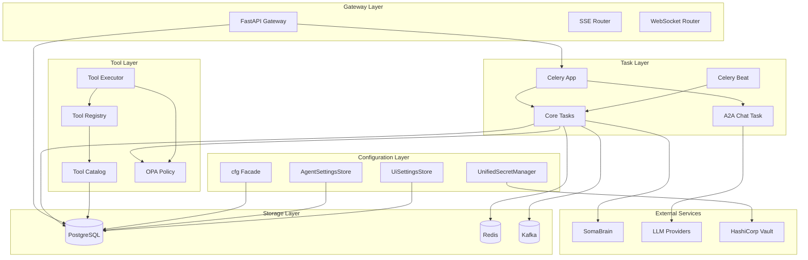
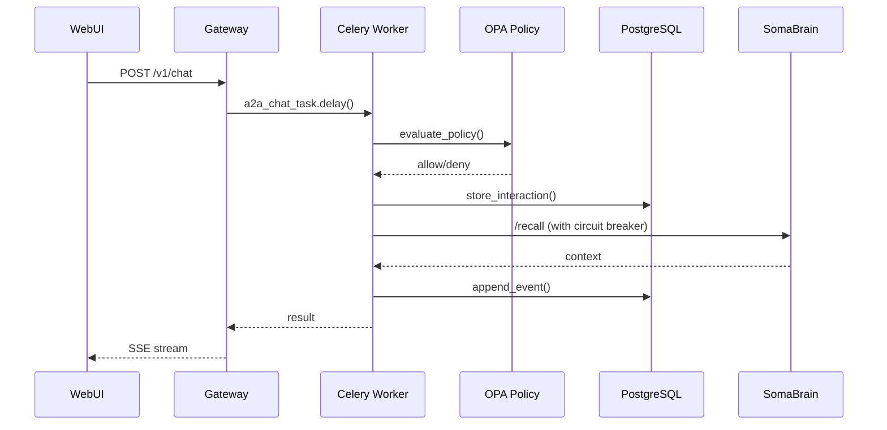

# Design Document: Canonical Architecture Cleanup

## Overview

This design document specifies the technical architecture for completing the canonical architecture cleanup and full Celery-Only Architecture integration for SomaAgent01. The implementation will eliminate all VIBE violations, consolidate 5 settings systems into 1, migrate from file-based to PostgreSQL-backed storage, and establish production-grade patterns for task execution, tool management, and degradation handling.

### Goals

1. Achieve 100% VIBE Coding Rules compliance
2. Remove all 8 persist_chat import violations
3. Consolidate settings into canonical `cfg` facade
4. Implement Celery Canvas patterns with OPA integration
5. Establish unified tool repository with permission control
6. Implement production-grade degradation mode

### Non-Goals

- Changing the core agent conversation loop
- Modifying LLM provider integrations
- Altering the SomaBrain API contract
- Changing the WebUI framework (Alpine.js)

## Architecture

### High-Level Architecture Diagram



### Component Interaction Flow



## Components and Interfaces

### 1. Configuration Facade (`src/core/config/`)

The canonical configuration system consolidates 5 existing systems into a single facade.

```python
# src/core/config/__init__.py
class ConfigFacade:
    """Singleton configuration facade - SINGLE SOURCE OF TRUTH."""
    
    def env(self, key: str, default: Any = None) -> Any:
        """Get configuration value with SA01_ prefix priority."""
        # Priority: SA01_* env → Raw env → YAML/JSON → Defaults
        pass
    
    def flag(self, key: str) -> bool:
        """Get boolean feature flag."""
        pass
    
    def opa_url(self) -> Optional[str]:
        """Get OPA policy URL."""
        pass

cfg = ConfigFacade()  # Singleton instance
```

**Migration Path:**
| Current System | Action | Target |
|----------------|--------|--------|
| `SA01Settings` | DEPRECATE | `cfg.env()` |
| `BaseServiceSettings` | DEPRECATE | `cfg.env()` |
| `ADMIN_SETTINGS` | REFACTOR | `cfg.env()` |
| `python/helpers/settings.py` | SPLIT | UI conversion stays, config → `cfg` |
| `env.py` | DEPRECATE | `cfg.env()` |
| `ServiceRegistry` | DEPRECATE | `cfg` ConfigRegistry |

### 2. Session Persistence (`services/common/session_repository.py`)

PostgreSQL-backed session storage replacing file-based persistence.

```python
class PostgresSessionStore:
    """Canonical session persistence - NO FILE STORAGE."""
    
    async def append_event(self, session_id: str, event: SessionEvent) -> None:
        """Append event to session timeline."""
        pass
    
    async def delete_session(self, session_id: str) -> None:
        """Delete session and cascade to attachments."""
        pass
    
    async def update_metadata(self, session_id: str, metadata: dict) -> None:
        """Update session envelope metadata (for rename)."""
        pass
    
    async def health_check(self) -> None:
        """Verify database connectivity."""
        pass
```

### 3. Celery Task Architecture (`python/tasks/`)

Consolidated task module with Canvas patterns and OPA integration.

```python
# python/tasks/core_tasks.py
from celery import shared_task, chain, group, chord
from prometheus_client import Counter, Histogram

TASK_COUNTER = Counter('celery_tasks_total', 'Total tasks', ['task'])
TASK_DURATION = Histogram('celery_task_duration_seconds', 'Task duration', ['task'])

@shared_task(
    bind=True,
    max_retries=3,
    autoretry_for=(Exception,),
    retry_backoff=True,
    retry_jitter=True,
    soft_time_limit=300,
    time_limit=600,
    rate_limit='10/m'
)
def build_context(self, session_id: str, tenant_id: str) -> dict:
    """Build conversation context from session history."""
    pass

@shared_task(bind=True, max_retries=3)
def evaluate_policy(self, tenant_id: str, action: str, resource: str) -> bool:
    """Evaluate OPA policy for authorization."""
    pass

@shared_task(bind=True, max_retries=3)
def store_interaction(self, session_id: str, interaction: dict) -> None:
    """Store interaction in PostgreSQL."""
    pass

@shared_task(bind=True, max_retries=3)
def feedback_loop(self, session_id: str, feedback: dict) -> None:
    """Process feedback and send to SomaBrain."""
    pass

@shared_task(bind=True, max_retries=3)
def rebuild_index(self, tenant_id: str) -> None:
    """Rebuild search index for tenant."""
    pass

@shared_task(bind=True, max_retries=1)
def publish_metrics(self) -> None:
    """Publish Prometheus metrics."""
    pass

@shared_task(bind=True, max_retries=1)
def cleanup_sessions(self, max_age_hours: int = 24) -> int:
    """Cleanup expired sessions."""
    pass
```

**Beat Schedule Configuration:**
```python
# python/tasks/celery_app.py
app.conf.beat_schedule = {
    'publish-metrics-every-minute': {
        'task': 'python.tasks.core_tasks.publish_metrics',
        'schedule': 60.0,
    },
    'cleanup-expired-sessions-hourly': {
        'task': 'python.tasks.core_tasks.cleanup_sessions',
        'schedule': 3600.0,
        'kwargs': {'max_age_hours': 24},
    },
}
app.conf.beat_scheduler = 'celery.beat:DatabaseScheduler'
```

**Task Queue Routing:**
```python
app.conf.task_routes = {
    'python.tasks.core_tasks.build_context': {'queue': 'default'},
    'python.tasks.core_tasks.evaluate_policy': {'queue': 'fast_a2a'},
    'python.tasks.a2a_chat_task.*': {'queue': 'fast_a2a'},
    'python.tasks.core_tasks.rebuild_index': {'queue': 'heavy'},
}
```

### 4. Tool Repository (`services/common/tool_catalog.py`)

Unified tool catalog with OPA permission control.

```python
class ToolCatalogStore:
    """PostgreSQL-backed tool catalog with tenant isolation."""
    
    async def is_enabled(self, tool_name: str, tenant_id: str = None) -> bool:
        """Check if tool is enabled for tenant."""
        # Check tenant_tool_flags first, fallback to global catalog
        pass
    
    async def register_tool(self, tool: ToolCatalogEntry) -> None:
        """Register tool in catalog with JSON schema."""
        pass
    
    async def set_tenant_flag(self, tenant_id: str, tool_name: str, enabled: bool) -> None:
        """Set tenant-specific tool flag."""
        pass
    
    async def get_tools_for_tenant(self, tenant_id: str) -> List[ToolCatalogEntry]:
        """Get all enabled tools for tenant."""
        pass
```

**OPA Policy Integration:**
```rego
# policy/tool_policy.rego
package somaagent.tools

default allow = false

allow {
    input.action == "tool.request"
    tool_enabled_for_tenant
    not tool_in_deny_list
}

tool_enabled_for_tenant {
    data.tenant_tool_flags[input.tenant][input.resource].enabled == true
}

tool_enabled_for_tenant {
    # Fallback to global catalog
    not data.tenant_tool_flags[input.tenant][input.resource]
    data.tool_catalog[input.resource].enabled == true
}

tool_in_deny_list {
    input.resource == data.deny_list[_]
}
```

### 5. Circuit Breaker (`src/core/clients/somabrain.py`)

Enhanced circuit breaker with half-open state and metrics.

```python
class SomaBrainClient:
    """SomaBrain client with production-grade circuit breaker."""
    
    def __init__(self):
        # Configurable via cfg.env()
        self._cb_threshold = int(cfg.env("SA01_SOMA_CB_THRESHOLD", "5"))
        self._cb_cooldown_sec = int(cfg.env("SA01_SOMA_CB_COOLDOWN_SEC", "30"))
        self._cb_half_open_max_calls = int(cfg.env("SA01_SOMA_CB_HALF_OPEN_CALLS", "3"))
        
        # State: closed, open, half-open
        self._cb_state = "closed"
        self._cb_failures = 0
        self._cb_open_until = 0.0
        
        # Prometheus metrics
        self._cb_state_gauge = Gauge('somabrain_circuit_breaker_state', 'CB state')
        self._cb_failures_counter = Counter('somabrain_circuit_breaker_failures_total', 'CB failures')
    
    async def _request(self, method: str, url: str, **kwargs):
        """Request with circuit breaker protection."""
        # State machine: closed → open → half-open → closed
        pass
```

### 6. File Upload System (`services/gateway/routers/uploads_full.py`)

TUS protocol implementation with antivirus scanning.

```python
class TUSUploadHandler:
    """Resumable file uploads with integrity verification."""
    
    async def create_upload(self, metadata: dict) -> str:
        """Create upload session, return upload_id."""
        pass
    
    async def append_chunk(self, upload_id: str, chunk: bytes, offset: int) -> int:
        """Append chunk, return new offset."""
        pass
    
    async def finalize_upload(self, upload_id: str) -> AttachmentRecord:
        """Finalize upload: hash verification, AV scan, store."""
        # 1. Compute SHA-256 hash
        # 2. Scan with ClamAV via pyclamd
        # 3. Store in PostgreSQL BYTEA
        # 4. Return attachment record
        pass
```

### 7. Degradation Manager (`services/common/degradation_manager.py`)

Cascading failure prevention with service dependency graph.

```python
from enum import Enum
from dataclasses import dataclass
from typing import Dict, List, Optional

class ServiceState(Enum):
    HEALTHY = "healthy"
    DEGRADED = "degraded"
    FAILED = "failed"
    UNKNOWN = "unknown"

@dataclass
class ServiceStatus:
    name: str
    state: ServiceState
    last_check: float
    error_message: Optional[str] = None
    latency_ms: Optional[float] = None

class DegradationManager:
    """Manages system-wide degradation and cascading failure prevention."""
    
    # Service dependency graph - VIBE: NO HARDCODING without justification
    # Justification: These are architectural dependencies, not configuration
    DEPENDENCY_GRAPH = {
        "conversation_worker": ["postgres", "kafka", "somabrain"],
        "tool_executor": ["postgres", "kafka"],
        "gateway": ["postgres", "redis"],
        "memory_sync": ["postgres", "somabrain"],
    }
    
    LATENCY_THRESHOLDS_MS = {
        "postgres": 1000,
        "redis": 100,
        "kafka": 500,
        "somabrain": 2000,
    }
    
    def __init__(self):
        self._services: Dict[str, ServiceStatus] = {}
    
    def update_service_status(
        self, 
        service: str, 
        state: ServiceState, 
        error: str = None,
        latency_ms: float = None
    ) -> None:
        """Update service status and evaluate cascading effects."""
        self._services[service] = ServiceStatus(
            name=service,
            state=state,
            last_check=time.time(),
            error_message=error,
            latency_ms=latency_ms
        )
        
        if state == ServiceState.FAILED:
            self._propagate_failure(service)
    
    def _propagate_failure(self, failed_service: str) -> None:
        """Propagate failure to dependent services."""
        for dependent, deps in self.DEPENDENCY_GRAPH.items():
            if failed_service in deps:
                current = self._services.get(dependent)
                if current and current.state == ServiceState.HEALTHY:
                    self.update_service_status(
                        dependent,
                        ServiceState.DEGRADED,
                        f"Dependency {failed_service} failed"
                    )
    
    async def check_all_parallel(self) -> Dict[str, ServiceStatus]:
        """Execute all health checks in parallel."""
        checks = [
            self._check_postgres(),
            self._check_redis(),
            self._check_kafka(),
            self._check_somabrain(),
        ]
        await asyncio.gather(*checks, return_exceptions=True)
        return self._services
    
    def get_system_health(self) -> Dict[str, any]:
        """Get overall system health status."""
        failed = [s for s in self._services.values() if s.state == ServiceState.FAILED]
        degraded = [s for s in self._services.values() if s.state == ServiceState.DEGRADED]
        
        if failed:
            overall = "failed"
        elif degraded:
            overall = "degraded"
        else:
            overall = "healthy"
        
        return {
            "overall_state": overall,
            "services": {s.name: s.state.value for s in self._services.values()},
            "failed_services": [s.name for s in failed],
            "degraded_services": [s.name for s in degraded],
        }
```

## Data Models

### Session Event Schema

```python
class SessionEvent(BaseModel):
    """Event in session timeline."""
    event_id: UUID
    session_id: str
    event_type: Literal["message", "tool_call", "tool_result", "attachment", "metadata"]
    timestamp: datetime
    payload: dict
    
class SessionEnvelope(BaseModel):
    """Session metadata container."""
    session_id: str
    tenant_id: str
    persona_id: str
    created_at: datetime
    updated_at: datetime
    title: Optional[str]
    metadata: dict
```

### Tool Catalog Schema

```sql
CREATE TABLE tool_catalog (
    name TEXT PRIMARY KEY,
    enabled BOOLEAN NOT NULL DEFAULT TRUE,
    description TEXT,
    params JSONB NOT NULL DEFAULT '{}'::jsonb,
    source TEXT DEFAULT 'builtin',  -- builtin, mcp, dynamic
    updated_at TIMESTAMPTZ NOT NULL DEFAULT now()
);

CREATE TABLE tenant_tool_flags (
    tenant_id TEXT NOT NULL,
    tool_name TEXT NOT NULL REFERENCES tool_catalog(name),
    enabled BOOLEAN NOT NULL,
    updated_at TIMESTAMPTZ DEFAULT NOW(),
    PRIMARY KEY (tenant_id, tool_name)
);
```

### A2A Data Contract

```python
class A2ARequest(BaseModel):
    """A2A request contract."""
    message: str
    metadata: A2AMetadata
    data: Optional[dict]
    subagent_url: str

class A2AMetadata(BaseModel):
    """A2A metadata."""
    tenant_id: str
    request_id: str
    persona_id: Optional[str]

class A2AResponse(BaseModel):
    """A2A response contract."""
    status: Literal["ok", "error"]
    data: Optional[dict]
    errors: Optional[List[str]]
```

## Correctness Properties

*A property is a characteristic or behavior that should hold true across all valid executions of a system-essentially, a formal statement about what the system should do. Properties serve as the bridge between human-readable specifications and machine-verifiable correctness guarantees.*

Based on the prework analysis, the following correctness properties must be validated:

### Property 1: No persist_chat imports
*For any* Python file in the codebase, it SHALL NOT contain imports from the deleted `persist_chat` module.
**Validates: Requirements 1.1-1.8**

### Property 2: PostgresSessionStore for all session operations
*For any* session operation (save, rename, delete, tool results, screenshots), it SHALL use `PostgresSessionStore` methods exclusively.
**Validates: Requirements 2.1-2.5**

### Property 3: Celery task decorator compliance
*For any* Celery task in `python/tasks/`, it SHALL use `@shared_task` decorator with proper configuration including `bind=True`, `max_retries`, `autoretry_for`, `retry_backoff`, `soft_time_limit`, and `time_limit`.
**Validates: Requirements 3.9, 22.1-22.5**

### Property 4: Configuration access via cfg
*For any* configuration access in the codebase, it SHALL use `cfg.env()` from `src.core.config` instead of direct environment variable access or deprecated settings modules.
**Validates: Requirements 8.1-8.7**

### Property 5: TUS protocol for file uploads
*For any* file upload operation, it SHALL use TUS protocol with SHA-256 integrity verification and return appropriate status after ClamAV scanning.
**Validates: Requirements 17.1-17.8**

### Property 6: Celery task queue routing
*For any* task submission, it SHALL route to the appropriate queue based on task type: `delegation` → delegation queue, `browser` → browser queue, `code` → code queue, `heavy` → heavy queue, `a2a` → fast_a2a queue.
**Validates: Requirements 21.1-21.6**

### Property 7: OPA policy enforcement for tools
*For any* tool request, it SHALL be authorized via OPA policy before execution, and SHALL fail-closed (deny) when OPA is unavailable.
**Validates: Requirements 23.1-23.4, 33.1-33.5**

### Property 8: Prometheus metrics for tasks
*For any* task execution, it SHALL emit Prometheus metrics: increment `celery_tasks_total` on start, increment `celery_tasks_success` or `celery_tasks_failed` on completion, and record duration in `celery_task_duration_seconds` histogram.
**Validates: Requirements 24.1-24.5**

### Property 9: Task deduplication
*For any* task submission with a `request_id`, if a task with the same `request_id` is already in progress or completed within TTL, the duplicate submission SHALL return `{"status": "duplicate"}` without re-execution.
**Validates: Requirements 25.1-25.4**

### Property 10: A2A data contract compliance
*For any* A2A request, it SHALL include `message`, `metadata` (with `tenant_id`, `request_id`), `data`, and `subagent_url`. *For any* A2A response, it SHALL include `status` (ok|error), `data`, and `errors` fields.
**Validates: Requirements 27.1-27.3**

### Property 11: Tool schema validation
*For any* tool call, arguments SHALL be validated against the tool's `input_schema()`. If validation fails, the tool SHALL NOT execute and SHALL return a clear error message.
**Validates: Requirements 37.1-37.5**

### Property 12: Tenant tool flag inheritance
*For any* tenant checking tool availability, the system SHALL check `tenant_tool_flags` first, then fall back to global `tool_catalog.enabled` if no tenant-specific flag exists.
**Validates: Requirements 36.1-36.5**

### Property 13: Tool execution tracking
*For any* tool execution, it SHALL call `_track_tool_execution_for_learning()` with tool name, arguments, response, success/failure status, and duration. If SomaBrain is unavailable, the tracking event SHALL be queued.
**Validates: Requirements 35.1-35.5**

### Property 14: LLM provider configuration
*For any* LLM provider configuration (Chat, Utility, Embedding, Browser models), settings SHALL be stored in `AgentSettingsStore` and API keys SHALL be retrieved via `UnifiedSecretManager`.
**Validates: Requirements 44.1-44.7**

### Property 15: No legacy fallbacks in configuration
*For any* configuration access in `src/core/config/loader.py`, it SHALL NOT use legacy `SOMA_` prefix fallbacks. Configuration SHALL use only `SA01_` prefix or explicit defaults.
**Validates: Requirements 46.1-46.4**

### Property 16: Circuit breaker three-state machine
*For any* SomaBrain circuit breaker, it SHALL support exactly three states (closed, open, half-open) with deterministic transitions: closed→open after threshold failures, open→half-open after cooldown, half-open→closed on success or half-open→open on failure.
**Validates: Requirements 47.1-47.5**

### Property 17: Cascading failure propagation
*For any* service failure (PostgreSQL, SomaBrain, Kafka), the `DegradationManager` SHALL evaluate and update dependent service states according to the dependency graph.
**Validates: Requirements 48.1-48.5**

### Property 18: Parallel health check execution
*For any* health check request, all component checks (PostgreSQL, Redis, Kafka, SomaBrain) SHALL execute in parallel using `asyncio.gather()`, and latency thresholds SHALL trigger degraded state.
**Validates: Requirements 49.1-49.5**

## Error Handling

### Circuit Breaker States

| State | Behavior | Transition |
|-------|----------|------------|
| **Closed** | Normal operation, requests pass through | → Open after `_cb_threshold` failures |
| **Open** | All requests fail immediately with `CircuitBreakerOpenError` | → Half-Open after `_cb_cooldown_sec` |
| **Half-Open** | Limited requests allowed (`_cb_half_open_max_calls`) | → Closed on success, → Open on failure |

### Error Response Patterns

```python
# OPA Policy Denial
raise PermissionError(f"OPA denied: {action} on {resource}")

# Circuit Breaker Open
raise CircuitBreakerOpenError(f"SomaBrain circuit breaker open for {remaining}s")

# Task Deduplication
return {"status": "duplicate", "request_id": request_id}

# Tool Validation Failure
raise ToolValidationError(f"Invalid arguments: {validation_errors}")

# File Upload Quarantine
return {"status": "quarantined", "reason": "AV scan failed"}
```

### Graceful Degradation

When SomaBrain is unavailable:
1. Circuit breaker opens after 5 failures
2. UI shows "Somabrain Offline" banner
3. Agent continues with chat history only
4. Memory operations are queued for later sync
5. Circuit breaker transitions to half-open after 30s cooldown

## Testing Strategy

### Dual Testing Approach

This implementation uses both unit tests and property-based tests:

- **Unit tests**: Verify specific examples, edge cases, and error conditions
- **Property-based tests**: Verify universal properties that should hold across all inputs

### Property-Based Testing Framework

**Library**: `hypothesis` (Python)

**Configuration**:
```python
from hypothesis import settings, given, strategies as st

@settings(max_examples=100)
@given(st.text(), st.text())
def test_property(input1, input2):
    # Property assertion
    pass
```

### Test Categories

| Category | Framework | Coverage |
|----------|-----------|----------|
| Unit Tests | pytest | Specific examples, edge cases |
| Property Tests | hypothesis | Universal properties (100+ iterations) |
| Integration Tests | pytest-asyncio | Component interactions |
| Contract Tests | pact | A2A data contracts |

### Property Test Annotations

Each property-based test MUST be annotated with:
```python
# **Feature: canonical-architecture-cleanup, Property 1: No persist_chat imports**
# **Validates: Requirements 1.1-1.8**
@given(st.sampled_from(python_files))
def test_no_persist_chat_imports(file_path):
    """Property 1: No file imports persist_chat."""
    content = Path(file_path).read_text()
    assert "from python.helpers import persist_chat" not in content
    assert "from python.helpers.persist_chat import" not in content
```

### Test File Structure

```
tests/
├── unit/
│   ├── test_session_store.py
│   ├── test_tool_catalog.py
│   └── test_circuit_breaker.py
├── property/
│   ├── test_prop_no_persist_chat.py
│   ├── test_prop_session_operations.py
│   ├── test_prop_task_routing.py
│   ├── test_prop_opa_enforcement.py
│   └── test_prop_tool_validation.py
└── integration/
    ├── test_celery_tasks.py
    └── test_a2a_contract.py
```
