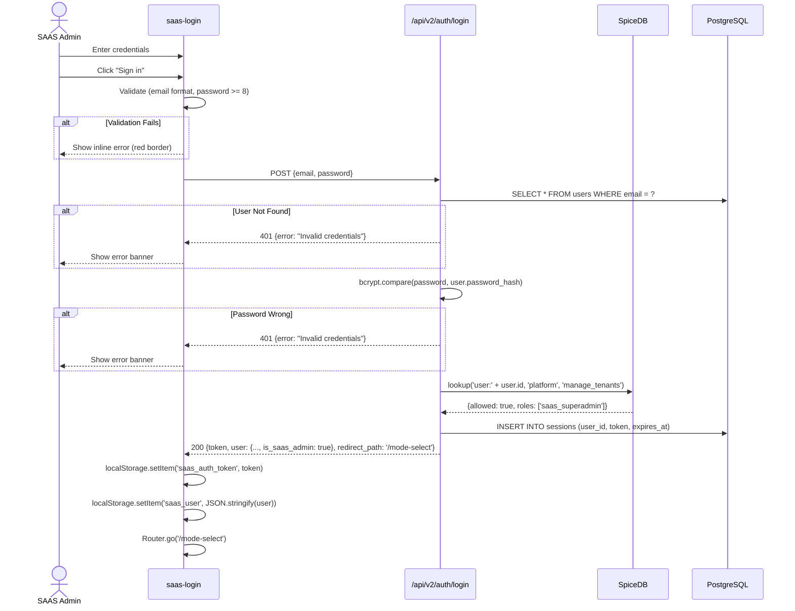
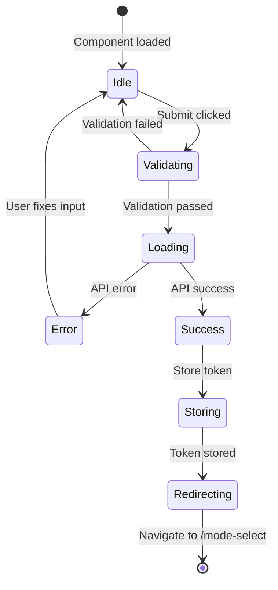
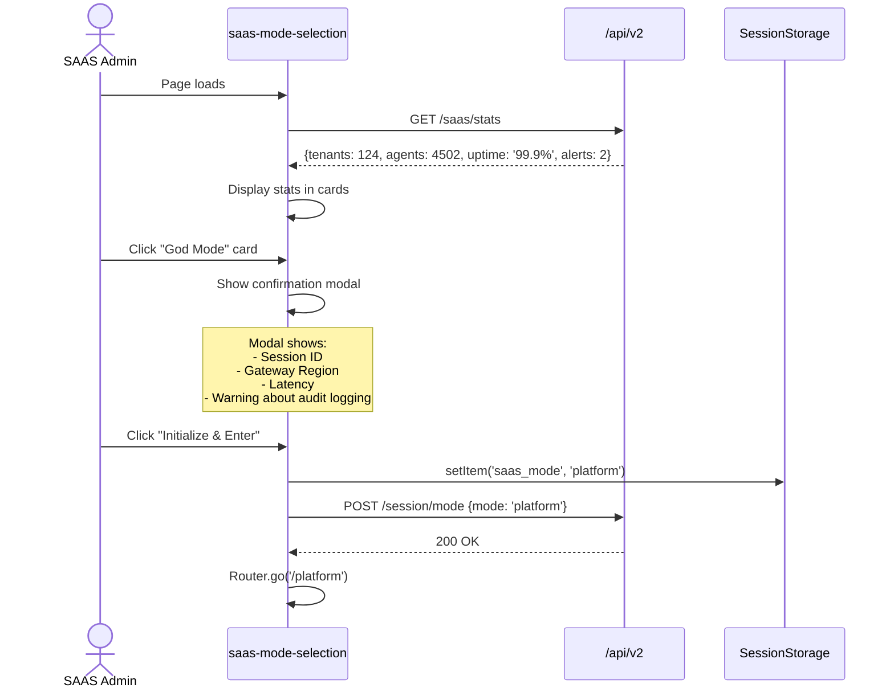
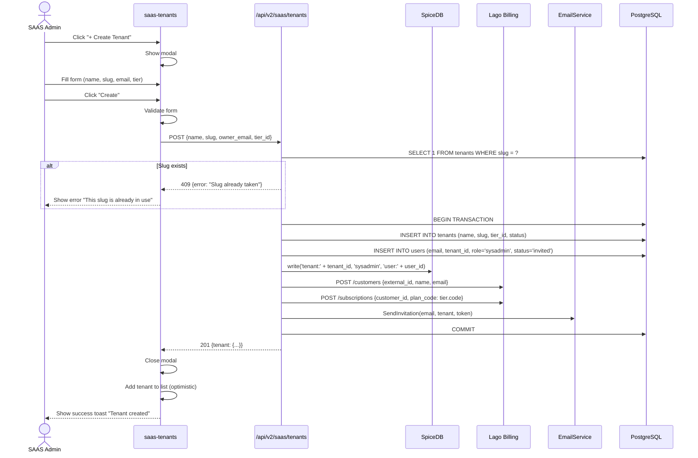

# SAAS Sys Admin — Complete UI SRS

**Document ID:** SA01-SAAS-SYSADMIN-UI-SRS-2025-12  
**Version:** 1.0  
**Date:** 2025-12-22  
**Status:** CANONICAL  
**Classification:** ENTERPRISE  
**Compliance:** ISO/IEC/IEEE 29148:2018

---

## Document Control

| Field | Value |
|-------|-------|
| Persona | SAAS System Administrator (God Mode) |
| Role Code | `saas_superadmin` |
| SpiceDB Permissions | `platform->manage_tenants`, `platform->view_billing`, `platform->configure_platform` |

---

## 1. Persona Definition

### 1.1 Who is the SAAS Sys Admin?

The **SAAS System Administrator** (also called "God Mode" user) is a super-administrator with complete control over the entire SomaAgent platform. They:

- Manage ALL tenants (create, suspend, delete)
- Configure subscription tiers and quotas
- View platform-wide billing and revenue
- Access any tenant as impersonator for support
- Configure platform-wide feature flags
- Monitor system health across all tenants

### 1.2 NOT Covered by This Document

- Tenant-level administration → See `TENANT_ADMIN_UI_SRS.md`
- Agent-level user management → See `AGENT_USER_UI_SRS.md`
- Regular user interactions → See `STANDARD_USER_UI_SRS.md`

---

## 2. Complete User Journey

### 2.1 User Flow Diagram

```
┌────────────────────────────────────────────────────────────────────────────────┐
│                         SAAS SYS ADMIN COMPLETE JOURNEY                         │
└────────────────────────────────────────────────────────────────────────────────┘

    ┌─────────────┐
    │   START     │
    └──────┬──────┘
           │
           ▼
    ┌─────────────────────────────────────────────────────────────────────────┐
    │                          AUTHENTICATION PHASE                            │
    │                                                                          │
    │  ┌────────────────┐     ┌────────────────┐     ┌────────────────┐       │
    │  │   /login       │ ──▶ │ /auth/callback │ ──▶ │ Token Stored   │       │
    │  │  (Email/OAuth) │     │ (Google/SSO)   │     │ (localStorage) │       │
    │  └────────────────┘     └────────────────┘     └────────┬───────┘       │
    └─────────────────────────────────────────────────────────┬───────────────┘
                                                              │
                                                              ▼
    ┌─────────────────────────────────────────────────────────────────────────┐
    │                          ROLE DETECTION PHASE                            │
    │                                                                          │
    │  Backend checks SpiceDB: lookup('user:123', 'platform', 'manage_tenants')│
    │                                                                          │
    │      ┌─────────────────┐                                                │
    │      │ is_saas_admin?  │                                                │
    │      └────────┬────────┘                                                │
    │               │                                                          │
    │       ┌───────┴───────┐                                                  │
    │       │               │                                                  │
    │    YES│            NO │                                                  │
    │       ▼               ▼                                                  │
    │  ┌─────────┐    ┌─────────────┐                                         │
    │  │/mode-   │    │ /dashboard  │ (regular user)                          │
    │  │ select  │    │ or /chat    │                                         │
    │  └────┬────┘    └─────────────┘                                         │
    └───────┼─────────────────────────────────────────────────────────────────┘
            │
            ▼
    ┌─────────────────────────────────────────────────────────────────────────┐
    │                          MODE SELECTION PHASE                            │
    │                                                                          │
    │     ┌────────────────────────────────────────────────────────┐          │
    │     │               /mode-select                              │          │
    │     │                                                         │          │
    │     │   ┌─────────────────┐      ┌─────────────────┐         │          │
    │     │   │ ⚡ GOD MODE     │      │ 🏢 TENANT VIEW  │         │          │
    │     │   │ Platform Admin  │      │ Enter as User   │         │          │
    │     │   │ • 124 Tenants   │      │ • Last: Acme    │         │          │
    │     │   │ • 4502 Agents   │      │ • Role: Owner   │         │          │
    │     │   │ • 99.9% Uptime  │      │ • 5 Agents      │         │          │
    │     │   └────────┬────────┘      └────────┬────────┘         │          │
    │     └────────────┼───────────────────────┼──────────────────┘          │
    │                  │                       │                              │
    │            CLICK │                 CLICK │                              │
    │                  ▼                       ▼                              │
    │         ┌────────────────┐      ┌────────────────┐                     │
    │         │ /platform      │      │ /tenant-select │                     │
    │         │ (God Dashboard)│      │ (Pick Tenant)  │                     │
    │         └────────────────┘      └────────────────┘                     │
    └─────────────────────────────────┬───────────────────────────────────────┘
                                      │
                                      ▼
    ┌─────────────────────────────────────────────────────────────────────────┐
    │                          PLATFORM ADMIN PHASE                            │
    │                                                                          │
    │  ┌──────────────────────────────────────────────────────────────────┐   │
    │  │                     SIDEBAR NAVIGATION                            │   │
    │  │                                                                   │   │
    │  │  PLATFORM                                                         │   │
    │  │  📊 Dashboard ──────────────────▶ /platform                       │   │
    │  │  🏢 Tenants ────────────────────▶ /platform/tenants               │   │
    │  │  💳 Billing ────────────────────▶ /platform/billing               │   │
    │  │  📦 Subscriptions ──────────────▶ /platform/subscriptions         │   │
    │  │  🚩 Feature Flags ──────────────▶ /platform/flags                 │   │
    │  │                                                                   │   │
    │  │  SYSTEM                                                           │   │
    │  │  ⚙️ Settings ───────────────────▶ /settings                       │   │
    │  │  📋 Audit Log ──────────────────▶ /platform/audit                 │   │
    │  │  🔐 Security ───────────────────▶ /platform/security              │   │
    │  │                                                                   │   │
    │  └──────────────────────────────────────────────────────────────────┘   │
    └─────────────────────────────────────────────────────────────────────────┘
```

---

## 3. Screen 1: Login

### 3.1 Route & Component

| Property | Value |
|----------|-------|
| Route | `/login` |
| Component | `saas-login.ts` |
| Permission | Public |

### 3.2 Wireframe

```
┌─────────────────────────────────────────────────────────────────┐
│                          (Page: #f5f5f5)                        │
│                                                                 │
│                    ┌─────────────────────────┐                  │
│                    │     (Card: #ffffff)     │                  │
│                    │                         │                  │
│                    │  ┌───┐                  │                  │
│                    │  │▓▓▓│ SomaAgent        │                  │
│                    │  │▓▓▓│ SaaS Admin       │                  │
│                    │  └───┘                  │                  │
│                    │                         │                  │
│                    │  Sign in to your        │                  │
│                    │  account                │                  │
│                    │                         │                  │
│                    │  ┌─────────────────────┐│                  │
│                    │  │ 🔵 Continue with    ││                  │
│                    │  │    Google           ││                  │
│                    │  └─────────────────────┘│                  │
│                    │                         │                  │
│                    │  ┌─────────────────────┐│                  │
│                    │  │ 🏢 Enterprise SSO   ││                  │
│                    │  │    (Keycloak)       ││                  │
│                    │  └─────────────────────┘│                  │
│                    │                         │                  │
│                    │  ──────── or ────────   │                  │
│                    │                         │                  │
│                    │  Email *                │                  │
│                    │  ┌─────────────────────┐│                  │
│                    │  │ admin@platform.io   ││                  │
│                    │  └─────────────────────┘│                  │
│                    │                         │                  │
│                    │  Password *  [Forgot?]  │                  │
│                    │  ┌─────────────────────┐│                  │
│                    │  │ ••••••••••••        ││                  │
│                    │  └─────────────────────┘│                  │
│                    │                         │                  │
│                    │  ┌─────────────────────┐│                  │
│                    │  │ ▓▓▓  Sign in  ▓▓▓   ││ (black btn)     │
│                    │  └─────────────────────┘│                  │
│                    │                         │                  │
│                    │  Don't have an account? │                  │
│                    │  [Contact Sales]        │                  │
│                    │                         │                  │
│                    └─────────────────────────┘                  │
│                                                                 │
└─────────────────────────────────────────────────────────────────┘
```

### 3.3 User Actions

| Action | Element | Validation | API Call | Next Screen |
|--------|---------|------------|----------|-------------|
| Click "Continue with Google" | OAuth Button | None | `GoogleAuthService.getAuthUrl()` | Redirect to Google |
| Click "Enterprise SSO" | OAuth Button | None | `KeycloakService.getAuthUrl()` | Redirect to Keycloak |
| Submit Email/Password | Form | Email format, Password min 8 | `POST /api/v2/auth/login` | `/mode-select` or error |
| Click "Forgot?" | Link | None | None | `/forgot-password` |

### 3.4 Sequence Diagram



### 3.5 State Diagram



---

## 4. Screen 2: Mode Selection

### 4.1 Route & Component

| Property | Value |
|----------|-------|
| Route | `/mode-select` |
| Component | `saas-mode-selection.ts` |
| Permission | `saas_admin` (must be SAAS admin to see this screen) |

### 4.2 Wireframe

```
┌─────────────────────────────────────────────────────────────────────────────┐
│                          (Page: Dark gradient #0f172a)                       │
│                                                                              │
│                          Select Interface Mode                               │
│                          Access your specialized workspace                   │
│                                                                              │
│   ┌────────────────────────────────────┐  ┌─────────────────────────────────┐│
│   │  ⚡ God Mode                       │  │  🏢 Tenant Viewer               ││
│   │     [SUPER ADMIN]                  │  │     [STANDARD VIEW]             ││
│   ├────────────────────────────────────┤  ├─────────────────────────────────┤│
│   │                                    │  │                                 ││
│   │  Full infrastructure control,     │  │  Focused workspace for agent   ││
│   │  multi-tenant oversight, and      │  │  management, conversation      ││
│   │  system-wide configuration.       │  │  flows, and memory.            ││
│   │                                    │  │                                 ││
│   ├────────────────────────────────────┤  ├─────────────────────────────────┤│
│   │  ┌──────────┐  ┌──────────┐       │  │  ┌──────────┐  ┌──────────┐    ││
│   │  │   124    │  │  4,502   │       │  │  │ Acme Corp│  │  Owner   │    ││
│   │  │ Tenants  │  │  Agents  │       │  │  │Last View │  │ Role     │    ││
│   │  └──────────┘  └──────────┘       │  │  └──────────┘  └──────────┘    ││
│   │  ┌──────────┐  ┌──────────┐       │  │  ┌──────────┐  ┌──────────┐    ││
│   │  │  99.9%   │  │    2     │       │  │  │    5     │  │   12     │    ││
│   │  │🟢Uptime  │  │🟡Alerts  │       │  │  │ Agents   │  │ Events   │    ││
│   │  └──────────┘  └──────────┘       │  │  └──────────┘  └──────────┘    ││
│   ├────────────────────────────────────┤  ├─────────────────────────────────┤│
│   │ Access: Tier 0 (Root)              │  │ Context: Single Tenant           ││
│   │              Configure System →    │  │              Enter Workspace →  ││
│   └────────────────────────────────────┘  └─────────────────────────────────┘│
│                                                                              │
└─────────────────────────────────────────────────────────────────────────────┘
```

### 4.3 User Actions

| Action | Element | API Call | Next Screen |
|--------|---------|----------|-------------|
| Click "God Mode" card | Card | None | Show confirmation modal |
| Confirm God Mode | Modal button | `POST /api/v2/session/mode` | `/platform` |
| Click "Tenant Viewer" card | Card | None | Show tenant picker modal |
| Select tenant → Confirm | Modal | `POST /api/v2/session/tenant` | `/dashboard` |

### 4.4 Sequence Diagram - Enter God Mode



---

## 5. Screen 3: Platform Dashboard

### 5.1 Route & Component

| Property | Value |
|----------|-------|
| Route | `/platform` |
| Component | `saas-platform-dashboard.ts` |
| Permission | `platform->manage_tenants` |

### 5.2 Wireframe

```
┌─────────────────────────────────────────────────────────────────────────────┐
│ ┌────────────┐ │ Platform Dashboard                         [Brian F. ▼]   │
│ │ SomaAgent  │ │────────────────────────────────────────────────────────────│
│ │            │ │                                                            │
│ │ PLATFORM   │ │ ┌──────────┐ ┌──────────┐ ┌──────────┐ ┌──────────┐       │
│ │ 📊Dashboard│◀│ │   124    │ │  4,502   │ │ $24.5K   │ │  99.9%   │       │
│ │ 🏢Tenants  │ │ │ Tenants  │ │ Agents   │ │   MRR    │ │ Uptime   │       │
│ │ 💳Billing  │ │ │  ↑12%    │ │  ↑8%     │ │  ↑15%    │ │  ✓       │       │
│ │ 📦Subs     │ │ └──────────┘ └──────────┘ └──────────┘ └──────────┘       │
│ │            │ │                                                            │
│ │ SYSTEM     │ │ Revenue Trend                               [Last 12 mo ▼]│
│ │ ⚙️Settings │ │ ┌────────────────────────────────────────────────────────┐│
│ │ 📋Audit    │ │ │  $30K ─                                    ▄▄          ││
│ │ 🔐Security │ │ │  $25K ─                               ▄▄▄ ██          ││
│ │            │ │ │  $20K ─                          ▄▄▄ ███ ██          ││
│ │            │ │ │  $15K ─                     ▄▄▄ ███ ███ ██          ││
│ │            │ │ │  $10K ─                ▄▄▄ ███ ███ ███ ██          ││
│ │            │ │ │   $5K ─           ▄▄▄ ███ ███ ███ ███ ██          ││
│ │            │ │ │    $0 ─ Jan Feb Mar Apr May Jun Jul Aug Sep Oct Nov Dec ││
│ │            │ │ └────────────────────────────────────────────────────────┘│
│ │            │ │                                                            │
│ │            │ │ Recent Activity                                [View All →]│
│ │ ─────────  │ │ ┌────────────────────────────────────────────────────────┐│
│ │ [Avatar]   │ │ │ 🟢 Acme Corp      New tenant created        2 min ago  ││
│ │ Platform   │ │ │ 🟡 Globex Inc     Quota warning: 80% agents 15 min ago ││
│ │ Admin      │ │ │ 🔵 TechStart      Agent "Support-AI" deployed 1 hr ago││
│ │            │ │ │ 🟢 DataFlow       Upgraded: Team → Enterprise 2 hr ago ││
│ └────────────┘ │ └────────────────────────────────────────────────────────┘│
└────────────────┴────────────────────────────────────────────────────────────┘
```

### 5.3 Components Breakdown

| Component | Data Source | Refresh Rate |
|-----------|-------------|--------------|
| Stat Cards (4x) | `GET /api/v2/saas/stats` | 60 seconds |
| Revenue Chart | `GET /api/v2/saas/billing/revenue` | On load |
| Activity Feed | `GET /api/v2/saas/activity` | WebSocket real-time |
| Health Status | `GET /api/v2/saas/health` | 30 seconds |

### 5.4 API Endpoints

| Endpoint | Method | Response |
|----------|--------|----------|
| `/api/v2/saas/stats` | GET | `{tenants: int, agents: int, mrr: float, uptime: str}` |
| `/api/v2/saas/billing/revenue` | GET | `{months: [{month: str, revenue: float}]}` |
| `/api/v2/saas/activity` | GET | `{items: [{id, type, tenant, message, timestamp}]}` |
| `/api/v2/saas/health` | GET | `{status: 'healthy'|'degraded', services: [...]}` |

---

## 6. Screen 4: Tenant Management

### 6.1 Route & Component

| Property | Value |
|----------|-------|
| Route | `/platform/tenants` |
| Component | `saas-tenants.ts` |
| Permission | `platform->manage_tenants` |

### 6.2 Wireframe - List View

```
┌─────────────────────────────────────────────────────────────────────────────┐
│ [Sidebar]  │ Tenants                                    [+ Create Tenant]   │
│            │─────────────────────────────────────────────────────────────────│
│            │                                                                 │
│            │ 🔍 Search tenants...        [Status ▼] [Tier ▼] [Sort: Name ▼] │
│            │                                                                 │
│            │ ┌───────────────────────────────────────────────────────────┐  │
│            │ │                                                           │  │
│            │ │  Organization    Status    Tier        Agents   Created   │  │
│            │ │ ─────────────────────────────────────────────────────────│  │
│            │ │  Acme Corp       🟢Active  Enterprise  45/∞     Dec 1     │  │
│            │ │  [acme-corp]                                      [···]   │  │
│            │ │ ─────────────────────────────────────────────────────────│  │
│            │ │  Globex Inc      🟢Active  Team        12/50    Nov 15    │  │
│            │ │  [globex-inc]                                     [···]   │  │
│            │ │ ─────────────────────────────────────────────────────────│  │
│            │ │  TechStart       🟡Pending Starter     3/10     Dec 20    │  │
│            │ │  [techstart]                                      [···]   │  │
│            │ │ ─────────────────────────────────────────────────────────│  │
│            │ │  DataFlow        🔴Suspend Free        1/3      Oct 5     │  │
│            │ │  [dataflow]                                       [···]   │  │
│            │ │                                                           │  │
│            │ └───────────────────────────────────────────────────────────┘  │
│            │                                                                 │
│            │ Showing 1-4 of 124 tenants            [← 1  2  3 ... 32 →]     │
│            │                                                                 │
└────────────┴─────────────────────────────────────────────────────────────────┘
```

### 6.3 Row Actions Menu [···]

```
┌─────────────────────────┐
│ 👁️  View Details        │
│ ✏️  Edit Tenant         │
│ ➡️  Enter as Admin      │
│ ───────────────────────│
│ ⏸️  Suspend             │
│ ▶️  Activate            │
│ ───────────────────────│
│ 🗑️  Delete              │
└─────────────────────────┘
```

### 6.4 Create Tenant Modal

```
┌─────────────────────────────────────────────────────────┐
│  Create New Tenant                                   ✕  │
├─────────────────────────────────────────────────────────┤
│                                                         │
│  Organization Name *                                    │
│  ┌─────────────────────────────────────────────────┐   │
│  │ Acme Corporation                                │   │
│  └─────────────────────────────────────────────────┘   │
│                                                         │
│  Slug (URL identifier) *                                │
│  ┌─────────────────────────────────────────────────┐   │
│  │ acme-corp                                       │   │
│  └─────────────────────────────────────────────────┘   │
│  URL: https://app.somaagent.io/tenant/acme-corp         │
│                                                         │
│  Owner Email *                                          │
│  ┌─────────────────────────────────────────────────┐   │
│  │ admin@acme.com                                  │   │
│  └─────────────────────────────────────────────────┘   │
│  An invitation will be sent to this email              │
│                                                         │
│  Subscription Tier *                                    │
│  ┌─────────────────────────────────────────────────┐   │
│  │ Team ($199/mo)                              ▼   │   │
│  └─────────────────────────────────────────────────┘   │
│                                                         │
│  Tier Details:                                          │
│  ┌─────────────────────────────────────────────────┐   │
│  │ • Up to 10 agents                               │   │
│  │ • Up to 50 users                                │   │
│  │ • 10M tokens/month                              │   │
│  │ • 100 GB storage                                │   │
│  └─────────────────────────────────────────────────┘   │
│                                                         │
├─────────────────────────────────────────────────────────┤
│  [Cancel]                                  [Create] █   │
└─────────────────────────────────────────────────────────┘
```

### 6.5 Sequence Diagram - Create Tenant



### 6.6 Tenant Detail Panel

When clicking "View Details" or a row:

```
┌─────────────────────────────────────────────────────────────────────────────┐
│ ← Back to Tenants                                                           │
├─────────────────────────────────────────────────────────────────────────────┤
│                                                                             │
│ ┌────────────────────────────────────────────────────────────────────────┐ │
│ │                                                                        │ │
│ │  🏢 Acme Corporation                               🟢 Active           │ │
│ │     acme-corp                                                          │ │
│ │                                                                        │ │
│ │  ┌──────────┐ ┌──────────┐ ┌──────────┐ ┌──────────┐ ┌──────────┐    │ │
│ │  │    45    │ │    8     │ │  4.2M    │ │  32 GB   │ │  $499    │    │ │
│ │  │ Agents   │ │ Users    │ │ Tokens   │ │ Storage  │ │ MRR      │    │ │
│ │  └──────────┘ └──────────┘ └──────────┘ └──────────┘ └──────────┘    │ │
│ │                                                                        │ │
│ └────────────────────────────────────────────────────────────────────────┘ │
│                                                                             │
│ [Overview] [Users] [Agents] [Billing] [Settings] [Audit]                    │
│                                                                             │
│ ┌────────────────────────────────────────────────────────────────────────┐ │
│ │ Subscription: Enterprise ($499/mo)                                     │ │
│ │ Owner: admin@acme.com                                                  │ │
│ │ Created: December 1, 2024                                              │ │
│ │ Last Activity: 2 minutes ago                                           │ │
│ │                                                                        │ │
│ │ Quota Usage:                                                           │ │
│ │ Agents:  45/∞ ████████████████████████░░░░░░░░░░                      │ │
│ │ Users:   8/∞  ████░░░░░░░░░░░░░░░░░░░░░░░░░░░░░                       │ │
│ │ Tokens:  4.2M/10M ████████████████░░░░░░░░░░░░░░                       │ │
│ │ Storage: 32GB/100GB ████████████░░░░░░░░░░░░░░░░                       │ │
│ └────────────────────────────────────────────────────────────────────────┘ │
│                                                                             │
│ [Edit Settings]  [Suspend Tenant]  [Enter as Admin]  [Delete]               │
│                                                                             │
└─────────────────────────────────────────────────────────────────────────────┘
```

---

## 7. Screen 5: Billing Dashboard

### 7.1 Route & Component

| Property | Value |
|----------|-------|
| Route | `/platform/billing` |
| Component | `saas-billing.ts` |
| Permission | `platform->view_billing` |

### 7.2 Wireframe

```
┌─────────────────────────────────────────────────────────────────────────────┐
│ [Sidebar]  │ Billing & Revenue                              [This Year ▼]  │
│            │─────────────────────────────────────────────────────────────────│
│            │                                                                 │
│            │ ┌──────────┐ ┌──────────┐ ┌──────────┐ ┌──────────┐           │
│            │ │  $24.5K  │ │  $281    │ │    87    │ │   2.3%   │           │
│            │ │   MRR    │ │   ARPU   │ │ Paying   │ │  Churn   │           │
│            │ │  ↑ 12%   │ │  ↑ 5%    │ │  ↑ 8     │ │  ↓ 0.5%  │           │
│            │ └──────────┘ └──────────┘ └──────────┘ └──────────┘           │
│            │                                                                 │
│            │ Revenue by Tier                    Tenant Distribution         │
│            │ ┌─────────────────────────┐       ┌─────────────────────────┐ │
│            │ │                         │       │        🟢12%            │ │
│            │ │ Enterprise ██████ $12.4K│       │      ████               │ │
│            │ │ Team       ████   $7.9K │       │    ████ 🔵32%           │ │
│            │ │ Starter    ██     $3.7K │       │  ██████                 │ │
│            │ │ Free       ░      $0    │       │ ████████ 🟡45%          │ │
│            │ │                         │       │ ██████████              │ │
│            │ └─────────────────────────┘       │ 🔘11% Free              │ │
│            │                                    └─────────────────────────┘ │
│            │                                                                 │
│            │ Recent Invoices                               [View All →]     │
│            │ ┌───────────────────────────────────────────────────────────┐ │
│            │ │ Invoice       Tenant       Amount   Status    Due         │ │
│            │ │ ─────────────────────────────────────────────────────────│ │
│            │ │ INV-2024-142  Acme Corp    $499     🟢 Paid   Dec 1       │ │
│            │ │ INV-2024-141  Globex Inc   $199     🟢 Paid   Dec 1       │ │
│            │ │ INV-2024-140  TechStart    $49      🟡 Pending Dec 1      │ │
│            │ │ INV-2024-139  NewCo        $199     🔴 Overdue Nov 15     │ │
│            │ └───────────────────────────────────────────────────────────┘ │
│            │                                                                 │
└────────────┴─────────────────────────────────────────────────────────────────┘
```

### 7.3 Lago Integration

| Metric | Lago API | Endpoint |
|--------|----------|----------|
| MRR | `/analytics/mrr` | `GET /api/v2/saas/billing/mrr` |
| ARPU | Calculated | MRR / paying_customers |
| Churn | `/analytics/invoice_collection` | `GET /api/v2/saas/billing/churn` |
| Invoices | `/invoices` | `GET /api/v2/saas/billing/invoices` |

---

## 8. Screen 6: Subscription Tiers

### 8.1 Route & Component

| Property | Value |
|----------|-------|
| Route | `/platform/subscriptions` |
| Component | `saas-subscriptions.ts` |
| Permission | `platform->configure_platform` |

### 8.2 Wireframe

```
┌─────────────────────────────────────────────────────────────────────────────┐
│ [Sidebar]  │ Subscription Tiers                          [+ Create Tier]   │
│            │─────────────────────────────────────────────────────────────────│
│            │                                                                 │
│            │ ┌─────────────────────────────────────────────────────────────┐│
│            │ │                                                             ││
│            │ │  Tier         Agents  Users   Tokens    Storage   Price     ││
│            │ │ ─────────────────────────────────────────────────────────── ││
│            │ │  🔘 Free      1       3       100K      1 GB      $0        ││
│            │ │     14 tenants                                     [Edit]   ││
│            │ │ ─────────────────────────────────────────────────────────── ││
│            │ │  🟡 Starter   3       10      1M        10 GB     $49/mo    ││
│            │ │     56 tenants                                     [Edit]   ││
│            │ │ ─────────────────────────────────────────────────────────── ││
│            │ │  🔵 Team      10      50      10M       100 GB    $199/mo   ││
│            │ │     42 tenants                                     [Edit]   ││
│            │ │ ─────────────────────────────────────────────────────────── ││
│            │ │  🟢 Enterprise ∞      ∞       Custom    Custom    Custom    ││
│            │ │     12 tenants                                     [Edit]   ││
│            │ │                                                             ││
│            │ └─────────────────────────────────────────────────────────────┘│
│            │                                                                 │
└────────────┴─────────────────────────────────────────────────────────────────┘
```

### 8.3 Edit Tier Modal

```
┌─────────────────────────────────────────────────────────┐
│  Edit Tier: Team                                     ✕  │
├─────────────────────────────────────────────────────────┤
│                                                         │
│  Tier Name *                                            │
│  ┌─────────────────────────────────────────────────┐   │
│  │ Team                                            │   │
│  └─────────────────────────────────────────────────┘   │
│                                                         │
│  Quotas                                                 │
│                                                         │
│  Max Agents *           Max Users *                     │
│  ┌──────────────┐       ┌──────────────┐               │
│  │ 10           │       │ 50           │               │
│  └──────────────┘       └──────────────┘               │
│                                                         │
│  Tokens/Month *         Storage (GB) *                  │
│  ┌──────────────┐       ┌──────────────┐               │
│  │ 10000000     │       │ 100          │               │
│  └──────────────┘       └──────────────┘               │
│                                                         │
│  Pricing                                                │
│                                                         │
│  Monthly Price (USD) *                                  │
│  ┌─────────────────────────────────────────────────┐   │
│  │ 199                                             │   │
│  └─────────────────────────────────────────────────┘   │
│                                                         │
│  ⚠️ Changes will affect new subscriptions only.         │
│     Existing tenants keep their current limits.         │
│                                                         │
├─────────────────────────────────────────────────────────┤
│  [Cancel]                              [Save Changes]   │
└─────────────────────────────────────────────────────────┘
```

---

## 9. Screen 7: Platform Audit Log

### 9.1 Route & Component

| Property | Value |
|----------|-------|
| Route | `/platform/audit` |
| Component | `saas-audit.ts` |
| Permission | `platform->manage_tenants` |

### 9.2 Wireframe

```
┌─────────────────────────────────────────────────────────────────────────────┐
│ [Sidebar]  │ Platform Audit Log                             [Export CSV]   │
│            │─────────────────────────────────────────────────────────────────│
│            │                                                                 │
│            │ 🔍 Search actions...  [Action ▼] [Actor ▼] [Date Range ▼]     │
│            │                                                                 │
│            │ ┌───────────────────────────────────────────────────────────┐ │
│            │ │                                                           │ │
│            │ │  Timestamp         Actor         Action         Target    │ │
│            │ │ ─────────────────────────────────────────────────────────│ │
│            │ │  Dec 22, 14:32:01  admin@plat    tenant.create   Acme     │ │
│            │ │  Dec 22, 14:30:45  admin@plat    user.invite     john@acm │ │
│            │ │  Dec 22, 14:15:22  system        quota.warning   Globex   │ │
│            │ │  Dec 22, 13:55:10  admin@plat    tier.update     Team     │ │
│            │ │  Dec 22, 12:30:00  support@plat  tenant.imperson TechStar │ │
│            │ │  Dec 22, 11:00:00  admin@plat    tenant.suspend  DataFlow │ │
│            │ │                                                           │ │
│            │ └───────────────────────────────────────────────────────────┘ │
│            │                                                                 │
│            │ Showing 1-6 of 1,242 events          [← 1  2  3 ... 208 →]    │
│            │                                                                 │
└────────────┴─────────────────────────────────────────────────────────────────┘
```

---

## 10. Summary: All SAAS Admin Screens

| # | Screen | Route | Component | Status |
|---|--------|-------|-----------|--------|
| 1 | Login | `/login` | `saas-login.ts` | ✅ Exists |
| 2 | Mode Selection | `/mode-select` | `saas-mode-selection.ts` | ✅ Exists |
| 3 | Platform Dashboard | `/platform` | `saas-platform-dashboard.ts` | ✅ Exists |
| 4 | Tenant Management | `/platform/tenants` | `saas-tenants.ts` | ✅ Exists |
| 5 | Tenant Detail | `/platform/tenants/:id` | `saas-tenant-detail.ts` | ❌ Create |
| 6 | Billing Dashboard | `/platform/billing` | `saas-billing.ts` | ❌ Create |
| 7 | Subscription Tiers | `/platform/subscriptions` | `saas-subscriptions.ts` | ❌ Create |
| 8 | Platform Audit Log | `/platform/audit` | `saas-audit.ts` | ❌ Create |
| 9 | Platform Settings | `/platform/settings` | `saas-platform-settings.ts` | ❌ Create |

---

**Document Status:** CANONICAL — Ready for Implementation  
**Next Document:** `TENANT_ADMIN_UI_SRS.md` (Tenant-level administration)
