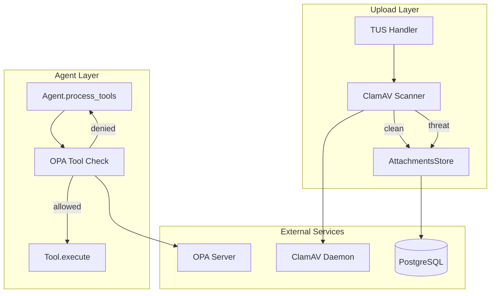
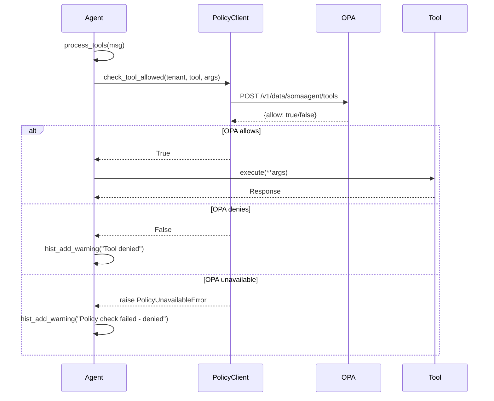

# Design Document: Upload Security & OPA Integration

## Overview

This design document specifies the technical architecture for three security improvements:

1. **OPA Policy Integration in Agent Tool Calls** - Fail-closed authorization before tool execution
2. **ClamAV Antivirus Scanning** - Virus scanning for file uploads with quarantine
3. **TUS Protocol Completion** - Full resumable upload implementation

### Goals

1. Achieve fail-closed security for tool execution via OPA
2. Prevent malicious file uploads via ClamAV scanning
3. Enable reliable large file uploads via TUS protocol
4. Maintain 100% VIBE compliance - NO mocks, NO stubs, NO placeholders

### Non-Goals

- Changing the core agent conversation loop
- Modifying existing tool implementations
- Changing the AttachmentsStore schema (extend only)

---

## Architecture

### High-Level Architecture



### Component Interaction Flow



---

## Components and Interfaces

### 1. OPA Tool Policy Checker (`python/helpers/tool_policy.py`)

New module for OPA tool authorization in agent context.

```python
"""OPA tool policy checker for agent tool execution."""

from __future__ import annotations

import logging
import time
from typing import Any, Dict, Optional

from prometheus_client import Counter, Histogram

from services.common.policy_client import PolicyClient
from src.core.config import cfg

LOGGER = logging.getLogger(__name__)

# Prometheus metrics
TOOL_POLICY_DENIED = Counter(
    "tool_policy_denied_total",
    "Tool requests denied by OPA",
    ["tool_name", "tenant_id"]
)
OPA_CHECK_DURATION = Histogram(
    "opa_tool_check_duration_seconds",
    "Duration of OPA tool policy checks",
    ["result"]
)


class PolicyUnavailableError(Exception):
    """Raised when OPA is unavailable - triggers fail-closed behavior."""
    pass


class ToolPolicyChecker:
    """Checks OPA policy before tool execution. Fail-closed on errors."""

    def __init__(self, policy_client: Optional[PolicyClient] = None):
        opa_url = cfg.settings().external.opa_url
        self._client = policy_client or PolicyClient(base_url=opa_url)

    async def check_tool_allowed(
        self,
        tenant_id: str,
        tool_name: str,
        tool_args: Dict[str, Any],
        persona_id: Optional[str] = None,
    ) -> bool:
        """Check if tool execution is allowed by OPA policy.
        
        Returns True if allowed, False if denied.
        Raises PolicyUnavailableError if OPA is unreachable (fail-closed).
        """
        start = time.time()
        try:
            result = await self._client.check_policy(
                action="tool.request",
                resource=tool_name,
                tenant_id=tenant_id,
                context={
                    "tool_args": tool_args,
                    "persona_id": persona_id,
                }
            )
            duration = time.time() - start
            
            if result:
                OPA_CHECK_DURATION.labels(result="allowed").observe(duration)
                return True
            else:
                OPA_CHECK_DURATION.labels(result="denied").observe(duration)
                TOOL_POLICY_DENIED.labels(
                    tool_name=tool_name,
                    tenant_id=tenant_id
                ).inc()
                LOGGER.warning(
                    "Tool denied by OPA",
                    extra={
                        "tenant_id": tenant_id,
                        "tool_name": tool_name,
                        "persona_id": persona_id,
                    }
                )
                return False
                
        except Exception as exc:
            duration = time.time() - start
            OPA_CHECK_DURATION.labels(result="error").observe(duration)
            LOGGER.error(
                "OPA unavailable - fail-closed",
                extra={
                    "tenant_id": tenant_id,
                    "tool_name": tool_name,
                    "error": str(exc),
                }
            )
            raise PolicyUnavailableError(f"OPA check failed: {exc}") from exc

    async def close(self):
        """Close the policy client connection."""
        if hasattr(self._client, 'close'):
            await self._client.close()
```

### 2. ClamAV Scanner (`services/common/clamav_scanner.py`)

New module for antivirus scanning via pyclamd.

```python
"""ClamAV antivirus scanner using pyclamd."""

from __future__ import annotations

import logging
import time
from dataclasses import dataclass
from enum import Enum
from typing import Optional

from prometheus_client import Counter, Histogram

from src.core.config import cfg

LOGGER = logging.getLogger(__name__)

# Prometheus metrics
UPLOAD_QUARANTINED = Counter(
    "upload_quarantined_total",
    "Files quarantined due to detected threats",
    ["threat_name"]
)
CLAMAV_SCAN_DURATION = Histogram(
    "clamav_scan_duration_seconds",
    "Duration of ClamAV scans",
    ["result"]
)


class ScanStatus(str, Enum):
    CLEAN = "clean"
    QUARANTINED = "quarantined"
    SCAN_PENDING = "scan_pending"
    ERROR = "error"


@dataclass
class ScanResult:
    status: ScanStatus
    threat_name: Optional[str] = None
    error_message: Optional[str] = None


class ClamAVScanner:
    """ClamAV scanner using pyclamd library."""

    def __init__(
        self,
        host: Optional[str] = None,
        port: Optional[int] = None,
    ):
        self._host = host or cfg.env("SA01_CLAMAV_HOST", "localhost")
        self._port = int(port or cfg.env("SA01_CLAMAV_PORT", "3310"))
        self._clamd = None

    def _get_clamd(self):
        """Lazy initialization of pyclamd connection."""
        if self._clamd is None:
            try:
                import pyclamd
                self._clamd = pyclamd.ClamdNetworkSocket(
                    host=self._host,
                    port=self._port,
                    timeout=30
                )
                # Test connection
                if not self._clamd.ping():
                    raise ConnectionError("ClamAV ping failed")
            except Exception as exc:
                LOGGER.warning(
                    "ClamAV connection failed",
                    extra={"host": self._host, "port": self._port, "error": str(exc)}
                )
                self._clamd = None
                raise
        return self._clamd

    def scan_bytes(self, content: bytes) -> ScanResult:
        """Scan byte content for viruses.
        
        Returns ScanResult with status and optional threat name.
        """
        start = time.time()
        
        try:
            clamd = self._get_clamd()
            result = clamd.scan_stream(content)
            duration = time.time() - start
            
            if result is None:
                # No threat detected
                CLAMAV_SCAN_DURATION.labels(result="clean").observe(duration)
                return ScanResult(status=ScanStatus.CLEAN)
            
            # Threat detected - result is dict like {'stream': ('FOUND', 'Eicar-Test-Signature')}
            if 'stream' in result:
                status, threat = result['stream']
                if status == 'FOUND':
                    CLAMAV_SCAN_DURATION.labels(result="threat").observe(duration)
                    UPLOAD_QUARANTINED.labels(threat_name=threat).inc()
                    LOGGER.warning(
                        "Threat detected",
                        extra={"threat_name": threat, "size": len(content)}
                    )
                    return ScanResult(
                        status=ScanStatus.QUARANTINED,
                        threat_name=threat
                    )
            
            # Unknown result format - treat as clean
            CLAMAV_SCAN_DURATION.labels(result="clean").observe(duration)
            return ScanResult(status=ScanStatus.CLEAN)
            
        except ImportError:
            LOGGER.error("pyclamd not installed - scans disabled")
            return ScanResult(
                status=ScanStatus.SCAN_PENDING,
                error_message="pyclamd not installed"
            )
        except Exception as exc:
            duration = time.time() - start
            CLAMAV_SCAN_DURATION.labels(result="error").observe(duration)
            LOGGER.warning(
                "ClamAV scan failed - marking as pending",
                extra={"error": str(exc)}
            )
            return ScanResult(
                status=ScanStatus.SCAN_PENDING,
                error_message=str(exc)
            )
```

### 3. TUS Upload Handler (`services/gateway/tus_handler.py`)

Enhanced TUS protocol implementation.

```python
"""TUS protocol handler for resumable uploads."""

from __future__ import annotations

import hashlib
import logging
import time
import uuid
from dataclasses import dataclass, field
from typing import Dict, Optional

from src.core.config import cfg

LOGGER = logging.getLogger(__name__)


@dataclass
class TUSUploadSession:
    """Tracks state of an in-progress TUS upload."""
    upload_id: str
    filename: str
    total_size: int
    mime_type: str
    session_id: Optional[str]
    tenant_id: Optional[str]
    chunks: bytes = field(default_factory=bytes, repr=False)
    current_offset: int = 0
    created_at: float = field(default_factory=time.time)
    expires_at: float = 0.0

    def __post_init__(self):
        expiry_hours = int(cfg.env("SA01_TUS_EXPIRY_HOURS", "24"))
        self.expires_at = self.created_at + (expiry_hours * 3600)

    @property
    def is_expired(self) -> bool:
        return time.time() > self.expires_at

    @property
    def is_complete(self) -> bool:
        return self.current_offset >= self.total_size


class TUSHandler:
    """Handles TUS protocol for resumable uploads."""

    def __init__(self):
        self._sessions: Dict[str, TUSUploadSession] = {}
        self._chunk_size = int(cfg.env("SA01_TUS_CHUNK_SIZE", str(1024 * 1024)))  # 1MB default

    def create_upload(
        self,
        filename: str,
        total_size: int,
        mime_type: str = "application/octet-stream",
        session_id: Optional[str] = None,
        tenant_id: Optional[str] = None,
    ) -> dict:
        """Initialize a new TUS upload session."""
        upload_id = str(uuid.uuid4())
        
        session = TUSUploadSession(
            upload_id=upload_id,
            filename=filename,
            total_size=total_size,
            mime_type=mime_type,
            session_id=session_id,
            tenant_id=tenant_id,
        )
        self._sessions[upload_id] = session
        
        LOGGER.info(
            "TUS upload created",
            extra={
                "upload_id": upload_id,
                "filename": filename,
                "total_size": total_size,
            }
        )
        
        return {
            "upload_id": upload_id,
            "upload_url": f"/v1/uploads/{upload_id}/chunk",
            "chunk_size": self._chunk_size,
            "expires_at": session.expires_at,
        }

    def append_chunk(
        self,
        upload_id: str,
        chunk: bytes,
        offset: int,
    ) -> dict:
        """Append a chunk to an existing upload."""
        session = self._sessions.get(upload_id)
        if session is None:
            raise ValueError(f"Upload not found: {upload_id}")
        
        if session.is_expired:
            del self._sessions[upload_id]
            raise ValueError(f"Upload expired: {upload_id}")
        
        # Validate offset continuity
        if offset != session.current_offset:
            raise ValueError(
                f"Invalid offset: expected {session.current_offset}, got {offset}"
            )
        
        # Append chunk
        session.chunks += chunk
        session.current_offset += len(chunk)
        
        return {
            "upload_id": upload_id,
            "offset": session.current_offset,
            "complete": session.is_complete,
        }

    def get_status(self, upload_id: str) -> dict:
        """Get current upload status for resume."""
        session = self._sessions.get(upload_id)
        if session is None:
            raise ValueError(f"Upload not found: {upload_id}")
        
        return {
            "upload_id": upload_id,
            "offset": session.current_offset,
            "total_size": session.total_size,
            "complete": session.is_complete,
            "expired": session.is_expired,
        }

    def finalize(self, upload_id: str) -> dict:
        """Finalize upload and return content with metadata."""
        session = self._sessions.get(upload_id)
        if session is None:
            raise ValueError(f"Upload not found: {upload_id}")
        
        if not session.is_complete:
            raise ValueError(
                f"Upload incomplete: {session.current_offset}/{session.total_size}"
            )
        
        # Compute SHA-256
        sha256 = hashlib.sha256(session.chunks).hexdigest()
        
        result = {
            "upload_id": upload_id,
            "filename": session.filename,
            "mime_type": session.mime_type,
            "size": len(session.chunks),
            "sha256": sha256,
            "content": session.chunks,
            "session_id": session.session_id,
            "tenant_id": session.tenant_id,
        }
        
        # Cleanup session
        del self._sessions[upload_id]
        
        LOGGER.info(
            "TUS upload finalized",
            extra={
                "upload_id": upload_id,
                "filename": session.filename,
                "size": len(session.chunks),
                "sha256": sha256,
            }
        )
        
        return result

    def cleanup_expired(self) -> int:
        """Remove expired upload sessions. Returns count of cleaned sessions."""
        expired = [
            uid for uid, session in self._sessions.items()
            if session.is_expired
        ]
        for uid in expired:
            del self._sessions[uid]
        
        if expired:
            LOGGER.info(f"Cleaned up {len(expired)} expired TUS sessions")
        
        return len(expired)
```

---

## Data Models

### Attachment Status Extension

The existing `AttachmentsStore` status field supports:
- `clean` - Passed ClamAV scan
- `quarantined` - Failed ClamAV scan (threat detected)
- `scan_pending` - ClamAV unavailable, needs retry

### OPA Policy Input

```json
{
  "input": {
    "action": "tool.request",
    "resource": "code_execution",
    "tenant": "tenant-123",
    "context": {
      "tool_args": {"runtime": "python", "code": "..."},
      "persona_id": "agent_0"
    }
  }
}
```

---

## Correctness Properties

*A property is a characteristic or behavior that should hold true across all valid executions of a system-essentially, a formal statement about what the system should do. Properties serve as the bridge between human-readable specifications and machine-verifiable correctness guarantees.*

### Property 1: OPA Check Determines Tool Execution

*For any* tool request in agent.process_tools(), the OPA policy check result SHALL determine whether the tool executes: allowed → execute, denied → no execution.
**Validates: Requirements 1.1, 1.2, 1.4**

### Property 2: OPA Unavailability Fails Closed

*For any* OPA connection failure or timeout, the tool request SHALL be denied (fail-closed behavior).
**Validates: Requirements 1.3**

### Property 3: ClamAV Scan Result Determines File Status

*For any* finalized upload, the ClamAV scan result SHALL determine the file status: threat → "quarantined", no threat → "clean".
**Validates: Requirements 2.2, 2.3**

### Property 4: Quarantined Files Cannot Be Downloaded

*For any* file with status "quarantined", download requests SHALL be rejected with 403 Forbidden.
**Validates: Requirements 2.5**

### Property 5: TUS Init Returns Required Fields

*For any* TUS upload initialization, the response SHALL contain `upload_id`, `upload_url`, and `chunk_size`.
**Validates: Requirements 3.1**

### Property 6: TUS Offset Continuity

*For any* TUS chunk upload, the offset SHALL match the current session offset (no gaps, no overlaps).
**Validates: Requirements 3.2, 3.3**

### Property 7: TUS Finalize Triggers Scan

*For any* TUS upload finalization, SHA-256 SHALL be computed AND ClamAV scan SHALL be triggered.
**Validates: Requirements 3.4**

### Property 8: Security Metrics Emission

*For any* OPA denial or file quarantine, the corresponding Prometheus counter SHALL be incremented.
**Validates: Requirements 4.1, 4.2**

---

## Error Handling

### OPA Errors

| Scenario | Behavior |
|----------|----------|
| OPA returns deny | Tool not executed, warning added to history |
| OPA timeout | PolicyUnavailableError raised, tool denied |
| OPA connection refused | PolicyUnavailableError raised, tool denied |
| OPA returns invalid response | PolicyUnavailableError raised, tool denied |

### ClamAV Errors

| Scenario | Behavior |
|----------|----------|
| ClamAV detects threat | Status = "quarantined", threat name logged |
| ClamAV unavailable | Status = "scan_pending", warning logged |
| pyclamd not installed | Status = "scan_pending", error logged |
| Scan timeout | Status = "scan_pending", retry later |

### TUS Errors

| Scenario | Behavior |
|----------|----------|
| Invalid upload_id | 404 Not Found |
| Upload expired | 410 Gone |
| Invalid offset | 409 Conflict with expected offset |
| Incomplete finalize | 400 Bad Request |

---

## Testing Strategy

### Property-Based Testing Framework

**Library:** `hypothesis` (Python)

**Configuration:**
```python
from hypothesis import settings, given, strategies as st

@settings(max_examples=100)
```

### Test Categories

| Category | Framework | Coverage |
|----------|-----------|----------|
| Unit Tests | pytest | OPA checker, ClamAV scanner, TUS handler |
| Property Tests | hypothesis | Correctness properties 1-8 |
| Integration Tests | pytest-asyncio | Full upload flow with real services |

### Property Test Annotations

Each property-based test MUST be annotated with:
```python
# **Feature: upload-security-opa-integration, Property 1: OPA Check Determines Tool Execution**
# **Validates: Requirements 1.1, 1.2, 1.4**
```

---

## Integration Points

### Agent Integration

Modify `agent.py` `process_tools()` to call `ToolPolicyChecker` before tool execution.

### Upload Integration

Modify `services/gateway/routers/uploads_full.py` to:
1. Use `TUSHandler` for chunked uploads
2. Call `ClamAVScanner.scan_bytes()` before storing
3. Set status based on scan result

### Attachments Router

Modify `services/gateway/routers/attachments.py` to reject downloads of quarantined files.
