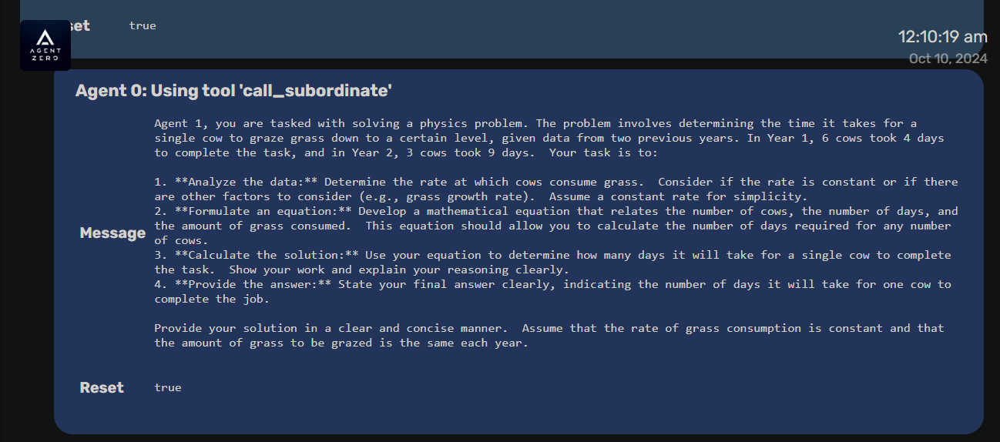

<div align="center">

# `Agent Zero`

**WE DO NOT MOCK. WE DO NOT BYPASS. WE DO NOT INVENT TESTS. WE USE REAL DATA, REAL SERVERS, REAL EVERYTHING.**


[](https://agent-zero.ai) [](https://github.com/sponsors/agent0ai) [](https://x.com/Agent0ai) [](https://discord.gg/B8KZKNsPpj) [](https://www.youtube.com/@AgentZeroFW) [](https://www.linkedin.com/in/jan-tomasek/) [](https://warpcast.com/agent-zero) 


## Documentation:

[Introduction](#a-personal-organic-agentic-framework-that-grows-and-learns-with-you) •
[Installation](./docs/installation.md) •
[Development](./docs/development.md) •
[SomaAgent01 Docker Stack](./docs/development/somaagent01_docker_compose.md) •
[Extensibility](./docs/extensibility.md) •
[Connectivity](./docs/connectivity.md) •
[How to update](./docs/installation.md#how-to-update-agent-zero) •
[Documentation](./docs/README.md) •
[Usage](./docs/usage.md)

For the complete documentation, see `docs/README.md` or build the site with `mkdocs`.

</div>


## Single point of entry (development)

Use the root Makefile targets below. Provider credentials and model profiles are managed exclusively through the Web UI Settings (`/ui` → Settings), not environment variables. Secrets are stored encrypted in Redis via the Gateway.

- Start stack (developer profile): `make dev-up`
- Stop stack: `make dev-down`
- Tail logs: `make dev-logs`
- Rebuild and restart: `make dev-rebuild`
- Clean shutdown and remove volumes: `make dev-down-hard`
- Fully clean (containers, volumes, dev network): `make dev-down-clean`

Notes:
- A minimal `.env` is auto-created to satisfy docker compose `env_file`; do not put secrets there. The UI is the source of truth for credentials.

### Enable live LLM chat via Groq (DEV)

Use the Settings UI (preferred) or the helper script to persist your Groq API key and dialogue model profile in the Gateway. The Gateway securely stores LLM credentials in Redis (encrypted with `GATEWAY_ENC_KEY`) and injects them into centralized `/v1/llm/invoke` calls used by the conversation worker.

- Option A – through the UI:
    - Open the app at http://localhost:${GATEWAY_PORT:-21016}/ui
    - Open Settings → Model
    - Set Provider: groq
    - Set Model: e.g. `llama-3.1-8b-instant` (or another Groq-supported model)
    - Leave API Base blank or set `https://api.groq.com/openai` (Gateway normalizes and appends `/v1` if needed)
    - In API Keys section, set `api_key_groq` with your Groq API key
    - Save; then start a chat. The worker uses Gateway `/v1/llm/invoke(/stream)` with stored credentials.

Option B (legacy helper script) has been removed; always use the Settings UI sections flow. External seeding scripts for provider credentials are intentionally unsupported to preserve a single write path.

Notes:
- Groq requires an OpenAI-compatible path; if you provide `https://api.groq.com` the Gateway will normalize to include `/openai` and `/v1` when needed.
- LLM invoke endpoints are internal-token gated; in dev this is `dev-internal-token` and already configured for worker↔gateway calls.

## UI access

Local Gateway + UI: http://127.0.0.1:21016/ui

Note: External baseline capture servers and Playwright parity projects are not part of this repository.

### Streaming Modes

Gateway streaming endpoint `/v1/llm/invoke/stream` supports two modes:
1. Canonical (default): each provider token → `assistant.delta`, then a single `assistant.final` carrying `metadata.done=true`.
2. Passthrough (OpenAI style): opt-in via query `?mode=openai` or env `GATEWAY_LLM_STREAM_MODE=openai` to forward raw upstream chunks plus the `[DONE]` sentinel unchanged.

Canonical contract sequence (typical):
`assistant.started` → optional `assistant.thinking.started` → repeated `assistant.delta` → optional `assistant.thinking.final` → `assistant.final` (+ `metadata.done=true`).
Optional tool markers (when enabled via `SA01_ENABLE_TOOL_EVENTS=true`): `assistant.tool.started` / `assistant.tool.delta` / `assistant.tool.final` may appear interleaved with deltas.
Errors are emitted as `assistant.error` (or `<role>.error` when tool/system sourced) and always normalized before persistence.

Prefer canonical for stable UI/event tooling. Passthrough exists solely for debugging or legacy client compatibility.

### Runtime Config & Flags

- Use `services.common.runtime_config.env()` for environment reads in business logic and `services.common.runtime_config.flag()` for feature checks. Avoid `os.getenv` directly except in settings/bootstrap modules.
- Newly centralized keys (guarded by tests): `EXPORT_JOBS_DIR`, `GATEWAY_EXPORT_REQUIRE_TENANT`, `MEMORY_EXPORT_MAX_ROWS`, `MEMORY_EXPORT_PAGE_SIZE`, `EXPORT_JOBS_MAX_ROWS`, `EXPORT_JOBS_PAGE_SIZE`, `UPLOAD_TMP_DIR`.
- CI guardrails: `tests/unit/test_no_direct_env_feature_flags.py` prevents direct feature-flag env reads; `tests/unit/test_no_direct_env_centralized_keys.py` blocks raw `os.getenv` for the keys above.

#### Feature Flags

- `SA01_ENABLE_CONTENT_MASKING`: enable masking of sensitive content in streamed errors and persisted events.
- `SA01_ENABLE_ERROR_CLASSIFIER`: enrich errors with `error_code` and `retriable` hints.
- `SA01_ENABLE_SEQUENCE` (default true): attach `metadata.sequence` counters to streamed events.
- `SA01_ENABLE_TOKEN_METRICS` (default true): emit first-token latency and token counters.
- `SA01_ENABLE_REASONING_STREAM`: include `assistant.thinking.started/final` markers in the stream (non-persisted).
- `SA01_ENABLE_TOOL_EVENTS`: include `assistant.tool.*` markers when providers stream tool calls.

### Metrics & Persistence

- Core Gateway metrics (Prometheus): `GATEWAY_METRICS_PORT` (default 8000).
- Additional connection gauges & rate limiter counters exposed on the same metrics endpoint.
- Circuit breaker metrics (if enabled by environment): `${CIRCUIT_BREAKER_METRICS_PORT:-9610}`.

In addition to Prometheus counters/gauges, the Gateway persists key metrics to Postgres via `TelemetryStore`:
- `assistant_first_token_seconds` (per provider/model, with session/persona metadata)
- Reasoning markers: `reasoning_events{phase=started|final,provider,model}`
- Tool markers: `tool_events{type=started|delta|final,provider,model}`
 - LLM invoke outcomes: `llm_invoke{stream=true|false,result=ok|error|timeout,provider,model}`

Persisted rows live in `generic_metrics`. Use `services/common/telemetry.py::TelemetryPublisher.emit_generic_metric` for new metrics.

Scrape configuration example snippet:
```
- job_name: gateway
    static_configs:
        - targets: ['localhost:8000']
- job_name: circuit_breakers
    static_configs:
        - targets: ['localhost:9610']
```


### Event Dedupe & Error Normalization

Timeline uniqueness enforced by index `(session_id, payload->>'event_id')`. Raw `type:"error"` rows are auto-upgraded on startup and blocked by a CHECK constraint. Read-time normalization (list + SSE) ensures defense in depth.

### SSE Heartbeats & Metrics

`/v1/session/{session_id}/events` streams canonical outbound events and injects `system.keepalive` heartbeats every `SSE_HEARTBEAT_SECONDS` (default 20s). Active connections tracked via Prometheus gauge `gateway_sse_connections`.

Metrics (scrape `${GATEWAY_METRICS_PORT:-8000}`):
- `gateway_sse_connections`
- `gateway_rate_limit_results_total{result=allowed|blocked|error}`
- `gateway_write_through_*`

Prometheus scrape example:
```yaml
- job_name: 'gateway'
    static_configs:
        - targets: ['localhost:8000']
```

### Rate Limiting

Enable with `GATEWAY_RATE_LIMIT_ENABLED=true`.
- `GATEWAY_RATE_LIMIT_WINDOW_SECONDS` (default 60)
- `GATEWAY_RATE_LIMIT_MAX_REQUESTS` (default 120)
Returns HTTP 429 + `retry_after` when exceeded; health and metrics endpoints exempt.


<div align="center">

> ### 🚨 **IMPORTANT ANNOUNCEMENT** 🚨

The original GitHub and DockerHub repositories for Agent Zero have been transferred to a new namespace:

- **GitHub & DockerHub:** `agent0ai/agent-zero`

From now on, please use this name for both `git clone` and `docker pull` commands.

</div>


[](https://youtu.be/lazLNcEYsiQ)


## A personal, organic agentic framework that grows and learns with you


- Agent Zero is not a predefined agentic framework. It is designed to be dynamic, organically growing, and learning as you use it.
- Agent Zero is fully transparent, readable, comprehensible, customizable, and interactive.
- Agent Zero uses the computer as a tool to accomplish its (your) tasks.

# 💡 Key Features

1. **General-purpose Assistant**

- Agent Zero is not pre-programmed for specific tasks (but can be). It is meant to be a general-purpose personal assistant. Give it a task, and it will gather information, execute commands and code, cooperate with other agent instances, and do its best to accomplish it.
- It has a persistent memory, allowing it to memorize previous solutions, code, facts, instructions, etc., to solve tasks faster and more reliably in the future.


2. **Computer as a Tool**

- Agent Zero uses the operating system as a tool to accomplish its tasks. It has no single-purpose tools pre-programmed. Instead, it can write its own code and use the terminal to create and use its own tools as needed.
- The only default tools in its arsenal are online search, memory features, communication (with the user and other agents), and code/terminal execution. Everything else is created by the agent itself or can be extended by the user.
- Tool usage functionality has been developed from scratch to be the most compatible and reliable, even with very small models.
- **Default Tools:** Agent Zero includes tools like knowledge, code execution, and communication.
- **Creating Custom Tools:** Extend Agent Zero's functionality by creating your own custom tools.
- **Instruments:** Instruments are a new type of tool that allow you to create custom functions and procedures that can be called by Agent Zero.

3. **Multi-agent Cooperation**

- Every agent has a superior agent giving it tasks and instructions. Every agent then reports back to its superior.
- In the case of the first agent in the chain (Agent 0), the superior is the human user; the agent sees no difference.
- Every agent can create its subordinate agent to help break down and solve subtasks. This helps all agents keep their context clean and focused.




4. **Completely Customizable and Extensible**

- Almost nothing in this framework is hard-coded. Nothing is hidden. Everything can be extended or changed by the user.
- The whole behavior is defined by a system prompt in the **prompts/default/agent.system.md** file. Change this prompt and change the framework dramatically.
- The framework does not guide or limit the agent in any way. There are no hard-coded rails that agents have to follow.
- Every prompt, every small message template sent to the agent in its communication loop can be found in the **prompts/** folder and changed.
- Every default tool can be found in the **python/tools/** folder and changed or copied to create new predefined tools.


5. **Communication is Key**

- Give your agent a proper system prompt and instructions, and it can do miracles.
- Agents can communicate with their superiors and subordinates, asking questions, giving instructions, and providing guidance. Instruct your agents in the system prompt on how to communicate effectively.
- The terminal interface is real-time streamed and interactive. You can stop and intervene at any point. If you see your agent heading in the wrong direction, just stop and tell it right away.
- There is a lot of freedom in this framework. You can instruct your agents to regularly report back to superiors asking for permission to continue. You can instruct them to use point-scoring systems when deciding when to delegate subtasks. Superiors can double-check subordinates' results and dispute. The possibilities are endless.

## 🚀 Things you can build with Agent Zero

- **Development Projects** - `"Create a React dashboard with real-time data visualization"`

- **Data Analysis** - `"Analyze last quarter's NVIDIA sales data and create trend reports"`

- **Content Creation** - `"Write a technical blog post about microservices"`

- **System Admin** - `"Set up a monitoring system for our web servers"`

- **Research** - `"Gather and summarize five recent AI papers about CoT prompting"`

## 🆕 What’s New (October 2025)

- Versioned gateway surface at `/v1/*` plus Prometheus alerts for latency, error-rate, and circuit-breaker openings.
- Capsule Registry service with optional Cosign signing, gateway proxy endpoints for `/v1/capsules/*` (with legacy `/capsules/*` aliases), SDK helpers (`python/somaagent/capsule.py`), and a refreshed marketplace UI (`webui/marketplace.html`) that surfaces signatures and triggers one-click installs into `/capsules/installed` entirely through the gateway.
- GitHub Actions capsule workflow (`.github/workflows/capsule.yml`) and Kafka partition scaler script (`scripts/kafka_partition_scaler.py`).
- Optional dependencies (PyJWT, sentence-transformers, openai-whisper, GitPython) now load lazily so tests can run without them; install as needed for full functionality.

# ⚙️ Installation

Click to open a video to learn how to install Agent Zero:

[](https://www.youtube.com/watch?v=w5v5Kjx51hs)

A detailed setup guide for Windows, macOS, and Linux with a video can be found in the Agent Zero Documentation at [this page](./docs/installation.md).

### ⚡ Quick Start (Local Stack)

```bash
make dev-up
curl -f http://localhost:${GATEWAY_PORT:-21016}/v1/health || echo "health check failed"
open http://localhost:${GATEWAY_PORT:-21016}/ui
```

### 🧰 Local SomaAgent01 stack via Makefile

For day-to-day development, run the Python services directly while Docker hosts
only the shared infrastructure:

```bash
# 1) Start Kafka/Redis/Postgres/OPA
make deps-up

# 2) Launch gateway + workers inside your virtualenv (Ctrl+C to stop)
make stack-up

# 3) Run the Agent UI locally (http://127.0.0.1:3000)
make ui
```

When you need a full Docker deployment (for parity with staging or CI), the
classic targets remain available:

```bash
make up        # start gateway, workers, and UI in containers
make down      # stop the full stack
make rebuild   # rebuild images and restart everything
```

Once the stack is healthy, reach the Agent UI at `http://localhost:${GATEWAY_PORT:-21016}/ui`. Run `make help` for the complete command catalog.

> **Observability tip:** The gateway now exports circuit-breaker counters on `${CIRCUIT_BREAKER_METRICS_PORT:-9610}`. Prometheus scrapes this endpoint via the `circuit-breakers` job, enabling the `CircuitBreakerOpenEvents` alert without additional wiring. Alertmanager ships alongside Prometheus—access it on `${ALERTMANAGER_PORT:-9093}` to manage silences or webhook routes. Override `CIRCUIT_BREAKER_METRICS_HOST`/`PORT` if you relocate the exporter.

## 🐳 Fully Dockerized, with Speech-to-Text and TTS


- Customizable settings allow users to tailor the agent's behavior and responses to their needs.
- The Web UI output is very clean, fluid, colorful, readable, and interactive; nothing is hidden.
- You can load or save chats directly within the Web UI.
- The same output you see in the terminal is automatically saved to an HTML file in **logs/** folder for every session.


- Agent output is streamed in real-time, allowing users to read along and intervene at any time.
- No coding is required; only prompting and communication skills are necessary.
- With a solid system prompt, the framework is reliable even with small models, including precise tool usage.

## 👀 Keep in Mind

1. **Agent Zero Can Be Dangerous!**

- With proper instruction, Agent Zero is capable of many things, even potentially dangerous actions concerning your computer, data, or accounts. Always run Agent Zero in an isolated environment (like Docker) and be careful what you wish for.

2. **Agent Zero Is Prompt-based.**

- The whole framework is guided by the **prompts/** folder. Agent guidelines, tool instructions, messages, utility AI functions, it's all there.


## 📚 Read the Documentation

| Page | Description |
|-------|-------------|
| [Installation](./docs/installation.md) | Installation, setup and configuration |
| [Usage](./docs/usage.md) | Basic and advanced usage |
| [Development](./docs/development.md) | Development and customization |
| [Extensibility](./docs/extensibility.md) | Extending Agent Zero |
| [Connectivity](./docs/connectivity.md) | External API endpoints, MCP server connections, A2A protocol |
| [Architecture](./docs/architecture.md) | System design and components |
| [Agent Quickstart](./docs/AGENT_QUICKSTART.md) | Run the agent without shared infra, ports, and pointers |
| [Shared Infra dependency](./docs/SHARED_INFRA_DEPENDENCY.md) | How to bring up somastack and wire endpoints |
| [Contributing](./docs/contribution.md) | How to contribute |
| [Troubleshooting](./docs/troubleshooting.md) | Common issues and their solutions |


## 🎯 Changelog

### v0.9.6 - Memory Dashboard
[Release video](https://youtu.be/sizjAq2-d9s)
- Memory Management Dashboard
- Kali update
- Python update + dual installation
- Browser Use update
- New login screen
- LiteLLM retry on temporary errors
- Github Copilot provider support


### v0.9.5 - Secrets
[Release video](https://www.youtube.com/watch?v=VqxUdt7pjd8)
- Secrets management - agent can use credentials without seeing them
- Agent can copy paste messages and files without rewriting them
- LiteLLM global configuration field
- Custom HTTP headers field for browser agent
- Progressive web app support
- Extra model params support for JSON
- Short IDs for files and memories to prevent LLM errors
- Tunnel component frontend rework
- Fix for timezone change bug
- Notifications z-index fix

### v0.9.4 - Connectivity, UI
[Release video](https://www.youtube.com/watch?v=C2BAdDOduIc)
- External API endpoints
- Streamable HTTP MCP A0 server
- A2A (Agent to Agent) protocol - server+client
- New notifications system
- New local terminal interface for stability
- Rate limiter integration to models
- Delayed memory recall
- Smarter autoscrolling in UI
- Action buttons in messages
- Multiple API keys support
- Download streaming
- Tunnel URL QR code
- Internal fixes and optimizations

### v0.9.3 - Subordinates, memory, providers Latest
[Release video](https://www.youtube.com/watch?v=-LfejFWL34k)
- Faster startup/restart
- Subordinate agents can have dedicated prompts, tools and system extensions
- Streamable HTTP MCP server support
- Memory loading enhanced by AI filter
- Memory AI consolidation when saving memories
- Auto memory system configuration in settings
- LLM providers available are set by providers.yaml configuration file
- Venice.ai LLM provider supported
- Initial agent message for user + as example for LLM
- Docker build support for local images
- File browser fix


### v0.9.2 - Kokoro TTS, Attachments
[Release video](https://www.youtube.com/watch?v=sPot_CAX62I)

- Kokoro text-to-speech integration
- New message attachments system
- Minor updates: log truncation, hyperlink targets, component examples, api cleanup


### v0.9.1 - LiteLLM, UI improvements
[Release video](https://youtu.be/crwr0M4Spcg)
- Langchain replaced with LiteLLM
    - Support for reasoning models streaming
    - Support for more providers
    - Openrouter set as default instead of OpenAI
- UI improvements
    - New message grouping system
    - Communication smoother and more efficient
    - Collapsible messages by type
    - Code execution tool output improved
    - Tables and code blocks scrollable
    - More space efficient on mobile
- Streamable HTTP MCP servers support
- LLM API URL added to models config for Azure, local and custom providers
    

### v0.9.0 - Agent roles, backup/restore
[Release video](https://www.youtube.com/watch?v=rMIe-TC6H-k)
- subordinate agents can use prompt profiles for different roles
- backup/restore functionality for easier upgrades
- security and bug fixes

### v0.8.7 - Formatting, Document RAG Latest
[Release video](https://youtu.be/OQJkfofYbus)
- markdown rendering in responses
- live response rendering
- document Q&A tool

### v0.8.6 - Merge and update
[Release video](https://youtu.be/l0qpK3Wt65A)
- Merge with Hacking Edition
- browser-use upgrade and integration re-work
- tunnel provider switch

### v0.8.5 - **MCP Server + Client**
[Release video](https://youtu.be/pM5f4Vz3_IQ)

- Agent Zero can now act as MCP Server
- Agent Zero can use external MCP servers as tools

### v0.8.4.1 - 2
Default models set to gpt-4.1
- Code execution tool improvements
- Browser agent improvements
- Memory improvements
- Various bugfixes related to context management
- Message formatting improvements
- Scheduler improvements
- New model provider
- Input tool fix
- Compatibility and stability improvements

### v0.8.4
[Release video](https://youtu.be/QBh_h_D_E24)

- **Remote access (mobile)**

### v0.8.3.1
[Release video](https://youtu.be/AGNpQ3_GxFQ)

- **Automatic embedding**


### v0.8.3
[Release video](https://youtu.be/bPIZo0poalY)

- ***Planning and scheduling***

### v0.8.2
[Release video](https://youtu.be/xMUNynQ9x6Y)

- **Multitasking in terminal**
- **Chat names**

### v0.8.1
[Release video](https://youtu.be/quv145buW74)

- **Browser Agent**
- **UX Improvements**

### v0.8
[Release video](https://youtu.be/cHDCCSr1YRI)

- **Docker Runtime**
- **New Messages History and Summarization System**
- **Agent Behavior Change and Management**
- **Text-to-Speech (TTS) and Speech-to-Text (STT)**
- **Settings Page in Web UI**
- **SearXNG Integration Replacing Perplexity + DuckDuckGo**
- **File Browser Functionality**
- **KaTeX Math Visualization Support**
- **In-chat File Attachments**

### v0.7
[Release video](https://youtu.be/U_Gl0NPalKA)

- **Automatic Memory**
- **UI Improvements**
- **Instruments**
- **Extensions Framework**
- **Reflection Prompts**
- **Bug Fixes**

## 🤝 Community and Support

- [Join our Discord](https://discord.gg/B8KZKNsPpj) for live discussions or [visit our Skool Community](https://www.skool.com/agent-zero).
- [Follow our YouTube channel](https://www.youtube.com/@AgentZeroFW) for video tutorials and updates.
- [Star the project on GitHub](https://github.com/agent0ai/agent-zero) to show your support.

## License

- This project is licensed under the MIT License - see the [LICENSE](./LICENSE) file for details.