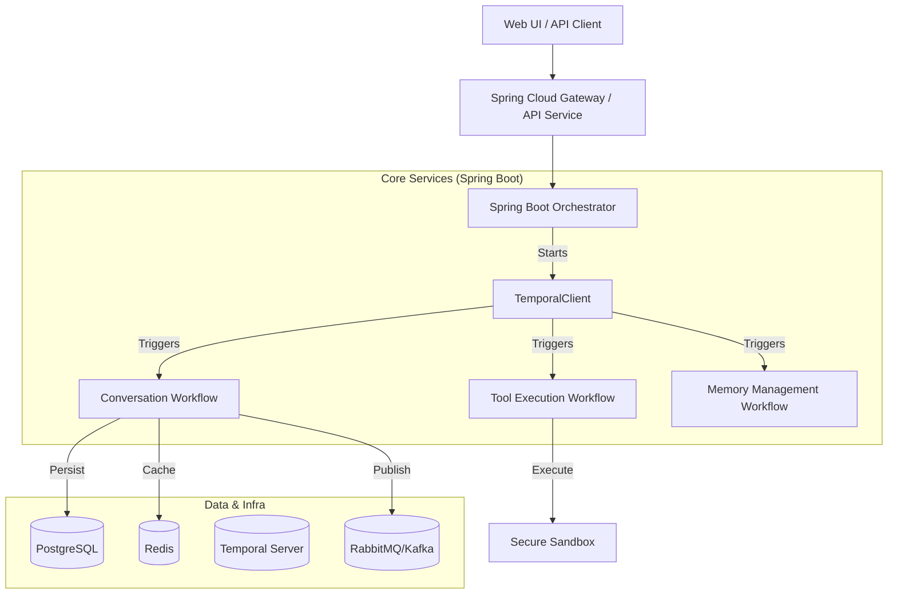

# Software Requirements Specification (SRS) for SomaAgent01 (Spring Boot Migration)

**Version:** 1.0
**Status:** DRAFT
**Date:** 2024-05-22

---

## Table of Contents
1. [Introduction](#1-introduction)
2. [Overall Description](#2-overall-description)
3. [System Architecture](#3-system-architecture)
4. [Functional Requirements](#4-functional-requirements)
5. [Data Requirements](#5-data-requirements)
6. [Non-Functional Requirements](#6-non-functional-requirements)
7. [Interface Requirements](#7-interface-requirements)

---

## 1. Introduction

### 1.1 Purpose
The purpose of this document is to define the comprehensive software requirements for **SomaAgent01**, an enterprise-grade AI agent framework, as it migrates from a Python-based microservices architecture to a robust **Spring Boot (Java 21)** ecosystem. This SRS is intended for developers, architects, and stakeholders to ensure the migrated system replicates 100% of the existing functionality while leveraging enterprise standards.

### 1.2 Scope
SomaAgent01 is an orchestrated AI system capable of autonomous task execution, conversation management, and tool use. The migration scope includes:
- **Core Orchestration:** Replacing Python `orchestrator` with a Spring Boot application managing service lifecycles.
- **API Gateway:** Re-implementing the FastAPI gateway using **Spring Cloud Gateway** or Spring MVC with Spring Security.
- **Workers:** Migrating the logic of `conversation_worker` and `tool_executor` into **Temporal Workflows** and Activities managed by Spring beans.
- **Data Persistence:** Migrating from SQLAlchemy/Redis direct access to **Spring Data JPA (PostgreSQL)** and **Spring Data Redis**.
- **AI Integration:** Integrating **Spring AI** for LLM interactions (replacing `litellm`) where applicable, while containerizing specific Python-only capabilities (e.g., `browser-use`) as sidecars if no Java equivalent exists.
- **Infrastructure:** Replacing Celery with **Temporal** for orchestration and **RabbitMQ/Kafka** (via Spring Cloud Stream) for event-driven communication.

### 1.3 Definitions, Acronyms, and Abbreviations
- **SRS:** Software Requirements Specification
- **RAG:** Retrieval-Augmented Generation
- **LLM:** Large Language Model
- **SLM:** Small Language Model (optimized for specific tasks)
- **OPA:** Open Policy Agent (for policy enforcement)
- **Temporal:** A durable execution system for orchestrating microservices.
- **DLQ:** Dead Letter Queue

### 1.4 References
- Existing SomaAgent01 Repository (Python)
- ISO/IEC/IEEE 29148:2018 (Requirements Engineering)
- Spring Boot Documentation
- Temporal.io Documentation

## 2. Overall Description

### 2.1 Product Perspective
SomaAgent01 is a self-contained, enterprise AI agent platform. It operates as a distributed system where a central **Orchestrator** coordinates specialized **Workers** (Conversation, Tool Execution, Memory Management). The new Spring Boot implementation will serve as the backbone, interacting with:
- **External LLM Providers:** OpenAI, Anthropic, etc. (via Spring AI).
- **Vector Databases:** For semantic memory retrieval (via Spring AI / PGVector).
- **User Interfaces:** The existing web UI (React/JS) which expects specific REST API contracts.

### 2.2 User Classes and Characteristics
- **End User:** Interacts with the agent via chat interface to perform tasks or retrieve information.
- **Administrator:** Configures tenant settings, policies (OPA), and monitors system health via dashboards.
- **Developer:** Extends the agent's capabilities by adding new tools or modifying workflows.

### 2.3 Operating Environment
- **Runtime:** Java 21 (LTS) running on Linux/Docker containers.
- **Orchestration:** Kubernetes or Docker Compose.
- **Database:** PostgreSQL 16+ (Primary), Redis 7+ (Cache/PubSub).
- **Message Broker:** RabbitMQ or Kafka (abstracted via Spring Cloud Stream).
- **Workflow Engine:** Temporal Server.

### 2.4 Design and Implementation Constraints
- **Language:** Strictly Java 21 (no Kotlin unless explicitly authorized for DSLs).
- **Framework:** Spring Boot 3.2+.
- **Build Tool:** Maven.
- **Verification:** All code must pass strict Checkstyle, PMD, and SpotBugs checks (Enterprise standard).
- **Backward Compatibility:** API endpoints MUST match the existing Python FastAPI contracts to ensure frontend compatibility.
- **"Vibe Coding" Compliance:** No mocks, no placeholders. Real implementations only.

---

## 3. System Architecture

### 3.1 High-Level Architecture
The system follows a **Microservices Architecture** orchestrated by **Temporal**.

### 3.2 Key Components
1.  **Gateway Service (Spring Boot Web):**
    -   Handles HTTP/WebSocket connections.
    -   Manages Authentication (OAuth2/JWT) and Rate Limiting.
    -   Routes requests to the appropriate internal services or triggers workflows.

2.  **Orchestrator (Spring Boot):**
    -   Replaces the Python `orchestrator`.
    -   Central service registry and health monitor (`/v1/health`).
    -   Manages the startup/shutdown lifecycle of the application context.

3.  **Worker Services (Temporal Activities):**
    -   **Conversation Worker:** Handles `process_message` logic (Analysis -> Policy -> RAG -> LLM).
    -   **Tool Executor:** Executes tools securely.
    -   **Memory Worker:** Handles asynchronous memory ingestion and indexing.

4.  **Event Bus (Spring Cloud Stream):**
    -   Decouples services for non-blocking operations (e.g., audit logging, telemetry).

## 4. Functional Requirements

### 4.1 Orchestrator & Gateway (Core)

#### FR-CORE-01: Health Monitoring
- **The System shall** expose a `/v1/health` endpoint returning the aggregated status of all connected services (Database, Redis, Temporal, Broker).
- **The System shall** implement deep health checks (Active Probing) rather than shallow "I am alive" signals.
- **The System shall** expose Prometheus metrics at `/metrics` (micrometer-registry-prometheus).

#### FR-CORE-02: Service Registration
- **The System shall** dynamically discover available Workers via the Temporal Client, removing the need for a manual `ServiceRegistry` implementation.
- **The System shall** log the startup sequence and "Critical Path" service availability (e.g., if DB is down, Orchestrator fails to start).

#### FR-GATEWAY-01: API Routing
- **The System shall** replicate the existing `services/gateway/routers` paths:
    -   `/v1/chat/*`: For conversation management.
    -   `/v1/tools/*`: For tool catalog and execution.
    -   `/v1/admin/*`: For system configuration.
- **The System shall** support WebSocket connections for real-time chat streaming.

#### FR-GATEWAY-02: Authentication & Rate Limiting
- **The System shall** validate JWT tokens for all protected endpoints.
- **The System shall** implement sliding window rate limiting (via Bucket4j or Redis) per Tenant ID.

### 4.2 Conversation Worker (The "Brain")

#### FR-CONV-01: Message Processing Pipeline
- **The System shall** implement a Temporal Workflow `ConversationWorkflow` that executes the following sequence:
    1.  **Analysis:** Classify intent (Question, Action, Problem) and Sentiment using a local or lightweight model/rule-engine.
    2.  **Policy Check:** Query OPA (Open Policy Agent) to verify if the request is allowed for the user/tenant.
    3.  **Memory Retrieval:** Query the Vector Store for relevant context (RAG).
    4.  **Context Construction:** Assemble System Prompt + History + RAG Context.
    5.  **Generation:** Call the LLM (via Spring AI) to generate a response.
    6.  **Post-Processing:** Detect "Multimodal Plans" (JSON blocks) in the response.

#### FR-CONV-02: Multimodal Plan Execution
- **The System shall** detect if the LLM response contains a JSON block with `multimodal_plan`.
- **The System shall** parse this plan and trigger a sub-workflow or separate Temporal Workflow to execute the tasks asynchronously.
- **The System shall** return the cleaned text response to the user immediately, while the plan executes in the background.

#### FR-CONV-03: Memory Management
- **The System shall** store every User Message and Assistant Response into the `EventLog` (PostgreSQL).
- **The System shall** asynchronously push these events to the Vector Database for future retrieval (Short-term -> Long-term consolidation).

### 4.3 Tool Executor (The "Muscle")

#### FR-TOOL-01: Tool Execution
- **The System shall** accept tool execution requests via Temporal Activities.
- **The System shall** validate tool arguments against a defined JSON Schema.
- **The System shall** execute Python-based tools (if keeping legacy) via a sidecar or JSR-223 / GraalVM polyglot context, OR execute Java-native tools directly.
    -   *Constraint:* For `browser-use`, a Python sidecar container is required.

#### FR-TOOL-02: Security & Sandboxing
- **The System shall** execute untrusted code/tools in an isolated environment (Docker container or restricted process).
- **The System shall** enforce timeouts and resource limits (CPU/RAM) on every tool execution.

## 5. Data Requirements

### 5.1 Data Dictionary
| Entity | Description | Key Attributes |
| :--- | :--- | :--- |
| **Session** | Represents a user's conversation thread. | `session_id` (UUID), `tenant_id`, `created_at` |
| **EventLog** | Immutable record of all system events. | `event_id`, `session_id`, `type` (user/assistant/system), `payload` (JSONB) |
| **Memory** | Semantic storage of facts/summaries. | `memory_id`, `embedding_vector`, `content`, `metadata` |
| **TenantConfig** | Configuration for a specific tenant. | `tenant_id`, `policy_rules`, `feature_flags` |
| **ToolDefinition** | Metadata about available tools. | `tool_name`, `schema` (JSON), `permissions` |

### 5.2 Schema Constraints
- **PostgreSQL:** Used as the primary Source of Truth.
- **JSONB:** Heavily used for `payload` and `metadata` columns to allow schema flexibility without migrations.
- **Vector Extension:** `pgvector` will be used for embedding storage.

---

## 6. Non-Functional Requirements

### 6.1 Security
- **NFR-SEC-01:** All internal service-to-service communication must be mTLS encrypted or secured via private network isolation.
- **NFR-SEC-02:** Secrets (API Keys, DB Credentials) must be injected via Environment Variables or HashiCorp Vault, never hardcoded.
- **NFR-SEC-03:** The System must sanitize all LLM inputs/outputs to prevent Prompt Injection (using tools like specific Spring AI advisors or guardrails).

### 6.2 Reliability & Fault Tolerance
- **NFR-REL-01:** **Temporal** must be used for all long-running processes. If a Worker crashes, the workflow must resume from the last checkpoint upon restart.
- **NFR-REL-02:** Circuit Breakers (Resilience4j) must be applied to all external API calls (OpenAI, Anthropic).

### 6.3 Performance
- **NFR-PERF-01:** API Gateway overhead must be < 50ms.
- **NFR-PERF-02:** DB Queries for chat history must be optimized to return < 100ms for p95.

### 6.4 Maintainability
- **NFR-MAINT-01:** Codebase must adhere to "Google Java Style Guide".
- **NFR-MAINT-02:** Use of Lombok is permitted to reduce boilerplate.
- **NFR-MAINT-03:** Comprehensive Unit (JUnit 5) and Integration (Testcontainers) tests are required for all flows.

---

## 7. Interface Requirements

### 7.1 API Specifications
The System shall provide a Swagger UI / OpenAPI 3.0 documentation at `/swagger-ui.html`.

**Key Endpoints:**
- `POST /v1/chat/completions` - OpenAI-compatible endpoint.
- `GET /v1/chat/sessions/{id}` - Retrieve history.
- `POST /v1/tools/execute` - Direct tool execution (Admin only).

### 7.2 Frontend Integration
- The backend must serve the existing `webui` static assets from `/`.
- All API calls from the frontend must be proxied correctly without CORS issues in a typical deployment.
