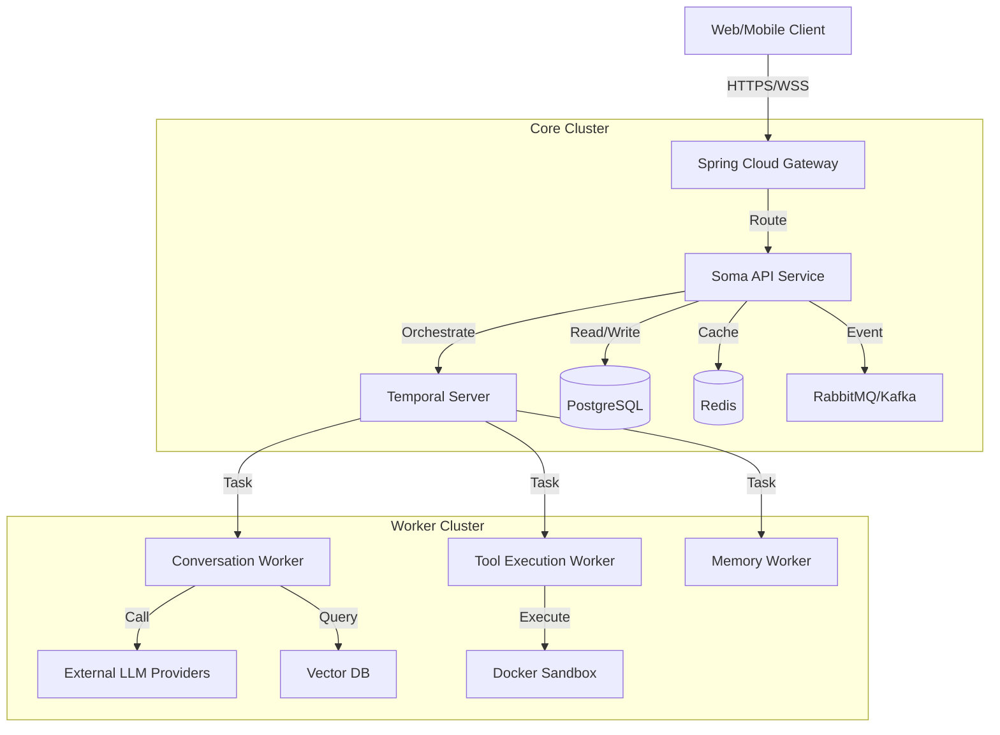

# Software Requirements Specification (SRS) for SomaAgent01 (Spring Boot Migration)

**Version:** 2.0 (Detailed Specification)
**Status:** DRAFT
**Date:** 2024-05-22
**Compliance:** ISO/IEC/IEEE 29148:2018 (Tailored)

---

## 1. Introduction

### 1.1 Purpose
The purpose of this document is to provide an exhaustive technical blueprint for migrating the **SomaAgent01** platform from Python (FastAPI/Celery) to **Java 21 (Spring Boot 3.3+)**. This document serves as the "Source of Truth" for all data structures, API contracts, and business logic algorithms.

### 1.2 Scope
The system is an Enterprise AI Agent Platform providing:
-   **Conversation Orchestration:** RAG-based chat with history and memory management.
-   **Tool Execution:** Secure execution of tasks (Python/Java) via sandboxed workers.
-   **Administration:** Tenant management, policy enforcement (OPA), and audit logging.

### 1.3 Technology Stack Constraints
-   **Language:** Java 21 LTS (Strict).
-   **Framework:** Spring Boot 3.3.x.
-   **Web:** Spring WebFlux (Netty) for high-throughput and SSE.
-   **Database:** PostgreSQL 16+ (Spring Data R2DBC/JPA).
-   **Cache/Broker:** Redis 7+ (Spring Data Redis), RabbitMQ/Kafka (Spring Cloud Stream).
-   **Orchestration:** Temporal.io (Java SDK).
-   **AI:** Spring AI (0.8.x+) for LLM abstraction.

---

## 2. System Architecture

### 2.1 Component Diagram



### 2.2 Security Architecture
-   **Authentication:** JWT (RFC 7519) validation via Spring Security OAuth2 Resource Server.
-   **Authorization:** Fine-grained access control using **Open Policy Agent (OPA)** sidecars.
-   **Secrets:** HashiCorp Vault integration via Spring Cloud Vault. API Keys must NEVER be stored in the DB in plain text.

---

## 3. Data Requirements

### 3.1 Database Schema (PostgreSQL)

#### 3.1.1 Table: `session_events`
Immutable log of all interactions.
| Column | Type | Constraints | Description |
| :--- | :--- | :--- | :--- |
| `id` | `SERIAL` | `PRIMARY KEY` | Auto-incrementing sequence ID. |
| `session_id` | `TEXT` | `NOT NULL`, Index | The unique UUID of the conversation session. |
| `occurred_at` | `TIMESTAMPTZ` | `DEFAULT NOW()` | Precise timestamp of the event. |
| `payload` | `JSONB` | `NOT NULL` | The event body (message, metadata, usage). |

#### 3.1.2 Table: `session_envelopes`
Current state metadata for a session.
| Column | Type | Constraints | Description |
| :--- | :--- | :--- | :--- |
| `session_id` | `UUID` | `PRIMARY KEY` | Unique Session ID. |
| `persona_id` | `TEXT` | | The AI persona ID being used. |
| `tenant` | `TEXT` | Index | Tenant identifier for multi-tenancy. |
| `metadata` | `JSONB` | `DEFAULT '{}'` | Arbitrary session context. |
| `analysis` | `JSONB` | `DEFAULT '{}'` | Latest sentiment/intent analysis. |
| `created_at` | `TIMESTAMPTZ` | `DEFAULT NOW()` | Session creation time. |
| `updated_at` | `TIMESTAMPTZ` | `DEFAULT NOW()` | Last update time. |

#### 3.1.3 Table: `agent_settings`
Configuration storage.
| Column | Type | Constraints | Description |
| :--- | :--- | :--- | :--- |
| `key` | `TEXT` | `PRIMARY KEY` | Setting key (e.g., 'global'). |
| `value` | `JSONB` | `NOT NULL` | The configuration object. |
| `updated_at` | `TIMESTAMPTZ` | | Last modification. |

### 3.2 Redis Data Structures
| Key Pattern | Type | TTL | Description |
| :--- | :--- | :--- | :--- |
| `session:{id}:meta` | `String` (JSON) | 900s | Cached session metadata for quick lookups. |
| `ratelimit:{tenant}:{ip}` | `String` (Int) | 60s | API Rate limiting counters. |

---

## 4. Functional Requirements

### 4.1 Conversation Logic (`ConversationWorkflow`)

#### 4.1.1 Context Construction Algorithm
**Input:** `UserMessage`, `History`, `Settings`
**Output:** `BuiltContext`

1.  **Health Check:** Query `SomabrainHealthState`. If `DOWN`, skip RAG.
2.  **Retrieval (RAG):**
    -   Fetch `top_k` snippets (8 if NORMAL, 3 if DEGRADED) from Vector Store.
    -   **Circuit Breaker:** Wrap call in `Resilience4j` breaker.
3.  **Salience Scoring:**
    -   Calculate `final_score = 0.7 * cosine_sim + 0.3 * exp(-age_days/30)`.
4.  **Redaction:**
    -   Apply PII Redaction (Presidio) to all snippet text.
5.  **Budgeting (Knapsack):**
    -   Available Tokens = `MaxTokens` - `SystemPrompt` - `UserMessage`.
    -   Select snippets maximizing `final_score` such that `sum(tokens) <= Available`.
    -   *Fallback:* Use Greedy approach if Optimal is too slow.
6.  **Prompt Assembly:**
    -   Inject `System Prompt` + `Multimodal Instructions` (if enabled).
    -   Inject `Snippet Block` as a System Message.
    -   Inject `History` (Last-N messages fitting remaining budget).

#### 4.1.2 Multimodal Plan Execution
**Trigger:** LLM Response contains JSON block with `multimodal_plan`.
**Action:**
1.  Parse JSON: `{ "multimodal_plan": { "tasks": [...] } }`.
2.  **Do Not Wait:** Return text response to user immediately.
3.  **Async:** Trigger child Temporal Workflow to execute tasks (e.g., Image Gen).
4.  **Callback:** When tasks complete, inject a new `System Event` into the session stream.

### 4.2 Tool Execution Logic (`ToolWorker`)

#### 4.2.1 Execution
**Input:** `ToolName`, `Args`, `SessionID`
**Action:**
1.  **Validation:** Validate `Args` against JSON Schema in `ToolCatalog`.
2.  **Policy:** Check OPA if `ToolName` is allowed for `Tenant`.
3.  **Sandboxing:**
    -   Spin up ephemeral Docker container (or isolate ClassLoader for Java tools).
    -   Inject `Args`.
    -   Set Hard Timeout (e.g., 30s).
4.  **Result:** Capture `STDOUT`, `STDERR`, and `Return Value`.

---

## 5. Interface Requirements (API)

### 5.1 Chat & Sessions

#### `GET /v1/chat/session/{session_id}`
Returns session metadata.
-   **Response:**
    ```json
    {
      "session_id": "uuid",
      "persona_id": "string",
      "tenant": "string"
    }
    ```

#### `GET /v1/session/{session_id}/events`
Returns events stream.
-   **Query:** `stream=true` (SSE) or `false` (JSON).
-   **SSE Format:** `data: { "type": "...", "payload": ... }\n\n`
-   **Keepalive:** Every 10s send `type: "system.keepalive"`.

#### `POST /v1/session/message`
Submit a user message.
-   **Body:**
    ```json
    {
      "session_id": "uuid",
      "message": "Hello",
      "tenant": "default",
      "persona_id": "default"
    }
    ```
-   **Response:** `{ "session_id": "...", "event_id": "..." }`

### 5.2 Admin & Config

#### `GET /v1/feature-flags`
Get effective feature flags.
-   **Response:**
    ```json
    {
      "profile": "standard",
      "flags": {
        "sse_enabled": { "enabled": true, "source": "local" }
      },
      "tenant": "default"
    }
    ```

#### `GET /v1/settings`
Get full UI settings schema.
-   **Response:** Large JSON with `sections`, `fields`, and enriched feature flag values.

#### `POST /v1/admin/migrate/export`
Export tenant data.
-   **Body:** `{ "include_wm": true, "wm_limit": 100 }`
-   **Response:** JSON Blob of memories and settings.

### 5.3 Tools

#### `GET /v1/tool-catalog`
List available tools.
-   **Response:** `[ { "name": "web_search", "enabled": true, "tags": ["search"] } ]`

#### `POST /v1/tool/request`
Manually trigger a tool (Debug/Admin).
-   **Body:** `{ "tool_name": "...", "args": {} }`

---

## 6. Non-Functional Requirements

### 6.1 Performance
-   **Latency:** API Gateway overhead < 20ms.
-   **Throughput:** Support 500 concurrent SSE connections per instance.
-   **Database:** Queries must use Indexes (Explain Analyze required during CI).

### 6.2 Reliability
-   **Circuit Breakers:** Required for *all* external calls (LLM, Embeddings, Tools).
-   **Retries:** Temporal Workflows must handle transient failures (Exponential Backoff).
-   **Dead Letter Queues:** Failed events must be routed to DLQ topics in Kafka/RabbitMQ.

### 6.3 Observability
-   **Metrics:** Expose `/actuator/prometheus`.
-   **Tracing:** Implement OpenTelemetry (Zipkin/Jaeger compatible).
-   **Logs:** JSON structured logging with `trace_id` and `span_id` injected.
