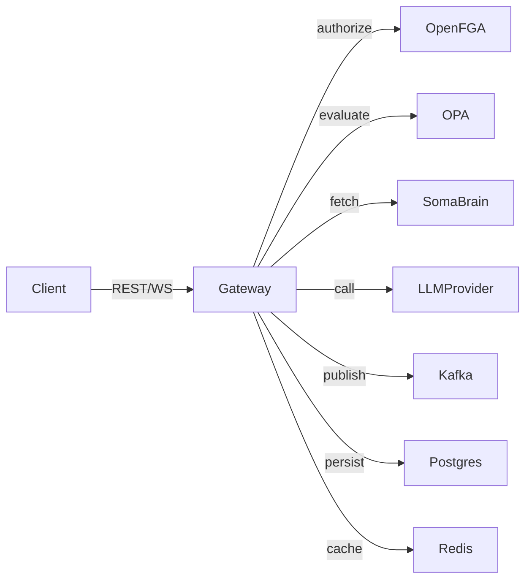

# Gateway Component

## Purpose
- Primary ingress for HTTP/WebSocket traffic (humans, agents, automations).
- Enforces authentication, authorization, and policy controls before delegating to LLMs or tools.
- Orchestrates conversation flow: context assembly, tool invocation, memory persistence.

## Module Structure

| Module | Key Responsibilities |
| --- | --- |
| `services/gateway/main.py` | FastAPI application factory, router registration |
| `services/gateway/routes/chat.py` | Chat send/stream endpoints, WebSocket handlers |
| `services/gateway/routes/settings.py` | `/settings_get`, `/settings_set`, realtime session negotiation |
| `services/gateway/auth/openfga.py` | Relationship tuples, access checks |
| `services/gateway/policies/opa_client.py` | Rego policy evaluation |
| `services/gateway/memory/service.py` | SomaBrain reads/writes |
| `services/gateway/tasks/publisher.py` | Kafka publishing helpers |

## Request Lifecycle

1. **Ingress:** Request hits FastAPI dependency stack (auth, tenant resolution).
2. **Policy:** OpenFGA checks relationship tuples; OPA enforces budgets/quotas.
3. **Context:** Gateway fetches session transcript, memories, tenant defaults.
4. **LLM Call:** Gateways reads provider info from `python/helpers/settings.py`, fan-outs to LiteLLM wrapper.
5. **Tooling:** Responses containing tool directives emit Kafka messages or call tool executor.
6. **Persistence:** Updated session state stored in Postgres; relevant memories saved to SomaBrain.
7. **Streaming:** WebSocket clients receive partial responses, status events.

## Configuration

- Environment: `GATEWAY_REQUIRE_AUTH`, `POSTGRES_DSN`, `KAFKA_BOOTSTRAP_SERVERS`, `OPENFGA_*`.
- Settings API: defaults set in `python/helpers/settings.py`, merged with user override at runtime.
- Profiles: `dev` profile enables auto-reload and debug logging.

## Observability

- Metrics: request latency, response codes, circuit breaker counts (`/metrics`).
- Logs: structured JSON per request (if `LOG_LEVEL=INFO`).
- Traces: optional OTEL instrumentation via env vars.

## Failure Modes & Mitigations

| Failure | Symptom | Mitigation |
| --- | --- | --- |
| Redis unavailable | Rate limit errors, cache misses | Gateway falls back to Postgres fetches; retry with backoff |
| LLM provider errors | 5xx streaming to UI | Circuit breaker triggers; Gateway surfaces actionable message |
| Kafka publish failure | Tool executions stall | Dead letter queue (Kafka) records message; operator restarts broker |
| OpenFGA connectivity | 403 for all requests | Cached decisions used briefly; escalate to SRE |

## Extensibility

- Routers register via FastAPI `include_router` – add new route modules under `services/gateway/routes/`.
- Tool actions encoded as LiteLLM function calls – define schema in `python/tools/schema/` and map to executor tasks.
- Tenants: update `conf/tenants.yaml` for per-tenant budgets, prompts.

## Integration Tests

- `tests/integration/test_gateway_public_api.py` covers health, chat, settings flows.
- Playwright tests assert UI <-> Gateway contract (`tests/playwright/test_realtime_speech.py`).
- Recommended to add regression tests whenever new routes or policies are introduced.
