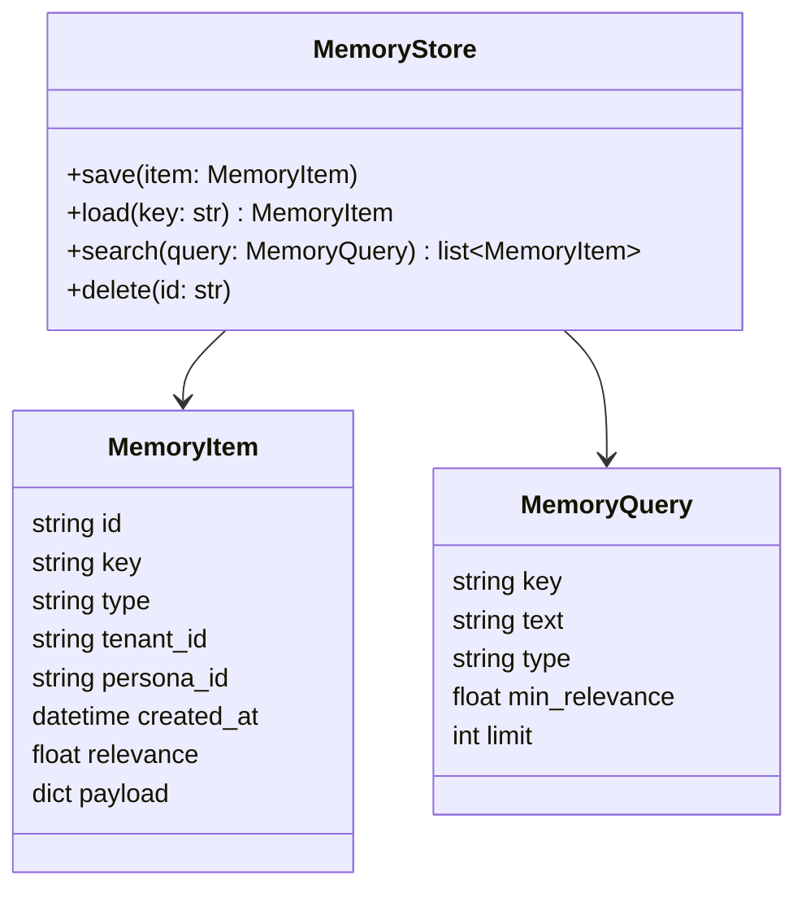

# SomaBrain Memory Subsystem

## Role
Provide durable, queryable factual context so LLM agents operate with continuity and verifiable truths.

## Data Model



- **Key:** stable identifier (e.g., `user.preferences.format`).
- **Type:** schema/namespace (e.g., `UserPreference`, `ProjectDecision`).
- **Payload:** JSON encoded data validated by Pydantic models.

## Storage Layers

| Layer | Technology | Purpose |
| --- | --- | --- |
| Hot cache | Redis | Millisecond access to recent entries |
| Durable store | Postgres (`memory_items` table) | Long-term persistence |
| Indexing | (Optional) Qdrant / embeddings | Semantic search for fuzzy recall |

`python/helpers/memory/` contains adapters that abstract the underlying storage so code remains provider-agnostic.

## API Surface

| Function | Location | Description |
| --- | --- | --- |
| `memory_save` | Gateway tool call | Persist structured payload with TTL/relevance |
| `memory_load` | Gateway tool call | Retrieve by key (exact match) |
| `memory_search` | Gateway tool call | Retrieve by vector/text query |
| `AgentContext.memory` | Runtime helper | Wraps the above with persona scoping |

## Retrieval Workflow

1. Gateway receives conversation request.
2. Extracts tenant/persona identifiers.
3. Runs `memory_search` for categories defined in persona configuration (`conf/tenants.yaml`).
4. Injects selected memories into LLM system prompt before processing.
5. Post-response, new facts summarized and written via `memory_save`.

## Best Practices

- Store structured JSON – e.g., Pydantic models stored as dictionaries.
- Include metadata: author, confidence, source, expiry to help ranking.
- Keep entries concise (<400 tokens) to avoid prompt overflow.
- Periodically prune low-relevance or stale items via background jobs.

## Machine Integration

Automated agents can use the same tool APIs to ensure continuity:

```python
from python.helpers.memory import save_memory, search_memory

save_memory(
    key="project.decisions.backend",
    payload={"stack": "FastAPI", "decision_date": "2025-10-01"},
    type="ProjectDecision",
)

recent = search_memory(key_prefix="project.decisions", limit=5)
```

## Failure Considerations

| Issue | Impact | Mitigation |
| --- | --- | --- |
| Redis eviction | First lookup slower (fallback to Postgres) | Warm cache via background worker |
| Postgres outage | Memory writes fail | Retry with exponential backoff, surface warning to user |
| Schema drift | Payload parsing errors | Version schemas, migrate data periodically |

## Roadmap

- Embedder-backed semantic search (Qdrant) for richer recall.
- Tenant-level retention policies and GDPR compliance hooks.
- Automated summaries when memory exceeds token budgets.
