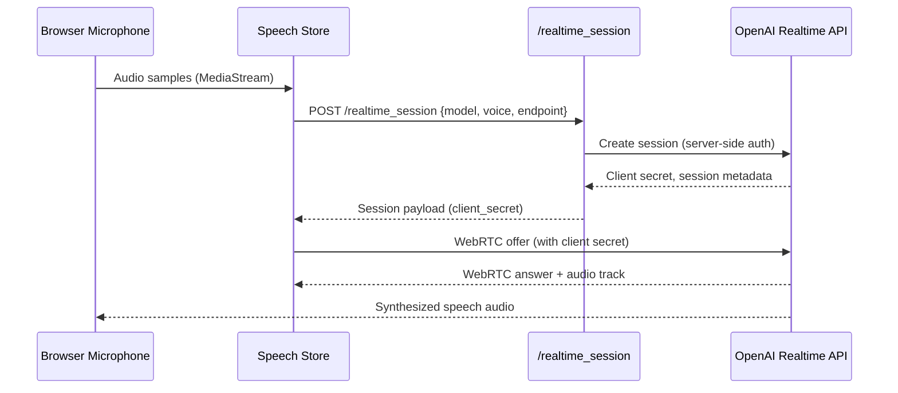

# Realtime Speech Pipeline

## Overview
Connects web clients to OpenAI's realtime speech models, enabling bidirectional audio streaming.

## Components

| Component | File(s) | Description |
| --- | --- | --- |
| UI Speech Store | `webui/components/chat/speech/speech-store.js` | Manages microphone, WebRTC, audio playback |
| Settings | `webui/js/settings.js`, `/settings` endpoints | Allows selecting provider, voice, endpoint |
| Gateway Endpoint | `python/api/realtime_session.py` | Creates realtime session against provider |
| Settings Backend | `python/helpers/settings.py` | Stores default provider, voice, endpoint |

## Provider Defaults

- Provider: `openai_realtime`
- Model: `gpt-4o-realtime-preview`
- Voice: `verse`
- Endpoint: `https://api.openai.com/v1/realtime/sessions`

These defaults ensure realtime features function immediately after stack deployment.

## Security & Compliance

- Client secret retrieved from provider is never persisted; UI keeps it in memory only.
- Gateway authenticates against provider using server-side API key stored in Secrets Manager.
- CORS restricted to trusted origins; WebRTC connections validated per session.

## Error Handling

| Failure | UI Behavior | Operator Action |
| --- | --- | --- |
| Session creation fails | Toast error `Realtime session error` | Validate API key, verify network egress |
| WebRTC negotiation timeout | UI retries, resets connection | Check browser permissions, turn server |
| Audio playback blocked | UI prompts for user interaction | User clicks anywhere to unlock audio |

## Operational Metrics

- Gateway logs session creation time, error codes.
- UI logs WebRTC state changes to console (for debugging).
- Future work: emit Prometheus metrics (`realtime_sessions_total`, `realtime_session_failures_total`).

## Extending Providers

1. Add provider definition to settings schema (e.g., `speech_provider == "custom"`).
2. Extend Gateway’s `/realtime_session` handler to call new provider.
3. Update UI store to handle provider-specific constraints (codecs, auth).
4. Document in `docs/features/realtime_speech.md` (see below).
