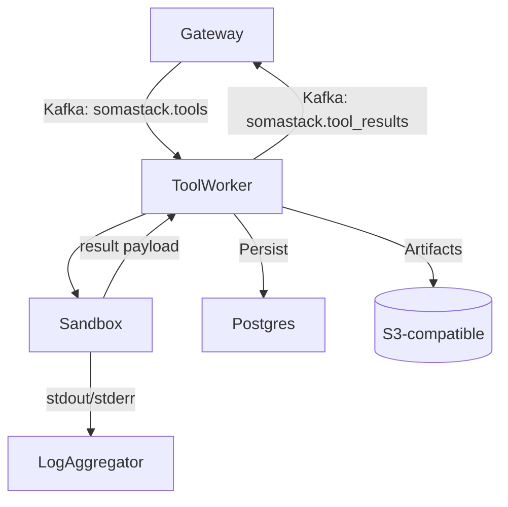

# Tool Executor Component

## Mission
Execute tool calls emitted by the Gateway, ensuring sandboxed, observable, and auditable automation.

## Pipeline

## Architecture Layers

| Layer | Description |
| --- | --- |
| Transport | Kafka consumer group (`tool-executor`), optional HTTP callbacks |
| Execution | Worker pool (`python/services/tool_executor/worker.py`), concurrency via asyncio |
| Sandbox | Ephemeral directories under `/tmp/tool-exec`, optional containerization |
| Persistence | Result metadata in Postgres, large payloads in object storage, cache in Redis |
| Telemetry | Metrics on task duration, success rate, retries |

## Supported Tool Types

| Tool | Module | Notes |
| --- | --- | --- |
| Shell / Command | `python/tools/shell.py` | Runs inside sandboxed environment |
| Code Interpreter | `python/tools/code.py` | Executes Python snippets with resource limits |
| HTTP | `python/tools/http.py` | Makes HTTP(S) calls, respects allowlist |
| Knowledge Base | `python/tools/knowledge.py` | Queries knowledge store |
| Custom | `python/tools/custom/*.py` | Register in startup using entrypoints |

## Configuration

- Kafka topics: `somastack.tools` (input), `somastack.tool_results` (output).
- Environment variables: `TOOL_EXECUTOR_MAX_WORKERS`, `SANDBOX_ROOT`, `TIMEOUT_SECONDS`.
- Secret resolution via `python/helpers/secrets.py`, ensures redaction in logs.

## Error Handling

| Scenario | Response |
| --- | --- |
| Tool timeout | Worker aborts execution, marks job `failed`, publishes error to results topic |
| Sandbox initialization failure | Worker retries (max 3) before dead-lettering |
| Postgres down | Results buffered in Redis; operator must restore DB and reprocess |
| Invalid payload schema | Gateway notified via `tool_results` with validation error |

## Observability Hooks

- Metrics: `tool_executor_tasks_total`, `tool_executor_duration_seconds`.
- Logs: structured per task, includes correlation ID (`task_id`).
- Tracing: optional OpenTelemetry instrumentation around sandbox execution.

## Extending the Executor

1. Create a new tool module under `python/tools/` implementing the base `Tool` interface.
2. Register the tool in `python/tools/__init__.py` so the discovery routine loads it.
3. Define the JSON schema representing input/output for contract validation.
4. Add integration tests ensuring Gateway emits the correct payload and executor handles it.

## Automation Use Cases

- CI/CD agents executing migrations or test suites on demand.
- Security scanners invoked by policy breaches detected in Gateway.
- Realtime data fetchers hydrating the chat context with up-to-date external information.

Ensure any long-running or stateful operations emit progress updates so Gateway can notify UI clients.
