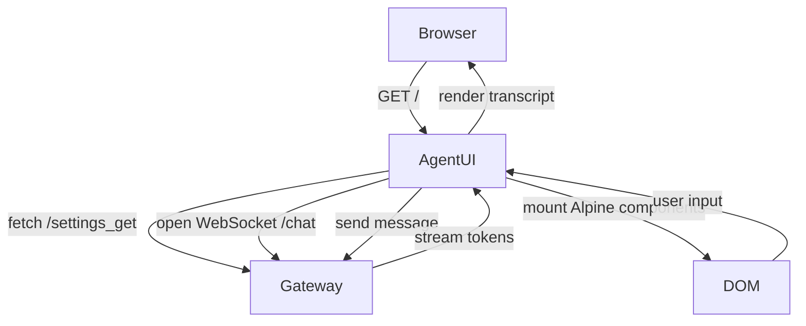

# Agent UI Component

## Purpose
Deliver a responsive, realtime interface for operators while exposing hooks that automated agents can leverage (Playwright, API clients).

## Technology Stack

| Layer | Technology |
| --- | --- |
| Bundler | Vite (through Docker build) |
| Runtime | Alpine.js + vanilla ES modules |
| Styling | Tailwind + custom CSS |
| Transport | WebSocket (chat stream), REST (settings, history) |

## Key Modules

| Path | Role |
| --- | --- |
| `webui/index.html` | Root shell, layout, script bootstrapping |
| `webui/js/settings.js` | Settings modal logic, tabs, persistence |
| `webui/components/chat/speech/speech-store.js` | Speech state management, WebRTC setup |
| `webui/components/chat/log-store.js` | Conversation transcript state |
| `webui/components/settings/*` | Modular settings panels |

## Rendering Flow

## Speech Experience

- Defaults to OpenAI Realtime provider (`speech_provider = openai_realtime`).
- Uses WebRTC peer connection for low-latency playback; falls back to browser TTS if provider unavailable.
- Microphone access controlled via `microphone-setting-store` with device selection and silence detection.

## Accessibility & UX Considerations

- Keyboard shortcuts provided for message send, focus management.
- Settings modal remembers last active tab via `localStorage`.
- Toast notifications surface errors from Gateway APIs.

## Automation Hooks

- `data-testid` attributes sprinkled across critical elements for Playwright tests.
- `window.sendJsonData` wrapper centralizes fetch requests, easy to stub.
- Real-time speech store exposes methods that tests can monkey patch (e.g., mock `RTCPeerConnection`).

## Deployment

- Built as part of `agent-ui` Docker image.
- Served via nginx (or similar) inside container; static assets cached aggressively.
- Reverse proxy ensures WebSocket upgrade to Gateway works out of the box.

## Extending the UI

1. Add new components under `webui/components/` with dedicated store module.
2. Register component in `webui/index.html` and ensure settings or routes expose data.
3. Update documentation in `docs/features/` with screenshots and workflows.

## Monitoring & Analytics

- Console logs kept minimal; use `LOG_LEVEL=debug` for verbose instrumentation during development.
- Add frontend telemetry by wiring to analytics service (optional) via environment-controlled flag.
