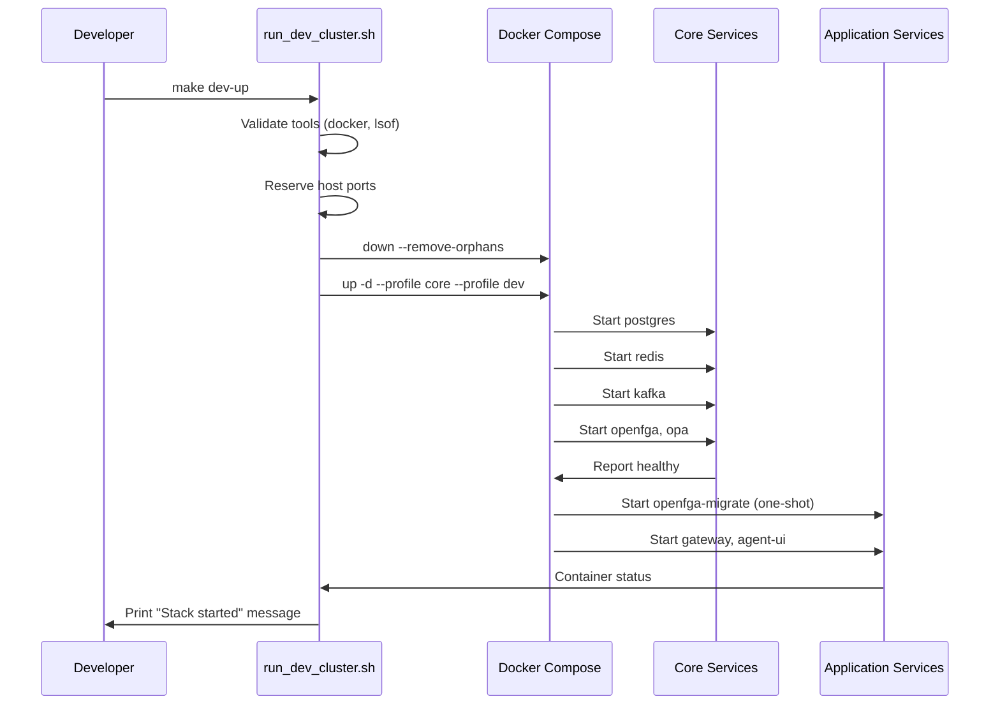

# Runtime Lifecycle & Deployment Topology

This document traces how SomaAgent01 boots, configures itself, and stays healthy across environments.

## Container Startup Order

- **Health gating:** Gateway and UI wait for Postgres/Redis/Kafka to declare `healthy` before starting.
- **Migration Jobs:** `openfga-migrate` runs once per boot; exit status is required before OpenFGA serves traffic.

## Configuration Sources

| Priority | Source | Format | Usage |
| --- | --- | --- | --- |
| 1 | Environment variables | `.env`, shell, CI secrets | Compose substitution, runtime toggles |
| 2 | Settings API | `tmp/settings.json` via `/settings_set` | User-driven runtime config (models, speech) |
| 3 | Tenants config | `conf/tenants.yaml` | Tenant-specific budgets, routing |
| 4 | Model providers | `conf/model_providers.yaml` | API host, key management |
| 5 | Code defaults | `python/helpers/settings.py` | Fallbacks when nothing else provided |

At runtime the settings helper merges sources top-down, so explicit env vars override persisted settings.

## Execution Modes

| Mode | Description | Key Commands | Notes |
| --- | --- | --- | --- |
| Development | Full stack in Docker with hot-reload UI | `make dev-up` | Default speech provider: OpenAI realtime |
| Headless Automation | Gateway + tool executor without UI | `docker compose -p somaagent01 up gateway tool-executor` | For scripted agents / CI |
| Speech Lab | Adds audio pipelines (Whisper, Realtime) | `COMPOSE_PROFILES="core,dev,speech" make dev-up` | Ensures GPUs / audio devices mapped |
| Production | Multi-node (Kubernetes or swarm) | Helm charts (WIP) | Use managed Kafka/Postgres/Redis |

## Runtime Responsibilities per Service

### Gateway

- Terminates HTTP and WebSocket sessions.
- Caches access tokens, rate limits in Redis.
- Publishes tool requests to Kafka topics (`somastack.tools`, etc.).
- Persists conversation state and audit logs in Postgres.

### Tool Executor

- Consumes Kafka topics, executes tool instructions in sandbox.
- Streams results back to Gateway via callback API or Kafka.
- Manages ephemeral workspaces, secrets resolution.

### Agent UI

- Serves static assets and proxies WebSocket stream.
- Fetches settings, memories, history via Gateway endpoints.
- Hosts realtime speech client (WebRTC).

### Backing Stores

- **Postgres:** canonical state (sessions, tasks, schedules).
- **Redis:** session caches, rate limit counters, short-term memory.
- **Kafka:** decouples synchronous chat from asynchronous work.
- **OpenFGA:** stores relationship tuples for authorization.
- **OPA:** evaluates Rego policies for compliance and quotas.

## Resiliency & Recovery

| Failure | Detection | Recovery |
| --- | --- | --- |
| Container crash | Docker health check, Prometheus alert | Compose restarts container automatically |
| Kafka broker down | Prometheus `kafka_isr_shrink` alert | Restart container, rebuild topics via scripts |
| Postgres migration drift | `pg_isready` failing | Redeploy from backup or run migration scripts |
| Gateway 5xx spikes | Prometheus latency SLO | Inspect logs, review Redis or provider connectivity |
| Realtime speech errors | UI toasts, Gateway `/realtime_session` logs | Validate API keys, check network egress, restart speech profile |

## Observability Pipeline

- Metrics scraped by Prometheus (see `docs/operations/observability.md`).
- Logs shipped to Docker stdout; aggregate with Loki/ELK in higher tiers.
- Tracing optional via OpenTelemetry when `OTEL_EXPORTER_OTLP_ENDPOINT` set.

## Rolling Updates

1. Drain incoming traffic (scale Gateway replicas or set maintenance banner).
2. `make dev-down` or targeted `docker compose up -d gateway` with new image.
3. Run smoke tests (`tests/integration/test_gateway_public_api.py`).
4. Re-enable traffic once health checks pass.

## Disaster Recovery

- **Postgres:** scheduled dumps to object storage; `make dev-clean` wipes local volumes only.
- **Kafka:** export configs via `scripts/kafka_partition_scaler.py`; restore from snapshots.
- **Redis:** persistent append-only file; for catastrophic loss rebuild caches from Postgres + SomaBrain persistence.
- **OpenFGA/OPA:** configuration stored in repository; reapply via migration scripts.

---

For component-specific internals, continue with the documents in `docs/architecture/components/`.
