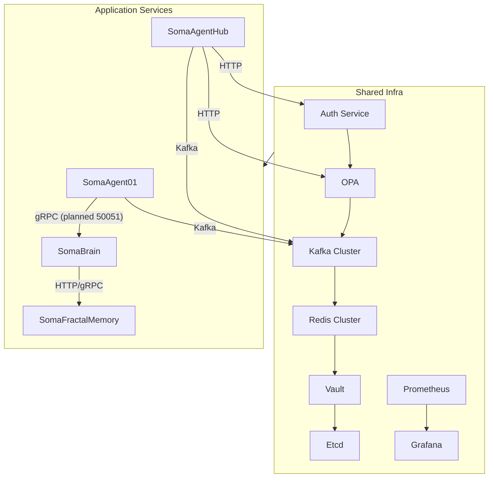

# Soma Stack Architecture (2025-10-10)

This document captures the current state of the Soma stack as implemented in this
repository, the target consolidated architecture, and the work needed to close
the remaining gaps. It supersedes earlier partial diagrams with a full stack view
that matches the code paths in `services/`, `common/`, and `infra/`.

## 1. Current Service Landscape (Snapshot)

| Alias | Repository components | Owner | Primary protocol | Typical port(s) | Status in repo |
| ----- | --------------------- | ----- | ---------------- | ---------------- | --------------- |
| SA01 (SomaAgent01) | `agent.py`, `services/conversation_worker/main.py`, `services/gateway/main.py` | Agents | gRPC (high‑throughput) | **50051** (planned) | gRPC server implementation present in `services/memory_service/main.py`; HTTP gateway on 8010 still active |
| SB (SomaBrain) | `services/memory_service/main.py` | Memory | gRPC / HTTP | **50052** | Implemented; compose exposes the port |
| SAH (SomaAgentHub) | `services/ui/main.py`, `run_ui.py`, `services/gateway/main.py` | Experience | FastAPI (HTTP) | **8080** (API gateway) | Running via `agent-ui` and `gateway` services |
| SMF (SomaFractalMemory) | `infra/docker-compose.somaagent01.yaml` (qdrant profile) | Knowledge | Async HTTP (FastAPI) | **50053** (Qdrant gRPC) / **6333‑6334** (HTTP) | Optional profile enabled when `COMPOSE_PROFILES` includes `vectorstore` |
| Auth | `infra/helm/soma-infra/charts/auth` | Platform | FastAPI (HTTP) | **8080** | Helm chart provides a single Auth service used by all components |
| OPA | `services/common/policy_client.py`, compose `opa` service | Platform | HTTP | **8181** | Deployed in compose and Helm |
| Kafka | `infra/docker-compose.somaagent01.yaml` (bitnami image) | Platform | TCP | **9092** | Single node in compose, 3‑node StatefulSet in Helm |
| Redis | `infra/docker-compose.somaagent01.yaml` | Platform | TCP | **6379** | Single instance; Redis Cluster planned in Helm |
| Prometheus | `infra/observability/prometheus.yml`, compose service | Platform | HTTP | **9090** | Live in compose and Helm |
| Grafana | `infra/observability/grafana/` | Platform | HTTP | **3000** | Optional profile in compose |
| Vault | `infra/docker-compose.somaagent01.yaml` | Platform | HTTP | **8200** | Dev mode container in compose; Helm chart provides production‑grade Vault |
| Etcd | `infra/helm/soma-infra/charts/etcd` | Platform | HTTP | **2379** | New Helm chart added under `infra/helm/soma-infra/charts/etcd` |

The stack currently runs the four application services plus twelve infrastructure
containers under Docker Compose. Several infrastructure components (Auth, Vault,
Etcd) already exist as Helm chart dependencies but are not fully wired in compose,
leading to duplicated configuration and drift between environments.

## 2. Goal: Consolidated Shared Infrastructure Layer

The long term goal is to run cross-cutting services once per cluster inside the
`soma-infra` namespace. Application charts consume those shared instances via
Kubernetes DNS (`*.soma.svc.cluster.local`).

### 2.1 Shared Infra Services

| Service | Deployment strategy | Repository anchor | Reason for sharing |
| ------- | ------------------- | ----------------- | ------------------ |
| Auth (JWT) | Deployment + Service | `infra/helm/soma-infra/charts/auth` | Single source of truth for signing keys and validation |
| OPA | Deployment with optional sidecar | `infra/helm/soma-infra/charts/opa` | Policy definitions live in one place, avoids policy drift |
| Kafka | StatefulSet (3 nodes) | `infra/helm/soma-infra/charts/kafka` | Shared event backbone, isolate storage once |
| Redis | Redis Cluster (6 pods) | `infra/helm/soma-infra/charts/redis` | Common cache, rate limiting, and session store |
| Prometheus + Grafana | Prometheus Operator + Deployment | `infra/helm/soma-infra/charts/prometheus`, `charts/grafana` | Unified observability and dashboards |
| Vault | Deployment with Agent Injector | `infra/helm/soma-infra/charts/vault` (placeholder) | Single secret store with pod-level injection |
| Etcd | StatefulSet | `infra/helm/soma-infra/charts/etcd` (placeholder) | Fast feature flag backend shared across services |

### 2.2 Resulting Service Count

- Application services: 4 (SA01, SB, SAH, SMF).
- Infra services: 7 shared deployments (Auth, OPA, Kafka, Redis, Prometheus/Grafana, Vault, Etcd).
- Total expected pods per environment: 20 to 25 (down from 30 to 40 when infra was duplicated).

## 3. Repository Layout and Alignment Plan

Current tree highlights:

```
agent-zero/
  agents/
  common/
  infra/
    helm/
      soma-infra/
      soma-stack/
    docker-compose.somaagent01.yaml
  services/
    audio_service/
    conversation_worker/
    gateway/
    memory_service/
    tool_executor/
    ui/
  docs/
    architecture.md (this file)
    roadmap_sa01.md
```

Planned adjustments:

1. Keep `services/` as the canonical home for application code but introduce
   subdirectories per logical service (`services/sa01`, `services/sah`, etc.)
   during the sprint migration. Existing modules will move behind those entry
   points.
2. `infra/helm/soma-stack` aggregates the application sub-charts and already
   consumes the shared infra chart; gaps are tracked in
   `infra/helm/soma-stack/values.yaml`.
3. `common/` remains the shared library: configuration, telemetry, feature flags,
   and memory clients used across services.

## 4. Configuration Baseline

All services ultimately load settings through `common/config/settings.py`. For
SA01-specific overrides we use `services/common/settings_sa01.py`, which inherits
from the shared `SA01Settings` dataclass. Important defaults:

- Kafka: `kafka.soma.svc.cluster.local:9092`
- Redis: `redis.soma.svc.cluster.local:6379`
- Postgres: `postgres.soma.svc.cluster.local:5432`
- OPA: `http://opa.soma.svc.cluster.local:8181`
- Auth: `http://auth.soma.svc.cluster.local:8080`
- Etcd: `etcd.soma.svc.cluster.local:2379`
- Metrics: `prometheus.soma.svc.cluster.local`
- Tracing: Jaeger OTLP endpoint drawn from `settings.otlp_endpoint`

Every service imports `common/utils/trace.py` to initialise OpenTelemetry spans
and uses `services/common/logging_config.py` for JSON logs.

## 5. Settings and Configuration Strategy

1. Base settings live in `common/config/settings.py` using Pydantic. Each
   service-specific module inherits and overrides its needs
   (`services/common/settings_sa01.py`, `services/common/settings_base.py`).
2. Helm renders a ConfigMap for non-secret values and a Secret for credentials;
   Vault Agent injects the sealed values into pods at runtime.
3. Feature flags resolve from Etcd (`feature_flag_endpoint` in settings) and cache
   in Redis. Services subscribe to the `config.updates` Kafka topic for hot reload.
4. Each Helm release labels pods with `configHash`; rolling upgrades only restart
   pods when the config payload changes.
5. Environment-specific overrides live under `infra/helm/values-dev.yaml`,
   `values-staging.yaml`, and `values-prod.yaml`.

## 6. Deployment Model (Kubernetes First, Multi Region)

| Layer | Tooling | Why it matters |
| ----- | ------- | -------------- |
| Cluster | Managed Kubernetes (EKS, GKE, AKS) | Autoscaling, managed control plane, cloud IAM |
| GitOps | Argo CD monitoring `infra/helm/` | Declarative rollouts, audit trail, easy rollbacks |
| Helm | `soma-stack` chart wrapping app sub-charts plus `soma-infra` dependency | Single release artifact per environment |
| Traffic shaping | Istio (or Linkerd) with weighted destinations | Safe blue-green and canary rollouts |
| Disaster recovery | Cloudflare Load Balancer (or Route53/GCP DNS) | Region-based failover |
| CI/CD | `.github/workflows/ci.yml` pipeline | Lint, unit, integration, contract tests, Kind-based Helm install |

**Benefits**

- Shared dashboards and alerts reduce toil.
- One secret source (Vault) lowers risk of divergent credentials.
- Less duplicated infra reduces compute cost and simplifies on-call response.

## 7. Observability (Unified Stack)

- Metrics: every FastAPI and worker process exposes `/metrics`; Prometheus scrape
  targets are configured in `infra/observability/prometheus.yml`.
- Tracing: `common/utils/trace.py` sets up OpenTelemetry exporters against
  Jaeger (`jaeger.soma.svc.cluster.local`).
- Logging: JSON logs routed to Loki via Promtail sidecars (Helm values pending).
- Alerting: Alertmanager rules cover API latency > 200 ms, error rate > 1 percent,
  and Kafka consumer lag > 5k. Rules are stored in `infra/observability/alerts.yml`.

## 8. Resource Footprint

| Category | Before (per environment) | After consolidation |
| -------- | ------------------------ | ------------------- |
| Application services | 4 | 4 |
| Infra services | 12 | 7 |
| Pods | ~30-40 | ~20-25 |
| Helm releases | 16 (4 app + 12 infra) | 5 (4 app + 1 infra) |
| Operational overhead | High | Reduced |

## 9. Run Book for Materialising the Architecture

1. Clone the repository (already present under `~/Documents/GitHub/Ag2/agent-zero`).
2. Create or update the shared infra chart:
   ```bash
   cd infra/helm
   # charts for auth, opa, kafka, redis, prometheus, grafana exist today
   # add or update vault and etcd under soma-infra/charts/
   ```
3. Move common code into `common/` modules as needed and ensure `__init__.py`
   exports shared clients (`memory_client`, `settings_base`).
4. Update each service entrypoint to import settings from `common.config` and to
   call shared DNS names. Track progress in `docs/roadmap_sa01.md`.
5. Simplify Dockerfiles to expose only service ports (for example SA01 will expose
   50051 once the gRPC endpoint lands).
6. Update `.github/workflows/ci.yml` to:
   - Run `ruff` and `mypy`.
   - Execute `pytest` (unit and integration) with the gRPC fixtures.
   - Start a Kind cluster, install `infra/helm/soma-infra`, then install
     `infra/helm/soma-stack`.
   - Run smoke tests (`scripts/smoke_test.py`).
7. Deploy to a dev namespace:
   ```bash
   helm upgrade --install soma-dev infra/helm \
     -f infra/helm/values-dev.yaml \
     --namespace soma-dev
   ```
8. Validate:
   - Call `/health` on gateway (`kubectl port-forward` on the service).
   - Verify Prometheus targets show as UP.
   - Confirm OPA blocks an unauthorised request from gateway.
9. Promote to staging and production by switching the values file and re-running
   the Helm upgrade.
10. Document the outcome in this file and in `docs/SomaAgent01_Deployment.md`.

## 10. Architecture Diagram (Mermaid)



## 11. Rationale Summary

| Decision | Benefit |
| -------- | ------- |
| Consolidate Auth, OPA, Kafka, Redis, Prometheus/Grafana, Vault, Etcd into `soma-infra` | Single upgrade path, lower cost |
| Switch SA01 to gRPC for memory access | Lower latency, schema enforcement |
| Keep SB to SMF as async HTTP | Allows swapping vector stores without regenerating stubs |
| Centralise feature flags in Etcd with Redis cache | Fast reads, hot reload via Kafka |
| Deploy one shared infra per environment | Less operational toil, consistent security posture |
| Adopt Argo CD GitOps | Automatic, auditable rollouts |

## 12. Next Steps

Immediate artifacts to generate or update:

1. Provider SDK skeleton (`common/provider_sdk/__init__.py`, `common/provider_sdk/discover.py`).
2. Helm chart scaffolding for Vault and Etcd under `infra/helm/soma-infra/charts/`.
3. CI workflow updates in `.github/workflows/ci.yml` for the Kind-based integration
   test.
4. Runbook refresh (`docs/runbook.md`) explaining how to operate the shared infra
   deployment.
5. Onboarding guide updates referencing the shared infra naming and this diagram.

For SA01 specifically, continue executing `docs/roadmap_sa01.md`. Sprint tracking
lives in `docs/ROADMAP_SPRINTS.md`, and each milestone should link back to the
shared infra alignment captured here.

