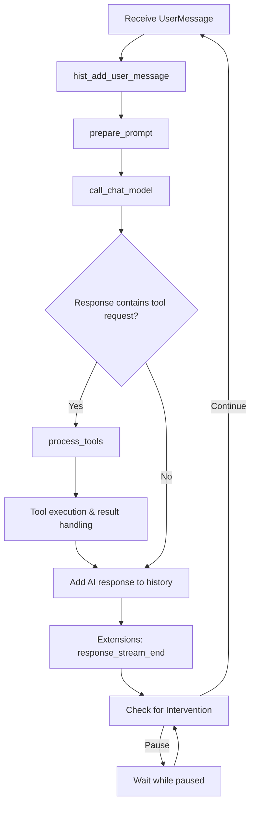
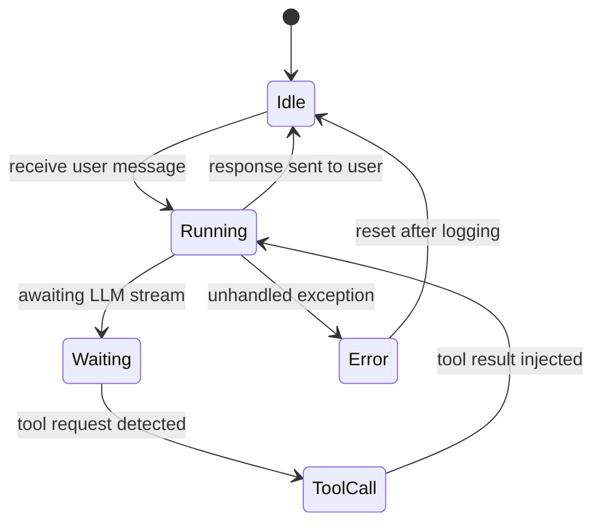

# Agent Monologue Loop

The core of **Agent‑Zero** lives in `agent.py`.  The following flowchart shows the
runtime steps for a single monologue iteration – from receiving a user message
to producing a response, optionally invoking tools, and handling extensions.

### State diagram for the monologue

**Key extension points** (see `docs/development/extensions.md`):
* `monologue_start`
* `message_loop_start`
* `before_main_llm_call`
* `reasoning_stream_chunk` / `response_stream_chunk`
* `tool_execute_before` / `tool_execute_after`
* `monologue_end`

All of these hooks receive the shared `loop_data` object, allowing developers to
inject custom behaviour without modifying the core loop.
