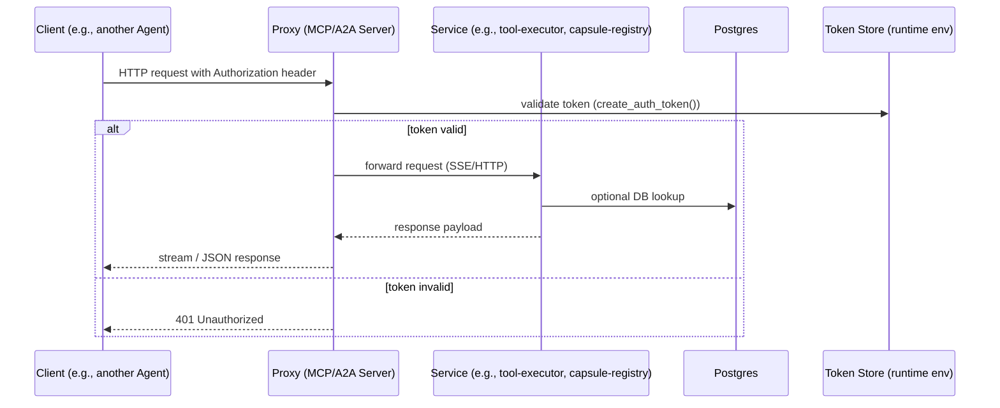

# MCP & A2A Interaction

This diagram shows how a client talks to the **MCP** (Model‑Context‑Protocol) and
**A2A** (Agent‑to‑Agent) servers that are part of the Agent‑Zero stack.  The flow
mirrors the implementation in `python/helpers/mcp_handler.py` and
`python/helpers/fasta2a_server.py`.

**Key points**
* Tokens are generated from the persistent runtime ID plus optional auth login
  credentials (`settings.py`).
* The proxy re‑configures itself at runtime (`DynamicMcpProxy`, `DynamicA2AProxy`).
* All requests pass through the same FastAPI gateway, keeping the network surface
  minimal.
