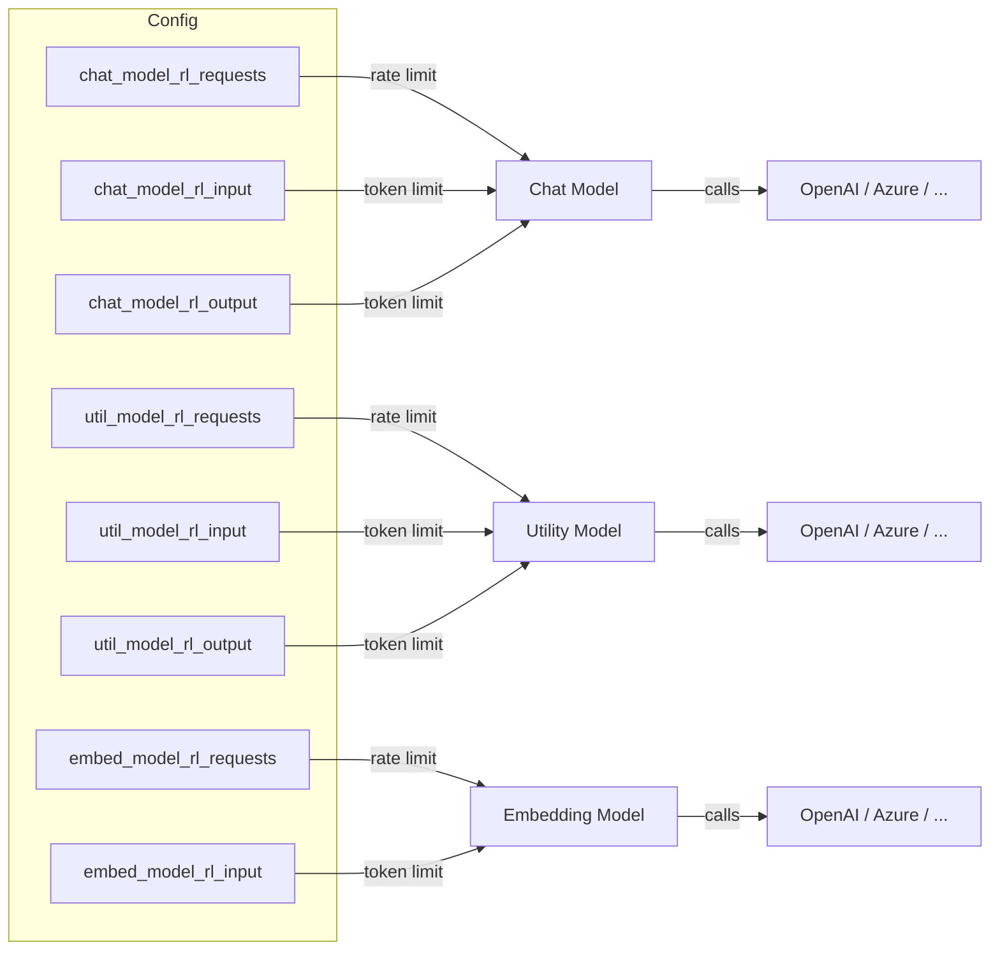

# Rate Limiter

Agent‑Zero limits the number of requests and tokens sent to each LLM model.  The
logic lives in `python/helpers/rate_limiter.py` and is used by the chat, utility
and embedding models.

**How it works**
1. The `RateLimiter` object tracks a sliding‑window of timestamps for each
   limit type.
2. Before each LLM call the engine asks the limiter whether the request can
   proceed (`allow`).
3. If the limit is exceeded the request is delayed (`await asyncio.sleep`).
4. The UI displays a progress bar (`AgentContext.log.set_progress`).

All limits are configurable via the `settings.py` fields (`*_rl_requests`,
`*_rl_input`, `*_rl_output`).
