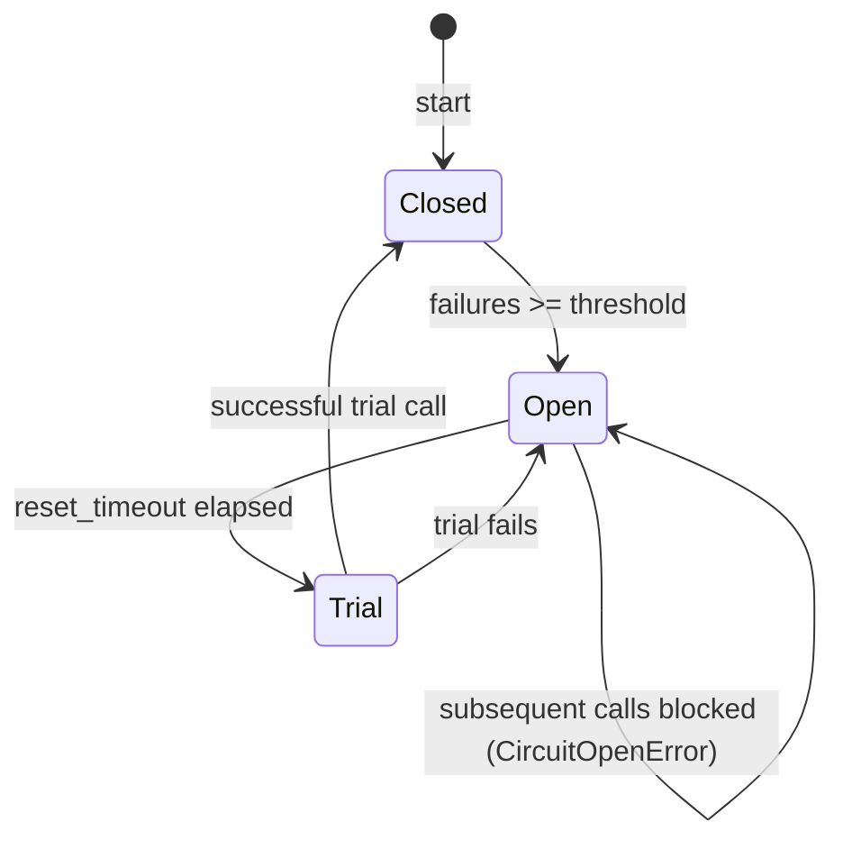

# Tool Executor – Circuit Breaker

The **Tool Executor** service runs user‑requested tools inside a sandbox and
protects the system with a **circuit‑breaker** implemented in
`python/helpers/circuit_breaker.py`.  The state machine below mirrors the
runtime behaviour of `ExecutionEngine` (see `services/tool_executor/execution_engine.py`).

**Metrics** (exported via Prometheus when `CIRCUIT_BREAKER_METRICS_PORT` is set):
* `circuit_breaker_opened_total` – increments each time the circuit opens.
* `circuit_breaker_closed_total` – increments after a successful trial.
* `circuit_breaker_trial_total` – increments on each trial attempt.

The diagram uses **solid arrows** for normal transitions and **dashed** for the
blocked‑call path.
