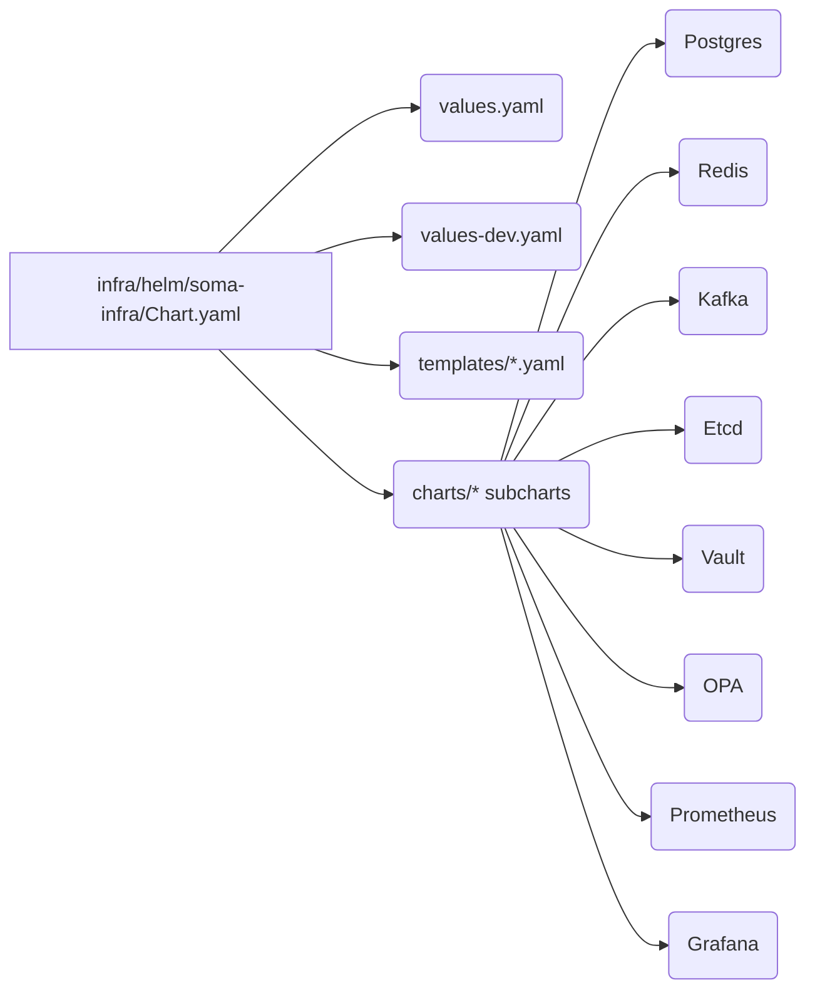

# Soma Shared Infra — Detailed Deployment Manual

This manual captures everything required to stand up the **soma-infra** shared services stack in a production-like development environment and to prepare it for distribution as a standalone project (e.g., GitHub `somatechlat/somastack`). Each section is designed to be copy/paste friendly so that another operator can reproduce the environment without tribal knowledge.

---

## 1. Architecture Overview

The shared infra chart installs the core platform dependencies in the `soma-infra` namespace. The current component set is illustrated below.

```mermaid
graph TD
    subgraph Shared Infra Namespace (soma-infra)
        postgres[(Postgres)]
        redis[(Redis)]
        kafka[(Kafka KRaft)]
        etcd[(Etcd)]
        vault[(Vault Dev)]
        opa[(OPA PDP)]
        prometheus[(Prometheus)]
        grafana[(Grafana)]
    end

    subgraph Application Namespace(s)
        apps[Workload Pods]
    end

    apps -- SQL, Secrets --> postgres
    apps -- Cache --> redis
    apps -- Events --> kafka
    apps -- Coordination --> etcd
    apps -- JWT Policy --> opa
    apps -- Metrics --> prometheus
    apps -- Dashboards --> grafana
    opa -- Policies --> vault
    prometheus -- Dashboards --> grafana
```

### Helm Chart Composition



---

## 2. Prerequisites

1. **Tooling**
   - Mac/Linux with Docker Desktop or containerd runtime.
   - `kubectl` ≥ 1.27.
   - `helm` ≥ 3.12.
   - `kind` (recommended for local cluster) or access to another Kubernetes cluster.
   - Optional: `make`, `yq`.

2. **Local Resources**
   - 4 CPUs and 8 GiB RAM minimum for the cluster (Kafka is the heaviest component).
   - 10 GiB of disk for PVCs (Postgres 5 GiB, Etcd 1 GiB, Docker image cache).

3. **Repositories**
   - This manual assumes the shared infra lives under `infra/helm/soma-infra` with supporting docs under `docs/infra/`.

---

## 3. Cluster Bring-up (Kind)

1. **Create Kind Cluster**
   ```bash
   kind create cluster --name soma --config infra/kind/soma-kind.yaml
   ```
   The provided Kind config reserves NodePorts and storage class `standard`.

2. **Verify Storage Class**
   ```bash
   kubectl get storageclass
   ```
   Ensure a default storage class exists (`standard`). Update `values-dev.yaml` if your cluster uses a different class.

3. **Namespace**
   ```bash
   kubectl create namespace soma-infra
   ```

---

## 4. Helm Deployment — Step by Step

1. **Dry-run**
   ```bash
   helm upgrade --install soma-infra infra/helm/soma-infra \
     -n soma-infra \
     -f infra/helm/soma-infra/values-dev.yaml \
     --dry-run
   ```

2. **Install**
   ```bash
   helm upgrade --install soma-infra infra/helm/soma-infra \
     -n soma-infra \
     -f infra/helm/soma-infra/values-dev.yaml
   ```
   > `--wait` is intentionally omitted to avoid long timeouts while Kafka downloads images. Monitor pods manually in the next step.

3. **Watch Pod Start-up**
   ```bash
   kubectl -n soma-infra get pods -w
   ```
   All pods should progress to `1/1 Running`. Kafka may take ~2 minutes on the first run while generating the KRaft metadata.

4. **Secrets**
   - Postgres, Grafana, and Vault pull credentials from Secrets rendered by the chart:
     - `soma-infra-postgres-credentials`
     - `soma-infra-grafana-admin`
     - `soma-infra-vault-dev-root`
   - Adjust defaults in `values.yaml` or create overrides before installation for stronger credentials.

---

## 5. Post-Install Verification

Run each command; all must succeed before onboarding application workloads.

```bash
kubectl -n soma-infra exec soma-infra-postgres-0 -- \
  env PGPASSWORD=$(kubectl -n soma-infra get secret soma-infra-postgres-credentials -o jsonpath='{.data.password}' | base64 --decode) \
  psql -U $(kubectl -n soma-infra get secret soma-infra-postgres-credentials -o jsonpath='{.data.username}' | base64 --decode) \
  -d $(kubectl -n soma-infra get secret soma-infra-postgres-credentials -o jsonpath='{.data.database}' | base64 --decode) \
  -c 'SELECT 1'

kubectl -n soma-infra exec deploy/soma-infra-redis -- redis-cli ping

kubectl -n soma-infra exec soma-infra-etcd-0 -- etcdctl --endpoints=http://127.0.0.1:2379 endpoint health

kubectl -n soma-infra exec deploy/soma-infra-vault -- \
  env VAULT_ADDR=http://127.0.0.1:8200 vault status

kubectl -n soma-infra logs deploy/soma-infra-kafka --tail=50
```

> Kafka logs will include `DuplicateBrokerRegistrationException` messages in single-node mode. These are expected; the broker still shows `Running`.

---

## 6. Configuration Reference

| Component  | Location                                          | Notes                                                                                   |
|------------|---------------------------------------------------|-----------------------------------------------------------------------------------------|
| Postgres   | `charts/postgres/values.yaml`                     | Credentials sourced from Secret; PVC default 5 Gi.                                      |
| Redis      | `charts/redis/values.yaml`                        | Stateless; no password in dev profile.                                                  |
| Kafka      | `charts/kafka/values.yaml`                        | KRaft single node; controller port 9093 exposed internally; new base64 cluster ID.      |
| Etcd       | `charts/etcd/templates/statefulset.yaml`          | `ETCD_INITIAL_CLUSTER` fix for single-member cluster.                                   |
| Vault      | `charts/vault/values.yaml`                        | Dev mode with root token stored in Secret.                                              |
| NetworkPolicies | `templates/networkpolicies.yaml`             | Default-deny + per-component ingress from namespaces labeled `soma.sh/allow-shared-infra=true`. |
| Environment docs | `docs/infra/ENV_VARS_AND_SECRETS.md`        | Inventory of sensitive values, recommended handling (Secrets/Vault).                    |
| Runbook    | `docs/infra/runbook_shared_infra.md`              | High-level bring-up; pair with this manual for full detail.                             |

---

## 7. Operational Tips

1. **Rolling Upgrades**
   ```bash
   helm upgrade soma-infra infra/helm/soma-infra \
     -n soma-infra \
     -f infra/helm/soma-infra/values-dev.yaml
   ```
   Recreate pods selectively with `kubectl delete pod` to pick up template changes.

2. **Logs & Metrics**
   - Access Grafana via port-forward:
     ```bash
     kubectl -n soma-infra port-forward deploy/soma-infra-grafana 3000:3000
     ```
   - Prometheus:
     ```bash
     kubectl -n soma-infra port-forward deploy/soma-infra-prometheus 9090:9090
     ```

3. **Cleaning Up**
   ```bash
   helm uninstall soma-infra -n soma-infra
   kubectl delete namespace soma-infra
   kind delete cluster --name soma  # if using Kind
   ```

---

## 8. Packaging for `somatechlat/somastack`

To publish this shared infra as its own repository:

1. **Copy Assets**
   ```
   infra/helm/soma-infra/
   docs/infra/SHARED_INFRA_MANUAL.md
   docs/infra/SHARED_INFRA_ARCHITECTURE.md
   docs/infra/runbook_shared_infra.md
   docs/infra/ENV_VARS_AND_SECRETS.md
   docs/infra/DEVELOPMENT_CANONICAL.md
   docs/infra/SPRINTS_SHARED_INFRA.md
   infra/env/.env.shared.example
   infra/docker/shared-infra.compose.yaml
   infra/kind/soma-kind.yaml
   README (new root readme referencing this manual)
   ```

2. **Initialize New Repo**
   ```bash
   mkdir somastack && cd somastack
   git init
   cp -R <above files> .
   echo "docs/node_modules" >> .gitignore  # extend as needed
   ```

3. **Commit & Push**
   ```bash
   git add .
   git commit -m "feat: add soma shared infra chart and docs"
   git remote add origin git@github.com:somatechlat/somastack.git
   git push -u origin main
   ```
   > Ensure you have write access to `somatechlat/somastack`. Set up SSH or HTTPS credentials before pushing.

4. **Release Preparation**
   - Run `helm lint infra/helm/soma-infra`.
   - Package chart: `helm package infra/helm/soma-infra --destination dist`.
   - Optionally publish to GitHub Releases or an OCI registry.

---

## 9. Troubleshooting

| Symptom | Resolution |
|---------|------------|
| Kafka in `ImagePullBackOff` | Verify image tag reachable (`confluentinc/cp-kafka:7.5.3`). Use `docker pull` or substitute with a mirrored registry. |
| Kafka complains `CLUSTER_ID` invalid | Ensure `clusterId` in values is a base64 string (`uuidgen | base64`). |
| Postgres `permission denied` on PVC | Leave default security context (root) or add init container that chowns to custom UID before dropping privileges. |
| Vault dev pod fails TLS | Ensure `VAULT_ADDR` uses HTTP for dev mode (`http://127.0.0.1:8200`). |
| Namespace stuck terminating | Remove finalizers: `kubectl get namespace soma-infra -o json | jq '.spec.finalizers=[]' | kubectl replace --raw "/api/v1/namespaces/soma-infra/finalize" -f -`. |

---

## 10. Change Log Pointers

- Helm chart state from commit `b8866fd` (`chore: snapshot development branch state`).
- Prior incremental fix: `b8d7fdd` (`fix: stabilize shared infra helm chart`).

Use these commits as baselines when lifting the shared infra into `somastack`.

---

### Appendix A — Command Recap

```bash
# Create Kind cluster
kind create cluster --name soma --config infra/kind/soma-kind.yaml

# Install shared infra
helm upgrade --install soma-infra infra/helm/soma-infra \
  -n soma-infra \
  -f infra/helm/soma-infra/values-dev.yaml

# Verify pods
kubectl -n soma-infra get pods

# Health checks
kubectl -n soma-infra exec soma-infra-postgres-0 -- psql -c 'SELECT 1'
kubectl -n soma-infra exec deploy/soma-infra-redis -- redis-cli ping
kubectl -n soma-infra exec soma-infra-etcd-0 -- etcdctl endpoint health
kubectl -n soma-infra exec deploy/soma-infra-vault -- env VAULT_ADDR=http://127.0.0.1:8200 vault status

# Tear down
helm uninstall soma-infra -n soma-infra
kind delete cluster --name soma
```

---

By following this manual, engineers can reliably reproduce the shared infrastructure locally and package it for distribution as the dedicated `somastack` repository.
