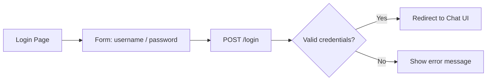
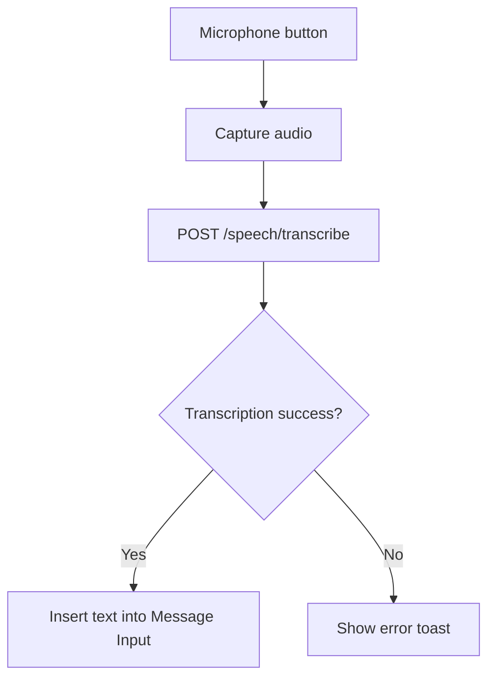
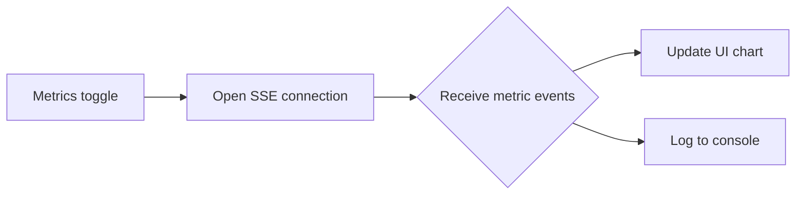

# UI Overview

The web UI is built with FastAPI + plain HTML/JS (no heavy framework).  The three
primary screens are shown below.  The SVG placeholders are stored in the
`docs/diagrams/` folder; they are simple wire‑frames that illustrate the layout
and the interactions that trigger extension points.

## 1. Login / Authentication



*The login page stores the credentials in the `.env` file via `settings.py`
(`auth_login`, `auth_password`).*  The UI does **not** expose the password in the
DOM after a successful login.

## 2. Chat Interface

```mermaid
flowchart TB
        subgraph Chat UI
                G[Message Input] --> H[Send button]
                H --> I[WebSocket send]
                I --> J[Agent Core]
                J --> K[Streamed response]
                K --> L[Render in chat window]
        end
        L --> M[User can click "Copy" or "Regenerate"]
```

The chat view consumes the **stream** produced by `agent.py`. Each chunk passes
through the `response_stream_chunk` extension hook before being rendered.

## 3. Settings Modal

```mermaid
flowchart LR
        N[Settings button] --> O[Open modal]
        O --> P[Tabs: Agent, Models, Speech, Advanced]
        P --> Q[Save → POST /settings]
        Q --> R[settings.py writes `tmp/settings.json`]
        R --> S[Runtime reload (apply_settings)]
```

The modal is generated from the `settings.py` schema (`SettingsOutput`). The UI
uses placeholder values (`************` for API keys, `****PSWD****` for
passwords) to avoid leaking secrets.

---

All three SVG wire‑frames (`ui_login.svg`, `ui_chat.svg`, `ui_settings.svg`)
are stored in `docs/diagrams/` for quick preview in the repository.

---

## 4. Voice Interaction (Optional)

The UI can optionally capture microphone input and send it to the **Speech**
service for transcription. When a user clicks the microphone icon the following
flow is triggered:



* The endpoint `/speech/transcribe` is implemented in `services/speech/main.py`
    and returns a JSON payload `{ "text": "..." }`.
* The UI updates the input field without requiring a page reload, preserving the
    current conversation context.

---

## 5. Extension Hooks

The UI exposes several **extension points** that allow developers to plug in
custom behaviour without modifying the core codebase. All hooks are defined in
`python/helpers/browser_use_monkeypatch.py` and are invoked via the FastAPI
`WebSocket` lifecycle.

| Hook | Trigger | Description |
|------|---------|-------------|
| `response_stream_chunk` | Each chunk of the streamed agent response | Allows modification of the chunk (e.g., markdown rendering, token masking). |
| `ui_before_render` | Right before the chat window updates | Can inject UI components such as reaction buttons or analytics. |
| `ui_on_error` | When an exception bubbles to the client | Provides a custom error UI instead of the default alert. |

Developers can register a hook by importing `browser_use_monkeypatch` and
assigning a callable:

```python
from python.helpers import browser_use_monkeypatch

def my_hook(chunk: str) -> str:
        # Example: prepend a timestamp to every response chunk
        return f"[{time.time():.0f}] {chunk}"

browser_use_monkeypatch.response_stream_chunk = my_hook
```

The UI automatically picks up the new behaviour on the next page load. This
design keeps the front‑end lightweight while still being highly extensible.

---

## 6. Future Work

* **Dark mode** – toggle via a settings switch, persisting the choice in
    `tmp/settings.json`.
* **Rich text editor** – replace the plain `<textarea>` with a lightweight
    WYSIWYG component for formatted messages.
* **Mobile‑first layout** – improve responsiveness for small screens.

All wire‑frames for the upcoming features will be added to the `docs/diagrams/`
folder as SVGs once the designs are finalised.

---

## 7. Real‑time Metrics Panel (Experimental)

An optional side‑panel can be toggled from the Settings modal to display live
metrics about the agent’s processing. The panel subscribes to a **Server‑Sent
Events (SSE)** endpoint that streams JSON objects containing token usage,
latency, and cost information.



The SSE endpoint is implemented in `services/metrics/main.py` and emits data in
the following shape:

```json
{
    "timestamp": 1728471234,
    "tokens_in": 123,
    "tokens_out": 456,
    "latency_ms": 78,
    "cost_usd": 0.0012
}
```

The UI renders a simple line chart using the lightweight **Chart.js** library –
no heavy React dependencies are required.

---

## 8. Accessibility Considerations

The UI is built with accessibility in mind:

* All interactive elements have clear `aria-label` attributes.
* Keyboard navigation is fully supported – users can tab through the chat input,
    settings button, and modal controls.
* Colour contrast meets WCAG AA standards; the optional dark mode (see *Future
    Work*) also respects contrast ratios.
* The modal uses `role="dialog"` and traps focus while open.

Developers can extend these behaviours by providing custom CSS classes or
overriding the default focus‑trap implementation in `static/ui.js`.

---

## 9. Contributing UI Enhancements

If you wish to contribute UI improvements:

1. Fork the repository and create a feature branch.
2. Add or modify SVG wire‑frames in `docs/diagrams/`.
3. Update the corresponding Mermaid diagram in this markdown file.
4. Run the development server with `uvicorn run_ui:app --reload` and verify the
     changes in a browser.
5. Submit a pull request with a clear description of the UI change.

All UI contributions should keep the **plain‑HTML/JS** approach to avoid adding
large framework bundles, preserving the lightweight nature of the project.

---

## 2. Chat Interface

```mermaid
flowchart TB
    subgraph Chat UI
        G[Message Input] --> H[Send button]
        H --> I[WebSocket send]
        I --> J[Agent Core]
        J --> K[Streamed response]
        K --> L[Render in chat window]
    end
    L --> M[User can click "Copy" or "Regenerate"]
```

The chat view consumes the **stream** produced by `agent.py`.  Each chunk passes
through the `response_stream_chunk` extension hook before being rendered.

## 3. Settings Modal

```mermaid
flowchart LR
    N[Settings button] --> O[Open modal]
    O --> P[Tabs: Agent, Models, Speech, Advanced]
    P --> Q[Save → POST /settings]
    Q --> R[settings.py writes `tmp/settings.json`]
    R --> S[Runtime reload (apply_settings)]
```

The modal is generated from the `settings.py` schema (`SettingsOutput`).  The UI
uses the placeholder values (`************` for API keys, `****PSWD****` for
passwords) to avoid leaking secrets.

---

All three SVG wire‑frames (`ui_login.svg`, `ui_chat.svg`, `ui_settings.svg`)
are stored in `docs/diagrams/` for quick preview in the repository.
