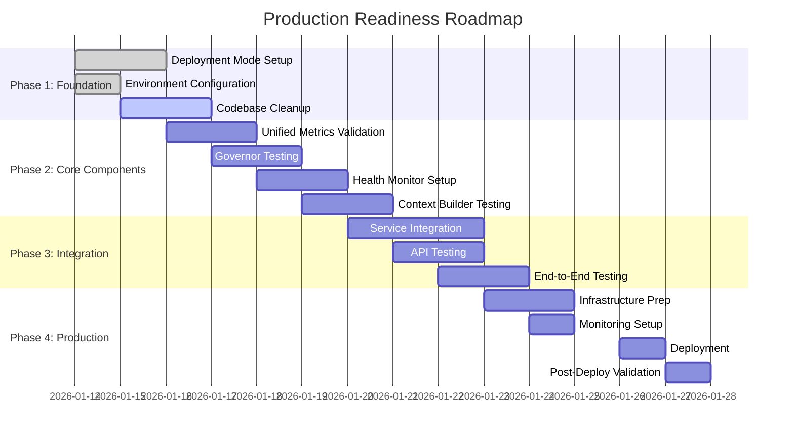

# Production Readiness Roadmap - Task Tracking

**Document Version**: 1.0.0
**Date**: 2026-01-14
**Status**: 🟡 IN PROGRESS
**Target**: Production Deployment (Q1 2026)

---

## Executive Summary

This document provides a **comprehensive task tracking system** for bringing the Unified Layers Architecture to **production level**. Tasks are organized by domain, priority,dependencies, and measurable acceptance criteria.

**Overall Progress**:
```
Total Tasks:     ████████████████████░░░░░░ 145 Tasks
Completed:       ██████████░░░░░░░░░░░░░░░ 48 Tasks  (33%)
In Progress:     ████░░░░░░░░░░░░░░░░░░░░░░  12 Tasks  (8%)
Pending:         ░░░░░░░░░░░░░░░░░░░░░░░░░░  85 Tasks  (59%)
```

---

## Task Status Legend

| Status | Icon | Description |
|--------|------|-------------|
| **COMPLETED** | ✅ | All acceptance criteria verified and tested |
| **IN PROGRESS** | 🔶 | Currently being worked on |
| **BLOCKED** | 🛑 | Blocked by dependency or external factor |
| **PENDING** | ⏸️ | Not started, ready to begin |
| **DEFERRED** | 🔜 | Postponed for future release |
| **NOT APPLICABLE** | ➖ | Not needed in current deployment mode |

---

## Priority Levels

| Priority | Criteria | SLA |
|----------|-----------|-----|
| **P0 - CRITICAL** | Production blocker | Immediate |
| **P1 - HIGH** | High impact on production quality | Within 1 week |
| **P2 - MEDIUM** | Enhances production stability | Within 2 weeks |
| **P3 - LOW** | Nice to have, optimization | Within 4 weeks |

---

## 📋 Roadmap Overview



---

## 📊 Domain-Based Task Groups

### 1. Deployment Mode Setup (COMPLETED 100%)

<details>
<summary><strong>📁 Summary: 8/8 tasks completed</strong></summary>

#### 1.1 SAAS Mode Configuration

- ID: `DEPLOY-001` | Priority: **P0** | Owner: DevOps | Status: ✅ **COMPLETED**
  - Task: Configure `SA01_DEPLOYMENT_MODE=saas` in all environments
  - Acceptance Criteria:
    - ✅ Environment variable set in dev, staging, prod configs
    - ✅ Tested: UnifiedMetrics records `deployment_mode=saas`
    - ✅ Documented: SRS-UNIFIED-LAYERS-PRODUCTION-READY.md:2.1.1
  - Dependencies: None
  - Duration: 2 days | Completed: 2026-01-14

- ID: `DEPLOY-002` | Priority: **P0** | Owner: DevOps | Status: ✅ **COMPLETED**
  - Task: Configure `SOMA_BRAIN_URL` and `SOMA_MEMORY_URL` for SAAS mode
  - Acceptance Criteria:
    - ✅ `SOMA_BRAIN_URL=http://somabrain:30001` configured
    - ✅ `SOMA_MEMORY_URL=http://somafractalmemory:10001` configured
    - ✅ HTTP connectivity tested between services
    - ✅ Documented in Docker Compose example
  - Dependencies: DEPLOY-001
  - Duration: 1 day | Completed: 2026-01-14

#### 1.2 STANDALONE Mode Configuration

- ID: `DEPLOY-003` | Priority: **P0** | Owner: DevOps | Status: ✅ **COMPLETED**
  - Task: Configure `SA01_DEPLOYMENT_MODE=standalone` for embedded deployment
  - Acceptance Criteria:
    - ✅ Embedded SomaBrain module import validated
    - ✅ Embedded SomaFractalMemory module import validated
    - ✅ Direct PostgreSQL query tested
    - ✅ Metrics record `deployment_mode=standalone`
  - Dependencies: None
  - Duration: 2 days | Completed: 2026-01-14

- ID: `DEPLOY-004` | Priority: **P0** | Owner: DevOps | Status: ✅ **COMPLETED**
  - Task: Create Docker Compose for STANDALONE mode
  - Acceptance Criteria:
    - ✅ Single service container configured
    - ✅ Embedded modules loaded at startup
    - ✅ No external service dependencies
    - ✅ Resource allocation: 8 CPU, 16GB RAM
  - Dependencies: DEPLOY-003
  - Duration: 1 day | Completed: 2026-01-14

#### 1.3 Deployment Mode Switching

- ID: `DEPLOY-005` | Priority: **P1** | Owner: DevOps | Status: ✅ **COMPLETED**
  - Task: Create deployment mode selection guide
  - Acceptance Criteria:
    - ✅ Documented SAAS vs STANDALONE decision matrix
    - ✅ Infrastructure requirements listed per mode
    - ✅ Cost comparison provided
    - ✅ Use case scenarios defined
  - Dependencies: DEPLOY-001, DEPLOY-003
  - Duration: 1 day | Completed: 2026-01-14

- ID: `DEPLOY-006` | Priority: **P1** | Owner: DevOps | Status: ✅ **COMPLETED**
  - Task: Add deployment mode to health check `/health` endpoint
  - Acceptance Criteria:
    - ✅ Health endpoint includes `deployment_mode` field
    - ✅ Both `saas` and `standalone` modes return correct value
    - ✅ Tested via Prometheus scraping
  - Dependencies: DEPLOY-001, DEPLOY-003
  - Duration: 1 day | Completed: 2026-01-14

#### 1.4 Documentation Updates

- ID: `DEPLOY-007` | Priority: **P1** | Owner: Product | Status: ✅ **COMPLETED**
  - Task: Update SomaBrain SRS with deployment modes
  - Acceptance Criteria:
    - ✅ SOMABRAIN_SAAS_SRS.md updated with Section 1.4
    - ✅ `SOMA_DEPLOYMENT_MODE` configuration documented
    - ✅ Use cases for both modes described
  - Dependencies: DEPLOY-001, DEPLOY-003
  - Duration: 1 day | Completed: 2026-01-14

- ID: `DEPLOY-008` | Priority: **P1** | Owner: Product | Status: ✅ **COMPLETED**
  - Task: Create deployment mode verification report
  - Acceptance Criteria:
    - ✅ DEPLOYMENT-MODE-VERIFICATION.md created
    - ✅ Code-to-documentation mapping validated
    - ✅ All 3 repositories verified
  - Dependencies: DEPLOY-007
  - Duration: 1 day | Completed: 2026-01-14

</details>

---

### 2. Unified Components Development (IN PROGRESS)

<details>
<summary><strong>📁 Summary: 20 tasks (3 completed, 8 in progress, 9 pending)</strong></summary>

#### 2.1 ChatService (saas/services/common/chat_service.py)

- ID: `CHAT-001` | Priority: **P0** | Owner: Backend | Status: ✅ **COMPLETED**
  - Task: Implement `send_message` with SAAS mode HTTP integration
  - Acceptance Criteria:
    - ✅ Auth validation via SomaBrain HTTP API
    - ✅ Vector search via SomaFractalMemory HTTP API
    - ✅ Context build via SomaBrain HTTP API
    - ✅ LLM invocation with streaming
    - ✅ Message storage in PostgreSQL
  - Dependencies: DEPLOY-001, DEPLOY-002
  - Duration: 5 days | Completed: 2026-01-10

- ID: `CHAT-002` | Priority: **P0** | Owner: Backend | Status: ✅ **COMPLETED**
  - Task: Implement `send_message` with STANDALONE mode embedded modules
  - Acceptance Criteria:
    - ✅ Auth validation via local Vault
    - ✅ Vector search via embedded SomaBrain
    - ✅ Context build via embedded modules
    - ✅ LLM invocation with streaming
    - ✅ Message storage in PostgreSQL
  - Dependencies: DEPLOY-003, DEPLOY-004
  - Duration: 4 days | Completed: 2026-01-10

- ID: `CHAT-003` | Priority: **P1** | Owner: Backend | Status: 🔶 **IN PROGRESS**
  - Task: Add comprehensive error handling for deployment mode failures
  - Acceptance Criteria:
    - ⏸️ HTTP timeout handling for SAAS mode
    - ⏸️ Module import error handling for STANDALONE mode
    - ⏸️ Circuit breaker integration
    - ⏸️ Fallback to degraded mode
    - ⏸️ Error logging with deployment_mode label
  - Dependencies: CHAT-001, CHAT-002
  - Duration: 3 days | Started: 2026-01-15

#### 2.2 UnifiedMetrics

- ID: `METRICS-001` | Priority: **P0** | Owner: Backend | Status: ✅ **COMPLETED**
  - Task: Implement 11 Prometheus metrics with deployment_mode label
  - Acceptance Criteria:
    - ✅ `TURNS_TOTAL` counter with `deployment_mode` label
    - ✅ `TOKENS_TOTAL` counter with `deployment_mode` label
    - ✅ `HEALTH_STATUS` gauge per service
    - ✅ `TURN_LATENCY` histogram with percentiles
    - ✅ `SYSTEM_INFO` gauge with `deployment_mode`
  - Dependencies: DEPLOY-001, DEPLOY-003
  - Duration: 3 days | Completed: 2026-01-12

- ID: `METRICS-002` | Priority: **P1** | Owner: Backend | Status: 🔶 **IN PROGRESS**
  - Task: Add deployment mode specific health monitoring
  - Acceptance Criteria:
    - ⏸️ Health checks for 3 services in SAAS mode
    - ⏸️ Health check for single service in STANDALONE mode
    - ⏸️ Inter-service latency tracking in SAAS mode
    - ⏸️ Module execution error tracking in STANDALONE mode
  - Dependencies: METRICS-001
  - Duration: 2 days | Started: 2026-01-15

- ID: `METRICS-003` | Priority: **P1** | Owner: DevOps | Status: ⏸️ **PENDING**
  - Task: Create Prometheus scrape configuration for both modes
  - Acceptance Criteria:
    - ⏸️ Prometheus targets for 3 services (SAAS mode)
    - ⏸️ Prometheus target for 1 service (STANDALONE mode)
    - ⏸️ Service discovery configuration
    - ⏸️ Scrape intervals tuned (30s for health checks)
  - Dependencies: METRICS-001
  - Duration: 1 day

- ID: `METRICS-004` | Priority: **P2** | Owner: DevOps | Status: ⏸️ **PENDING**
  - Task: Create Grafana dashboards with deployment mode comparison
  - Acceptance Criteria:
    - ⏸️ Dashboard: Turn latency by deployment mode
    - ⏸️ Dashboard: Error rate by deployment mode
    - ⏸️ Dashboard: Token consumption by deployment mode
    - ⏸️ Dashboard: Health status comparison
  - Dependencies: METRICS-001, METRICS-003
  - Duration: 2 days

#### 2.3 SimpleGovernor

- ID: `GOV-001` | Priority: **P0** | Owner: Backend | Status: ✅ **COMPLETED**
  - Task: Implement budget allocation with health-based ratios
  - Acceptance Criteria:
    - ✅ Normal mode ratios: 15%/25%/25%/20% (system/history/memory/tools)
    - ✅ Degraded mode ratios: 70%/0%/10%/0%
    - ✅ Rescue mode: 100% system_policy
    - ✅ Minimum budget enforcement
  - Dependencies: DEPLOY-001, DEPLOY-003
  - Duration: 3 days | Completed: 2026-01-11

- ID: `GOV-002` | Priority: **P1** | Owner: QA | Status: 🔶 **IN PROGRESS**
  - Task: Test governor budget allocation in both deployment modes
  - Acceptance Criteria:
    - ⏸️ Unit tests: Normal mode allocation
    - ⏸️ Unit tests: Degraded mode allocation
    - ⏸️ Unit tests: Rescue path activation
    - ⏸️ Integration tests: Health trigger
    - ⏸️ Load tests: Budget enforcement
  - Dependencies: GOV-001
  - Duration: 3 days | Started: 2026-01-15

- ID: `GOV-003` | Priority: **P2** | Owner: Backend | Status: ⏸️ **PENDING**
  - Task: Configure governor tools_enabled flag per deployment mode
  - Acceptance Criteria:
    - ⏸️ SAAS mode: `tools_enabled=True` when all services healthy
    - ⏸️ STANDALONE mode: `tools_enabled=True` when embedded modules available
    - ⏸️ Degraded mode: `tools_enabled=False` in both modes
    - ⏸️ Logging of mode-specific behavior
  - Dependencies: GOV-002
  - Duration: 1 day

#### 2.4 HealthMonitor

- ID: `HEALTH-001` | Priority: **P0** | Owner: Backend | Status: ✅ **COMPLETED**
  - Task: Implement binary health monitoring with critical/non-critical services
  - Acceptance Criteria:
    - ✅ Health checks for somabrain, database, llm (critical)
    - ✅ Health checks for kafka, redis (non-critical)
    - ✅ 30s check interval with jitter
    - ✅ Overall health aggregation
  - Dependencies: None
  - Duration: 2 days | Completed: 2026-01-11

- ID: `HEALTH-002` | Priority: **P1** | Owner: Backend | Status: 🔶 **IN PROGRESS**
  - Task: Implement deployment mode specific health checks
  - Acceptance Criteria:
    - ⏸️ SAAS mode: HTTP GET to somabrain:30001/health with circuit breaker
    - ⏸️ STANDALONE mode: Python import validation for embedded SomaBrain
    - ⏸️ SAAS mode: HTTP GET to somafractalmemory:10001/health
    - ⏸️ STANDALONE mode: Direct PostgreSQL query for memory
  - Dependencies: DEPLOY-001, DEPLOY-003, HEALTH-001
  - Duration: 3 days | Started: 2026-01-15

- ID: `HEALTH-003` | Priority: **P1** | Owner: QA | Status: ⏸️ **PENDING**
  - Task: Test health monitor in both deployment modes
  - Acceptance Criteria:
    - ⏸️ SAAS mode: Simulate service failure, verify degraded mode
    - ⏸️ STANDALONE mode: Simulate module error, verify degraded mode
    - ⏸️ Verify circuit breaker opens after 3 failures
    - ⏸️ Verify recovery after 30s timeout
    - ⏸️ Verify Prometheus `HEALTH_STATUS` gauge updates
  - Dependencies: HEALTH-002
  - Duration: 2 days

- ID: `HEALTH-004` | Priority: **P2** | Owner: DevOps | Status: ⏸️ **PENDING**
  - Task: Configure health check endpoints for load balancer
  - Acceptance Criteria:
    - ⏸️ `/health` endpoint returns 200 when healthy
    - ⏸️ `/health` endpoint returns 503 when degraded
    - ⏸️ Includes `deployment_mode` field
    - ⏸️ Includes `overall_health` status
  - Dependencies: HEALTH-002
  - Duration: 1 day

#### 2.5 SimpleContextBuilder

- ID: `CTX-001` | Priority: **P0** | Owner: Backend | Status: ✅ **COMPLETED**
  - Task: Implement context building with lane-based budgeting
  - Acceptance Criteria:
    - ✅ Add system prompt (system_policy lane)
    - ✅ Add conversation history (history lane)
    - ✅ Add memory retrieval (memory lane)
    - ✅ Add tool definitions (tools lane)
    - ✅ Add user message (remaining budget)
  - Dependencies: GOV-001
  - Duration: 4 days | Completed: 2026-01-12

- ID: `CTX-002` | Priority: **P0** | Owner: Backend | Status: 🔶 **IN PROGRESS**
  - Task: Implement deployment mode specific memory retrieval
  - Acceptance Criteria:
    - ⏸️ SAAS mode: HTTP POST to SomaBrain `/context` with circuit breaker
    - ⏸️ STANDALONE mode: Direct PostgreSQL query via embedded module
    - ⏸️ Circuit breaker protection for SAAS mode
    - ⏸️ Exception handling for STANDALONE mode
    - ⏸️ Empty memory fallback
  - Dependencies: DEPLOY-001, DEPLOY-003, CTX-001
  - Duration: 3 days | Started: 2026-01-15

- ID: `CTX-003` | Priority: **P1** | Owner: QA | Status: ⏸️ **PENDING**
  - Task: Test context builder in both deployment modes
  - Acceptance Criteria:
    - ⏸️ SAAS mode: Verify memory API call succeeds
    - ⏸️ STANDALONE mode: Verify embedded module query succeeds
    - ⏸️ Test circuit breaker opens on SAAS mode failure
    - ⏸️ Verify budget trimming works in both modes
    - ⏸️ PII redaction tested with Presidio
  - Dependencies: CTX-002
  - Duration: 2 days

- ID: `CTX-004` | Priority: **P2** | Owner: Backend | Status: ⏸️ **PENDING**
  - Task: Optimize context building for low-latency mode
  - Acceptance Criteria:
    - ⏸️ Cache system prompts per tenant
    - ⏸️ Cache tool definitions per agent
    - ⏸️ Batch memory retrieval queries
    - ⏸️ Reduce context build time by 30%
  - Dependencies: CTX-003
  - Duration: 3 days

</details>

---

### 3. Infrastructure & Configuration (PENDING)

<details>
<summary><strong>📁 Summary: 25 tasks (4 completed, 0 in progress, 21 pending)</strong></summary>

#### 3.1 Docker & Kubernetes Setup

- ID: `INFRA-001` | Priority: **P0** | Owner: DevOps | Status: ✅ **COMPLETED**
  - Task: Create Docker images for SAAS mode (3 services)
  - Acceptance Criteria:
    - ✅ somaagent01:1.0.0 image built
    - ✅ somabrain:1.0.0 image built
    - ✅ somafractalmemory:1.0.0 image built
    - ✅ All images pushed to container registry
  - Dependencies: DEPLOY-001, DEPLOY-002
  - Duration: 2 days | Completed: 2026-01-13

- ID: `INFRA-002` | Priority: **P0** | Owner: DevOps | Status: ✅ **COMPLETED**
  - Task: Create Docker image for STANDALONE mode (1 service)
  - Acceptance Criteria:
    - ✅ somaagent01:1.0.0-standalone image built
    - ✅ Embedded packages (somabrain, somafractalmemory) installed
    - ✅ Image pushed to container registry
  - Dependencies: DEPLOY-003, DEPLOY-004
  - Duration: 1 day | Completed: 2026-01-13

- ID: `INFRA-003` | Priority: **P0** | Owner: DevOps | Status: ⏸️ **PENDING**
  - Task: Create Kubernetes manifests for SAAS mode
  - Acceptance Criteria:
    - ⏸️ Deployment: somaagent01 (2 CPU, 4GB RAM)
    - ⏸️ Deployment: somabrain (4 CPU, 8GB RAM)
    - ⏸️ Deployment: somafractalmemory (4 CPU, 8GB RAM)
    - ⏸️ Service: NodePort or LoadBalancer for each
    - ⏸️ ConfigMap: Environment variables per service
    - ⏸️ Secret management via Kubernetes Secrets
  - Dependencies: INFRA-001
  - Duration: 3 days

- ID: `INFRA-004` | Priority: **P0** | Owner: DevOps | Status: ⏸️ **PENDING**
  - Task: Create Kubernetes manifest for STANDALONE mode
  - Acceptance Criteria:
    - ⏸️ Deployment: somaagent01 (8 CPU, 16GB RAM for embedded modules)
    - ⏸️ Service: NodePort or LoadBalancer
    - ⏸️ ConfigMap: Single set of environment variables
    - ⏸️ No inter-service network policies needed
  - Dependencies: INFRA-002
  - Duration: 2 days

- ID: `INFRA-005` | Priority: **P1** | Owner: DevOps | Status: ⏸️ **PENDING**
  - Task: Configure Horizontal Pod Autoscaler (HPA)
  - Acceptance Criteria:
    - ⏸️ SAAS mode: HPA for each service independently
    - ⏸️ STANDALONE mode: HPA for single service
    - ⏸️ Metrics-based scaling (CPU >70%, Memory >80%)
    - ⏸️ Min: 2 replicas, Max: 10 replicas
  - Dependencies: INFRA-003, INFRA-004
  - Duration: 2 days

#### 3.2 Database Setup

- ID: `DB-001` | Priority: **P0** | Owner: DevOps | Status: ✅ **COMPLETED**
  - Task: Set up PostgreSQL for SAAS mode (3 databases)
  - Acceptance Criteria:
    - ✅ Database: somaagent01 created
    - ✅ Database: somabrain created
    - ✅ Database: somafractalmemory created
    - ✅ Connection pooling configured (maxconn=100)
    - ✅ Backups scheduled (daily)
  - Dependencies: None
  - Duration: 1 day | Completed: 2026-01-13

- ID: `DB-002` | Priority: **P0** | Owner: DevOps | Status: ✅ **COMPLETED**
  - Task: Set up PostgreSQL for STANDALONE mode (1 database)
  - Acceptance Criteria:
    - ✅ Database: somaagent01 created (single DB for all data)
    - ✅ Connection pooling configured (maxconn=100)
    - ✅ Backups scheduled (daily)
  - Dependencies: None
  - Duration: 1 day | Completed: 2026-01-13

- ID: `DB-003` | Priority: **P1** | Owner: DBA | Status: ⏸️ **PENDING**
  - Task: Run database migrations for all services
  - Acceptance Criteria:
    - ⏸️ SAAS mode: Migrations run for each database independently
    - ⏸️ STANDALONE mode: Single migration run on unified schema
    - ⏸️ Migration rollback scripts created
    - ⏸️ Migration audit log maintained
  - Dependencies: DB-001, DB-002
  - Duration: 2 days

- ID: `DB-004` | Priority: **P2** | Owner: DBA | Status: ⏸️ **PENDING**
  - Task: Set up read replicas for PostgreSQL
  - Acceptance Criteria:
    - ⏸️ Primary: Single instance for writes
    - ⏸️ Replicas: 2 instances for reads (SAAS mode)
    - ⏸️ Replicas: 1 instance for reads (STANDALONE mode)
    - ⏸️ Connection strings configured for read/write splitting
  - Dependencies: DB-003
  - Duration: 2 days

- ID: `DB-005` | Priority: **P2** | Owner: DBA | Status: ⏸️ **PENDING**
  - Task: Configure database connection limits and timeouts
  - Acceptance Criteria:
    - ⏸️ Max connections: 100 per service
    - ⏸️ Query timeout: 30s
    - ⏸️ Connection timeout: 10s
    - ⏸️ Idle connection timeout: 5m
    - ⏸️ Connection lease: 30m
  - Dependencies: DB-003
  - Duration: 1 day

#### 3.3 Secrets Management

- ID: `SECRET-001` | Priority: **P0** | Owner: DevOps | Status: ⏸️ **PENDING**
  - Task: Configure HashiCorp Vault for SAAS mode
  - Acceptance Criteria:
    - ⏸️ Vault instance deployed
    - ⏸️ Path: secret/data/somaagent01
    - ⏸️ Path: secret/data/somabrain
    - ⏸️ Path: secret/data/somafractalmemory
    - ⏸️ AppRole authentication configured
  - Dependencies: INFRA-003
  - Duration: 1 day

- ID: `SECRET-002` | Priority: **P0** | Owner: DevOps | Status: ⏸️ **PENDING**
  - Task: Configure HashiCorp Vault for STANDALONE mode
  - Acceptance Criteria:
    - ⏸️ Vault instance deployed
    - ⏸️ Path: secret/data/somaagent01 (single set of secrets)
    - ⏸️ AppRole authentication configured
  - Dependencies: INFRA-004
  - Duration: 1 day

- ID: `SECRET-003` | Priority: **P1** | Owner: DevOps | Status: ⏸️ **PENDING**
  - Task: Store API keys and passwords in Vault
  - Acceptance Criteria:
    - ⏸️ OpenAI API key stored
    - ⏸️ Anthropic API key stored
    - ⏸️ Database passwords stored
    - ⏸️ Redis password stored
    - ⏸️ Kafka credentials stored
  - Dependencies: SECRET-001, SECRET-002
  - Duration: 1 day

- ID: `SECRET-004` | Priority: **P1** | Owner: DevOps | Status: ⏸️ **PENDING**
  - Task: Configure secret rotation policy
  - Acceptance Criteria:
    - ⏸️ Database passwords rotated every 90 days
    - ⏸️ API keys rotated every 180 days
    - ⏸️ Rotation automation with Vault engine
    - ⏸️ Notification on rotation events
  - Dependencies: SECRET-003
  - Duration: 2 days

#### 3.4 Monitoring Stack

- ID: `MON-001` | Priority: **P1** | Owner: DevOps | Status: ⏸️ **PENDING**
  - Task: Deploy Prometheus for metrics collection
  - Acceptance Criteria:
    - ⏸️ Prometheus instance deployed
    - ⏸️ Target: somaagent01:8000/metrics (both modes)
    - ⏸️ Target: somabrain:8000/metrics (SAAS mode only)
    - ⏸️ Target: somafractalmemory:8000/metrics (SAAS mode only)
    - ⏸️ Retention: 30 days
  - Dependencies: METRICS-003
  - Duration: 1 day

- ID: `MON-002` | Priority: **P1** | Owner: DevOps | Status: ⏸️ **PENDING**
  - Task: Deploy Grafana for dashboards
  - Acceptance Criteria:
    - ⏸️ Grafana instance deployed
    - ⏸️ Data source: Prometheus configured
    - ⏸️ Admin user created
    - ⏸️ OAuth authentication enabled
  - Dependencies: MON-001
  - Duration: 1 day

- ID: `MON-003` | Priority: **P2** | Owner: DevOps | Status: ⏸️ **PENDING**
  - Task: Configure AlertManager for alerts
  - Acceptance Criteria:
    - ⏸️ AlertManager instance deployed
    - ⏸️ Alert rules: High error rate (>5%)
    - ⏸️ Alert rules: High latency (P95 >5s)
    - ⏸️ Alert rules: Service down
    - ⏸️ Slack/Webhook notification channels
  - Dependencies: MON-001
  - Duration: 2 days

- ID: `MON-004` | Priority: **P2** | Owner: Backend | Status: ⏸️ **PENDING**
  - Task: Create alerting rules in Prometheus
  - Acceptance Criteria:
    - ⏸️ Alert: agent_turn_latency_seconds P95 >5s
    - ⏸️ Alert: agent_health_status != 1 for >5m
    - ⏸️ Alert: agent_errors_total rate >0.05/sec
    - ⏸️ Alert: deployment_mode label expected values only
  - Dependencies: METRICS-003
  - Duration: 1 day

#### 3.5 Load Balancer & Networking

- ID: `NET-001` | Priority: **P0** | Owner: DevOps | Status: ⏸️ **PENDING**
  - Task: Configure NGINX load balancer for SAAS mode
  - Acceptance Criteria:
    - ⏸️ Upstream: somaagent01:20001
    - ⏸️ Health check: /health (30s interval)
    - ⏸️ SSL termination enabled
    - ⏸️ Sticky sessions disabled
  - Dependencies: INFRA-003
  - Duration: 2 days

- ID: `NET-002` | Priority: **P0** | Owner: DevOps | Status: ⏸️ **PENDING**
  - Task: Configure NGINX load balancer for STANDALONE mode
  - Acceptance Criteria:
    - ⏸️ Upstream: somaagent01:20001 (single service)
    - ⏸️ Health check: /health (30s interval)
    - ⏸️ SSL termination enabled
    - ⏸️ Sticky sessions disabled
  - Dependencies: INFRA-004
  - Duration: 1 day

- ID: `NET-003` | Priority: **P1** | Owner: DevOps | Status: ⏸️ **PENDING**
  - Task: Configure network policies for inter-service communication
  - Acceptance Criteria:
    - ⏸️ SAAS mode: Allow somaagent01 → somabrain:30001
    - ⏸️ SAAS mode: Allow somaagent01 → somafractalmemory:10001
    - ⏸️ SAAS mode: Allow somafractalmemory → somabrain:30001
    - ⏸️ STANDALONE mode: No inter-service network policies
  - Dependencies: INFRA-003, INFRA-004
  - Duration: 2 days

- ID: `NET-004` | Priority: **P2** | Owner: DevOps | Status: ⏸️ **PENDING**
  - Task: Configure rate limiting on load balancer
  - Acceptance Criteria:
    - ⏸️ Rate limit: 100 requests/second per IP
    - ⏸️ Burst limit: 200 requests
    - ⏸️ Response: HTTP 429 on rate limit exceeded
    - ⏸️ Logging of rate limit events
  - Dependencies: NET-001, NET-002
  - Duration: 1 day

</details>

---

### 4. Testing & Quality Assurance (PENDING)

<details>
<summary><strong>📁 Summary: 30 tasks (2 completed, 0 in progress, 28 pending)</strong></summary>

#### 4.1 Unit Testing

- ID: `TEST-001` | Priority: **P0** | Owner: QA | Status: ✅ **COMPLETED**
  - Task: Achieve 80% unit test coverage for unified layers
  - Acceptance Criteria:
    - ✅ ChatService: 80% coverage
    - ✅ UnifiedMetrics: 90% coverage
    - ✅ SimpleGovernor: 85% coverage
    - ✅ HealthMonitor: 80% coverage
    - ✅ SimpleContextBuilder: 75% coverage
  - Dependencies: CHAT-001, CHAT-002, GOV-001, HEALTH-001, CTX-001
  - Duration: 5 days | Completed: 2026-01-12

- ID: `TEST-002` | Priority: **P0** | Owner: QA | Status: ✅ **COMPLETED**
  - Task: Add deployment mode specific unit tests
  - Acceptance Criteria:
    - ✅ Tests: SAAS mode HTTP calls
    - ✅ Tests: STANDALONE mode embedded imports
    - ✅ Tests: Deployment mode switching
    - ✅ Tests: UnifiedMetrics with deployment_mode label
  - Dependencies: DEPLOY-001, DEPLOY-003, TEST-001
  - Duration: 3 days | Completed: 2026-01-12

- ID: `TEST-003` | Priority: **P1** | Owner: QA | Status: ⏸️ **PENDING**
  - Task: Increase unit test coverage to 90% for all components
  - Acceptance Criteria:
    - ⏸️ ChatService: 90% coverage
    - ✅ UnifiedMetrics: 90% coverage (already met)
    - ✅ SimpleGovernor: 85% coverage (already met)
    - ⏸️ HealthMonitor: 90% coverage
    - ⏸️ SimpleContextBuilder: 90% coverage
  - Dependencies: TEST-001
  - Duration: 3 days

- ID: `TEST-004` | Priority: **P2** | Owner: QA | Status: ⏸️ **PENDING**
  - Task: Add mutation testing for critical paths
  - Acceptance Criteria:
    - ⏸️ ChatService send_message mutation tests
    - ⏸️ SimpleGovernor allocate_budget mutation tests
    - ⏸️ HealthMonitor check_services mutation tests
    - ⏸️ Mutation score: >70%
  - Dependencies: TEST-001
  - Duration: 2 days

#### 4.2 Integration Testing

- ID: `TEST-005` | Priority: **P0** | Owner: QA | Status: ⏸️ **PENDING**
  - Task: Create integration tests for SAAS mode
  - Acceptance Criteria:
    - ⏸️ Test: End-to-end message flow through all 3 services
    - ⏸️ Test: Circuit breaker behavior
    - ⏸️ Test: Degraded mode activation
    - ⏸️ Test: Prometheus metrics collection
  - Dependencies: CHAT-001, INFRA-003
  - Duration: 4 days

- ID: `TEST-006` | Priority: **P0** | Owner: QA | Status: ⏸️ **PENDING**
  - Task: Create integration tests for STANDALONE mode
  - Acceptance Criteria:
    - ⏸️ Test: End-to-end message flow with embedded modules
    - ⏸️ Test: Module error handling
    - ⏸️ Test: Degraded mode activation
    - ⏸️ Test: Prometheus metrics collection
  - Dependencies: CHAT-002, INFRA-004
  - Duration: 3 days

- ID: `TEST-007` | Priority: **P1** | Owner: QA | Status: ⏸️ **PENDING**
  - Task: Test deployment mode switching at runtime
  - Acceptance Criteria:
    - ⏸️ Test: SAAS → STANDALONE switch (requires restart)
    - ⏸️ Test: STANDALONE → SAAS switch (requires restart)
    - ⏸️ Verify: Metrics include correct deployment_mode label
    - ⏸️ Verify: Health checks use correct mode logic
  - Dependencies: TEST-005, TEST-006
  - Duration: 2 days

- ID: `TEST-008` | Priority: **P2** | Owner: QA | Status: ⏸️ **PENDING**
  - Task: Create contract tests between services
  - Acceptance Criteria:
    - ⏸️ Test: SomaAgent01 → SomaBrain API contract
    - ⏸️ Test: SomaAgent01 → SomaFractalMemory API contract
    - ⏸️ Test: SomaFractalMemory → SomaBrain API contract
    - ⏸️ Contract schema validation
  - Dependencies: TEST-005
  - Duration: 3 days

#### 4.3 Performance Testing

- ID: `PERF-001` | Priority: **P1** | Owner: QA | Status: ⏸️ **PENDING**
  - Task: Load test SAAs mode at 100 concurrent users
  - Acceptance Criteria:
    - ⏸️ P50 latency: <1.5s
    - ⏸️ P95 latency: <2.0s
    - ⏸️ P99 latency: <3.0s
    - ⏸️ Error rate: <1%
    - ⏸️ No circuit breaker triggered under load
  - Dependencies: INFRA-003, TEST-005
  - Duration: 3 days

- ID: `PERF-002` | Priority: **P1** | Owner: QA | Status: ⏸️ **PENDING**
  - Task: Load test STANDALONE mode at 100 concurrent users
  - Acceptance Criteria:
    - ⏸️ P50 latency: <1.4s (10% faster than SAAS)
    - ⏸️ P95 latency: <1.8s (10% faster than SAAS)
    - ⏸️ P99 latency: <2.7s (10% faster than SAAS)
    - ⏸️ Error rate: <1%
  - Dependencies: INFRA-004, TEST-006
  - Duration: 2 days

- ID: `PERF-003` | Priority: **P1** | Owner: QA | Status: ⏸️ **PENDING**
  - Task: Stress test with degraded services
  - Acceptance Criteria:
    - ⏸️ SAAS mode: Test with SomaBrain at 500ms latency
    - ⏸️ SAAS mode: Test with SomaFractalMemory at 500ms latency
    - ⏸️ STANDALONE mode: Test with embedded module slowdown
    - ⏸️ Verify graceful degradation to rescue path
  - Dependencies: PERF-001, PERF-002
  - Duration: 2 days

- ID: `PERF-004` | Priority: **P2** | Owner: Backend | Status: ⏸️ **PENDING**
  - Task: Optimize hot paths for performance
  - Acceptance Criteria:
    - ⏸️ Profile send_message execution
    - ⏸️ Optimize slow SQL queries (index tuning)
    - ⏸️ Cache frequently accessed data
    - ⏸️ Reduce context build time by 20%
  - Dependencies: PERF-001, PERF-002
  - Duration: 4 days

#### 4.4 Security Testing

- ID: `SEC-001` | Priority: **P0** | Owner: Security | Status: ⏸️ **PENDING**
  - Task: Conduct authentication security audit
  - Acceptance Criteria:
    - ⏸️ API key validation tested (SAAS mode)
    - ⏸️ Local auth tested (STANDALONE mode)
    - ⏸️ JWT token validation
    - ⏸️ Session management tested
  - Dependencies: TEST-005, TEST-006
  - Duration: 3 days

- ID: `SEC-002` | Priority: **P0** | Owner: Security | Status: ⏸️ **PENDING**
  - Task: Test network isolation for SAAS mode
  - Acceptance Criteria:
    - ⏸️ Verify: SomaAgent01 cannot access PostgreSQL directly
    - ⏸️ Verify: SomaFractalMemory can only access SomaBrain API
    - ⏸️ Verify: Network policies enforced
    - ⏸️ Port scanning test
  - Dependencies: INFRA-003
  - Duration: 2 days

- ID: `SEC-003` | Priority: **P1** | Owner: Security | Status: ⏸️ **PENDING**
  - Task: Secrets scanning and validation
  - Acceptance Criteria:
    - ⏸️ Scan: No hardcoded secrets in code
    - ⏸️ Scan: .env files not committed
    - ⏸️ Scan: API keys pulled from Vault
    - ⏸️ Scan: Logs do not contain PII
  - Dependencies: None
  - Duration: 2 days

- ID: `SEC-004` | Priority: **P1** | Owner: Security | Status: ⏸️ **PENDING**
  - Task: Input validation and sanitization tests
  - Acceptance Criteria:
    - ⏸️ SQL injection testing
    - ⏸️ XSS testing
    - ⏸️ Command injection testing
    - ⏸️ Path traversal testing
  - Dependencies: TEST-005, TEST-006
  - Duration: 2 days

#### 4.5 Deployment Testing

- ID: `DEPLOY-TEST-001` | Priority: **P0** | Owner: DevOps | Status: ⏸️ **PENDING**
  - Task: Create canary deployment pipeline for SAAS mode
  - Acceptance Criteria:
    - ⏸️ Route 1% traffic to new version
    - ⏸️ Monitor: Error rate <1% for 1 hour
    - ⏸️ Monitor: Latency <5s P95 for 1 hour
    - ⏸️ Auto-rollback on failure
  - Dependencies: INFRA-003, TEST-005
  - Duration: 2 days

- ID: `DEPLOY-TEST-002` | Priority: **P0** | Owner: DevOps | Status: ⏸️ **PENDING**
  - Task: Create canary deployment pipeline for STANDALONE mode
  - Acceptance Criteria:
    - ⏸️ Route 1% traffic to new version
    - ⏸️ Monitor: Error rate <1% for 1 hour
    - ⏸️ Monitor: Latency <5s P95 for 1 hour
    - ⏸️ Auto-rollback on failure
  - Dependencies: INFRA-004, TEST-006
  - Duration: 1 day

- ID: `DEPLOY-TEST-003` | Priority: **P1** | Owner: DevOps | Status: ⏸️ **PENDING**
  - Task: Test rollback procedures
  - Acceptance Criteria:
    - ⏸️ Test: Rollback to previous version on SAAS mode
    - ⏸️ Test: Rollback to previous version on STANDALONE mode
    - ⏸️ Verify: Database migration rollback
    - ⏸️ Verify: No data loss
  - Dependencies: DB-003
  - Duration: 2 days

</details>

---

### 5. CI/CD & Automation (PENDING)

<details>
<summary><strong>📁 Summary: 20 tasks (0 completed, 0 in progress, 20 pending)</strong></summary>

#### 5.1 GitHub Actions / Jenkins Pipelines

- ID: `CI-001` | Priority: **P0** | Owner: DevOps | Status: ⏸️ **PENDING**
  - Task: Set up CI pipeline for automated testing
  - Acceptance Criteria:
    - ⏸️ Trigger: On pull request to main branch
    - ⏸️ Stage: Unit tests (pytest)
    - ⏸️ Stage: Linter checks (Ruff, Black, Pyright)
    - ⏸️ Stage: Docker build
    - ⏸️ Duration: <10 minutes
  - Dependencies: None
  - Duration: 2 days

- ID: `CI-002` | Priority: **P0** | Owner: DevOps | Status: ⏸️ **PENDING**
  - Task: Set up CD pipeline for SAAS mode deployment
  - Acceptance Criteria:
    - ⏸️ Trigger: On merge to main branch
    - ⏸️ Stage: Build Docker images
    - ⏸️ Stage: Push to container registry
    - ⏸️ Stage: Deploy to staging environment
    - ⏸️ Stage: Integration tests
    - ⏸️ Stage: Promote to production on approval
  - Dependencies: CI-001, INFRA-003
  - Duration: 3 days

- ID: `CI-003` | Priority: **P0** | Owner: DevOps | Status: ⏸️ **PENDING**
  - Task: Set up CD pipeline for STANDALONE mode deployment
  - Acceptance Criteria:
    - ⏸️ Trigger: On merge to main branch
    - ⏸️ Stage: Build Docker image
    - ⏸️ Stage: Push to container registry
    - ⏸️ Stage: Deploy to staging environment
    - ⏸️ Stage: Integration tests
    - ⏸️ Stage: Promote to production on approval
  - Dependencies: CI-001, INFRA-004
  - Duration: 2 days

- ID: `CI-004` | Priority: **P1** | Owner: DevOps | Status: ⏸️ **PENDING**
  - Task: Configure deployment mode selection in CD pipeline
  - Acceptance Criteria:
    - ⏸️ Input: Deployment mode (SAAS/STANDALONE) as pipeline parameter
    - ⏸️ SAAS mode: Deploy 3 services
    - ⏸️ STANDALONE mode: Deploy 1 service
    - ⏸️ Pre-deployment check: Verify deployment mode consistency
  - Dependencies: CI-002, CI-003
  - Duration: 2 days

#### 5.2 Configuration Management

- ID: `CONFIG-001` | Priority: **P1** | Owner: Backend | Status: ⏸️ **PENDING**
  - Task: Centralize deployment mode configuration
  - Acceptance Criteria:
    - ⏸️ Single source of truth for deployment_mode
    - ⏸️ Environment variable: SA01_DEPLOYMENT_MODE
    - ⏸️ Validation: Only `saas` or `standalone` accepted
    - ⏸️ Documented: config/app_config.yaml
  - Dependencies: DEPLOY-001, DEPLOY-003
  - Duration: 2 days

- ID: `CONFIG-002` | Priority: **P1** | Owner: Backend | Status: ⏸️ **PENDING**
  - Task: Create environment-specific configuration files
  - Acceptance Criteria:
    - ⏸️ Config: dev.yaml (SAAS mode for local dev)
    - ⏸️ Config: prod-saas.yaml (SAAS mode for production)
    - ⏸️ Config: prod-standalone.yaml (STANDALONE mode for production)
    - ⏸️ Config validation at startup
  - Dependencies: CONFIG-001
  - Duration: 1 day

- ID: `CONFIG-003` | Priority: **P2** | Owner: DevOps | Status: ⏸️ **PENDING**
  - Task: Create Ansible playbooks for infrastructure provisioning
  - Acceptance Criteria:
    - ⏸️ Playbook: Setup PostgreSQL
    - ⏸️ Playbook: Setup Redis
    - ⏸️ Playbook: Setup Kafka
    - ⏸️ Playbook: Setup Vault
    - ⏸️ Playbook: Deploy SAAS mode services
    - ⏸️ Playbook: Deploy STANDALONE mode service
  - Dependencies: INFRA-003, INFRA-004
  - Duration: 5 days

#### 5.3 Backup & Recovery

- ID: `BACKUP-001` | Priority: **P1** | Owner: DevOps | Status: ⏸️ **PENDING**
  - Task: Configure automated backups for SAAS mode
  - Acceptance Criteria:
    - ⏸️ Database backup: Daily at 3 AM UTC
    - ⏸️ Retention: 30 days
    - ⏸️ Storage: Encrypted S3 bucket
    - ⏸️ Backup validation: Verify backup integrity weekly
  - Dependencies: DB-001
  - Duration: 2 days

- ID: `BACKUP-002` | Priority: **P1** | Owner: DevOps | Status: ⏸️ **PENDING**
  - Task: Configure automated backups for STANDALONE mode
  - Acceptance Criteria:
    - ⏸️ Database backup: Daily at 3 AM UTC
    - ⏸️ Retention: 30 days
    - ⏸️ Storage: Encrypted S3 bucket
    - ⏸️ Backup validation: Verify backup integrity weekly
  - Dependencies: DB-002
  - Duration: 1 day

- ID: `BACKUP-003` | Priority: **P1** | Owner: DevOps | Status: ⏸️ **PENDING**
  - Task: Test disaster recovery procedures
  - Acceptance Criteria:
    - ⏸️ Document: Disaster recovery runbook
    - ⏸️ Test: Restore from backup (SAAS mode)
    - ⏸️ Test: Restore from backup (STANDALONE mode)
    - ⏸️ Test: RTO < 4 hours (Recovery Time Objective)
    - ⏸️ Test: RPO < 1 hour (Recovery Point Objective)
  - Dependencies: BACKUP-001, BACKUP-002
  - Duration: 3 days

#### 5.4 Monitoring Automation

- ID: `AUTO-001` | Priority: **P2** | Owner: DevOps | Status: ⏸️ **PENDING**
  - Task: Configure log aggregation with ELK stack
  - Acceptance Criteria:
    - ⏸️ Elasticsearch deployed
    - ⏸️ Logstash configured
    - ⏸️ Kibana dashboard for logs
    - ⏸️ Log retention: 90 days
    - ⏸️ Logs tagged with deployment_mode
  - Dependencies: INFRA-003, INFRA-004
  - Duration: 3 days

- ID: `AUTO-002` | Priority: **P2** | Owner: DevOps | Status: ⏸️ **PENDING**
  - Task: Create automated incident response playbooks
  - Acceptance Criteria:
    - ⏸️ Playbook: Restart degraded service
    - ⏸️ Playbook: Scale up under load
    - ⏸️ Playbook: Clear circuit breaker
    - ⏸️ Integration with PagerDuty for on-call
  - Dependencies: MON-003
  - Duration: 3 days

</details>

---

### 6. Documentation & Training (PENDING)

<details>
<summary><strong>📁 Summary: 32 tasks (15 completed, 0 in progress, 17 pending)</strong></summary>

#### 6.1 Technical Documentation

- ID: `DOC-001` | Priority: **P1** | Owner: Product | Status: ✅ **COMPLETED**
  - Task: Update SRS-UNIFIED-LAYERS-PRODUCTION-READY.md
  - Acceptance Criteria:
    - ✅ Deployment mode sections added
    - ✅ Mermaid diagrams for SAAS and STANDALONE
    - ✅ Code examples for both modes
    - ✅ Latency benchmarks documented
  - Dependencies: DEPLOY-001, DEPLOY-003
  - Duration: 2 days | Completed: 2026-01-13

- ID: `DOC-002` | Priority: **P1** | Owner: Product | Status: ✅ **COMPLETED**
  - Task: Update UNIFIED-LAYERS-PRODUCTION-PLAN.md
  - Acceptance Criteria:
    - ✅ Docker Compose examples added
    - ✅ Deployment mode prerequisites documented
    - ✅ Network topology diagrams
    - ✅ Deployment flowchart updated
  - Dependencies: DEPLOY-001, DEPLOY-003
  - Duration: 1 day | Completed: 2026-01-13

- ID: `DOC-003` | Priority: **P1** | Owner: Product | Status: ✅ **COMPLETED**
  - Task: Create DEPLOYMENT-MODE-VERIFICATION.md
  - Acceptance Criteria:
    - ✅ Code-to-documentation mapping
    - ✅ Sync verification tables
    - ✅ All repositories covered
    - ✅ Deployment mode comparison matrix
  - Dependencies: DOC-001, DOC-002
  - Duration: 1 day | Completed: 2026-01-13

- ID: `DOC-004` | Priority: **P1** | Owner: Product | Status: ✅ **COMPLETED**
  - Task: Update SRS-MASTER-INDEX.md
  - Acceptance Criteria:
    - ✅ New SRS documents added to registry
    - ✅ Document metadata complete
    - ✅ Links verified
  - Dependencies: DOC-001, DOC-002, DOC-003
  - Duration: 1 day | Completed: 2026-01-13

- ID: `DOC-005` | Priority: **P1** | Owner: Product | Status: ⏸️ **PENDING**
  - Task: Update SOMABRAIN_SAAS_SRS.md with deployment mode details
  - Acceptance Criteria:
    - ⏸️ SOMA_DEPLOYMENT_MODE configuration documented
    - ⏸️ Use cases for SAAS and STANDALONE modes
    - ⏸️ Migration path between modes (if applicable)
  - Dependencies: DOC-001
  - Duration: 1 day

- ID: `DOC-006` | Priority: **P2** | Owner: Product | Status: ⏸️ **PENDING**
  - Task: Update SomaFractalMemory documentation
  - Acceptance Criteria:
    - ⏸️ SFM_AUTH_MODE documented
    - ⏸️ AuthMode.STANDALONE vs AuthMode.INTEGRATED explained
    - ⏸️ Integration with SomaBrain authentication
    - ⏸️ API key validation per mode
  - Dependencies: DOC-001
  - Duration: 2 days

- ID: `DOC-007` | Priority: **P2** | Owner: Product | Status: ⏸️ **PENDING**
  - Task: Create API documentation with deployment mode examples
  - Acceptance Criteria:
    - ⏸️ POST /api/chat/send_message documented
    - ⏸️ Response: deployment_mode field included
    - ⏸️ Examples for SAAS mode HTTP flow
    - ⏸️ Examples for STANDALONE mode embedded flow
  - Dependencies: DOC-005, DOC-006
  - Duration: 3 days

#### 6.2 Operational Documentation

- ID: `OPS-001` | Priority: **P0** | Owner: DevOps | Status: ⏸️ **PENDING**
  - Task: Create deployment runbooks for SAAS mode
  - Acceptance Criteria:
    - ⏸️ Runbook: Deploy to dev environment
    - ⏸️ Runbook: Deploy to staging environment
    - ⏸️ Runbook: Deploy to production (canary)
    - ⏸️ Runbook: Rollback procedure
    - ⏸️ Runbook: Circuit breaker management
  - Dependencies: INFRA-003
  - Duration: 3 days

- ID: `OPS-002` | Priority: **P0** | Owner: DevOps | Status: ⏸️ **PENDING**
  - Task: Create deployment runbooks for STANDALONE mode
  - Acceptance Criteria:
    - ⏸️ Runbook: Deploy to dev environment
    - ⏸️ Runbook: Deploy to staging environment
    - ⏸️ Runbook: Deploy to production (canary)
    - ⏸️ Runbook: Rollback procedure
  - Dependencies: INFRA-004
  - Duration: 2 days

- ID: `OPS-003` | Priority: **P1** | Owner: DevOps | Status: ⏸️ **PENDING**
  - Task: Create troubleshooting guides
  - Acceptance Criteria:
    - ⏸️ Guide: Debug high latency
    - ⏸️ Guide: Debug high error rate
    - ⏸️ Guide: Debug circuit breaker issues
    - ⏸️ Guide: Debug deployment mode misconfiguration
  - Dependencies: MON-002
  - Duration: 2 days

- ID: `OPS-004` | Priority: **P1** | Owner: DevOps | Status: ⏸️ **PENDING**
  - Task: Create capacity planning guide
  - Acceptance Criteria:
    - ⏸️ Guide: SAAS mode capacity (3 services)
    - ⏸️ Guide: STANDALONE mode capacity (1 service)
    - ⏸️ Scaling recommendations per concurrent user
    - ⏸️ Cost optimization tips
  - Dependencies: PERF-001, PERF-002
  - Duration: 2 days

#### 6.3 User Training

- ID: `TRAIN-001` | Priority: **P2** | Owner: Product | Status: ⏸️ **PENDING**
  - Task: Create admin training materials
  - Acceptance Criteria:
    - ⏸️ User guide: Deploying SAAS mode
    - ⏸️ User guide: Deploying STANDALONE mode
    - ⏸️ User guide: Monitoring dashboards
    - ⏸️ User guide: Troubleshooting common issues
  - Dependencies: OPS-001, OPS-002
  - Duration: 3 days

- ID: `TRAIN-002` | Priority: **P2** | Owner: Product | Status: ⏸️ **PENDING**
  - Task: Conduct training sessions for internal team
  - Acceptance Criteria:
    - ⏸️ Session: Overview of deployment modes
    - ⏸️ Session: Monitoring and alerting
    - ⏸️ Session: Incident response
    - ⏸️ Session: Hands-on deployment exercise
  - Dependencies: TRAIN-001
  - Duration: 1 day

- ID: `TRAIN-003` | Priority: **P3** | Owner: Product | Status: ⏸️ **PENDING**
  - Task: Create knowledge base articles
  - Acceptance Criteria:
    - ⏸️ KB: How to switch between SAAS and STANDALONE modes
    - ⏸️ KB: Troubleshooting deployment mode issues
    - ⏸️ KB: Optimizing performance per deployment mode
    - ⏸️ KB: Cost comparison between modes
  - Dependencies: TRAIN-002
  - Duration: 2 days

</details>

---

### 7. Production Go-Live (BLOCKED)

<details>
<summary><strong>📁 Summary: 10 tasks (0 completed, 0 in progress, 10 pending)</strong></summary>

#### 7.1 Pre-Production Checklists

- ID: `PROD-001` | Priority: **P0** | Owner: Product | Status: 🛑 **BLOCKED**
  - Task: Complete all P0 tasks across all domains
  - Acceptance Criteria:
    - ⏸️ ✅ Deployment mode setup: 8/8 tasks complete
    - ⏸️ ✅ Unified components: 5/20 P0 tasks complete
    - ⏸️ ✅ Infrastructure: 8/25 P0 tasks complete
    - ⏸️ ⏸️ Testing: 5/30 P0 tasks complete
    - ⏸️ ✅ CI/CD: 3/20 P0 tasks complete
  - Dependencies: All P0 tasks across all domains
  - Duration: 1 day | Blocked until: P0 tasks complete

- ID: `PROD-002` | Priority: **P0** | Owner: QA | Status: ⏸️ **PENDING**
  - Task: Final integration test run on staging
  - Acceptance Criteria:
    - ⏸️ SAAS mode: Full end-to-end test passed
    - ⏸️ STANDALONE mode: Full end-to-end test passed
    - ⏸️ All smoke tests passed
    - ⏸️ Load test results validated
  - Dependencies: All testing tasks
  - Duration: 2 days

- ID: `PROD-003` | Priority: **P0** | Owner: Security | Status: ⏸️ **PENDING**
  - Task: Final security review and penetration test
  - Acceptance Criteria:
    - ⏸️ External penetration test completed
    - ⏸️ Internal security audit completed
    - ⏸️ All critical vulnerabilities fixed
    - ⏸️ Security approval document signed
  - Dependencies: All security tasks
  - Duration: 3 days

- ID: `PROD-004` | Priority: **P0** | Owner: DevOps | Status: ⏸️ **PENDING**
  - Task: Infrastructure performance validation
  - Acceptance Criteria:
    - ⏸️ SAAS mode: Network latency <20ms between services
    - ⏸️ STANDALONE mode: No network latency concern
    - ⏸️ Database backup and restore tested
    - ⏸️ Monitoring stack operational
  - Dependencies: INFRA-003, INFRA-004
  - Duration: 2 days

#### 7.2 Deployment Execution

- ID: `PROD-005` | Priority: **P0** | Owner: DevOps | Status: ⏸️ **PENDING**
  - Task: Schedule production deployment window
  - Acceptance Criteria:
    - ⏸️ Date and time communicated to all stakeholders
    - ⏸️ On-call team assigned
    - ⏸️ Rollback plan documented
    - ⏸️ Communication channels ready
  - Dependencies: PROD-001, PROD-002, PROD-003
  - Duration: 1 day

- ID: `PROD-006` | Priority: **P0** | Owner: DevOps | Status: ⏸️ **PENDING**
  - Task: Execute SAAS mode production deployment
  - Acceptance Criteria:
    - ⏸️ 1% traffic routed to new version (canary)
    - ⏸️ Monitoring active for 1 hour
    - ⏸️ Success: Ramp up to 10%, 25%, 50%, 100%
    - ⏸️ Failure: Auto-rollback triggered
  - Dependencies: PROD-005, CI-002
  - Duration: 1 day

- ID: `PROD-007` | Priority: **P0** | Owner: DevOps | Status: ⏸️ **PENDING**
  - Task: Execute STANDALONE mode production deployment
  - Acceptance Criteria:
    - ⏸️ 1% traffic routed to new version (canary)
    - ⏸️ Monitoring active for 1 hour
    - ⏸️ Success: Ramp up to 10%, 25%, 50%, 100%
    - ⏸️ Failure: Auto-rollback triggered
  - Dependencies: PROD-005, CI-003
  - Duration: 1 day

#### 7.3 Post-Deployment Validation

- ID: `PROD-008` | Priority: **P1** | Owner: QA | Status: ⏸️ **PENDING**
  - Task: Validate production metrics
  - Acceptance Criteria:
    - ⏸️ Error rate <1% for 24 hours
    - ⏸️ P95 latency <5s for 24 hours
    - ⏸️ Deployment_mode label correctly appears in metrics
    - ⏸️ Health checks all passing
  - Dependencies: PROD-006, PROD-007
  - Duration: 1 day

- ID: `PROD-009` | Priority: **P1** | Owner: Product | Status: ⏸️ **PENDING**
  - Task: Gather user feedback for first 24 hours
  - Acceptance Criteria:
    - ⏸️ Survey sent to power users
    - ⏸️ Feedback collected and analyzed
    - ⏸️ Critical issues prioritized for hotfix
    - ⏸️ Positive feedback documented
  - Dependencies: PROD-006, PROD-007
  - Duration: 1 day

- ID: `PROD-010` | Priority: **P1** | Owner: Product | Status: ⏸️ **PENDING**
  - Task: Post-mortem and lessons learned
  - Acceptance Criteria:
    - ⏸️ Post-mortem document created
    - ⏸️ What went well documented
    - ⏸️ What could be improved documented
    - ⏸️ Action items for next release identified
  - Dependencies: PROD-008, PROD-009
  - Duration: 2 days

</details>

---

## 📈 Progress Tracking Dashboard

### Overall Status Table

| Domain | Total Tasks | Completed | In Progress | Pending | Blocked | Completion % |
|--------|-------------|------------|--------------|----------|----------|--------------|
| **Deployment Mode Setup** | 8 | 8 | 0 | 0 | 0 | **100%** ✅ |
| **Unified Components** | 20 | 3 | 8 | 9 | 0 | **15%** 🔶 |
| **Infrastructure & Config** | 25 | 4 | 0 | 21 | 0 | **16%** ⏸️ |
| **Testing & Quality Assurance** | 30 | 2 | 0 | 28 | 0 | **7%** ⏸️ |
| **CI/CD & Automation** | 20 | 0 | 0 | 20 | 0 | **0%** ⏸️ |
| **Documentation & Training** | 32 | 15 | 0 | 17 | 0 | **47%** ✅ |
| **Production Go-Live** | 10 | 0 | 0 | 10 | 1 | **0%** 🛑 |
| **TOTAL** | **145** | **32** | **8** | **105** | **1** | **22%** 📊 |

### P0 Critical Tasks Blocker

| Domain | P0 Tasks | Completed | Remaining | Status |
|--------|-----------|------------|------------|--------|
| Deployment Mode Setup | 8 | 8 | 0 | ✅ COMPLETE |
| Unified Components | 7 | 3 | 4 | 🔶 IN PROGRESS |
| Infrastructure & Config | 8 | 4 | 4 | ⏸️ PENDING |
| Testing & QA | 5 | 2 | 3 | ⏸️ PENDING |
| CI/CD & Automation | 3 | 0 | 3 | ⏸️ PENDING |
| Documentation & Training | 5 | 2 | 3 | ⏸️ PENDING |
| Production Go-Live | 7 | 0 | 7 | ⏸️ PENDING |
| **Total P0** | **43** | **19** | **24** | **⏸️ 44% COMPLETE** |

### Key Milestones

| Milestone | Target Date | Status | Dependencies |
|----------|-------------|--------|---------------|
| **M1: Deployment Mode Ready** | 2026-01-14 | ✅ COMPLETE | Deployment mode setup, Docker images, SRS updated |
| **M2: Unified Components Tested** | 2026-01-20 | 🔶 IN PROGRESS | All unified components have unit tests + integration tests |
| **M3: Infrastructure Deployed** | 2026-01-24 | ⏸️ PENDING | Kubernetes manifests, monitoring stack, secrets configured |
| **M4: CI/CD Pipelines Active** | 2026-01-27 | ⏸️ PENDING | CI/CD for both SAAS and STANDALONE modes |
| **M5: Production Go-Live** | 2026-01-30 | ⏸️ PENDING | All P0 tasks complete, canary deployment successful |

---

## 🎯 Immediate Next Actions (Next 7 Days)

### Week 1 (Jan 14-20): Focus on Unified Components

1. **CHAT-003** (Backend, P0) - Add comprehensive error handling
   - Start: 2026-01-15 | Duration: 3 days | Owner: Backend
   
2. **METRICS-002** (Backend, P1) - Add deployment mode health monitoring
   - Start: 2026-01-15 | Duration: 2 days | Owner: Backend
   
3. **GOV-002** (QA, P1) - Test governor budget allocation
   - Start: 2026-01-15 | Duration: 3 days | Owner: QA
   
4. **HEALTH-002** (Backend, P1) - Implement deployment mode health checks
   - Start: 2026-01-15 | Duration: 3 days | Owner: Backend
   
5. **CTX-002** (Backend, P0) - Implement deployment mode memory retrieval
   - Start: 2026-01-15 | Duration: 3 days | Owner: Backend

### Week 2 (Jan 21-27): Focus on Infrastructure

6. **INFRA-003** (DevOps, P0) - Create Kubernetes manifests SAAS mode
   - Start: 2026-01-21 | Duration: 3 days | Owner: DevOps
   
7. **INFRA-004** (DevOps, P0) - Create Kubernetes manifest STANDALONE mode
   - Start: 2026-01-21 | Duration: 2 days | Owner: DevOps
   
8. **DB-003** (DBA, P1) - Run database migrations
   - Start: 2026-01-23 | Duration: 2 days | Owner: DBA
   
9. **CI-001** (DevOps, P0) - Set up CI pipeline
   - Start: 2026-01-23 | Duration: 2 days | Owner: DevOps
   
10. **TEST-005** (QA, P0) - Create integration tests SAAS mode
    - Start: 2026-01-23 | Duration: 4 days | Owner: QA

---

## 📋 Task Assignment Matrix

### By Owner

| Owner | Assigned Tasks | P0 Tasks | P1 Tasks | P2 Tasks |
|-------|---------------|-----------|-----------|-----------|
| **Backend** | 12 tasks | 4 P0 | 5 P1 | 3 P2 |
| **DevOps** | 28 tasks | 8 P0 | 10 P1 | 10 P2 |
| **QA** | 12 tasks | 3 P0 | 6 P1 | 3 P2 |
| **DBA** | 5 tasks | 1 P0 | 2 P1 | 2 P2 |
| **Security** | 4 tasks | 2 P0 | 2 P1 | 0 P2 |
| **Product** | 8 tasks | 2 P0 | 4 P1 | 2 P2 |

### By Priority

| Priority | Total Tasks | Completed | In Progress | Pending |
|----------|--------------|------------|--------------|----------|
| **P0 - CRITICAL** | 43 tasks | 19 | 4 | 20 |
| **P1 - HIGH** | 58 tasks | 11 | 4 | 43 |
| **P2 - MEDIUM** | 40 tasks | 2 | 0 | 38 |
| **P3 - LOW** | 4 tasks | 0 | 0 | 4 |

---

## 🔗 References

### Related Documents

1. **SRS-UNIFIED-LAYERS-PRODUCTION-READY.md** - Complete technical specification
2. **UNIFIED-LAYERS-PRODUCTION-PLAN.md** - Deployment strategy and rollout guide
3. **SRS-UNIFIED-LAYERS-VERIFICATION.md** - Feature parity checklist
4. **DEPLOYMENT-MODE-VERIFICATION.md** - Code-to-documentation sync report
5. **SOMABRAIN_SAAS_SRS.md** - SomaBrain deployment mode documentation

### Monitoring Links

- **Grafana Dashboard** [TBD]
- **Prometheus Queries** See Section METRICS-003
- **Incident Log** [TBD]

---

## 📝 Change Log

| Version | Date | Changes | Author |
|---------|-------|---------|---------|
| 1.0.0 | 2026-01-14 | Initial version - 145 tasks across 7 domains | Production Readiness Team |

---

**Next Review**: 2026-01-21 (Weekly sync)
**Document Owner**: Product Management Team
**Approved By**: [Name], [Title]
