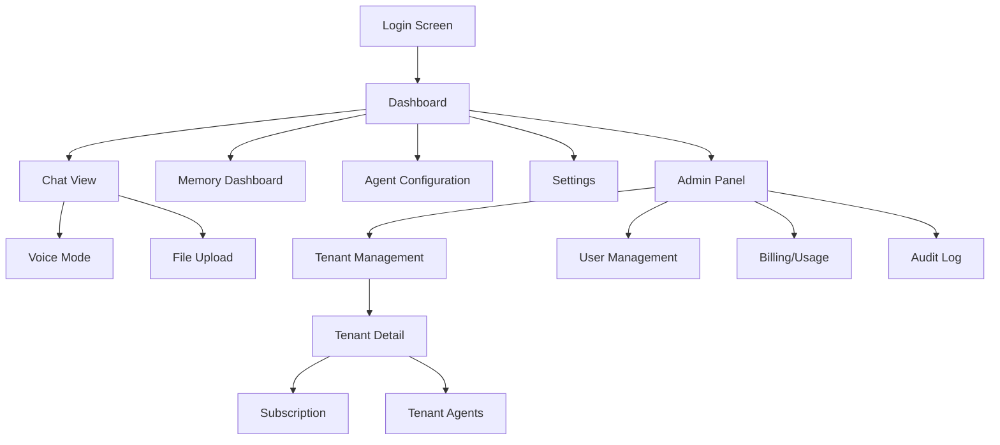

# SomaAgent01 — User Journeys & Screen Flows

**Document ID:** SA01-UX-JOURNEYS-2025-12
**Version:** 1.0
**Created:** 2025-12-24
**Status:** CANONICAL

---

## 1. Overview

This document defines **all major user journeys** for the SomaAgent01 SaaS platform, covering:
- End Users (Tenant Users)
- Tenant Admins
- Platform Super Admins (God Mode)
- API Consumers (A2A, MCP)

---

## 2. Primary User Personas

| Persona | Role | Access Level |
|---------|------|--------------|
| **End User** | Regular user interacting with AI agent | Tenant-scoped |
| **Tenant Admin** | Manages users, agents, settings within tenant | Tenant admin |
| **Platform Admin** | Super admin managing all tenants (God Mode) | Platform-wide |
| **API Consumer** | External system integrating via API | API token |
| **Agent** | AI agent persona executing tasks | System-level |

---

## 3. User Journey: Conversation Flow

### 3.1 Chat with AI Agent

**Actors:** End User, AI Agent, SomaBrain, LLM Provider

```
┌─────────────────────────────────────────────────────────────────┐
│ SCREEN: Chat View                                               │
├─────────────────────────────────────────────────────────────────┤
│ ┌─────────────┐  ┌────────────────────────────────────────────┐ │
│ │ Sidebar     │  │ Chat Panel                                 │ │
│ │             │  │                                            │ │
│ │ [Conv 1]    │  │ Agent: How can I help you today?           │ │
│ │ [Conv 2]    │  │                                            │ │
│ │ [+ New]     │  │ User: Analyze this document for me         │ │
│ │             │  │                                            │ │
│ │             │  │ Agent: [Streaming response...]             │ │
│ │             │  │                                            │ │
│ │             │  ├────────────────────────────────────────────┤ │
│ │             │  │ [📎] Type message...            [🎤] [➤]  │ │
│ └─────────────┘  └────────────────────────────────────────────┘ │
└─────────────────────────────────────────────────────────────────┘
```

**Flow:**
1. User opens Chat View
2. User types message or uses voice input
3. Message → Gateway (Django Ninja) → Kafka → Conversation Worker
4. Worker builds context via SomaBrain `/memory/recall`
5. Worker calls LLM (LiteLLM)
6. Streaming response → SSE → UI
7. Memory stored via SomaBrain `/memory/remember`
8. Agent response displayed with streaming animation

**API Endpoints:**
- `POST /api/v2/chat/messages` - Send message
- `GET /api/v2/chat/conversations` - List conversations
- `POST /api/v2/chat/conversations` - Create new

---

## 4. User Journey: Tenant Onboarding

### 4.1 New Tenant Signup

**Actors:** New User, Platform, Keycloak, Lago Billing

```
┌─────────────────────────────────────────────────────────────────┐
│ SCREEN: Signup                                                  │
├─────────────────────────────────────────────────────────────────┤
│                                                                 │
│           ┌────────────────────────────────┐                    │
│           │  Create Your Account           │                    │
│           │                                │                    │
│           │  [Company Name]                │                    │
│           │  [Email Address]               │                    │
│           │  [Password]                    │                    │
│           │                                │                    │
│           │  [Select Plan: Free/Pro/Ent]   │                    │
│           │                                │                    │
│           │  [Create Account →]            │                    │
│           │                                │                    │
│           │  or [Sign in with Google/SSO]  │                    │
│           └────────────────────────────────┘                    │
│                                                                 │
└─────────────────────────────────────────────────────────────────┘
```

**Flow:**
1. User fills signup form
2. Backend creates Tenant in DB
3. Creates user in Keycloak (SSO)
4. Creates subscription in Lago Billing
5. Creates SpiceDB permission relationships
6. Sends confirmation email
7. Redirects to onboarding wizard

**API Endpoints:**
- `POST /api/v2/saas/tenants` - Create tenant
- `POST /api/v2/saas/tenants/{id}/users` - Create first user
- `POST /api/v2/saas/subscriptions` - Assign subscription

---

## 5. User Journey: Agent Configuration

### 5.1 Create/Configure Agent

**Actors:** Tenant Admin, Agent, SpiceDB

```
┌─────────────────────────────────────────────────────────────────┐
│ SCREEN: Agent Configuration                                    │
├─────────────────────────────────────────────────────────────────┤
│ ┌─────────────────────────────────────────────────────────────┐ │
│ │ Agent: CustomerSupport01                                    │ │
│ ├─────────────────────────────────────────────────────────────┤ │
│ │                                                             │ │
│ │ [General]  [Capabilities]  [Memory]  [Permissions]         │ │
│ │                                                             │ │
│ │ LLM Model: [GPT-4o ▼]                                       │ │
│ │ Temperature: [0.7 ────●──────]                              │ │
│ │ Max Tokens: [4096]                                          │ │
│ │                                                             │ │
│ │ Capabilities:                                               │ │
│ │ ☑ Web Search    ☑ Code Execution                          │ │
│ │ ☐ File Upload   ☑ Memory Access                            │ │
│ │                                                             │ │
│ │ Memory Mode: [Per-Session ▼]                                │ │
│ │                                                             │ │
│ │                               [Cancel] [Save Agent]        │ │
│ └─────────────────────────────────────────────────────────────┘ │
└─────────────────────────────────────────────────────────────────┘
```

**Flow:**
1. Admin opens Agent Configuration
2. Sets LLM model, temperature, capabilities
3. Configures memory mode (session/persistent/shared)
4. Sets permissions via SpiceDB
5. Saves agent config
6. Agent available for conversations

**API Endpoints:**
- `GET /api/v2/agents` - List agents
- `POST /api/v2/agents` - Create agent
- `PUT /api/v2/agents/{id}` - Update agent
- `GET /api/v2/agents/{id}/capabilities` - Get capabilities

---

## 6. User Journey: Memory Dashboard

### 6.1 View & Manage Memories

**Actors:** User, SomaBrain

```
┌─────────────────────────────────────────────────────────────────┐
│ SCREEN: Memory Dashboard                                        │
├─────────────────────────────────────────────────────────────────┤
│ [Search memories...]                    [Filters ▼] [Export]   │
│                                                                 │
│ ┌─────────────────────────────────────────────────────────────┐ │
│ │ Memory Graph Visualization (Interactive)                    │ │
│ │                                                             │ │
│ │     [Node]──────[Node]──────[Node]                         │ │
│ │        │           │           │                            │ │
│ │     [Node]      [Node]      [Node]                         │ │
│ │                                                             │ │
│ └─────────────────────────────────────────────────────────────┘ │
│                                                                 │
│ Recent Memories:                                                │
│ ┌───────────────────────────────────────────────────────────┐  │
│ │ "Project deadline is Dec 31" | Today | [View] [Delete]    │  │
│ │ "Client prefers email contact" | Yesterday | [View]       │  │
│ └───────────────────────────────────────────────────────────┘  │
└─────────────────────────────────────────────────────────────────┘
```

**Flow:**
1. User opens Memory Dashboard
2. Loads memories from SomaBrain `/memory/recall`
3. Displays graph visualization
4. User can search, filter, delete memories
5. Changes sync back to SomaBrain

**API Endpoints:**
- `POST /api/v2/memory/search` - Semantic search
- `GET /api/v2/memory/recent` - Recent memories
- `DELETE /api/v2/memory/{id}` - Delete memory

---

## 7. User Journey: Platform Admin (God Mode)

### 7.1 Tenant Management

**Actors:** Platform Admin (Super Admin)

```
┌─────────────────────────────────────────────────────────────────┐
│ SCREEN: Platform Admin - Tenant Management (GOD MODE)          │
├─────────────────────────────────────────────────────────────────┤
│ [+ Create Tenant]  [Bulk Import]  [Export]                     │
│                                                                 │
│ ┌─────────────────────────────────────────────────────────────┐ │
│ │ Tenant          │ Plan     │ Users │ Agents │ Status       │ │
│ ├─────────────────────────────────────────────────────────────┤ │
│ │ Acme Corp       │ Pro      │ 25    │ 5      │ ✓ Active     │ │
│ │ TechStartup     │ Free     │ 3     │ 1      │ ✓ Active     │ │
│ │ BigEnterprise   │ Ent      │ 500   │ 50     │ ✓ Active     │ │
│ │ OldCompany      │ Pro      │ 10    │ 2      │ ⚠ Suspended  │ │
│ └─────────────────────────────────────────────────────────────┘ │
│                                                                 │
│ Platform Metrics:                                               │
│ Total Tenants: 127 | Total Users: 2,340 | MRR: $45,600         │
└─────────────────────────────────────────────────────────────────┘
```

**Flow:**
1. Admin logs in with super admin credentials
2. Sees platform-wide dashboard
3. Can create/suspend/delete tenants
4. View usage metrics across all tenants
5. Manage billing and subscriptions
6. Access audit logs

**API Endpoints:**
- `GET /api/v2/saas/tenants` - List all tenants
- `POST /api/v2/saas/tenants/{id}/suspend` - Suspend tenant
- `GET /api/v2/saas/usage` - Platform usage

---

## 8. User Journey: Tool Execution

### 8.1 Agent Uses External Tool

**Actors:** Agent, Tool Executor, OPA, External API

```
┌─────────────────────────────────────────────────────────────────┐
│ FLOW: Tool Execution                                            │
├─────────────────────────────────────────────────────────────────┤
│                                                                 │
│  User: "Search the web for AI news"                            │
│           │                                                     │
│           ▼                                                     │
│  ┌─────────────────┐                                           │
│  │ LLM Response:   │                                           │
│  │ tool: web_search│                                           │
│  │ query: "AI news"│                                           │
│  └────────┬────────┘                                           │
│           │                                                     │
│           ▼                                                     │
│  ┌─────────────────┐    ┌─────────────────┐                   │
│  │ Tool Executor   │───▶│ OPA Policy      │                   │
│  │                 │◀───│ Check           │                   │
│  └────────┬────────┘    └─────────────────┘                   │
│           │ (if allowed)                                        │
│           ▼                                                     │
│  ┌─────────────────┐                                           │
│  │ Execute Tool    │───▶ External API (DuckDuckGo)             │
│  │ Return Results  │                                           │
│  └────────┬────────┘                                           │
│           │                                                     │
│           ▼                                                     │
│  Agent: "Here are the latest AI news..."                       │
│                                                                 │
└─────────────────────────────────────────────────────────────────┘
```

**API Endpoints:**
- Kafka topic: `tool.requests`
- Kafka topic: `tool.results`
- `GET /api/v2/tools` - List available tools

---

## 9. User Journey: Voice Interaction

### 9.1 Voice Chat

**Actors:** User, Voice Service, STT, TTS

```
┌─────────────────────────────────────────────────────────────────┐
│ SCREEN: Voice Mode Active                                       │
├─────────────────────────────────────────────────────────────────┤
│                                                                 │
│                    ┌────────────────────┐                      │
│                    │                    │                      │
│                    │   ●  ●  ●  ●  ●    │ ← Audio Visualizer  │
│                    │                    │                      │
│                    └────────────────────┘                      │
│                                                                 │
│              "Please search for Python tutorials"               │
│                                                                 │
│              [🎤 Listening...]  or  [🔊 Speaking...]           │
│                                                                 │
│                    [End Voice Session]                          │
│                                                                 │
└─────────────────────────────────────────────────────────────────┘
```

**Flow:**
1. User clicks voice button
2. Microphone capture starts
3. VAD detects speech
4. Audio → Whisper STT → Text
5. Text → Agent → Response
6. Response → Kokoro TTS → Audio
7. Audio plays to user

**API Endpoints:**
- WebSocket: `/ws/voice`
- `POST /api/v2/voice/transcribe` - STT
- `POST /api/v2/voice/synthesize` - TTS

---

## 10. User Journey: Settings & Configuration

### 10.1 User Settings

```
┌─────────────────────────────────────────────────────────────────┐
│ SCREEN: Settings                                                │
├─────────────────────────────────────────────────────────────────┤
│                                                                 │
│ [General] [Agent] [External] [Connectivity] [System]           │
│                                                                 │
│ ┌─────────────────────────────────────────────────────────────┐ │
│ │ GENERAL SETTINGS                                            │ │
│ │                                                             │ │
│ │ Theme:        [Dark Mode ▼]                                 │ │
│ │ Language:     [English ▼]                                   │ │
│ │ Notifications: ☑ Browser  ☑ Email  ☐ SMS                   │ │
│ │                                                             │ │
│ │ AGENT SETTINGS                                              │ │
│ │                                                             │ │
│ │ Default Agent: [CustomerSupport01 ▼]                        │ │
│ │ Voice Enabled: [On]                                         │ │
│ │ Memory Mode:   [Persistent ▼]                               │ │
│ │                                                             │ │
│ └─────────────────────────────────────────────────────────────┘ │
│                                                                 │
│                               [Cancel] [Save Settings]          │
└─────────────────────────────────────────────────────────────────┘
```

---

## 11. Major Use Cases Summary

| ID | Use Case | Primary Actor | Priority |
|----|----------|---------------|----------|
| UC-01 | Chat with AI Agent | End User | HIGH |
| UC-02 | Create New Conversation | End User | HIGH |
| UC-03 | Upload File to Agent | End User | HIGH |
| UC-04 | Voice Chat | End User | MEDIUM |
| UC-05 | View/Manage Memories | End User | MEDIUM |
| UC-06 | Configure Agent | Tenant Admin | HIGH |
| UC-07 | Manage Users | Tenant Admin | HIGH |
| UC-08 | View Usage/Billing | Tenant Admin | MEDIUM |
| UC-09 | Create Tenant | Platform Admin | HIGH |
| UC-10 | Suspend/Activate Tenant | Platform Admin | HIGH |
| UC-11 | Manage Subscriptions | Platform Admin | HIGH |
| UC-12 | View Platform Metrics | Platform Admin | MEDIUM |
| UC-13 | Execute Tool | Agent (System) | HIGH |
| UC-14 | Store/Recall Memory | Agent (System) | HIGH |
| UC-15 | API Integration | API Consumer | HIGH |

---

## 12. Screen Flow Diagram



---

**Last Updated:** 2025-12-24
**Maintained By:** Development Team
