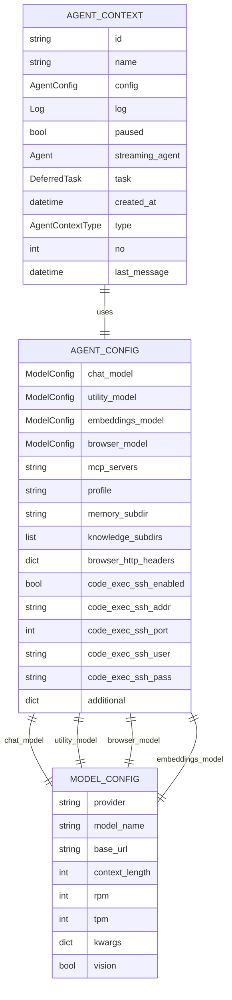
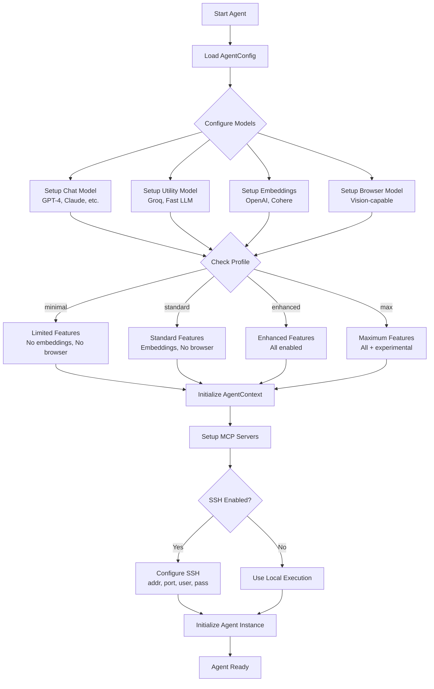
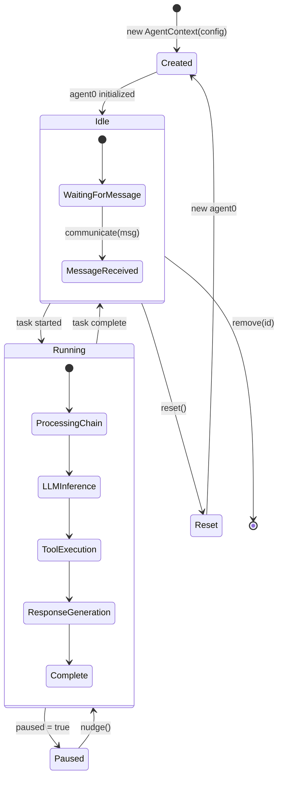
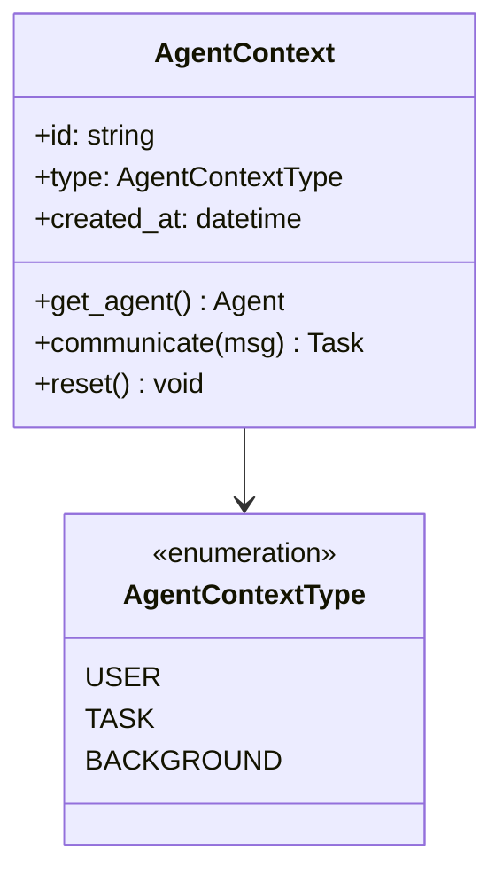
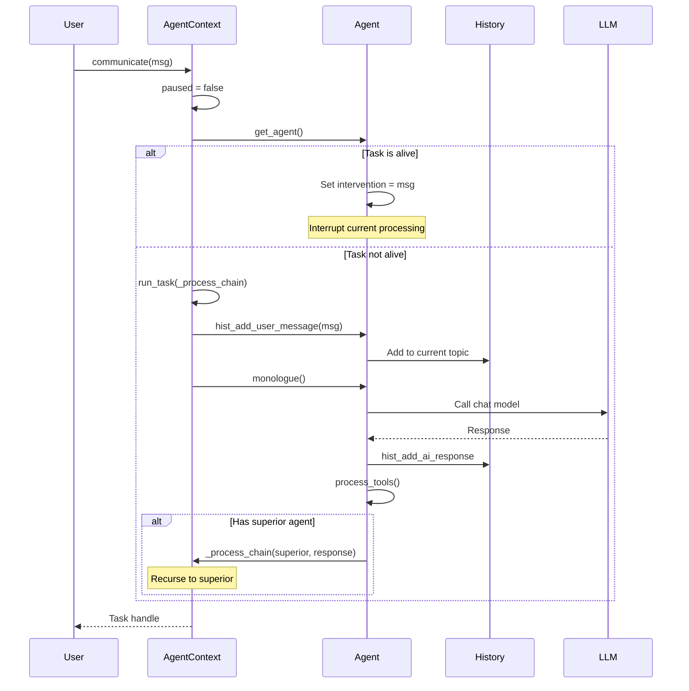

# 🎛️ AGENT BEHAVIOR SETTINGS
## Complete Configuration & Behavior Control

**Based On:** `python/somaagent/agent_context.py` (247 lines)

---

## 1. AGENT CONFIGURATION MODEL

### AgentConfig Data Model



---

## 2. AGENT_CONFIG SETTINGS

### Complete Settings List

```python
@dataclass
class AgentConfig:
    """Core agent configuration."""
    
    # LLM Models (4 model configs)
    chat_model: models.ModelConfig        # Primary conversation model
    utility_model: models.ModelConfig      # Fast tool routing model
    embeddings_model: models.ModelConfig   # Vector embeddings
    browser_model: models.ModelConfig      # Browser automation model
    
    # MCP Configuration
    mcp_servers: str                       # JSON string of MCP servers
    
    # Agent Profile & Identity
    profile: str = ""                      # Agent profile (minimal/standard/enhanced/max)
    memory_subdir: str = ""                # Memory subdirectory
    knowledge_subdirs: list[str] = ["default", "custom"]  # Knowledge bases
    
    # Browser Settings
    browser_http_headers: dict = {}        # Custom HTTP headers
    
    # SSH Code Execution
    code_exec_ssh_enabled: bool = True     # Enable SSH execution
    code_exec_ssh_addr: str = "localhost"  # SSH host
    code_exec_ssh_port: int = 55022        # SSH port
    code_exec_ssh_user: str = "root"       # SSH username
    code_exec_ssh_pass: str = ""           # SSH password (Vault)
    
    # Additional Config
    additional: dict = {}                  # Extra settings
```

---

## 3. AGENT BEHAVIOR FLOW

### Behavior Configuration Flow



---

## 4. AGENT CONTEXT LIFECYCLE

### Context State Machine



---

## 5. AGENT CONTEXT TYPE

### Context Type Enum



**Context Types:**
- **USER**: Interactive user session (most common)
- **TASK**: Background task execution
- **BACKGROUND**: Long-running background processes

---

## 6. BEHAVIOR SETTINGS BY PROFILE

### Profile Feature Matrix

| Feature | Minimal | Standard | Enhanced | Max |
|---------|---------|----------|----------|-----|
| **Chat Model** | ✅ | ✅ | ✅ | ✅ |
| **Utility Model** | ✅ | ✅ | ✅ | ✅ |
| **Embeddings** | ❌ | ✅ | ✅ | ✅ |
| **Browser** | ❌ | ❌ | ✅ | ✅ |
| **MCP Client** | ❌ | ✅ | ✅ | ✅ |
| **MCP Server** | ❌ | ❌ | ✅ | ✅ |
| **Vision Support** | ❌ | ✅ | ✅ | ✅ |
| **Audio Support** | ❌ | ❌ | ✅ | ✅ |
| **Code Execution** | ✅ | ✅ | ✅ | ✅ |
| **SSH Execution** | ❌ | ✅ | ✅ | ✅ |
| **Semantic Recall** | ❌ | ✅ | ✅ | ✅ |
| **Content Masking** | ❌ | ✅ | ✅ | ✅ |
| **Tool Sandboxing** | ❌ | ❌ | ✅ | ✅ |
| **Learning Context** | ❌ | ❌ | ✅ | ✅ |
| **Delegation** | ❌ | ❌ | ✅ | ✅ |

**Set via:** `SA01_FEATURE_PROFILE=enhanced`

---

## 7. MESSAGE PROCESSING BEHAVIOR

### User Message Flow



---

## 8. CRITICAL BEHAVIOR SETTINGS

### Must-Configure Settings

```python
# 1. Chat Model (REQUIRED)
config.chat_model = ModelConfig(
    provider="openai",
    model_name="gpt-4-turbo",
    base_url="https://api.openai.com/v1",
    context_length=128000,
    rpm=60,           # Rate limiting
    tpm=90000,        # Token rate limiting
    kwargs={          # Model-specific params
        "temperature": 0.7,
        "top_p": 0.9
    },
    vision=True       # Enable vision capabilities
)

# 2. SSH Code Execution (if remote)
config.code_exec_ssh_enabled = True
config.code_exec_ssh_addr = "production-host"
config.code_exec_ssh_port = 22
config.code_exec_ssh_user = "agent"
config.code_exec_ssh_pass = get_vault_secret("ssh_password")

# 3. MCP Servers (if using MCP)
config.mcp_servers = json.dumps({
    "servers": {
        "filesystem": {
            "command": "npx",
            "args": ["-y", "@modelcontextprotocol/server-filesystem", "/workspace"]
        }
    }
})

# 4. Knowledge Subdirs (for knowledge base)
config.knowledge_subdirs = ["default", "product-docs", "api-specs"]

# 5. Profile (feature set)
config.profile = "enhanced"  # minimal|standard|enhanced|max
```

---

## 9. RUNTIME BEHAVIOR CONTROL

### Context Management API

```python
# Create new context
context = AgentContext(
    config=agent_config,
    id="user-session-123",
    name="Production Agent",
    type=AgentContextType.USER
)

# Get context by ID
context = AgentContext.get("user-session-123")

# Get first context
context = AgentContext.first()

# Get all contexts
all_contexts = AgentContext.all()

# Send message
task = context.communicate(
    UserMessage(
        message="Deploy to production",
        attachments=["deployment-config.yaml"]
    ),
    broadcast_level=1  # Interrupt depth
)

# Pause execution
context.paused = True

# Resume (nudge)
context.nudge()

# Reset agent state
context.reset()

# Remove context
AgentContext.remove("user-session-123")
```

---

## 10. BEHAVIOR CUSTOMIZATION EXAMPLES

### Example 1: Conservative Agent

```python
config = AgentConfig(
    profile="minimal",
    chat_model=ModelConfig(
        provider="anthropic",
        model_name="claude-3-haiku",  # Fast, cheap
        rpm=100,
        tpm=150000,
        kwargs={"temperature": 0.3}   # Low creativity
    ),
    code_exec_ssh_enabled=False,     # No remote execution
    knowledge_subdirs=["safe-docs"]  # Limited knowledge
)
```

### Example 2: Research Agent

```python
config = AgentConfig(
    profile="enhanced",
    chat_model=ModelConfig(
        provider="openai",
        model_name="gpt-4-turbo",
        vision=True,
        kwargs={"temperature": 0.9}   # High creativity
    ),
    browser_model=ModelConfig(
        provider="openai",
        model_name="gpt-4o",          # Vision for web
        vision=True
    ),
    knowledge_subdirs=["research", "papers", "datasets"],
    browser_http_headers={
        "User-Agent": "ResearchBot/1.0"
    }
)
```

### Example 3: Production Automation Agent

```python
config = AgentConfig(
    profile="max",
    chat_model=ModelConfig(
        provider="openai",
        model_name="gpt-4-turbo",
        rpm=120,                      # High throughput
        tpm=200000
    ),
    code_exec_ssh_enabled=True,
    code_exec_ssh_addr="prod-runner.company.com",
    code_exec_ssh_port=22,
    knowledge_subdirs=["runbooks", "api-docs"],
    mcp_servers=json.dumps({
        "servers": {
            "kubernetes": {"command": "kubectl-mcp"},
            "terraform": {"command": "tf-mcp"}
        }
    })
)
```

---

## 11. UI INTEGRATION

### Settings UI Component

```html
<div x-data="agentBehaviorSettings()">
  <!-- Profile Selection -->
  <select x-model="profile">
    <option value="minimal">Minimal</option>
    <option value="standard">Standard</option>
    <option value="enhanced">Enhanced</option>
    <option value="max">Maximum</option>
  </select>
  
  <!-- Chat Model Config -->
  <div class="model-config">
    <h4>Chat Model</h4>
    <input x-model="chatModel.provider" placeholder="Provider">
    <input x-model="chatModel.model_name" placeholder="Model Name">
    <input type="number" x-model="chatModel.rpm" placeholder="RPM">
    <input type="number" x-model="chatModel.tpm" placeholder="TPM">
  </div>
  
  <!-- SSH Config -->
  <div class="ssh-config" x-show="profile !== 'minimal'">
    <label>
      <input type="checkbox" x-model="sshEnabled"> Enable SSH
    </label>
    <input x-show="sshEnabled" x-model="sshAddr" placeholder="SSH Host">
    <input x-show="sshEnabled" type="number" x-model="sshPort" placeholder="Port">
  </div>
  
  <button @click="saveConfig()">Save Configuration</button>
</div>
```

---

## SUMMARY

**AgentConfig Controls:**
- ✅ 4 LLM Model Configurations
- ✅ Profile-based Feature Selection
- ✅ SSH Remote Execution
- ✅ MCP Server Integration
- ✅ Knowledge Base Selection
- ✅ Browser Behavior
- ✅ Additional Custom Settings

**All behavior flows through AgentContext!** 🎯
