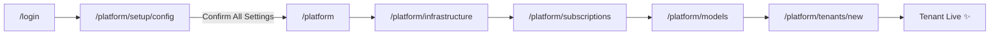

# SaaS Admin Journey — Complete Visual Architecture

**Document:** SAAS-ADMIN-VISUAL-ARCHITECTURE.md  
**Version:** 2.0.0  
**Date:** 2026-01-05  
**Source:** SRS-MASTER-INDEX.md, SRS-EOG-SCREEN-FLOWS.md

---

## 1. Authoritative Screen Registry (70 Screens)

### 1.1 Platform Admin (33 Screens)

| Route | Component | Priority | Status |
|-------|-----------|----------|--------|
| `/platform/setup/config` | system-config-wizard.ts | P0 | ❌ |
| `/platform` | platform-dashboard.ts | P0 | ✅ |
| `/platform/tenants` | tenant-list.ts | P0 | ✅ |
| `/platform/tenants/:id` | tenant-detail.ts | P0 | ✅ |
| `/platform/tenants/new` | tenant-wizard.ts | P0 | ⚠️ |
| `/platform/tenants/:id/users` | tenant-users.ts | P1 | ❌ |
| `/platform/tenants/:id/actions` | tenant-lifecycle.ts | P1 | ❌ |
| `/platform/subscriptions` | tier-list.ts | P0 | ✅ |
| `/platform/subscriptions/:id` | tier-builder.ts | P0 | ⚠️ |
| `/platform/subscriptions/:id/quotas` | tier-quotas.ts | P1 | ❌ |
| `/platform/billing` | platform-billing.ts | P1 | ⚠️ |
| `/platform/permissions` | permission-browser.ts | P0 | ⚠️ |
| `/platform/roles` | role-list.ts | P1 | ✅ |
| `/platform/roles/create` | role-builder.ts | P1 | ❌ |
| `/platform/features` | feature-catalog.ts | P1 | ❌ |
| `/platform/models` | model-catalog.ts | P1 | ❌ |
| `/platform/tools` | tool-catalog.ts | P2 | ❌ |
| `/platform/marketplace` | marketplace.ts | P2 | ❌ |
| `/platform/audit` | platform-audit.ts | P1 | ⚠️ |
| `/platform/infrastructure` | infra-dashboard.ts | P0 | ❌ |
| `/platform/infrastructure/database` | database-admin.ts | P1 | ❌ |
| `/platform/infrastructure/redis` | redis-admin.ts | P0 | ❌ |
| `/platform/infrastructure/redis/ratelimits` | ratelimit-editor.ts | P0 | ❌ |
| `/platform/infrastructure/temporal` | temporal-admin.ts | P1 | ❌ |
| `/platform/infrastructure/qdrant` | qdrant-admin.ts | P1 | ❌ |
| `/platform/infrastructure/auth` | keycloak-admin.ts | P1 | ❌ |
| `/platform/infrastructure/billing` | lago-admin.ts | P1 | ❌ |
| `/platform/infrastructure/somabrain` | somabrain-admin.ts | P1 | ❌ |
| `/platform/infrastructure/voice` | voice-admin.ts | P1 | ❌ |
| `/platform/infrastructure/mcp` | mcp-registry.ts | P1 | ❌ |
| `/platform/infrastructure/storage` | storage-admin.ts | P2 | ❌ |
| `/platform/infrastructure/email` | email-admin.ts | P2 | ❌ |
| `/platform/metrics` | platform-metrics.ts | P0 | ❌ |

### 1.2 Tenant Admin (20 Screens)

| Route | Component | Priority | Status |
|-------|-----------|----------|--------|
| `/admin` | tenant-dashboard.ts | P0 | ✅ |
| `/admin/users` | user-list.ts | P0 | ✅ |
| `/admin/users/:id` | user-detail.ts | P0 | ⚠️ |
| `/admin/users/invite` | user-invite.ts | P1 | ❌ |
| `/admin/agents` | agent-list.ts | P0 | ✅ |
| `/admin/agents/:id` | agent-detail.ts | P0 | ⚠️ |
| `/admin/agents/new` | agent-create.ts | P0 | ⚠️ |
| `/admin/usage` | usage-analytics.ts | P0 | ✅ |
| `/admin/billing` | tenant-billing.ts | P1 | ⚠️ |
| `/admin/settings` | tenant-settings.ts | P1 | ⚠️ |
| `/admin/settings/api-keys` | api-keys.ts | P1 | ⚠️ |
| `/admin/settings/integrations` | integrations.ts | P2 | ❌ |
| `/admin/settings/roles` | tenant-roles.ts | P2 | ❌ |
| `/admin/settings/data` | data-management.ts | P1 | ❌ |
| `/admin/audit` | tenant-audit.ts | P1 | ✅ |
| `/admin/metrics` | tenant-metrics.ts | P0 | ❌ |
| `/admin/metrics/agents` | agent-metrics.ts | P1 | ❌ |
| `/admin/profile` | user-profile.ts | P2 | ❌ |

### 1.3 Agent Owner (12 Screens)

| Route | Component | Priority | Status |
|-------|-----------|----------|--------|
| `/chat` | chat-view.ts | P0 | ✅ |
| `/chat/:conversationId` | chat-view.ts | P0 | ✅ |
| `/memory` | memory-browser.ts | P0 | ✅ |
| `/memory/:id` | memory-detail.ts | P1 | ⚠️ |
| `/settings` | agent-settings.ts | P0 | ✅ |
| `/settings/models` | model-settings.ts | P0 | ❌ |
| `/settings/memory` | memory-settings.ts | P1 | ⚠️ |
| `/settings/voice` | voice-settings.ts | P1 | ⚠️ |
| `/settings/tools` | tool-settings.ts | P1 | ⚠️ |
| `/settings/multimodal` | multimodal-settings.ts | P1 | ❌ |
| `/profile` | user-profile.ts | P1 | ⚠️ |

### 1.4 Specialized Modes (6 Screens)

| Route | Component | Priority | Status |
|-------|-----------|----------|--------|
| `/dev/console` | debug-console.ts | P1 | ⚠️ |
| `/dev/mcp` | mcp-inspector.ts | P1 | ⚠️ |
| `/dev/logs` | log-viewer.ts | P2 | ❌ |
| `/dev/metrics` | dev-metrics.ts | P1 | ❌ |
| `/trn/cognitive` | cognitive-panel.ts | P1 | ⚠️ |
| `/trn/memory` | memory-trainer.ts | P2 | ❌ |

---

## 2. Day 0 Journey Flow

> **CRITICAL UPDATE:** Step B is now the MANDATORY System Configuration Check. All infrastructure settings must be validated before accessing the dashboard.



---

## 3. Reusable Lit Components (20)

| Component | Purpose | Events |
|-----------|---------|--------|
| `saas-sidebar` | Navigation | navigate |
| `saas-header` | Top bar | action-click |
| `saas-stats-card` | Metric card | click |
| `saas-data-table` | Paginated table | page-change, row-click, sort |
| `saas-modal` | Dialog | close, confirm |
| `saas-form-field` | Input wrapper | - |
| `saas-toggle` | Boolean switch | change |
| `saas-badge` | Status badge | - |
| `saas-avatar` | User avatar | click |
| `saas-toast` | Notification | dismiss, action |
| `saas-empty-state` | Empty data | action-click |
| `saas-permission-guard` | Permission gate | - |
| `saas-quota-bar` | Usage bar | - |
| `saas-breadcrumb` | Navigation | navigate |
| `saas-impersonation-banner` | Impersonation | end |
| `saas-confirm-dialog` | Confirmation | confirm, cancel |
| `saas-skeleton` | Loading state | - |
| `saas-search-input` | Search field | search |
| `saas-filter-bar` | Filters | change |
| `saas-tabs` | Tab navigation | tab-change |

---

## 4. CSS Design Tokens (Canonical from tokens.css)

```css
/* Backgrounds - Light Theme */
--saas-bg-page: #f5f5f5;
--saas-bg-card: #ffffff;
--saas-bg-hover: #fafafa;

/* Text - Light Theme */
--saas-text-primary: #1a1a1a;
--saas-text-secondary: #666666;
--saas-text-muted: #999999;

/* Accent - Primary Action (Light Theme) */
--saas-accent: #1a1a1a;  /* Black in light mode */

/* Borders */
--saas-border-light: #e0e0e0;

/* Status Colors */
--saas-status-success: #22c55e;
--saas-status-warning: #f59e0b;
--saas-status-danger: #ef4444;
--saas-status-info: #3b82f6;

/* Typography */
--saas-font-sans: -apple-system, BlinkMacSystemFont, 'Segoe UI', Roboto, sans-serif;

/* Role Accent Colors (SomaStack Theme) */
[data-role="platform"] { --soma-accent: #94a3b8; }  /* Slate */
[data-role="tenant"]   { --saas-accent: #1a1a1a; }
[data-role="agent"]    { --saas-accent: #1a1a1a; }
```

> **Source:** [tokens.css](file:///Users/macbookpro201916i964gb1tb/Documents/GitHub/somaAgent01/webui/src/styles/tokens.css)

---

## 5. Implementation Stats

| Category | Count |
|----------|-------|
| **Total Screens** | 70 |
| Platform Admin | 32 |
| Tenant Admin | 20 |
| Agent Owner | 12 |
| Specialized | 6 |
| **Status** | |
| Implemented (✅) | 12 |
| Partial (⚠️) | 20 |
| Missing (❌) | 38 |
| **Components** | 20 |
| **CSS Properties** | 35 |
| **Permissions** | 78 |
| **API Endpoints** | ~60 |

---

## 6. Priority Matrix

| Priority | Screens | Focus |
|----------|---------|-------|
| **P0** | 18 | Core functionality |
| **P1** | 28 | Extended features |
| **P2** | 24 | Advanced features |

**Source Documents:**
- [SRS-MASTER-INDEX.md](file:///Users/macbookpro201916i964gb1tb/Documents/GitHub/somaAgent01/docs/srs/SRS-MASTER-INDEX.md)
- [SRS-EOG-SCREEN-FLOWS.md](file:///Users/macbookpro201916i964gb1tb/Documents/GitHub/somaAgent01/docs/srs/SRS-EOG-SCREEN-FLOWS.md)
