# 🔄 SomaAgent01 COMPLETE Chat Architecture - ULTRA DETAILED

**Date**: 2026-01-14 | **Version**: 3.0 - Step-by-Step Integration

---

## 🎯 MEGA FLOWCHART: Everything From User Input to Response

```mermaid
flowchart TB
    subgraph ENTRY["🚪 1. ENTRY POINT"]
        USER[("👤 User<br/>Sends Message")]
        WS["/ws/chat/{session_id}/<br/>WebSocket"]
        REST["/api/chat/<br/>REST API"]
    end

    subgraph AUTH["🔐 2. AUTHENTICATION (Keycloak)"]
        JWT["JWT Token<br/>from Cookie/Header"]
        KC_VERIFY["Keycloak OIDC<br/>verify_token()"]
        SESSION_CREATE["SessionManager<br/>create_session()"]
        REDIS_SESSION[("Redis<br/>Session Cache")]
    end

    subgraph AUTHZ["🛡️ 3. AUTHORIZATION (SpiceDB)"]
        SPICE_CLIENT["SpiceDBClient<br/>check_permission()"]
        PERM_CHECK{"user:X can<br/>chat on agent:Y?"}
        FAIL_CLOSED["DENY if SpiceDB<br/>unavailable"]
    end

    subgraph CAPSULE["📦 4. CAPSULE INJECTION"]
        CAP_LOAD["Load Capsule<br/>from PostgreSQL"]
        CAP_VERIFY["verify_capsule()<br/>Signature Check"]
        CONST_BIND["Validate<br/>constitution_ref"]
        INJECTED["InjectedCapsule<br/>soul + body"]
    end

    subgraph STORE_USER["💾 5. STORE USER MESSAGE"]
        MSG_CREATE["MessageModel.create()<br/>role='user'"]
        CONV_UPDATE["Conversation<br/>message_count++"]
        TOKENS_IN["CHAT_TOKENS<br/>.labels('input')"]
    end

    subgraph SETTINGS["⚙️ 6. LOAD SETTINGS"]
        DEFAULTS["get_default_settings()<br/>Agent + Tenant"]
        PROVIDER["chat_model_provider<br/>'openrouter'"]
        MODEL["chat_model_name<br/>'anthropic/claude-3.5'"]
        CTX_LEN["chat_model_ctx_length<br/>128000"]
    end

    subgraph GOVERNOR["⚖️ 7. SIMPLE GOVERNOR"]
        TURN_CTX["LaneBudget + HealthStatus<br/>━━━━━━━━━━━━━━━━━<br/>max_tokens, is_degraded"]
        HEALTH_CHK["HealthMonitor<br/>.get_overall_health()"]
        BUDGET_ALLOC["allocate_budget()<br/>━━━━━━━━━━━━━━━━━<br/>Normal: system=15%, history=25%,<br/>memory=25%, tools=20%, buffer=5%<br/>Degraded: system=40%, history=10%,<br/>memory=15%, tools=0%, buffer=35%"]
        DECISION["GovernorDecision<br/>lane_budget + health_status + mode"]
    end

    subgraph CONTEXT["🧠 8. CONTEXT BUILDING"]
        CTX_INIT["ContextBuilder()<br/>somabrain, metrics"]
        HEALTH_CHK["_current_health()<br/>NORMAL/DEGRADED/DOWN"]
        HISTORY_LOAD["Load history<br/>last 20 messages"]
        SNIPPET_RETRIEVE["_retrieve_snippets()<br/>SomaBrain.context_evaluate()"]
        RANK_CLIP["_rank_and_clip_snippets()<br/>by salience"]
        REDACT["RealPresidioRedactor<br/>.redact() PII"]
        BUILD_MSGS["Build messages[]<br/>SystemMessage+HumanMessage"]
        BUILT_CTX["BuiltContext<br/>messages, token_counts"]
    end

    subgraph LLM["🤖 9. LLM INVOCATION"]
        LLM_INIT["get_chat_model()<br/>provider, name"]
        VAULT_KEY["Vault<br/>get_provider_key()"]
        LC_MSGS["Convert to<br/>LangChain Messages"]
        STREAM_CALL["llm._astream()<br/>messages"]
    end

    subgraph STREAMING["📡 10. TOKEN STREAMING"]
        TOKEN_LOOP["async for chunk<br/>in response"]
        EXTRACT_TOKEN["Extract token<br/>from chunk"]
        YIELD_TOKEN["yield token<br/>→ WebSocket"]
        COLLECT["response_content<br/>.append(token)"]
    end

    subgraph CONFIDENCE["📊 11. CONFIDENCE SCORING"]
        CONF_CONFIG["get_confidence_config()"]
        CALC_CONF["calculate_confidence_safe()<br/>logprobs"]
        EWMA["ConfidenceEWMA<br/>.update(score)"]
        RECORD_CONF["record_confidence()<br/>provider, model"]
    end

    subgraph RECEIPT["📝 12. RUN RECEIPT"]
        CREATE_REC["create_receipt_from_decision()<br/>decision, turn_context"]
        RECORD_REC["record_receipt_persisted()<br/>tenant_id"]
        LANE_ACTUAL["record_lane_actual()<br/>actual vs budget"]
        AIQ_OBS["record_aiq_observed()<br/>observed score"]
    end

    subgraph STORE_RESP["💾 13. STORE RESPONSE"]
        MSG_ASSIST["MessageModel.create()<br/>role='assistant'"]
        TOKENS_OUT["CHAT_TOKENS<br/>.labels('output')"]
        LATENCY["CHAT_LATENCY<br/>.observe()"]
    end

    subgraph MEMORY["🧠 14. MEMORY STORAGE"]
        STORE_TASK["asyncio.create_task()<br/>non-blocking"]
        STORE_INT["store_interaction()<br/>user + assistant"]
        SFM_STORE["SomaFractalMemory<br/>embed + store"]
    end

    subgraph COMPLETE["✅ 15. COMPLETE"]
        DONE["chat.done<br/>→ WebSocket"]
    end

    %% Flow connections
    USER --> WS & REST
    WS & REST --> JWT
    JWT --> KC_VERIFY
    KC_VERIFY --> SESSION_CREATE
    SESSION_CREATE --> REDIS_SESSION
    
    REDIS_SESSION --> SPICE_CLIENT
    SPICE_CLIENT --> PERM_CHECK
    PERM_CHECK -->|ALLOW| CAP_LOAD
    PERM_CHECK -->|DENY| FAIL_CLOSED
    
    CAP_LOAD --> CAP_VERIFY
    CAP_VERIFY --> CONST_BIND
    CONST_BIND --> INJECTED
    
    INJECTED --> MSG_CREATE
    MSG_CREATE --> CONV_UPDATE
    CONV_UPDATE --> TOKENS_IN
    
    TOKENS_IN --> DEFAULTS
    DEFAULTS --> PROVIDER & MODEL & CTX_LEN
    
    CTX_LEN --> TURN_CTX
    TURN_CTX --> GOV_CALL
    GOV_CALL --> DEG_STATUS
    DEG_STATUS --> LANE_ALLOC
    LANE_ALLOC --> AIQ_CALC
    AIQ_CALC --> PATH_MODE
    PATH_MODE --> GOV_DECISION
    
    GOV_DECISION --> CTX_INIT
    CTX_INIT --> HEALTH_CHK
    HEALTH_CHK --> HISTORY_LOAD
    HISTORY_LOAD --> SNIPPET_RETRIEVE
    SNIPPET_RETRIEVE --> RANK_CLIP
    RANK_CLIP --> REDACT
    REDACT --> BUILD_MSGS
    BUILD_MSGS --> BUILT_CTX
    
    BUILT_CTX --> LLM_INIT
    LLM_INIT --> VAULT_KEY
    VAULT_KEY --> LC_MSGS
    LC_MSGS --> STREAM_CALL
    
    STREAM_CALL --> TOKEN_LOOP
    TOKEN_LOOP --> EXTRACT_TOKEN
    EXTRACT_TOKEN --> YIELD_TOKEN
    YIELD_TOKEN --> COLLECT
    COLLECT --> TOKEN_LOOP
    TOKEN_LOOP -->|done| CONF_CONFIG
    
    CONF_CONFIG --> CALC_CONF
    CALC_CONF --> EWMA
    EWMA --> RECORD_CONF
    
    RECORD_CONF --> CREATE_REC
    CREATE_REC --> RECORD_REC
    RECORD_REC --> LANE_ACTUAL
    LANE_ACTUAL --> AIQ_OBS
    
    AIQ_OBS --> MSG_ASSIST
    MSG_ASSIST --> TOKENS_OUT
    TOKENS_OUT --> LATENCY
    
    LATENCY --> STORE_TASK
    STORE_TASK --> STORE_INT
    STORE_INT --> SFM_STORE
    
    SFM_STORE --> DONE
```

---

## ⚖️ DETAILED: SimpleGovernor Token Budgeting

```mermaid
flowchart TB
    subgraph INPUT["📥 INPUTS"]
        TC["TurnContext<br/>━━━━━━━━━━━━<br/>turn_id: uuid<br/>session_id: uuid<br/>tenant_id: uuid<br/>user_message: str<br/>history: list[dict]<br/>system_prompt: str<br/>available_tools: list<br/>memory_snippets: list"]
        MT["max_tokens<br/>━━━━━━━━━━━━<br/>e.g. 128000<br/>(from ctx_length)"]
    end

    subgraph DEG["🚨 DEGRADATION CHECK"]
        DEG_MON["DegradationMonitor<br/>.get_degradation_status()"]
        COMP_HEALTH["Check all components:<br/>• somabrain<br/>• database<br/>• kafka<br/>• redis<br/>• temporal<br/>• llm"]
        DEG_LEVEL{"overall_level?"}
        L_NONE["NONE<br/>All healthy"]
        L_MINOR["MINOR<br/>Slight issues"]
        L_MOD["MODERATE<br/>Some down"]
        L_SEVERE["SEVERE<br/>Major issues"]
        L_CRIT["CRITICAL<br/>Emergency"]
    end

    subgraph LANES["📊 6-LANE TOKEN ALLOCATION"]
        ALLOC["LaneAllocator.allocate()<br/>━━━━━━━━━━━━━━━━━"]
        
        subgraph NORMAL["NONE/MINOR Ratios"]
            R_SYS["system_policy: 15%"]
            R_HIST["history: 25%"]
            R_MEM["memory: 25%"]
            R_TOOL["tools: 20%"]
            R_RES["tool_results: 10%"]
            R_BUF["buffer: 5%"]
        end
        
        subgraph DEGRADED["MODERATE Ratios"]
            D_SYS["system_policy: 25%"]
            D_HIST["history: 10%"]
            D_MEM["memory: 15%"]
            D_TOOL["tools: 5%"]
            D_RES["tool_results: 5%"]
            D_BUF["buffer: 15%"]
        end
        
        subgraph SEVERE_R["SEVERE/CRITICAL"]
            S_SYS["system_policy: 70%"]
            S_BUF["buffer: 30%"]
            S_REST["others: 0%"]
        end
        
        BOUNDS["Apply LaneBounds<br/>━━━━━━━━━━━━━━━━━<br/>system: 100-2000<br/>history: 0-4000<br/>memory: 0-2000<br/>tools: 0-1500<br/>results: 0-1000<br/>buffer: 200-500"]
        
        LANE_PLAN["LanePlan<br/>━━━━━━━━━━━━━━━━━<br/>system_policy: 500<br/>history: 1000<br/>memory: 800<br/>tools: 600<br/>tool_results: 400<br/>buffer: 300<br/>━━━━━━━━━━━━━━━━━<br/>total: 3600"]
    end

    subgraph AIQ["📈 AIQ SCORE CALCULATION"]
        CALC["AIQCalculator.compute_predicted()"]
        
        subgraph CQ["Context Quality (40%)"]
            CQ_BASE["Base: 50"]
            CQ_MEM["+ Memory snippets<br/>(avg_score × 30)"]
            CQ_HIST["+ History depth<br/>(log2 × 5, max 15)"]
            CQ_SYS["+ System prompt<br/>(+5 if present)"]
        end
        
        subgraph TR["Tool Relevance (30%)"]
            TR_BASE["Base: 50"]
            TR_COUNT["+ Tool count<br/>(×5, max 30)"]
            TR_BUDGET["+ Tool budget<br/>(+10-20)"]
        end
        
        subgraph BE["Budget Efficiency (30%)"]
            BE_LEVEL["By degradation:<br/>NONE: 100<br/>MINOR: 80<br/>MODERATE: 60<br/>SEVERE: 30<br/>CRITICAL: 10"]
            BE_BUFFER["+ Buffer bonus<br/>(+5-10)"]
        end
        
        AIQ_SCORE["AIQ Score<br/>━━━━━━━━━━━━<br/>predicted: 72.5<br/>components: {...}"]
    end

    subgraph PATH["🎯 PATH DETERMINATION"]
        THRESH["Thresholds:<br/>L1: 0.7<br/>L2: 0.5<br/>L3: 0.3<br/>L4: 0.1"]
        
        P_FAST["FAST PATH<br/>AIQ > 0.7<br/>tool_k = 5"]
        P_L1["L1 DEGRADED<br/>0.5-0.7<br/>tool_k = 3"]
        P_L2["L2 DEGRADED<br/>0.3-0.5<br/>tool_k = 1"]
        P_RESCUE["RESCUE PATH<br/>< 0.3<br/>tool_k = 0"]
    end

    subgraph OUTPUT["📤 OUTPUT"]
        DECISION["GovernorDecision<br/>━━━━━━━━━━━━━━━━━<br/>lane_plan: LanePlan<br/>aiq_score: AIQScore<br/>degradation_level<br/>path_mode: FAST<br/>tool_k: 5<br/>allowed_tools: [...]<br/>latency_ms: 3.2"]
    end

    TC --> DEG_MON
    MT --> DEG_MON
    DEG_MON --> COMP_HEALTH
    COMP_HEALTH --> DEG_LEVEL
    DEG_LEVEL --> L_NONE & L_MINOR & L_MOD & L_SEVERE & L_CRIT
    
    L_NONE & L_MINOR --> NORMAL
    L_MOD --> DEGRADED
    L_SEVERE & L_CRIT --> SEVERE_R
    
    NORMAL & DEGRADED & SEVERE_R --> ALLOC
    ALLOC --> BOUNDS
    BOUNDS --> LANE_PLAN
    
    LANE_PLAN --> CALC
    CALC --> CQ & TR & BE
    CQ & TR & BE --> AIQ_SCORE
    
    AIQ_SCORE --> THRESH
    THRESH --> P_FAST & P_L1 & P_L2 & P_RESCUE
    P_FAST & P_L1 & P_L2 & P_RESCUE --> DECISION
```

---

## 🧠 DETAILED: Context Building with Memory

```mermaid
flowchart TB
    subgraph INPUT["📥 INPUTS"]
        TURN["turn: dict<br/>━━━━━━━━━━━━<br/>tenant_id<br/>session_id<br/>user_message<br/>history: [...]<br/>system_prompt"]
        LP["lane_plan<br/>━━━━━━━━━━━━<br/>system: 500<br/>history: 1000<br/>memory: 800<br/>..."]
    end

    subgraph HEALTH["🏥 HEALTH CHECK"]
        H_CHECK["_current_health()"]
        H_BREAKER["SOMABRAIN_BREAKER<br/>AsyncCircuitBreaker"]
        H_STATE{"Health State?"}
        H_NORMAL["NORMAL<br/>top_k = 8"]
        H_DEGRADED["DEGRADED<br/>top_k = 3"]
        H_DOWN["DOWN<br/>skip retrieval"]
    end

    subgraph RETRIEVE["🔍 MEMORY RETRIEVAL"]
        EVAL_CALL["somabrain.context_evaluate()<br/>━━━━━━━━━━━━━━━━━━<br/>query: user_message<br/>top_k: 8<br/>tenant_id: tenant<br/>session_id: session"]
        MILVUS["SomaFractalMemory<br/>Vector Similarity"]
        SNIPPETS["Memory Snippets<br/>━━━━━━━━━━━━━━━━━━<br/>[{score: 0.92,<br/>  content: '...',<br/>  metadata: {...}},<br/> {...}, ...]"]
    end

    subgraph PROCESS["⚙️ SNIPPET PROCESSING"]
        RANK["_rank_and_clip_snippets()"]
        SALIENCE["_apply_salience()<br/>━━━━━━━━━━━━━━━━━━<br/>time_decay = 0.95^hours<br/>recency_boost<br/>interaction_weight"]
        CLIP["Clip to lane budget<br/>memory: 800 tokens"]
        SCORED["Scored Snippets<br/>sorted by final_score"]
    end

    subgraph REDACT["🔒 PII REDACTION"]
        PRESIDIO["RealPresidioRedactor"]
        ANALYZER["AnalyzerEngine<br/>━━━━━━━━━━━━━━━━━━<br/>PHONE_NUMBER<br/>EMAIL_ADDRESS<br/>IBAN<br/>CREDIT_CARD<br/>US_SSN"]
        ANONYMIZER["AnonymizerEngine<br/>replace with [REDACTED]"]
        CLEAN["Redacted Text"]
    end

    subgraph BUILD["🏗️ MESSAGE BUILDING"]
        SYS_MSG["SystemMessage<br/>━━━━━━━━━━━━━━━━━━<br/>system_prompt +<br/>multimodal_instructions"]
        
        MEM_MSG["Memory Context<br/>━━━━━━━━━━━━━━━━━━<br/>'Relevant context:<br/> - snippet 1<br/> - snippet 2...'"]
        
        HIST_MSG["History Messages<br/>━━━━━━━━━━━━━━━━━━<br/>HumanMessage(...)×N<br/>AIMessage(...)×N"]
        
        USER_MSG["HumanMessage<br/>━━━━━━━━━━━━━━━━━━<br/>current user_message"]
        
        MESSAGES["Final messages[]<br/>━━━━━━━━━━━━━━━━━━<br/>[SystemMessage,<br/> MemoryContext,<br/> ...History...,<br/> HumanMessage]"]
    end

    subgraph OUTPUT["📤 OUTPUT"]
        BUILT["BuiltContext<br/>━━━━━━━━━━━━━━━━━━<br/>messages: [...]<br/>token_counts: {<br/>  system: 450,<br/>  history: 980,<br/>  memory: 750,<br/>  user: 50}<br/>lane_actual: {...}<br/>debug: {...}"]
    end

    TURN --> H_CHECK
    LP --> H_CHECK
    H_CHECK --> H_BREAKER
    H_BREAKER --> H_STATE
    H_STATE --> H_NORMAL & H_DEGRADED & H_DOWN
    
    H_NORMAL & H_DEGRADED --> EVAL_CALL
    EVAL_CALL --> MILVUS
    MILVUS --> SNIPPETS
    H_DOWN --> BUILD
    
    SNIPPETS --> RANK
    RANK --> SALIENCE
    SALIENCE --> CLIP
    CLIP --> SCORED
    
    SCORED --> PRESIDIO
    PRESIDIO --> ANALYZER
    ANALYZER --> ANONYMIZER
    ANONYMIZER --> CLEAN
    
    CLEAN --> MEM_MSG
    MEM_MSG --> BUILD
    
    BUILD --> SYS_MSG & HIST_MSG & USER_MSG
    SYS_MSG & MEM_MSG & HIST_MSG & USER_MSG --> MESSAGES
    MESSAGES --> BUILT
```

---

## 📦 DETAILED: Capsule & Constitution System

```mermaid
flowchart TB
    subgraph CAPSULE_DB["💾 CAPSULE IN DATABASE"]
        CAP_MODEL["Capsule Model<br/>━━━━━━━━━━━━━━━━━━<br/>id: UUID<br/>name: 'SomaAgent-v1'<br/>version: '1.0.3'<br/>tenant: 'acme-corp'<br/>status: 'active'"]
        
        SOUL["SOUL (Identity)<br/>━━━━━━━━━━━━━━━━━━<br/>system_prompt: str<br/>personality_traits: {}<br/>neuromodulator_baseline: {}"]
        
        BODY["BODY (Capabilities)<br/>━━━━━━━━━━━━━━━━━━<br/>capabilities_whitelist: []<br/>resource_limits: {}<br/>tool_risk_profile: 'low'"]
        
        CONST_REF["constitution_ref<br/>━━━━━━━━━━━━━━━━━━<br/>checksum: 'sha256...'<br/>url: 'somabrain-url'"]
        
        SIG["registry_signature<br/>━━━━━━━━━━━━━━━━━━<br/>signed by RegistryService"]
    end

    subgraph CONST_DB["📜 CONSTITUTION IN DATABASE"]
        CONST_MODEL["Constitution Model<br/>━━━━━━━━━━━━━━━━━━<br/>id: UUID<br/>version: '2.1.0'<br/>is_active: true"]
        
        RULES["Policy Rules<br/>━━━━━━━━━━━━━━━━━━<br/>max_tokens_per_turn<br/>allowed_capabilities<br/>prohibited_tools<br/>safety_constraints"]
        
        HASH["content_hash<br/>━━━━━━━━━━━━━━━━━━<br/>SHA-256 of content"]
    end

    subgraph VERIFY["✅ VERIFICATION FLOW"]
        V_LOAD["1. Load Capsule<br/>Capsule.objects.get()"]
        V_SIG["2. Verify Signature<br/>RegistryService<br/>.verify_capsule_integrity()"]
        V_CONST["3. Validate Constitution<br/>checksum == hash?"]
        V_STATUS["4. Check Status<br/>status == 'active'?"]
    end

    subgraph INJECT["💉 INJECTION FLOW"]
        I_CALL["inject_capsule(capsule_id)"]
        I_VERIFY["verify_capsule(capsule)"]
        I_CREATE["InjectedCapsule<br/>.from_capsule()"]
    end

    subgraph INJECTED["🎭 INJECTED CAPSULE"]
        INJ["InjectedCapsule<br/>━━━━━━━━━━━━━━━━━━<br/>id: UUID<br/>name: str<br/>version: str<br/>tenant: str<br/>soul: dict<br/>body: dict<br/>constitution_ref: dict"]
    end

    subgraph CERTIFY["📜 CERTIFICATION FLOW"]
        C_DRAFT["Capsule status='draft'"]
        C_BIND["Bind to active<br/>Constitution"]
        C_SIGN["RegistryService<br/>.certify_capsule()"]
        C_ACTIVE["status='active'<br/>certified_at=now()"]
    end

    CAP_MODEL --> SOUL & BODY & CONST_REF & SIG
    CONST_MODEL --> RULES & HASH
    
    V_LOAD --> V_SIG
    V_SIG --> V_CONST
    V_CONST --> V_STATUS
    
    I_CALL --> V_LOAD
    V_STATUS -->|Pass| I_VERIFY
    I_VERIFY --> I_CREATE
    I_CREATE --> INJ
    
    C_DRAFT --> C_BIND
    C_BIND --> CONST_MODEL
    C_BIND --> C_SIGN
    C_SIGN --> C_ACTIVE
```

---

## 🔐 DETAILED: SpiceDB Authorization

```mermaid
flowchart TB
    subgraph INPUT["📥 AUTHORIZATION REQUEST"]
        REQ["check_permission()<br/>━━━━━━━━━━━━━━━━━━<br/>subject: user:abc123<br/>resource: agent:xyz789<br/>permission: chat<br/>tenant_id: acme-corp"]
    end

    subgraph SCHEMA["📋 SPICEDB SCHEMA"]
        TENANT_DEF["definition tenant {}<br/>━━━━━━━━━━━━━━━━━━<br/>relation member: user<br/>relation admin: user"]
        
        AGENT_DEF["definition agent {}<br/>━━━━━━━━━━━━━━━━━━<br/>relation owner: tenant<br/>relation assigned: user<br/>permission view = owner->member<br/>permission chat = assigned + owner->admin<br/>permission manage = owner->admin"]
        
        USER_DEF["definition user {}"]
    end

    subgraph GRPC["🔌 GRPC CONNECTION"]
        CLIENT["SpiceDBClient<br/>connect()"]
        CHANNEL["gRPC Channel<br/>host:port"]
        STUB["PermissionsServiceStub"]
    end

    subgraph CHECK["✅ PERMISSION CHECK"]
        BUILD_REQ["CheckPermissionRequest<br/>━━━━━━━━━━━━━━━━━━<br/>resource: agent:xyz789<br/>subject: user:abc123<br/>permission: 'chat'"]
        
        SEND["permissions.CheckPermission()"]
        
        RESULT{"Permissionship?"}
        
        HAS_PERM["HAS_PERMISSION<br/>→ ALLOW"]
        NO_PERM["NO_PERMISSION<br/>→ DENY"]
        UNKNOWN["UNKNOWN<br/>→ DENY (fail-closed)"]
    end

    subgraph METRICS["📊 METRICS"]
        COUNTER["spicedb_requests_total<br/>.labels(operation, status)"]
        LATENCY["spicedb_request_latency_seconds<br/>.observe()"]
    end

    subgraph OUTPUT["📤 RESULT"]
        ALLOW["True<br/>Proceed with request"]
        DENY["False<br/>403 Forbidden"]
    end

    REQ --> CLIENT
    SCHEMA --> CLIENT
    CLIENT --> CHANNEL
    CHANNEL --> STUB
    
    REQ --> BUILD_REQ
    BUILD_REQ --> SEND
    SEND --> RESULT
    
    RESULT --> HAS_PERM & NO_PERM & UNKNOWN
    HAS_PERM --> ALLOW
    NO_PERM --> DENY
    UNKNOWN --> DENY
    
    SEND --> COUNTER & LATENCY
```

---

## 🤖 DETAILED: LLM Invocation Flow

```mermaid
flowchart TB
    subgraph INPUT["📥 LLM REQUEST"]
        MSGS["messages: [<br/>  SystemMessage,<br/>  HumanMessage×N,<br/>  AIMessage×N,<br/>  HumanMessage<br/>]"]
        CONFIG["chat_model_kwargs<br/>━━━━━━━━━━━━━━━━━━<br/>temperature: 0.7<br/>max_tokens: 4096"]
    end

    subgraph FACTORY["🏭 MODEL FACTORY"]
        GET_MODEL["get_chat_model()<br/>━━━━━━━━━━━━━━━━━━<br/>provider: 'openrouter'<br/>name: 'claude-3.5'"]
        
        MERGE["_merge_provider_defaults()<br/>━━━━━━━━━━━━━━━━━━<br/>Apply timeouts<br/>Inject API base"]
        
        GET_KEY["get_provider_key()<br/>━━━━━━━━━━━━━━━━━━<br/>From Vault or Settings"]
    end

    subgraph VAULT["🔐 VAULT SECRETS"]
        VAULT_READ["UnifiedSecretManager<br/>.get_llm_api_key()"]
        FALLBACK["Fallback chain:<br/>1. Vault KV<br/>2. Django Settings<br/>3. Environment"]
    end

    subgraph WRAPPER["🎁 LITELLM WRAPPER"]
        LITELLM["LiteLLMChatWrapper<br/>━━━━━━━━━━━━━━━━━━<br/>model_name<br/>api_key<br/>kwargs"]
        
        CONVERT["_get_message_dicts()<br/>━━━━━━━━━━━━━━━━━━<br/>LangChain → LiteLLM<br/>message format"]
    end

    subgraph STREAM["📡 STREAMING"]
        ASTREAM["_astream() async<br/>━━━━━━━━━━━━━━━━━━"]
        
        LITELLM_CALL["acompletion()<br/>━━━━━━━━━━━━━━━━━━<br/>model: provider/name<br/>messages: [...]<br/>stream: True"]
        
        CHUNK_LOOP["async for chunk<br/>in response"]
        
        PARSE["_parse_chunk()<br/>━━━━━━━━━━━━━━━━━━<br/>Extract delta.content<br/>Extract reasoning"]
        
        YIELD["yield ChatGenerationChunk<br/>━━━━━━━━━━━━━━━━━━<br/>message: AIMessageChunk<br/>generation_info: {}"]
    end

    subgraph RESULT["📤 RESULT"]
        RESULT_OBJ["ChatGenerationResult<br/>━━━━━━━━━━━━━━━━━━<br/>response: str<br/>reasoning: str<br/>usage: {<br/>  prompt_tokens<br/>  completion_tokens<br/>}"]
    end

    MSGS --> GET_MODEL
    CONFIG --> GET_MODEL
    GET_MODEL --> MERGE
    MERGE --> GET_KEY
    GET_KEY --> VAULT_READ
    VAULT_READ --> FALLBACK
    
    FALLBACK --> LITELLM
    LITELLM --> CONVERT
    CONVERT --> ASTREAM
    ASTREAM --> LITELLM_CALL
    LITELLM_CALL --> CHUNK_LOOP
    CHUNK_LOOP --> PARSE
    PARSE --> YIELD
    YIELD --> CHUNK_LOOP
    CHUNK_LOOP -->|done| RESULT_OBJ
```

---

## 📊 TELEMETRY: Metrics & RunReceipt

```mermaid
flowchart TB
    subgraph METRICS["📈 PROMETHEUS METRICS"]
        CHAT_REQ["CHAT_REQUESTS<br/>.labels(method, result)"]
        CHAT_LAT["CHAT_LATENCY<br/>.labels(method)"]
        CHAT_TOK["CHAT_TOKENS<br/>.labels(direction)"]
        SINGLETON["singleton_health<br/>.labels(integration)"]
        LLM_CALLS["llm_calls_total<br/>.labels(model, result)"]
        LLM_LAT["llm_call_latency<br/>.labels(model)"]
    end

    subgraph GOVERNOR_TEL["⚖️ GOVERNOR TELEMETRY"]
        GOV_DEC["record_governor_decision()<br/>━━━━━━━━━━━━━━━━━━<br/>tenant_id<br/>aiq_pred: 72.5<br/>degradation_level<br/>path_mode<br/>tool_k<br/>latency_ms<br/>lane_budgets"]
        
        LANE_ACT["record_lane_actual()<br/>━━━━━━━━━━━━━━━━━━<br/>Compare actual vs budget"]
        
        AIQ_OBS["record_aiq_observed()<br/>━━━━━━━━━━━━━━━━━━<br/>Post-call observation"]
    end

    subgraph RECEIPT["📝 RUN RECEIPT"]
        CREATE["create_receipt_from_decision()<br/>━━━━━━━━━━━━━━━━━━<br/>decision: GovernorDecision<br/>turn_context: TurnContext<br/>lane_actual: dict<br/>confidence: float<br/>aiq_obs: float"]
        
        RECORD["RunReceipt<br/>━━━━━━━━━━━━━━━━━━<br/>turn_id<br/>tenant_id<br/>aiq_pred + aiq_obs<br/>lane_plan + lane_actual<br/>path_mode<br/>tool_k<br/>latency_ms<br/>confidence_score<br/>timestamp"]
        
        PERSIST["record_receipt_persisted()<br/>━━━━━━━━━━━━━━━━━━<br/>Store for analytics"]
    end

    subgraph CONFIDENCE["📊 CONFIDENCE"]
        CONF_CFG["get_confidence_config()<br/>━━━━━━━━━━━━━━━━━━<br/>enabled: bool<br/>min_acceptance: 0.5"]
        
        CALC["calculate_confidence_safe()<br/>━━━━━━━━━━━━━━━━━━<br/>from logprobs"]
        
        EWMA["ConfidenceEWMA<br/>.update(score)<br/>━━━━━━━━━━━━━━━━━━<br/>alpha: 0.1"]
        
        REC_CONF["record_confidence()<br/>━━━━━━━━━━━━━━━━━━<br/>provider, model<br/>score, latency_ms"]
    end

    GOV_DEC --> METRICS
    LANE_ACT --> METRICS
    AIQ_OBS --> METRICS
    
    CREATE --> RECORD
    RECORD --> PERSIST
    
    CONF_CFG --> CALC
    CALC --> EWMA
    EWMA --> REC_CONF
    REC_CONF --> METRICS
```

---

## 📁 KEY FILES REFERENCE

| Component | File Path | Key Functions |
|-----------|-----------|--------------|
| **ChatService** | [chat_service.py](file:///Users/macbookpro201916i964gb1tb/Documents/GitHub/somaAgent01/services/common/chat_service.py) | `send_message()`, `create_conversation()` |
| **SimpleGovernor** | [simple_governor.py](file:///Users/macbookpro201916i964gb1tb/Documents/GitHub/somaAgent01/services/common/simple_governor.py) | `allocate_budget()`, `get_fallback_decision()` |
| **HealthMonitor** | [health_monitor.py](file:///Users/macbookpro201916i964gb1tb/Documents/GitHub/somaAgent01/services/common/health_monitor.py) | `get_overall_health()`, `get_component_health()` |
| **SimpleContextBuilder** | [simple_context_builder.py](file:///Users/macbookpro201916i964gb1tb/Documents/GitHub/somaAgent01/services/common/simple_context_builder.py) | `build_for_turn()`, `_add_memory_saas()`, `_add_memory_standalone()` |
| **CapsuleCore** | [capsule_core.py](file:///Users/macbookpro201916i964gb1tb/Documents/GitHub/somaAgent01/services/capsule_core.py) | `verify_capsule()`, `inject_capsule()`, `certify_capsule()` |
| **SpiceDB Client** | [spicedb_client.py](file:///Users/macbookpro201916i964gb1tb/Documents/GitHub/somaAgent01/services/common/spicedb_client.py) | `check_permission()`, `get_permissions()` |
| **LiteLLM Client** | [litellm_client.py](file:///Users/macbookpro201916i964gb1tb/Documents/GitHub/somaAgent01/admin/llm/services/litellm_client.py) | `get_chat_model()`, `_astream()` |
| **DegradationMonitor** | [degradation_monitor.py](file:///Users/macbookpro201916i964gb1tb/Documents/GitHub/somaAgent01/services/common/degradation_monitor.py) | `get_degradation_status()`, `_check_component_health()` |
| **SomaBrainClient** | [somabrain_client.py](file:///Users/macbookpro201916i964gb1tb/Documents/GitHub/somaAgent01/admin/core/somabrain_client.py) | `context_evaluate()`, `remember()` |
