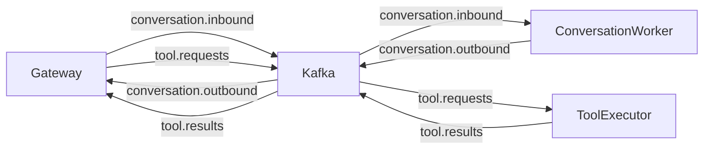

# Event Streams & Data Contracts

Note: This page is referenced from the Technical Manual. Default topic names reflect the current code; environment variables can override them.

SomaAgent01 relies on Kafka to decouple orchestration from long-running work. This document enumerates topics, payloads, and retention policy.

## Topic Catalog

Default topics in code (configurable via env):

| Topic | Producer | Consumer | Retention | Payload Schema |
| --- | --- | --- | --- | --- |
| `tool.requests` | Gateway/Orchestrator | Tool Executor | 7 days | `ToolInvocation` |
| `tool.results` | Tool Executor | Gateway/Orchestrator | 7 days | `ToolResult` |
| `conversation.inbound` | Gateway | Conversation workers | 3 days | `ConversationEvent` |
| `conversation.outbound` | Conversation workers | Gateway/UI | 3 days | `ConversationEvent` |
| `config_updates` | Config publisher | Gateway | 1 day | `SettingsPayload` |

Environment overrides:

- TOOL_REQUESTS_TOPIC, TOOL_RESULTS_TOPIC, TOOL_EXECUTOR_GROUP
- KAFKA_BOOTSTRAP_SERVERS and security-related vars

## Payload Schemas

### ToolInvocation

```json
{
  "task_id": "uuid",
  "tenant_id": "default",
  "persona": "agent0",
  "tool_name": "shell",
  "payload": {"command": "ls"},
  "metadata": {"requested_by": "gateway", "timestamp": "2025-10-09T16:59:00Z"}
}
```

### ToolResult

```json
{
  "task_id": "uuid",
  "status": "success",
  "output": {"stdout": "...", "stderr": ""},
  "metrics": {"duration_ms": 4500},
  "metadata": {"tenant_id": "default", "correlation_id": "conversation-uuid"}
}
```

### DelegatedTask

```json
{
  "task_id": "uuid",
  "type": "schedule:run",
  "payload": {"cron": "0 9 * * *", "job": "daily_report"},
  "tenant_id": "default",
  "priority": 5
}
```

## Partitioning Strategy

- Partition key: `tenant_id` to guarantee ordering per tenant.
- Default partitions: 3 (scale via `scripts/kafka_partition_scaler.py`).

## Producers & Consumers



## Retention & Compaction

- All topics use delete-based retention; adjust via `KAFKA_CFG_LOG_RETENTION_HOURS`.
- For audit trails consider enabling log compaction with key = `task_id`.

## Monitoring

- Prometheus JMX exporter exposes metrics (topic lag, ISR count).
- Alert thresholds: lag > 500 for `somastack.tools`, offline partitions > 0.

## Local Development Tips

- Use `kafkacat` or `kcat` to inspect topics: `kcat -b localhost:29092 -t somastack.tools -C`.
- If you reset volumes via `make dev-clean`, recreate topics automatically on boot.

## Data Governance

- Sensitive payloads should avoid PII; if unavoidable, encrypt payload fields before publishing.
- Record schema versions within payload (`metadata.schema_version`).
