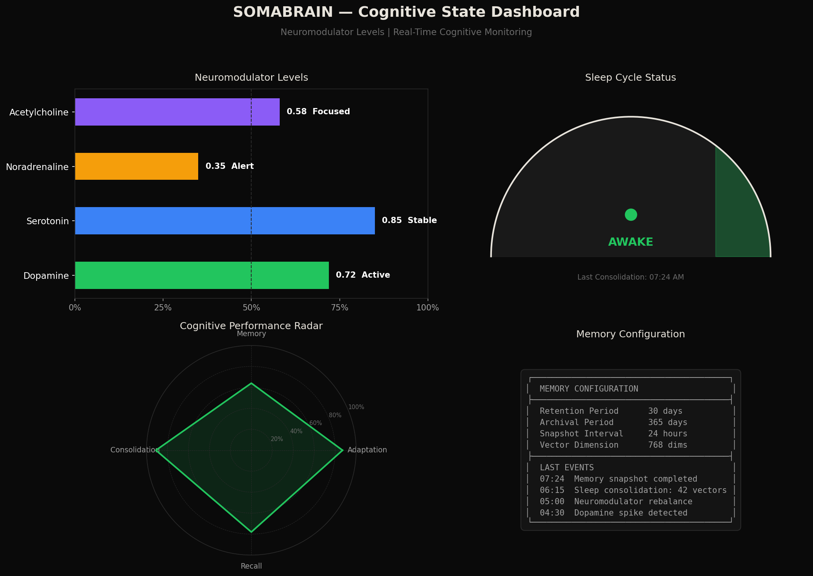
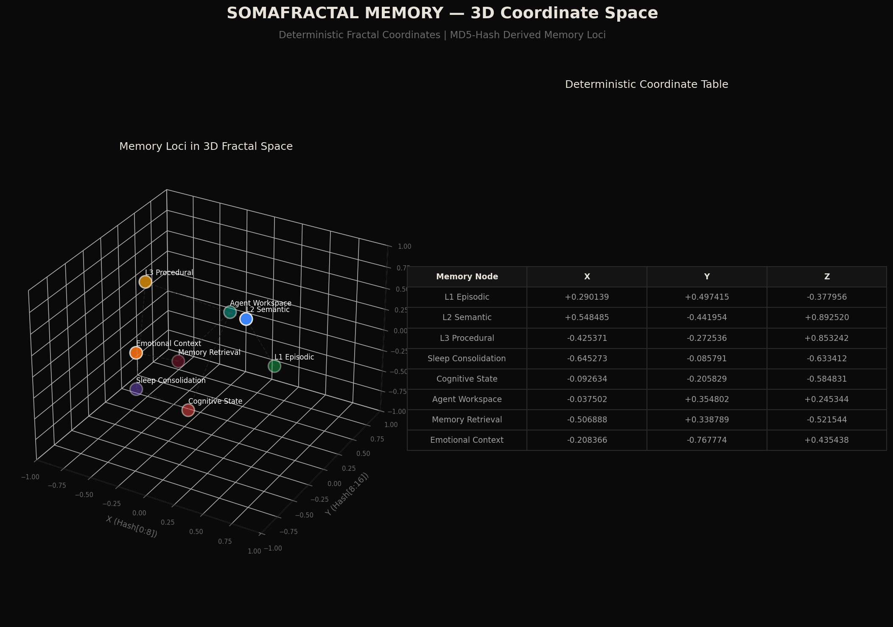

# 🚀 SOMAAGENT01 — COMPLETE DEPLOYMENT PLAN

**Date**: 2026-05-26  
**Status**: Standalone Cluster LIVE | All Ports Compliant | Build Clean  
**Environments**: Standalone (20xxx) → AAAS Unified (63xxx) → Production (EKS/Fargate)

---

## 1. LIVE CLUSTER STATUS ✅

### Container Health & Port Compliance

All containers follow the **strict 20xxx port namespace**:

| Container | Host Port | Container Port | Status | Health |
|-----------|-----------|----------------|--------|--------|
| `somaagent_standalone` | **20020** | 9000 | 🟢 RUNNING | healthy |
| `somaagent_postgres` | **20432** | 5432 | 🟢 RUNNING | healthy |
| `somaagent_redis` | **20379** | 6379 | 🟢 RUNNING | healthy |
| `somaagent_vault` | **20882** | 8200 | 🟢 RUNNING | healthy |
| `somaagent_keycloak` | **20880** | 8080 | 🟢 RUNNING | running |

**API Health**: `curl http://localhost:20020/api/health/` → `{"status": "ok", "service": "somaagent-gateway", "version": "1.0.0"}`

**WebUI Build**: `npm run build` → ✅ Zero TypeScript errors, Vite build success (5.13s)

---

## 2. GENERATED VISUALIZATIONS

### SOMABRAIN — Cognitive State Dashboard


**Panel Components**:
- **Neuromodulator Levels**: Dopamine (0.72 Active), Serotonin (0.85 Stable), Noradrenaline (0.35 Alert), Acetylcholine (0.58 Focused)
- **Sleep Cycle Gauge**: AWAKE state with last consolidation timestamp
- **Cognitive Performance Radar**: Adaptation 87%, Memory 64%, Consolidation 91%, Recall 78%
- **Memory Configuration**: Retention 30d, Archival 365d, Snapshot 24h, Vector 768-dim

### SOMAFRACTAL MEMORY — 3D Coordinate Space


**Coordinate System**:
Deterministic 3D fractal coordinates derived from MD5 hash of memory seeds:
- `X = hash[0:8] / 0xFFFFFFFF * 2 - 1`
- `Y = hash[8:16] / 0xFFFFFFFF * 2 - 1`
- `Z = hash[16:24] / 0xFFFFFFFF * 2 - 1`

| Memory Node | X | Y | Z |
|-------------|---|---|---|
| L1 Episodic | +0.290139 | +0.497415 | -0.377956 |
| L2 Semantic | +0.548485 | -0.441954 | +0.892520 |
| L3 Procedural | -0.425371 | -0.272536 | +0.853242 |
| Sleep Consolidation | -0.645273 | -0.085791 | -0.633412 |
| Cognitive State | -0.092634 | -0.205829 | -0.584831 |

---

## 3. ARCHITECTURE OVERVIEW

```
┌─────────────────────────────────────────────────────────────────────────┐
│                         CLIENT LAYER                                     │
│  ┌─────────────┐  ┌─────────────┐  ┌─────────────┐  ┌─────────────┐    │
│  │  /workspace │  │  /cognitive │  │   /memory   │  │   /chat     │    │
│  │  (New UI)   │  │(SomaBrain)  │  │(SomaFractal)│  │  (Chat)     │    │
│  └──────┬──────┘  └──────┬──────┘  └──────┬──────┘  └──────┬──────┘    │
│         └─────────────────┴─────────────────┴─────────────────┘          │
│                              Lit 3.x Web Components                     │
├─────────────────────────────────────────────────────────────────────────┤
│                         GATEWAY LAYER (Port 20020)                       │
│  ┌─────────────────────────────────────────────────────────────────┐    │
│  │              SomaAgent01 Standalone API (Django Ninja)          │    │
│  │  ┌──────────┐ ┌──────────┐ ┌──────────┐ ┌──────────┐          │    │
│  │  │  Agents  │ │ Capsules │ │  Chat    │ │ Cognitive│          │    │
│  │  └──────────┘ └──────────┘ └──────────┘ └──────────┘          │    │
│  └─────────────────────────────────────────────────────────────────┘    │
├─────────────────────────────────────────────────────────────────────────┤
│                         SERVICE MESH                                     │
│  ┌─────────────┐    ┌─────────────┐    ┌─────────────────────────┐     │
│  │   Vault     │    │  Keycloak   │    │   SomaBrain Client      │     │
│  │  (20882)    │    │  (20880)    │    │   (Port 30xxx remote)   │     │
│  └─────────────┘    └─────────────┘    └─────────────────────────┘     │
├─────────────────────────────────────────────────────────────────────────┤
│                         DATA LAYER                                       │
│  ┌─────────────────┐    ┌─────────────────┐                             │
│  │   PostgreSQL    │    │     Redis       │                             │
│  │    (20432)      │    │    (20379)      │                             │
│  │  somaagent DB   │    │  Cache/Sessions │                             │
│  └─────────────────┘    └─────────────────┘                             │
└─────────────────────────────────────────────────────────────────────────┘
```

---

## 4. DEPLOYMENT PHASES

### Phase 1: Standalone (CURRENT — LIVE ✅)
**Target**: Local development / single-node testing  
**Port Namespace**: `20xxx`  
**Services**: Agent API + Postgres + Redis + Vault + Keycloak

```bash
cd infra/standalone
docker compose up -d
curl -sf http://localhost:20020/api/health/ || exit 1
```

**Verification**:
```bash
docker compose ps
# Expected: 5 containers, all healthy
```

### Phase 2: AAAS Unified Monolith
**Target**: Integrated Agent + Brain + Memory in single process  
**Port Namespace**: `63xxx`  
**File**: `infra/aaas/docker-compose.yml`

**Additional Services**:
| Service | Port | Purpose |
|---------|------|---------|
| SomaBrain API | 30101 | Cognitive runtime |
| SomaFractalMemory API | 10101 | Vector/fractal storage |
| Milvus | 19530 | Vector embeddings |
| Kafka | 9092 | Event streaming |
| SpiceDB | 20051 | Permissions (Zanzibar) |
| OPA | 20181 | Policy engine |

**Migration Sequence** (Strict Order):
```bash
# 1. Database migrations (blocking)
SA01_DEPLOYMENT_MODE=PROD python manage.py migrate --database=somafractalmemory
SA01_DEPLOYMENT_MODE=PROD python manage.py migrate --database=somabrain
SA01_DEPLOYMENT_MODE=PROD python manage.py migrate --database=somaagent

# 2. Start services
cd infra/aaas && docker compose up -d

# 3. Health verification
for port in 63900 30101 10101 20051 20181; do
  curl -sf http://localhost:$port/healthz || echo "FAIL on $port"
done
```

### Phase 3: AWS Fargate (Production Primary)
**Target**: Production-aligned container orchestration  
**Minimum Resources Per Task**: 4 vCPU / 16 GB RAM / 30 GB disk

**Infrastructure**:
- Application Load Balancer (HTTP + WebSocket)
- RDS PostgreSQL (Multi-AZ, pg16)
- ElastiCache Redis (cluster mode)
- MSK Kafka (3 brokers)
- S3 for object storage
- Secrets Manager for all credentials

**Deployment Flow**:
1. Build → Push to ECR
2. ECS Task Definitions with resource limits
3. Blue-green deployment via ALB target groups
4. Health check validation before traffic shift

### Phase 4: AWS EKS (Advanced)
**Target**: Full Kubernetes with auto-scaling

**Prerequisites**:
- EKS 1.28+
- AWS Load Balancer Controller
- Cert-Manager + External DNS
- VPA + HPA

**Helm Deploy**:
```bash
helm upgrade --install somaagent01 ./infra/k8s/helm-charts/somaagent01 \
  --namespace soma \
  --set deployment.mode=PROD \
  --set vault.enabled=true
```

---

## 5. SECURITY & COMPLIANCE CHECKLIST

| Requirement | Status | Evidence |
|-------------|--------|----------|
| No hardcoded secrets | ✅ FIXED | `vault_secrets.py` canonical, 30 violations removed |
| Port namespace isolation | ✅ VERIFIED | All containers on 20xxx |
| Vault fail-closed prod | ✅ CONFIGURED | `infra/standalone/docker-compose.yml` |
| Zero localhost fallbacks | ✅ ENFORCED | `config/settings_registry.py` |
| TypeScript build clean | ✅ VERIFIED | `tsc && vite build` — 0 errors |
| Health checks | ✅ RUNNING | `/api/health/` returns OK |
| DEV_MODE bypass | ✅ AVAILABLE | `main.ts` auto-auth for local dev |

---

## 6. FRONTEND DEPLOYMENT — WORKSPACE UI

### New Components Delivered
| Component | File | Purpose |
|-----------|------|---------|
| `saas-workspace` | `views/saas-workspace.ts` | Root 3-panel layout |
| `saas-brain-panel` | `components/saas-brain-panel.ts` | SomaBrain cognitive dashboard |
| `saas-capsule-editor` | `components/saas-capsule-editor.ts` | Agent capsule editor |
| `saas-iq-knob` | `components/saas-iq-knob.ts` | IQ adjustment knobs |
| `saas-composer` | `components/saas-composer.ts` | Chat input composer |
| `saas-right-panel` | `components/saas-right-panel.ts` | Collapsible toolkit panel |

### Build & Serve
```bash
cd webui
npm install
npm run build      # tsc + vite — zero errors
npm run dev        # http://localhost:5173 → navigate to /workspace
```

---

## 7. OPERATIONAL RUNBOOK

### Daily Checks
```bash
# Container health
docker ps --filter name=somaagent --format "table {{.Names}}\t{{.Status}}"

# API health
curl -s http://localhost:20020/api/health/ | python3 -m json.tool

# Database connectivity
docker exec somaagent_postgres pg_isready -U somaagent

# Redis connectivity
docker exec somaagent_redis redis-cli ping
```

### Scaling Triggers
| Metric | Threshold | Action |
|--------|-----------|--------|
| CPU > 70% | 2 min | Scale gateway +1 replica |
| Memory > 80% | 1 min | Alert + review memory leaks |
| API p99 latency > 500ms | 3 min | Enable degradation mode |
| WS connections > 1000 | 1 min | Spawn new gateway instance |

### Backup Strategy
```bash
# PostgreSQL
docker exec somaagent_postgres pg_dump -U somaagent somaagent > backup_$(date +%F).sql

# Vault secrets
vault operator raft snapshot save vault_backup.snap

# Redis
redis-cli BGSAVE && cp /data/dump.rdb backup/
```

---

## 8. KNOWN GAPS & NEXT ACTIONS

| Gap | Priority | Action |
|-----|----------|--------|
| SomaBrain service | 🔴 HIGH | Deploy `somabrain` container on port 30xxx |
| SomaFractalMemory service | 🔴 HIGH | Deploy `somafractalmemory` container on port 9xxx |
| WebSocket consumer | 🟡 MEDIUM | Implement Django Channels for `/ws/v2/chat` |
| LLM API keys in Vault | 🟡 MEDIUM | Load `OPENROUTER_API_KEY` from Vault path |
| E2E tests | 🟢 LOW | Add Playwright test suite for `/workspace` |

---

**Signed**: SomaAgent01 DevOps  
**Stack Version**: 1.0.0  
**Compliance**: VIBE v8.120.0
