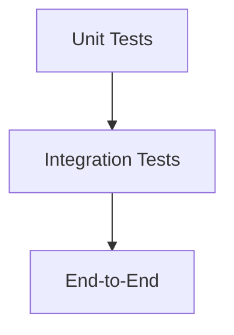

# Testing Strategy

SomaAgent01 enforces a layered test strategy aligned with real-service execution. Tests interact with live dependencies unless explicitly mocked.

## Test Pyramid

| Layer | Scope | Command |
| ----- | ----- | ------- |
| Unit | Functions, helpers, schema validation | `pytest tests/unit` |
| Integration | Gateway routes, memory, tool executor contracts | `pytest tests/integration` |
| End-to-End | Full UI + backend flows (Playwright) | `pytest tests/playwright --headed` |

## Fixtures & Data

- `tests/conftest.py`: shared FastAPI client, settings overrides.
- `tests/fixtures/`: factories for memory items, Kafka messages.
- Use `tests/context/` for long-running conversational scenarios.

## Real Service Policy

- Tests run against live dependencies (Postgres, Redis, Kafka). Ensure stack is up via `make dev-up`.
- For destructive tests, use dedicated tenants or ephemeral namespaces.

## CI Pipeline

1. Lint (`make lint`).
2. Unit + integration tests (`pytest`).
3. Playwright suite (headless via xvfb container).
4. Collect screenshots and logs on failure.

## Adding Tests

1. Identify coverage gap or regression.
2. Add descriptive test under correct suite.
3. Update docs if user-facing behavior changes.
4. Run targeted command locally before pushing.

## Load & Resilience Testing

- `scripts/load/locustfile.py` (planned) exercises conversation throughput.
- Monitor metrics via Prometheus dashboards; capture baseline before stressing.

## Regression Tracking

- Tag flaky or bug-specific tests with `@pytest.mark.issue123`.
- Document regressions and fixes in [`docs/changelog.md`](../changelog.md).
