### Delegation gateway service

A lightweight delegation gateway now exposes `/v1/delegation/task` for posting tasks onto the `somastack.delegation` topic. Use `uvicorn services.delegation_gateway.main:app --port 8015` during local testing; the service records task metadata in Postgres until callbacks land. Clients can poll `/v1/delegation/task/{task_id}` or POST to `/callback` when downstream workers finish.

### Tenant policy configuration

Budgets, routing allowlists, and fail-open behaviour can now be managed via `conf/tenants.yaml`. Each tenant block supports `fail_open`, optional per-persona `budgets`, and routing `allow`/`deny` lists. Update the file and restart the services to apply changes locally; Kubernetes environments should mount the file or inject it via ConfigMap.

# Development manual for Agent Zero
This guide will show you how to setup a local development environment for Agent Zero in a VS Code compatible IDE, including proper debugger.

> [!TIP]
> Looking for the full SomaAgent01 stack in Docker? Follow the dedicated step-by-step guide in [`docs/development/somaagent01_docker_compose.md`](./development/somaagent01_docker_compose.md).


[](https://www.youtube.com/watch?v=KE39P4qBjDk)


> [!WARNING]
> This guide is for developers and contributors. It assumes you have a basic understanding of how to use Git/GitHub, Docker, IDEs and Python.

> [!NOTE]
> - Agent Zero runs in a Docker container, this simplifies installation and ensures unified environment and behavior across systems.
> - Developing and debugging in a container would be complicated though, therefore we use a hybrid approach where the python framework runs on your machine (in VS Code for example) and only connects to a Dockerized instance when it needs to execute code or use other pre-installed functionality like the built-in search engine.


## To follow this guide you will need:
1. VS Code compatible IDE (VS Code, Cursor, Windsurf...)
2. Python environment (Conda, venv, uv...)
3. Docker (Docker Desktop, docker-ce...)
4. (optional) Git/GitHub

> [!NOTE]
> I will be using clean VS Code, Conda and Docker Desktop in this example on MacOS.


## Step 0: Install required software
- See the list above and install the software required if you don't already have it.
- You can choose your own variants, but Python, Docker and a VS Code compatible IDE are required.
- For Python you can choose your environment manager - base Python venv, Conda, uv...

## Step 1: Clone or download the repository
- Agent Zero is available on GitHub [github.com/agent0ai/agent-zero](https://github.com/agent0ai/agent-zero).
- You can download the files using a browser and extract or run `git clone https://github.com/agent0ai/agent-zero` in your desired directory.

> [!NOTE]
> In my case, I used `cd ~/Desktop` and `git clone https://github.com/agent0ai/agent-zero`, so my project folder is `~/Desktop/agent-zero`.

## Step 2: Open project folder in your IDE
- I will be using plain and clean VS Code for this example to make sure I don't skip any setup part, you can use any of it's variants like Cursor, Windsurf etc.
- Agent Zero comes with `.vscode` folder that contains basic setup, recommended extensions, and debugger profiles. These will help us a lot.

1. Open your IDE and open the project folder using `File > Open Folder` and select your folder, in my case `~/Desktop/agent-zero`.
2. You will probably be prompted to trust the directory, confirm that.
3. You should now have the project open in your IDE
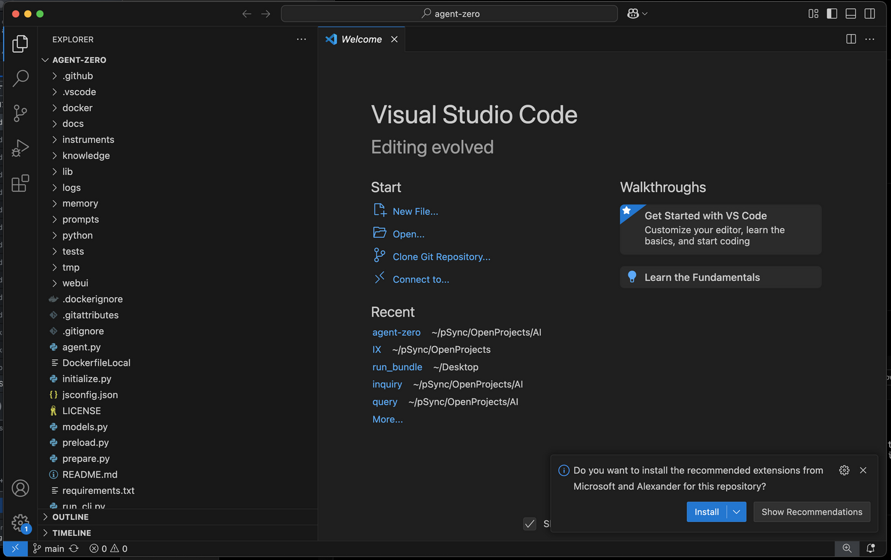

# Step 3: Prepare your IDE:
1. Notice the prompt in lower right corner of the screenshot above to install recommended extensions, this comes from the `.vscode/extensions.json` file. It contains Python language support, debugger and error helper, install them by confirming the popup or manually in Extensions tab of your IDE. These are the extensions mentioned:
```
usernamehw.errorlens
ms-python.debugpy
ms-python.python
```

Now when you select one of the python files in the project, you should see proper Python syntax highlighting and error detection. It should immediately show some errors, because we did not yet install dependencies.
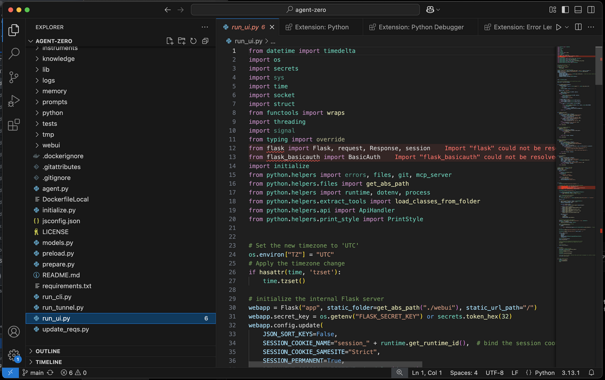

2. Prepare the python environment to run Agent Zero in. (⚠️ This step assumes you have some Python runtime installed.) By clicking the python version in lower right corner (3.13.1 in my example), you should get a list of available environments. You can click the `+ Create Virtual Environment` button. You might be prompted to select the environment manager if you have multiple installed. I have venv and Conda, I will select Conda here. I'm also prompted for desired python version, I will select 3.12, that is known to work well.
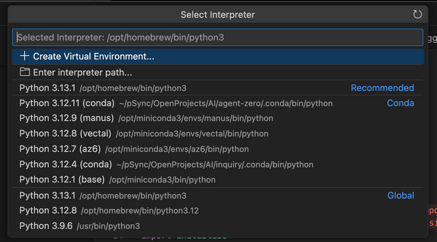
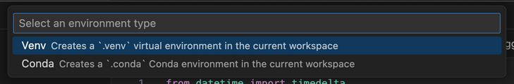

- Your new environment should be automatically activated. If not, select it in the lower right corner. You might need to open a new terminal in VS Code to reflect the changes with `Terminal > New Terminal` or clicking the `+` button in the terminal tab. Your terminal prompt should now start with your environment name/path, in my case `(/Users/frdel/Desktop/agent-zero/.conda)` This shows the environment is active in the terminal.

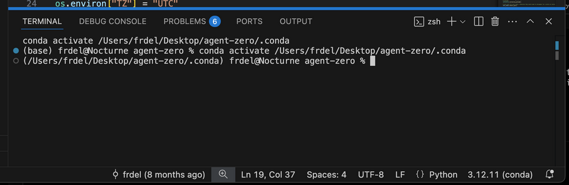

3. Install dependencies. Run these two commands in the terminal:
```bash
pip install -r requirements.txt
playwright install chromium
``` 
These will install all the python packages and browser binaries for playwright (browser agent).
Errors in the code editor caused by missing packages should now be gone. If not, try reloading the window.


## Step 4: Run Agent Zero in the IDE
Great work! Now you should be able to run Agent Zero from your IDE including real-time debugging.
It will not be able to do code execution and few other features requiring the Docker container just yet, but most of the framework will already work.

1. The project is pre-configured for debugging. Go to Debugging tab, select "run_ui.py" and click the green play button (or press F5 by default). The configuration can be found at `.vscode/launch.json`.

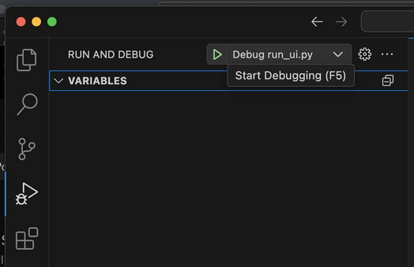

The framework will run at the default port 5000. If you open `http://localhost:5000` in your browser and see `ERR_EMPTY_RESPONSE`, don't panic, you may need to select another port like I did for some reason. If you need to change the defaut port, you can add `"--port=5555"` to the args in the `.vscode/launch.json` file or you can create a `.env` file in the root directory and set the `WEB_UI_PORT` variable to the desired port.

It may take a while the first time. You should see output like the screenshot below. The RFC error is ok for now as we did not yet connect our local development to another instance in docker.
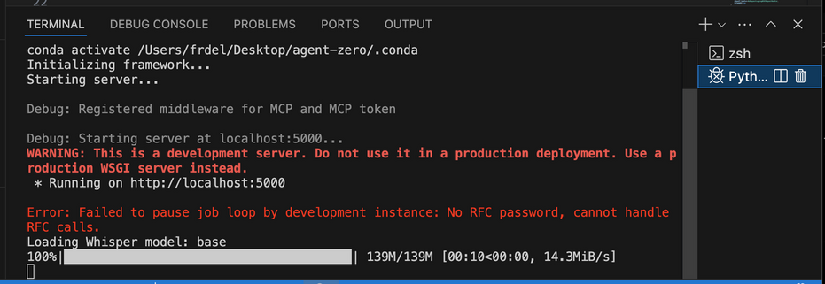


After inserting my API key in settings, my Agent Zero instance works. I can send a simple message and get a response.
⚠️ Some tools like code execution will not work yet as they need to be connected to a Dockerized instance.

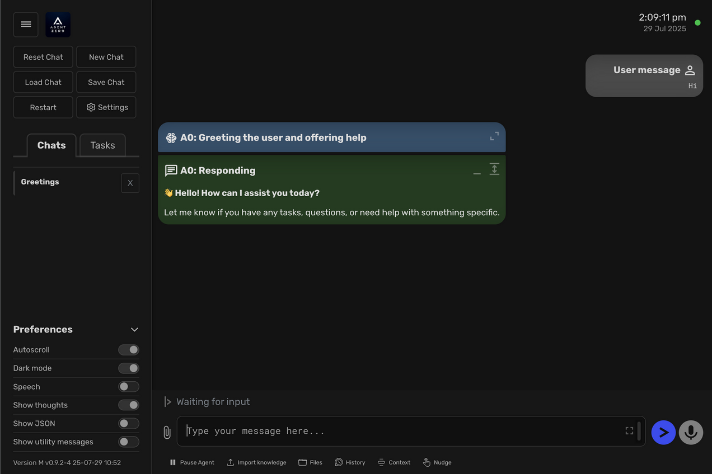


## Debugging
- You can try out the debugger already by placing a breakpoint somewhere in the python code.
- Let's open `python/api/message.py` for example and place a breakpoint at the beginning of the `communicate` function by clicking on the left of the row number. A red dot should appear showing a breakpoint is set.

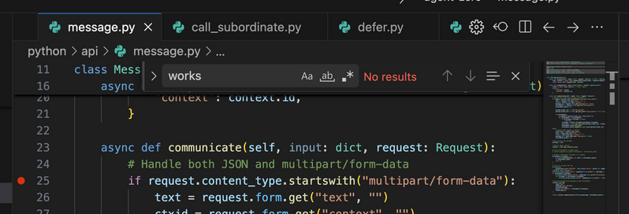

- Now when I send a message in the UI, the debugger will pause the execution at the breakpoint and allow me to inspect all the runtime variables and run the code step by step, even modify the variables or jump to another locations in the code. No more print statements needed!

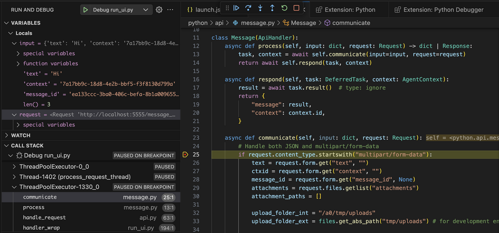


## Step 5: Run another instance of Agent Zero in Docker
- Some parts of A0 require standardized linux environment, additional web services and preinstalled binaries that would be unneccessarily complex to set up in a local environment.
- To make development easier, we can use existing A0 instance in docker and forward some requests to be executed there using SSH and RFC (Remote Function Call).

1. Pull the docker image `agent0ai/agent-zero` from Docker Hub and run it with a web port (`80`) mapped and SSH port (`22`) mapped.
If you want, you can also map the `/a0` folder to our local project folder as well, this way we can update our local instance and the docker instance at the same time.
This is how it looks in my example: port `80` is mapped to `8880` on the host and `22` to `8822`, `/a0` folder mapped to `/Users/frdel/Desktop/agent-zero`:

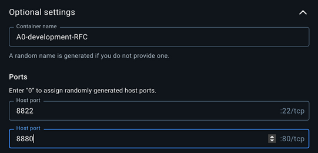
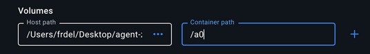


## Step 6: Configure SSH and RFC connection
- The last step is to configure the local development (VS Code) instance and the dockerized instance to communicate with each other. This is very simple and can be done in the settings in the Web UI of both instances.
- In my example the dark themed instance is the VS Code one, the light themed one is the dockerized instance.

1. Open the "Settings" page in the Web UI of your dockerized instance and go in the "Development" section.
2. Set the `RFC Password` field to a new password and save.
3. Open the "Settings" page in the Web UI of your local instance and go in the "Development" section.
4. Here set the `RFC Password` field to the same password you used in the dockerized instance. Also set the SSH port and HTTP port the same numbers you used when creating the container - in my case `8822` for SSH and `8880` for HTTP. The `RFC Destination URL` will most probably stay `localhost` as both instances are running on the host machine.
5. Click save and test by asking your agent to do something in the terminal, like "Get current OS version". It should be able to communicate with the dockerized instance via RFC and SSH and execute the command there, responding with something like "Kali GNU/Linux Rolling".

My Dockerized instance:
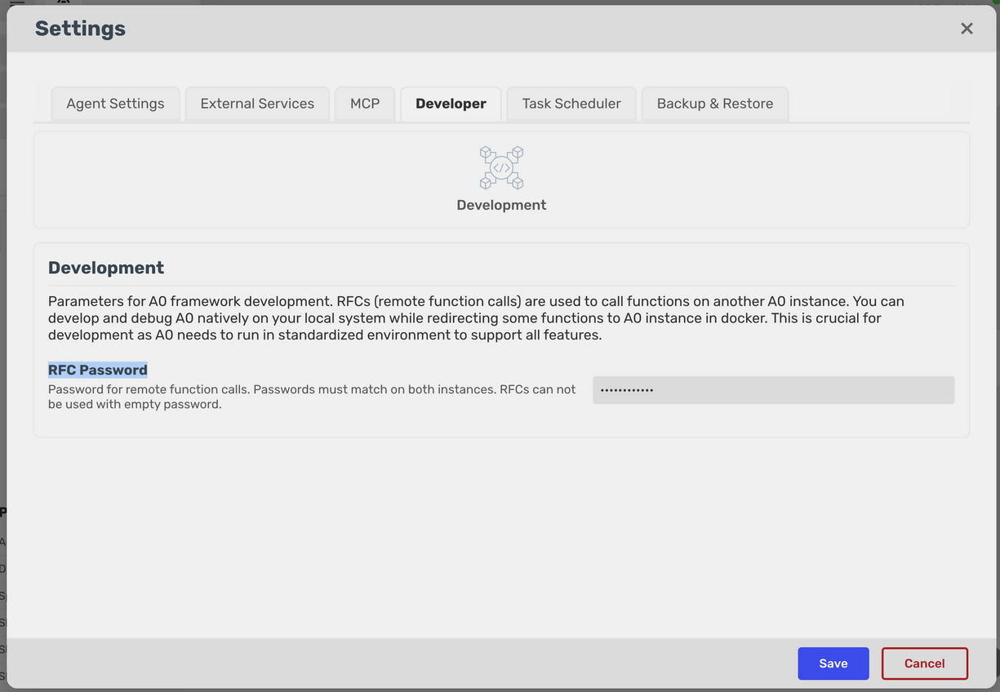

My VS Code instance:
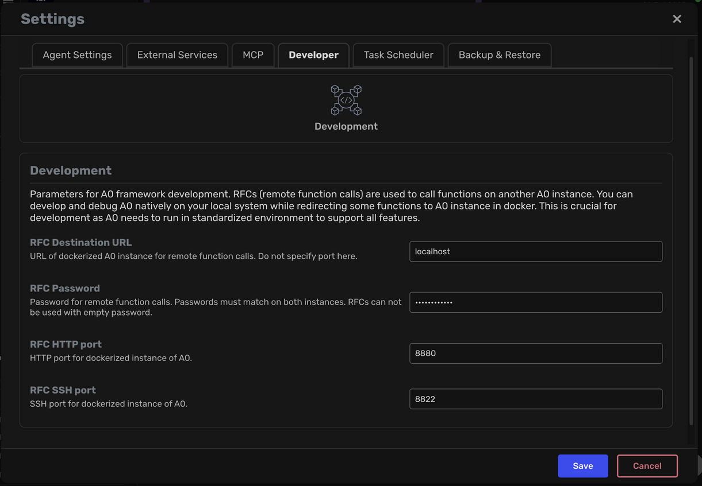


## Step 7: Guaranteed SomaAgent01 Docker stack runbook

Use this playbook whenever you need the full SomaAgent01 stack (Kafka, gateway, tool executor, observability, and UI) to come up cleanly on your development machine. It condenses everything we practice internally to avoid drift between “testing” and “prod-like” environments.

| Task | Command |
| --- | --- |
| Start or restart the entire stack | `make dev-up` |
| Stop services, keep volumes | `make dev-down` |
| Tear down and clear named volumes | `make dev-clean` |
| Tail service logs | `make dev-logs` |
| Check container status | `make dev-status` |

### 7.1 Prerequisites

- Docker Desktop (or docker-ce) is running.
- Docker Compose v2.20 or newer (bundled with current Docker Desktop).
- This repository checked out locally with the nested `a0_data` directory intact.
- The `somaagent01` docker network exists. Create it once if you have never launched the stack:

  ```bash
  docker network inspect somaagent01 >/dev/null 2>&1 || docker network create somaagent01
  ```

> [!IMPORTANT]
> Named volumes like `agent-zero_kafka_data`, `agent-zero_postgres_data`, and the rest persist across runs. Clearing them wipes service state; only do so when you intentionally want a factory reset.

### 7.2 First launch or hard reset

1. **Stop leftovers (safe anytime):**

	```bash
	docker compose -f docker-compose.somaagent01.yaml -p somaagent01 down --remove-orphans || true
	```

2. **Optional clean slate:** remove volumes when you need to eradicate corrupted Kafka metadata or abandon stale databases. Remove only the ones you need; a full wipe looks like:

	```bash
	docker volume rm agent-zero_kafka_data agent-zero_postgres_data agent-zero_redis_data agent-zero_qdrant_data agent-zero_prometheus_data agent-zero_grafana_data agent-zero_vault_data 2>/dev/null || true
	```

3. **Launch the stack** via `make dev-up` (or run `scripts/run_dev_cluster.sh` directly). The entrypoint reserves free host ports, exports them, and attaches required profiles. Watch the console output—when it exits the compose project is up and waiting.

4. **Verify health:**

	```bash
	docker ps --format '{{.Names}}\t{{.Status}}' | grep somaAgent01
	```

	You should see every service `Up`, with `healthy` checks for Kafka, Postgres, and Redis.

5. **Open the UI** at http://localhost:7002 (or the `WEB_UI_PORT` printed by the script) and confirm it loads.

### 7.3 Daily usage

| Scenario | Command |
| --- | --- |
| Stop stack, keep data | `docker compose -f docker-compose.somaagent01.yaml -p somaagent01 down`
| Quick restart | `COMPOSE_PROFILES=dev bash scripts/run_dev_cluster.sh`
| Tail logs | `docker logs somaAgent01_<service> --tail 100`
| Exec inside | `docker exec -it somaAgent01_<service> bash`

Need optional services (delegation load test, metrics, etc.)? Supply additional profiles, e.g. `COMPOSE_PROFILES="dev,core,metrics"`.

### 7.3.1 Memory service quick facts

- The new gRPC memory service now ships with the default `core` profile. It listens on `50052` inside the compose network and is exposed on the same port by default.
- Router and tool executor connect through gRPC using `MEMORY_SERVICE_TARGET`. Override it for remote clusters via `MEMORY_SERVICE_TARGET=host.docker.internal:9060` (or another hostname) before running `make dev-up`.
- Tail its logs with `make dev-logs memory-service` or `docker logs somaAgent01_memory-service -f` to confirm successful boot and database migrations.
- When running the Helm chart, update `values.yaml` to point at your production Postgres DSN and OTLP endpoint so tracing matches the rest of the stack.

### 7.4 Routine health checks

- **UI heartbeat:** `curl -I http://localhost:7002` should return `200`.
- **Kafka availability:**

  ```bash
  docker exec somaAgent01_kafka kafka-topics.sh --bootstrap-server kafka:9092 --list
  ```

- **Tool executor → Kafka connectivity:**

  ```bash
  docker exec somaAgent01_tool-executor python - <<'PY'
  import socket
  socket.create_connection(("kafka", 9092), timeout=5).close()
  print("ok")
  PY
  ```

- **Persistent storage present:** `docker volume ls | grep agent-zero` and `docker run --rm -v agent-zero_postgres_data:/data alpine ls /data` confirm data is mounted.

### 7.5 Troubleshooting quick hits

- **Kafka stuck restarting** → `docker rm -f somaAgent01_kafka && docker volume rm agent-zero_kafka_data`, then rerun the launch script.
- **Workers crash looping** → check Kafka/Postgres health first, then `docker compose -f docker-compose.somaagent01.yaml -p somaagent01 up -d tool-executor conversation-worker` once dependencies are healthy.
- **Port already in use** → provide overrides: `WEB_UI_PORT=7100 COMPOSE_PROFILES=dev bash scripts/run_dev_cluster.sh`.
- **Need a full reset** → run the volume removal command in §7.2 step 2, then relaunch.

### 7.6 Observability extras

- Prometheus and Alertmanager ship in the dev profile. Prometheus listens on the port printed by the helper script (default 29090).
- Grafana lives behind the `metrics` profile. Enable it with `COMPOSE_PROFILES="dev,core,metrics" bash scripts/run_dev_cluster.sh`; login credentials follow Grafana defaults unless overridden.
- `/health` in the agent UI reflects dependency health. When it turns amber/red, check Kafka, Postgres, Redis, and optional telemetry containers using the commands above.

### 7.7 Graceful shutdown & backups

1. Stop the project: `docker compose -f docker-compose.somaagent01.yaml -p somaagent01 down`.
2. Capture backups before destructive changes:

	```bash
	docker run --rm -v agent-zero_postgres_data:/data -v "$PWD/backups":/backup alpine tar -czf /backup/postgres_$(date +%Y%m%d).tgz -C /data .
	docker run --rm -v agent-zero_kafka_data:/data -v "$PWD/backups":/backup alpine tar -czf /backup/kafka_$(date +%Y%m%d).tgz -C /data .
	```

3. Restore by extracting the archive back into the same volume (`tar -xzf`).

Following this cycle keeps the “testing” stack in perfect parity with our prod topology and eliminates the Kafka/tool-executor restart loops we’ve observed when volumes drift.


### Health status indicator

The status glyph beside the clock polls `/health` every few seconds. Green indicates full connectivity, amber reflects degraded dependencies, and red means the gateway cannot reach critical services. Hover over the icon to see component-level detail gathered from Postgres, Redis, Kafka, and optional telemetry/delegation health endpoints.

### Prometheus alert rules

### Delegation load testing

Run `k6 run scripts/loadtest_k6.js` (set `GATEWAY_URL` to your deployment) to exercise the delegation gateway under load. The script ramps to 50 RPS and verifies 200 responses. Combine with Prometheus dashboards to observe latency and error-rate SLOs.


Prometheus now ships with `infra/observability/alerts.yml`, which includes latency/error-rate SLOs for the gateway, circuit-breaker open events, and legacy telemetry worker availability checks. Mount this file alongside `prometheus.yml` in docker-compose or your Kubernetes manifests and extend the rule set with additional SLOs.

> [!TIP]
> To expose the circuit breaker counters, set `CIRCUIT_BREAKER_METRICS_PORT` (default `9610` in Docker) and optionally `CIRCUIT_BREAKER_METRICS_HOST` on any service that imports `python.helpers.circuit_breaker`. The FastAPI gateway invokes `ensure_metrics_exporter()` during startup, so the Prometheus target appears automatically once the environment variables are present.

> [!NOTE]
> The tool executor now wraps each registered tool in its own circuit breaker. Tune breaker sensitivity by setting `TOOL_EXECUTOR_CIRCUIT_FAILURE_THRESHOLD` (default `5`) and `TOOL_EXECUTOR_CIRCUIT_RESET_TIMEOUT_SECONDS` (default `30`) before restarting the service.

### Chaos testing quick start

To rehearse failure recovery, stop individual containers in `docker-compose.somaagent01.yaml` (for example `docker compose stop kafka`) and watch `/health` degrade before bringing the service back up. In Kubernetes you can achieve the same by scaling a deployment to zero; Prometheus and the UI status indicator will flag the outage once scrapes fail.


## SomaBrain memory backend

- Agent Zero now relies on the local SomaBrain service for all long-term memory operations. The service listens on `http://127.0.0.1:9696` by default, matching the local control plane configuration.
- If your instance runs elsewhere, export `SOMA_BASE_URL` before starting Agent Zero (for example `export SOMA_BASE_URL=http://host.docker.internal:9696` when launching from inside Docker). Optional headers can be provided via `SOMA_API_KEY` (Bearer token) and `SOMA_TENANT_ID`.
- Soma is enabled automatically. To fall back to the legacy FAISS store for troubleshooting, set `SOMA_ENABLED=false` in your environment before launching the app.
- The built-in memory dashboard and extensions now read and write directly to SomaBrain, so changes made via Soma will appear instantly in Agent Zero and vice versa.


# 🎉 Congratulations! 🚀

You have successfully set up a complete Agent Zero development environment! You now have:

- ✅ A local development instance running in your IDE with full debugging capabilities
- ✅ A dockerized instance for code execution and system operations
- ✅ RFC and SSH communication between both instances
- ✅ The ability to develop, debug, and test Agent Zero features seamlessly

You're now ready to contribute to Agent Zero, create custom extensions, or modify the framework to suit your needs. Happy coding! 💻✨


## Next steps
- See [extensibility](extensibility.md) for instructions on how to create custom extensions.
- See [contribution](contribution.md) for instructions on how to contribute to the framework.

## Want to build your docker image?
- You can use the `DockerfileLocal` to build your docker image.
- Navigate to your project root in the terminal and run `docker build -f DockerfileLocal -t agent-zero-local --build-arg CACHE_DATE=$(date +%Y-%m-%d:%H:%M:%S) .`
- The `CACHE_DATE` argument is optional, it is used to cache most of the build process and only rebuild the last steps when the files or dependencies change.
- See `docker/run/build.txt` for more build command examples.
