# COMPLETE END-TO-END MESSAGE FLOW
## somaAgent01 Architecture (From Actual Code)

**Based On:**
- `docs/SRS.md` (System Architecture)
- `services/gateway/routers/sessions.py` (HTTP → Kafka)
- `services/conversation_worker/main.py` (Kafka Consumer)
- `src/core/application/use_cases/conversation/process_message.py` (Orchestration)
- `agent.py` (`monologue()` loop)
- `python/somaagent/context_builder.py` (SomaBrain integration)

---

## Complete Message Flow Diagram

```mermaid
sequenceDiagram
    autonumber
    
    participant User as 👤 User (WebUI)
    participant Gateway as 🌐 Gateway (FastAPI:8010)
    participant PostgreSQL as 💾 PostgreSQL
    participant Kafka as 📨 Kafka
    participant Worker as ⚙️ ConversationWorker
    participant UseCase as 🎯 ProcessMessageUseCase
    participant CtxBuilder as 🧠 ContextBuilder
    participant SomaBrain as 🎭 SomaBrain (9696)
    participant Agent as 🤖 Agent (FSM)
    participant LLM as 🔮 LiteLLM/OpenAI
    participant Redis as 🔴 Redis Cache
    
    Note over User,Redis: STEP 1-2: User Message → Gateway (HTTP POST)
    User->>Gateway: POST /v1/session/message<br/>{message, session_id, persona_id}
    Gateway->>PostgreSQL: INSERT INTO session_events<br/>(user message)
    Gateway->>Redis: CACHE persona_id, tenant
    
    Note over Gateway,Kafka: STEP 3: Gateway → Kafka (Async Queue)
    Gateway->>Kafka: PUBLISH conversation.inbound<br/>{session_id, message, metadata}
    Gateway-->>User: 200 OK {session_id, event_id}
    
    Note over User,Redis: User opens SSE stream for real-time updates
    User->>Gateway: GET /v1/session/{session_id}/events?stream=true
    Gateway-->>User: SSE Stream (keepalive every 10s)
    
    Note over Kafka,Worker: STEP 4: Kafka → ConversationWorker (Consumer)
    Kafka->>Worker: CONSUME conversation.inbound
    Worker->>Worker: _handle(event)
    
    Note over Worker,UseCase: STEP 5: ProcessMessageUseCase Orchestration
    Worker->>UseCase: execute(ProcessMessageInput)
    
    activate UseCase
    UseCase->>UseCase: MessageAnalyzer.analyze()<br/>(intent, sentiment, tags)
    UseCase->>PostgreSQL: SessionRepository.append_event()<br/>(store user message)
    
    Note over UseCase,SomaBrain: STEP 6: Memory Storage
    UseCase->>SomaBrain: POST /remember<br/>{persona_id, session_id, text}
    SomaBrain-->>UseCase: 200 OK
    
    Note over UseCase,CtxBuilder: STEP 7: Context Building
    UseCase->>CtxBuilder: build_for_turn(turn, max_prompt_tokens=4000)
    activate CtxBuilder
    
    CtxBuilder->>CtxBuilder: _current_health()<br/>→ NORMAL/DEGRADED/DOWN
    
    alt Health State: NORMAL or DEGRADED
        CtxBuilder->>SomaBrain: POST /recall<br/>{query, top_k=8 or 3}
        SomaBrain-->>CtxBuilder: {candidates: [snippets]}
        CtxBuilder->>CtxBuilder: _apply_salience()<br/>(0.7*relevance + 0.3*recency)
        CtxBuilder->>CtxBuilder: _rank_and_clip_snippets()
    else Health State: DOWN
        CtxBuilder->>CtxBuilder: Skip retrieval<br/>(history-only mode)
    end
    
    CtxBuilder->>CtxBuilder: _clip_history_to_budget()
    CtxBuilder-->>UseCase: ContextResult(snippets, history)
    deactivate CtxBuilder
    
    Note over UseCase,Agent: STEP 8: Response Generation
    UseCase->>UseCase: GenerateResponseUseCase.execute()
    UseCase->>Agent: agent.monologue()
    
    activate Agent
    Agent->>Agent: set_state(PLANNING)
    Agent->>Agent: prepare_prompt(loop_data)
    Note right of Agent: Assemble:<br/>- System prompt<br/>- Context snippets<br/>- Chat history
    
    Agent->>Agent: call_extensions("before_main_llm_call")
    Agent->>Agent: set_state(EXECUTING)
    
    Agent->>LLM: LiteLLM.acompletion(messages, stream=True)
    activate LLM
    
    loop Streaming Response
        LLM-->>Agent: Chunk (delta)
        Agent->>Agent: stream_callback(chunk, full)
        Agent->>Agent: call_extensions("response_stream_chunk")
        Agent->>PostgreSQL: UPDATE session_events<br/>(streaming chunk)
        Agent->>Kafka: PUBLISH conversation.outbound<br/>{type: "assistant_chunk", chunk}
        Kafka->>Gateway: Event Bus
        Gateway->>PostgreSQL: POLL list_events_after()
        Gateway-->>User: SSE: data: {type:"assistant_chunk"}<br/>(real-time streaming)
    end
    
    LLM-->>Agent: Complete response
    deactivate LLM
    
    Agent->>Agent: hist_add_ai_response(response)
    Agent->>Agent: process_tools(response)
    Agent->>Agent: set_state(VERIFYING)
    Agent->>Agent: set_state(IDLE)
    Agent-->>UseCase: tools_result
    deactivate Agent
    
    Note over UseCase,SomaBrain: STEP 9: Response Storage
    UseCase->>PostgreSQL: SessionRepository.append_event()<br/>(assistant response)
    UseCase->>SomaBrain: POST /remember<br/>{role: "assistant", text}
    UseCase->>Kafka: PUBLISH conversation.outbound<br/>{type: "assistant_complete"}
    
    UseCase-->>Worker: ProcessMessageResult(success=true)
    deactivate UseCase
    
    Note over Gateway,User: STEP 10: Final Event Delivery
    Gateway->>PostgreSQL: POLL new events
    Gateway-->>User: SSE: data: {type:"assistant_complete"}
    
    User->>User: Display complete message
```



---

## Key Components Breakdown

### 1. **Gateway (`services/gateway/routers/sessions.py`)**
```python
@router.post("/message")
async def post_session_message(payload, bus, store, cache):
    session_id = payload.get("session_id") or str(uuid.uuid4())
    event = {
        "session_id": session_id,
        "message": payload["message"],
        "role": "user",
        "metadata": {"tenant": payload.get("tenant"), "source": "gateway"}
    }
    
    # 1. Persist to PostgreSQL
    await store.append_event(session_id, event)
    
    # 2. Publish to Kafka
    await bus.publish("conversation.inbound", event)
    
    # 3. Cache metadata
    await cache.write_context(session_id, persona_id, metadata)
    
    return {"session_id": session_id, "event_id": event_id}
```

### 2. **SSE Streaming (`sessions.py`)**
```python
@router.get("/{session_id}/events")
async def session_events_sse(session_id, stream=True):
    async def _sse_event_generator():
        last_event_id = None
        while True:
            # Poll PostgreSQL every 2 seconds
            events = await store.list_events_after(session_id, last_event_id)
            for event in events:
                yield f"data: {json.dumps(event)}\n\n"
            await asyncio.sleep(2.0)
    
    return StreamingResponse(_sse_event_generator(), media_type="text/event-stream")
```

### 3. **ConversationWorker (`services/conversation_worker/main.py`)**
```python
class ConversationWorkerImpl:
    def __init__(self):
        self.bus = KafkaEventBus(kafka_settings)
        self.ctx_builder = ContextBuilder(somabrain, metrics, token_counter)
        self._proc = ProcessMessageUseCase(
            session_repo=store,
            policy_enforcer=enforcer,
            memory_client=soma,
            context_builder=ctx_builder,
            response_generator=gen
        )
    
    async def _handle(self, event: Dict[str, Any]):
        sid = event.get("session_id")
        result = await self._proc.execute(
            ProcessMessageInput(event, sid, tenant, persona_id, metadata)
        )
```

### 4. **ProcessMessageUseCase (453 lines)**
```python
class ProcessMessageUseCase:
    async def execute(self, input: ProcessMessageInput):
        # 1. Message Analysis
        analysis = MessageAnalyzer.analyze(input.event["message"])
        
        # 2. Policy Check
        await self.policy_enforcer.check(input.session_id, input.tenant)
        
        # 3. Store User Message
        await self.session_repo.append_event(input.session_id, user_event)
        
        # 4. Memory Storage (SomaBrain)
        await self.memory_client.remember(persona_id, session_id, text)
        
        # 5. Context Building
        context = await self.context_builder.build_for_turn(turn, max_tokens=4000)
        
        # 6. Generate Response (delegates to GenerateResponseUseCase)
        response = await self.response_generator.execute(
            session_id, context, history
        )
        
        # 7. Store Assistant Response
        await self.session_repo.append_event(input.session_id, assistant_event)
        await self.memory_client.remember(persona_id, session_id, response)
        
        # 8. Publish Completion
        await self.publisher.publish("conversation.outbound", completion_event)
        
        return ProcessMessageResult(success=True)
```

### 5. **ContextBuilder (`python/somaagent/context_builder.py` - 407 lines)**
```python
async def build_for_turn(self, turn, *, max_prompt_tokens):
    state = self._current_health()  # NORMAL | DEGRADED | DOWN
    
    snippets = []
    if state != SomabrainHealthState.DOWN:
        try:
            # Adjust top_k based on health
            top_k = 8 if state == NORMAL else 3
            
            # Retrieve from SomaBrain
            raw_snippets = await self.somabrain.recall(query, top_k)
            
            # Apply salience scoring (70% relevance + 30% recency)
            scored = self._apply_salience(raw_snippets)
            snippets = self._rank_and_clip_snippets(scored, state)
        except SomaClientError:
            self.on_degraded(15)  # 15-second degradation window
            snippets = []
    
    # Clip history to fit token budget
    history = self._clip_history_to_budget(turn["history"], max_prompt_tokens)
    
    return ContextResult(snippets, history, debug_info)
```

### 6. **Agent Monologue Loop (`agent.py`)**
```python
async def monologue(self):
    while True:
        self.loop_data = LoopData(user_message=self.last_user_message)
        
        while True:
            self.set_state(AgentState.PLANNING)
            
            # Build prompt with context
            prompt = await self.prepare_prompt(loop_data)
            
            # Stream callback for real-time updates
            async def stream_callback(chunk, full):
                await self.call_extensions("response_stream_chunk", stream_data)
                await self.handle_response_stream(full)
            
            # Call LLM with streaming
            agent_response, _reasoning = await self.call_chat_model(
                messages=prompt,
                response_callback=stream_callback
            )
            
            # Add to history
            self.hist_add_ai_response(agent_response)
            
            # Process tools if any
            tools_result = await self.process_tools(agent_response)
            
            if tools_result:
                self.set_state(AgentState.VERIFYING)
                self.set_state(AgentState.IDLE)
                return tools_result
```

---

## Data Flow Summary (8 Steps)

| # | From | To | Protocol | Data | Latency |
|---|------|-----|----------|------|---------|
| 1 | WebUI | Gateway | HTTP POST | `{message, session_id}` | ~10ms |
| 2 | Gateway | PostgreSQL | asyncpg | `INSERT session_events` | ~5ms |
| 3 | Gateway | Kafka | Kafka Producer | `conversation.inbound` | ~2ms |
| 4 | Kafka | Worker | Kafka Consumer | Event polling | ~50ms |
| 5 | Worker | SomaBrain | HTTP POST | `/remember`, `/recall` | ~100ms |
| 6 | Worker | Agent | In-process | `monologue()` call | ~1ms |
| 7 | Agent | LLM | HTTPS | `litellm.acompletion()` | ~500ms |
| 8 | Worker | Kafka | Kafka Producer | `conversation.outbound` | ~2ms |

**Total E2E Latency:** ~670ms + LLM generation time

---

## Health State Degradation


---

## Circuit Breaker Configuration

| Service | fail_max | reset_timeout | Behavior on Open |
|---------|----------|---------------|------------------|
| `somabrain` | 5 | 60s | Context builder → DOWN mode |
| `postgres` | 3 | 30s | Database ops fail-fast |
| `kafka` | 4 | 45s | Event publishing stops |

---

## Complete Technology Stack

| Layer | Technology | Purpose |
|-------|-----------|---------|
| **Frontend** | Alpine.js 3.x, SSE | Reactive UI, real-time streaming |
| **Gateway** | FastAPI, Uvicorn | HTTP API, routing, auth |
| **Message Queue** | Kafka | Async message processing |
| **Worker** | AsyncIO, Clean Arch | Use case orchestration |
| **Agent** | FSM, LangChain | Conversation loop |
| **LLM** | LiteLLM | Multi-provider support |
| **Memory** | SomaBrain (HTTP) | Cognitive memory service |
| **Database** | PostgreSQL (asyncpg) | Session persistence |
| **Cache** | Redis | Session metadata |
| **Observability** | Prometheus | Metrics collection |
| **Authorization** | OPA | Policy enforcement |

---

This diagram represents the **ACTUAL IMPLEMENTATION** as found in the codebase! 🎯
