# 🎯 ULTIMATE END-TO-END MESSAGE FLOW
## Complete System: All Inputs + Degradation Mode + Full Stack

**This diagram shows EVERYTHING together:**
- ✅ Text, Voice, Attachments, Vision inputs
- ✅ Degradation Mode (NORMAL → DEGRADED → DOWN)
- ✅ Circuit Breakers (fail_max, reset_timeout)
- ✅ Context Builder adaptive behavior (8 → 3 → 0 snippets)
- ✅ Complete data flow from User → Response

---

## The Complete Picture: 3 Scenarios in Parallel

```mermaid
graph TB
    subgraph "USER INPUTS (All Modalities)"
        I1[📝 Text Message]
        I2[📎 File Attachment]
        I3[🎤 Voice STT]
        I4[🖼️ Image Vision]
    end
    
    subgraph "GATEWAY LAYER"
        G1[FastAPI Gateway :8010]
        G2[TUS Upload Handler]
        G3[Speech WebSocket]
        G4[ClamAV Scanner]
    end
    
    subgraph "MESSAGE QUEUE"
        K1[Kafka: conversation.inbound]
        K2[Kafka: file.uploaded]
    end
    
    subgraph "WORKER LAYER"
        W1[ConversationWorker]
        W2[ProcessMessageUseCase]
        W3[Message Analyzer]
        W4[Policy Enforcer]
    end
    
    subgraph "CONTEXT BUILDING (Adaptive)"
        CB{Context Builder<br/>Health State?}
        CB -->|NORMAL| CB1[Retrieve 8 snippets]
        CB -->|DEGRADED| CB2[Retrieve 3 snippets]
        CB -->|DOWN| CB3[Skip retrieval, 0 snippets]
    end
    
    subgraph "MEMORY LAYER"
        SB[SomaBrain :9696]
        CB_CIRCUIT{Circuit Breaker<br/>fail_max=5}
        CB_CIRCUIT -->|OPEN| CB3
        CB_CIRCUIT -->|CLOSED| SB
    end
    
    subgraph "AGENT & LLM"
        A1[Agent FSM]
        A2[prepare_prompt]
        L1[LiteLLM]
        L2[GPT-4 / Claude / Gemini]
    end
    
    subgraph "RESPONSES"
        R1[💬 Text Response]
        R2[🔊 TTS Audio]
        R3[SSE Stream]
    end
    
    I1 --> G1
    I2 --> G2
    I3 --> G3
    I4 --> G2
    
    G2 --> G4
    G4 --> K2
    G1 --> K1
    G3 --> K1
    
    K1 --> W1
    W1 --> W2
    W2 --> W3
    W3 --> W4
    
    W4 --> CB
    CB1 --> SB
    CB2 --> SB
    CB3 --> A2
    SB --> CB_CIRCUIT
    CB_CIRCUIT --> A2
    
    A2 --> A1
    A1 --> L1
    L1 --> L2
    
    L2 --> R1
    R1 --> R2
    R1 --> R3
    
    style CB fill:#ff6b47,color:#fff
    style CB_CIRCUIT fill:#f59e0b,color:#000
    style SB fill:#10b981,color:#fff
```



---

## COMPLETE SEQUENCE: Normal → Degraded → Down


---

## State Machine: Complete System States


---

## Circuit Breaker State Transitions


---

## Token Budget Allocation by State

| State | Snippets | Snippet Tokens | History Budget | Total | Quality |
|-------|----------|----------------|----------------|-------|---------|
| **NORMAL** | 8 × 150 | 1200 | 2800 | 4000 | ⭐⭐⭐⭐⭐ Best |
| **DEGRADED** | 3 × 150 | 450 | 3550 | 4000 | ⭐⭐⭐⭐ Good |
| **DOWN** | 0 × 0 | 0 | 4000 | 4000 | ⭐⭐⭐ Acceptable |

**Key Insight:** DOWN mode actually has MORE history tokens available since no memory retrieval!

---

## Failure Cascade Timeline

```
Time    Event                           State        Action
------  -----------------------------   -----------  ---------------------------
T+0s    User sends message             NORMAL       Full retrieval (8 snippets)
T+2s    SomaBrain timeout              NORMAL       Trigger degradation window
T+2s    Set degraded_until=T+17s       DEGRADED     Reduce to 3 snippets
T+5s    2nd SomaBrain timeout          DEGRADED     failure_count=2
T+8s    3rd timeout                    DEGRADED     failure_count=3
T+11s   4th timeout                  DEGRADED     failure_count=4
T+14s   5th timeout                    DEGRADED     failure_count=5 → OPEN
T+14s   Circuit breaker opens          DOWN         Skip all SomaBrain calls
T+74s   reset_timeout expires          HALF_OPEN    Allow 1 test request
T+74s   Test request succeeds          CLOSED       → DEGRADED (15s window)
T+89s   Window expires                 NORMAL       Full functionality restored
```

---

## Multimodal Flow in Degraded States

### Text + Image (NORMAL)
```
User → [Text + Image] → Gateway
  → Kafka → Worker
  → ContextBuilder(NORMAL) → SomaBrain(8 snippets)
  → Agent(8 snippets + image) → GPT-4-Vision
  → Response
```

### Text + Image (DEGRADED)
```
User → [Text + Image] → Gateway
  → Kafka → Worker
  → ContextBuilder(DEGRADED) → SomaBrain(3 snippets)
  → Agent(3 snippets + image) → GPT-4-Vision
  → Response (still has vision, just less memory)
```

### Text + Image (DOWN)
```
User → [Text + Image] → Gateway
  → Kafka → Worker
  → ContextBuilder(DOWN) → SKIP SomaBrain
  → Agent(0 snippets + image + extended history) → GPT-4-Vision
  → Response (vision works, no memory, more history)
```

---

## Voice Flow in Degraded States

### Voice Message (ALL STATES)
```
State: NORMAL/DEGRADED/DOWN (no impact on STT)

User → 🎤 Voice
  → WebSocket STT → Transcribed text
  → (Same as text flow above)
  → Response
  → 🔊 TTS (if enabled)
```

**Key:** Voice transcription happens in Gateway, BEFORE ContextBuilder, so degradation doesn't impact STT/TTS!

---

## Observable Metrics by State

### Prometheus Metrics

```python
# Context state gauge
context_builder_state = Gauge(
    "context_builder_health_state",
    "Current health state (0=down, 1=degraded, 2=normal)"
)

# Circuit breaker state
circuit_breaker_state = Gauge(
    "circuit_breaker_state",
    "Circuit state (0=open, 1=half_open, 2=closed)",
    labelnames=["service"]
)

# Snippet count distribution
snippet_count_histogram = Histogram(
    "context_builder_snippets_retrieved",
    "Number of snippets retrieved",
    buckets=(0, 1, 3, 5, 8, 10)
)

# Degradation events
degradation_events = Counter(
    "degradation_mode_triggered_total",
    "Total degradation events",
    labelnames=["from_state", "to_state"]
)
```

### Grafana Dashboard Queries

```promql
# Current health state
context_builder_health_state

# Circuit breaker open count
sum(circuit_breaker_state{state="open"})

# P95 snippet count by state
histogram_quantile(0.95, 
  sum by (le) (rate(context_builder_snippets_retrieved_bucket[5m]))
)

# Degradation event rate
rate(degradation_mode_triggered_total[5m])
```

---

## UI Degradation Indicators

### Visual Feedback

```javascript
// webui/js/health-monitor.js
const healthStates = {
  normal: {
    icon: '🟢',
    color: '#10b981',
    message: 'All systems operational',
    banner: null
  },
  degraded: {
    icon: '🟡',
    color: '#ff6b47',
    message: 'Memory retrieval limited (3 snippets)',
    banner: 'SomaBrain is experiencing delays. Responses will use reduced context.'
  },
  down: {
    icon: '🔴',
    color: '#ef4444',
    message: 'Memory offline (history-only mode)',
    banner: 'SomaBrain is offline. Agent will respond using conversation history only.'
  }
};
```

### UI Components

```html
<!-- Health indicator in header -->
<div class="health-indicator" :class="healthState">
  <span class="icon">{{ healthStates[healthState].icon }}</span>
  <span class="text">{{ healthStates[healthState].message }}</span>
</div>

<!-- Degradation banner -->
<div v-if="healthStates[healthState].banner"  class="degradation-banner">
  <svg class="warning-icon">...</svg>
  <p>{{ healthStates[healthState].banner }}</p>
</div>
```

---

## Summary: Complete System Behavior

| Input | Normal (8) | Degraded (3) | Down (0) |
|-------|-----------|--------------|----------|
| **Text** | Full memory | Limited memory | History-only |
| **Text + File** | Full memory | Limited memory | History-only |
| **Voice** | Full memory | Limited memory | History-only |
| **Text + Image** | Full memory + vision | Limited memory + vision | History-only + vision |
| **Latency** | 100ms (retrieval) | 60ms (reduced) | 1ms (skip) |
| **LLM Quality** | Best | Good | Acceptable |
| **User Experience** | Optimal | Slightly reduced | Still functional |

**The system NEVER fails completely - it gracefully degrades through 3 levels of functionality!** 🎯
