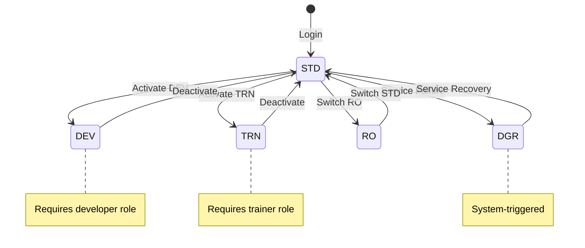
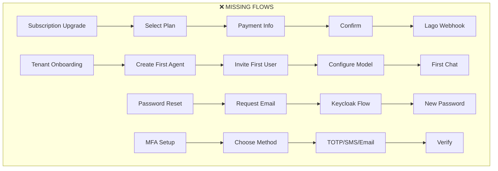

# CANONICAL SaaS Design — Complete UI/UX Specification

**Document ID:** SA01-SAAS-DESIGN-2025-12  
**Version:** 1.0  
**Date:** 2025-12-24  
**Status:** CANONICAL  
**Stack:** Django 5.x + Django Ninja + Lit 3.x + SpiceDB

---

## 1. Role Hierarchy — Complete Permission Model

```
┌─────────────────────────────────────────────────────────────────────────────────────┐
│                              SOMAAGENT SAAS PLATFORM                                 │
└─────────────────────────────────────────────────────────────────────────────────────┘

LEVEL 0: PLATFORM
┌─────────────────────────────────────────────────────────────────────────────────────┐
│ 🔴 SAAS SYSADMIN (God Mode)                                                         │
│    • Create/Delete Tenants                                                          │
│    • Set Subscription Tiers (Free/Starter/Team/Enterprise)                          │
│    • View All Billing/Revenue                                                       │
│    • Platform Feature Flags                                                         │
│    • Impersonate Any Tenant                                                         │
│    Route: /saas/*                                                                   │
└─────────────────────────────────────────────────────────────────────────────────────┘
                                        │
                                        ▼
LEVEL 1: TENANT
┌─────────────────────────────────────────────────────────────────────────────────────┐
│ 🟠 TENANT SYSADMIN (Owner)                   │ 🟡 TENANT ADMIN                      │
│    • Full tenant control                     │    • Manage users (not SysAdmins)    │
│    • Create/Delete Agents                    │    • Configure agents                │
│    • Manage ALL users                        │    • View audit logs                 │
│    • View tenant billing                     │    • Cannot delete agents            │
│    • Tenant settings                         │                                      │
│    Route: /admin/*                           │    Route: /admin/* (limited)         │
└─────────────────────────────────────────────────────────────────────────────────────┘
                                        │
                                        ▼
LEVEL 2: AGENT
┌─────────────────────────────────────────────────────────────────────────────────────┐
│ 🟢 AGENT OWNER     │ 🔵 DEVELOPER      │ 🟣 TRAINER       │ ⚪ USER  │ ⚫ VIEWER  │
│ Full agent control │ DEV+STD modes     │ TRN+STD modes    │ STD mode │ RO mode   │
│ ADM mode access    │ Debug tools       │ Cognitive params │ Chat     │ View only │
│ Route: /agent/*    │ Route: /dev/*     │ Route: /trn/*    │ /chat/*  │ /view/*   │
└─────────────────────────────────────────────────────────────────────────────────────┘

SPECIAL MODE:
┌─────────────────────────────────────────────────────────────────────────────────────┐
│ ⛔ DEGRADED (DGR) — System-triggered when services fail                             │
│    • Limited functionality                                                          │
│    • Session-only memory (SomaBrain down)                                           │
│    • Fallback LLM providers                                                         │
│    • No external tools                                                              │
└─────────────────────────────────────────────────────────────────────────────────────┘
```

---

## 2. Complete Screen Inventory — By Role

### 2.1 🔴 SAAS SYSADMIN Screens (God Mode)

| # | Screen | Route | Component | SpiceDB Permission |
|---|--------|-------|-----------|-------------------|
| 1 | Platform Dashboard | `/saas` | `saas-platform-dashboard.ts` | `platform->manage` |
| 2 | Tenant List | `/saas/tenants` | `saas-tenant-list.ts` | `platform->manage_tenants` |
| 3 | Tenant Create | `/saas/tenants/new` | `saas-tenant-create.ts` | `platform->manage_tenants` |
| 4 | Tenant Detail | `/saas/tenants/:id` | `saas-tenant-detail.ts` | `platform->manage_tenants` |
| 5 | Subscription Tiers | `/saas/subscriptions` | `saas-subscription-tiers.ts` | `platform->configure` |
| 6 | Platform Billing | `/saas/billing` | `saas-platform-billing.ts` | `platform->view_billing` |
| 7 | Revenue Dashboard | `/saas/revenue` | `saas-revenue-dashboard.ts` | `platform->view_billing` |
| 8 | Platform Features | `/saas/features` | `saas-platform-features.ts` | `platform->configure` |
| 9 | System Health | `/saas/health` | `saas-system-health.ts` | `platform->configure` |
| 10 | Audit Log (All) | `/saas/audit` | `saas-platform-audit.ts` | `platform->manage` |
| 11 | Impersonate Tenant | `/saas/impersonate/:id` | N/A (redirect) | `platform->impersonate` |

---

### 2.2 🟠 TENANT SYSADMIN Screens

| # | Screen | Route | Component | SpiceDB Permission |
|---|--------|-------|-----------|-------------------|
| 1 | Tenant Dashboard | `/admin` | `saas-tenant-dashboard.ts` | `tenant->manage` |
| 2 | User List | `/admin/users` | `saas-users.ts` | `tenant->administrate` |
| 3 | User Invite | `/admin/users/invite` | Modal | `tenant->administrate` |
| 4 | User Detail | `/admin/users/:id` | `saas-user-detail.ts` | `tenant->administrate` |
| 5 | Agent List | `/admin/agents` | `saas-agents.ts` | `tenant->create_agent` |
| 6 | Agent Create | `/admin/agents/new` | Modal | `tenant->create_agent` |
| 7 | Agent Config | `/admin/agents/:id` | `saas-agent-config.ts` | `agent->configure` |
| 8 | Agent Users | `/admin/agents/:id/users` | `saas-agent-users.ts` | `agent->configure` |
| 9 | Roles & Permissions | `/admin/roles` | `saas-roles.ts` | `tenant->manage` |
| 10 | Tenant Settings | `/admin/settings` | `saas-tenant-settings.ts` | `tenant->manage` |
| 11 | Integrations | `/admin/integrations` | `saas-integrations.ts` | `tenant->administrate` |
| 12 | Audit Log | `/admin/audit` | `saas-tenant-audit.ts` | `tenant->administrate` |
| 13 | Usage Dashboard | `/admin/usage` | `saas-usage.ts` | `tenant->administrate` |
| 14 | Billing | `/admin/billing` | `saas-tenant-billing.ts` | `tenant->manage` |
| 15 | API Keys | `/admin/api-keys` | `saas-api-keys.ts` | `tenant->manage` |

---

### 2.3 🟡 TENANT ADMIN Screens (Limited)

| # | Screen | Route | Component | SpiceDB Permission |
|---|--------|-------|-----------|-------------------|
| 1 | Tenant Dashboard | `/admin` | `saas-tenant-dashboard.ts` | `tenant->administrate` |
| 2 | User List | `/admin/users` | `saas-users.ts` | `tenant->administrate` |
| 3 | User Invite | `/admin/users/invite` | Modal | `tenant->administrate` |
| 4 | Agent List | `/admin/agents` | `saas-agents.ts` | `tenant->administrate` |
| 5 | Agent Config | `/admin/agents/:id` | `saas-agent-config.ts` | `agent->configure` |
| 6 | Audit Log | `/admin/audit` | `saas-tenant-audit.ts` | `tenant->administrate` |
| 7 | Usage Dashboard | `/admin/usage` | `saas-usage.ts` | `tenant->administrate` |

**Cannot Access:** Billing, API Keys, Roles, Tenant Settings, Delete Agents

---

### 2.4 🟢 AGENT OWNER / ADMIN Screens (ADM Mode)

| # | Screen | Route | Component | SpiceDB Permission |
|---|--------|-------|-----------|-------------------|
| 1 | Agent Overview | `/agent/:id` | `saas-agent-overview.ts` | `agent->configure` |
| 2 | Chat Model Config | `/agent/:id/models/chat` | `saas-chat-model.ts` | `agent->configure` |
| 3 | Utility Model Config | `/agent/:id/models/utility` | `saas-utility-model.ts` | `agent->configure` |
| 4 | Embedding Model Config | `/agent/:id/models/embedding` | `saas-embedding-model.ts` | `agent->configure` |
| 5 | Memory Settings | `/agent/:id/memory` | `saas-memory-settings.ts` | `agent->configure` |
| 6 | Feature Flags | `/agent/:id/features` | `saas-feature-flags.ts` | `agent->configure` |
| 7 | Voice Settings | `/agent/:id/voice` | `saas-voice-settings.ts` | `agent->configure` |
| 8 | MCP Servers | `/agent/:id/mcp` | `saas-mcp-config.ts` | `agent->configure` |
| 9 | Agent Users | `/agent/:id/users` | `saas-agent-users.ts` | `agent->configure` |
| 10 | Agent Themes | `/agent/:id/themes` | `saas-agent-themes.ts` | `agent->configure` |
| 11 | Agent Logs | `/agent/:id/logs` | `saas-agent-logs.ts` | `agent->configure` |

---

### 2.5 🔵 DEVELOPER Screens (DEV Mode)

| # | Screen | Route | Component | SpiceDB Permission |
|---|--------|-------|-----------|-------------------|
| 1 | Debug Console | `/dev/console` | `saas-debug-console.ts` | `agent->activate_dev` |
| 2 | API Logs | `/dev/logs` | `saas-api-logs.ts` | `agent->activate_dev` |
| 3 | MCP Inspector | `/dev/mcp` | `saas-mcp-inspector.ts` | `agent->activate_dev` |
| 4 | Tool Playground | `/dev/tools` | `saas-tool-playground.ts` | `agent->activate_dev` |
| 5 | WebSocket Monitor | `/dev/ws` | `saas-ws-monitor.ts` | `agent->activate_dev` |
| 6 | Component Playground | `/dev/components` | `saas-component-playground.ts` | `agent->activate_dev` |
| 7 | Settings View | `/settings` | `saas-settings.ts` | `settings:view` |

**Plus all STD mode screens**

---

### 2.6 🟣 TRAINER Screens (TRN Mode)

| # | Screen | Route | Component | SpiceDB Permission |
|---|--------|-------|-----------|-------------------|
| 1 | Cognitive Panel | `/trn/cognitive` | `saas-cognitive-panel.ts` | `agent->activate_trn` |
| 2 | Neuromodulators | `/trn/neuromodulators` | `saas-neuromodulators.ts` | `cognitive:edit` |
| 3 | Adaptation Settings | `/trn/adaptation` | `saas-adaptation.ts` | `cognitive:edit` |
| 4 | Sleep Cycle Control | `/trn/sleep` | `saas-sleep-control.ts` | `cognitive:edit` |
| 5 | Learning Curves | `/trn/learning` | `saas-learning-curves.ts` | `cognitive:view` |
| 6 | Training Sessions | `/trn/sessions` | `saas-training-sessions.ts` | `cognitive:view` |
| 7 | Memory Browser | `/memory` | `saas-memory-view.ts` | `memory:read` |

**Plus all STD mode screens**

---

### 2.7 ⚪ USER Screens (STD Mode)

| # | Screen | Route | Component | SpiceDB Permission |
|---|--------|-------|-----------|-------------------|
| 1 | Chat View | `/chat` | `saas-chat-view.ts` | `chat:send` |
| 2 | Conversation List | `/chat/conversations` | `saas-conversations.ts` | `chat:send` |
| 3 | Memory Browser | `/memory` | `saas-memory-view.ts` | `memory:read` |
| 4 | Tools List | `/tools` | `saas-tools-view.ts` | `tools:execute` |
| 5 | Themes Gallery | `/themes` | `saas-themes-view.ts` | All |
| 6 | User Profile | `/profile` | `saas-profile.ts` | All |
| 7 | User Settings | `/settings` | `saas-settings.ts` | `settings:view` |

---

### 2.8 ⚫ VIEWER Screens (RO Mode)

| # | Screen | Route | Component | SpiceDB Permission |
|---|--------|-------|-----------|-------------------|
| 1 | Chat View (Read) | `/chat` | `saas-chat-view.ts` | `chat:view` |
| 2 | Memory Browser (Read) | `/memory` | `saas-memory-view.ts` | `memory:read` |
| 3 | Settings View | `/settings` | `saas-settings.ts` | `settings:view` |

**Cannot:** Send messages, execute tools, write memories

---

### 2.9 ⛔ DEGRADED Mode (DGR)

| # | Screen | Route | Component | Notes |
|---|--------|-------|-----------|-------|
| 1 | Degraded Chat | `/chat` | `saas-chat-view.ts` | Session-only memory |
| 2 | Status Banner | (overlay) | `saas-degraded-banner.ts` | Shows degraded services |
| 3 | Fallback Settings | `/settings` | `saas-settings.ts` | View only |

**Behavior:**
- SomaBrain down → Session-only context
- LLM down → Fallback provider
- Voice down → Text-only
- Tools down → Disabled

---

## 3. Complete Navigation Flows

### 3.1 Authentication Flow

```mermaid
flowchart TD
    A[User visits /] --> B{Authenticated?}
    B -->|No| C[/login]
    B -->|Yes| D{Check Role}
    
    C --> E[Enter credentials]
    E --> F[Keycloak OAuth]
    F --> G[JWT Token]
    G --> H[Store in httpOnly cookie]
    H --> D
    
    D -->|SAAS Admin| I[/saas - Platform Dashboard]
    D -->|Tenant Admin| J[/admin - Tenant Dashboard]
    D -->|Agent User| K[/chat - Chat View]
    D -->|Viewer| L[/chat - Read Only]
    
    I --> M[SpiceDB: platform->manage]
    J --> N[SpiceDB: tenant->administrate]
    K --> O[SpiceDB: chat:send]
    L --> P[SpiceDB: chat:view]
```

---

### 3.2 SAAS Admin Journey

```mermaid
flowchart LR
    subgraph Platform["🔴 SAAS ADMIN"]
        A[/saas] --> B[/saas/tenants]
        B --> C[Create Tenant]
        B --> D[View Tenant]
        D --> E[Suspend/Delete]
        D --> F[Impersonate]
        
        A --> G[/saas/subscriptions]
        G --> H[Edit Tiers]
        
        A --> I[/saas/billing]
        I --> J[Revenue Reports]
        
        A --> K[/saas/features]
        K --> L[Platform Flags]
        
        A --> M[/saas/health]
        M --> N[Service Status]
    end
```

---

### 3.3 Tenant Admin Journey

```mermaid
flowchart LR
    subgraph Tenant["🟠 TENANT ADMIN"]
        A[/admin] --> B[/admin/users]
        B --> C[Invite User]
        B --> D[Edit Role]
        B --> E[Remove User]
        
        A --> F[/admin/agents]
        F --> G[Create Agent]
        F --> H[Configure Agent]
        H --> I[Models]
        H --> J[Features]
        H --> K[Users]
        
        A --> L[/admin/settings]
        L --> M[Branding]
        L --> N[Security]
        L --> O[API Keys]
        
        A --> P[/admin/billing]
        P --> Q[Usage]
        P --> R[Invoices]
        P --> S[Upgrade Plan]
    end
```

---

### 3.4 Agent User Journey (STD Mode)

```mermaid
flowchart LR
    subgraph Agent["⚪ AGENT USER"]
        A[/chat] --> B[New Conversation]
        A --> C[Continue Conversation]
        
        B --> D[Send Message]
        C --> D
        D --> E{Voice Enabled?}
        E -->|Yes| F[Voice Input]
        E -->|No| G[Text Input]
        F --> H[Transcribe]
        H --> D
        
        D --> I[LLM Response]
        I --> J{Tool Call?}
        J -->|Yes| K[Execute Tool]
        K --> I
        J -->|No| L[Display Response]
        
        L --> M{Save Memory?}
        M -->|Auto| N[SomaBrain Store]
        N --> O[Memory Browser]
        
        A --> P[/settings]
        P --> Q[Theme]
        P --> R[Voice]
        P --> S[Preferences]
    end
```

---

### 3.5 Mode Switching Flow



---

## 4. Screen Wireframes — Key Screens

### 4.1 SAAS Platform Dashboard

```
┌─────────────────────────────────────────────────────────────────────────────┐
│ 🔴 SomaAgent Platform                                        [Admin ▼]      │
├──────────────┬──────────────────────────────────────────────────────────────┤
│              │                                                              │
│ PLATFORM     │  Platform Overview                                           │
│ ─────────    │  ┌────────────┐ ┌────────────┐ ┌────────────┐ ┌────────────┐│
│ 📊 Dashboard │  │   156      │ │   2,340    │ │  $47,500   │ │   99.9%    ││
│ 🏢 Tenants   │  │  Tenants   │ │   Users    │ │   MRR      │ │  Uptime    ││
│ 💳 Billing   │  └────────────┘ └────────────┘ └────────────┘ └────────────┘│
│ 📈 Revenue   │                                                              │
│ ⚙️ Features  │  Active Tenants by Tier                                      │
│ 🏥 Health    │  ┌──────────────────────────────────────────────────────────┐│
│ 📋 Audit     │  │ Enterprise ████████████████████████ 12                   ││
│              │  │ Team       ██████████████████████████████████████ 45     ││
│              │  │ Starter    ████████████████████████████████ 67           ││
│              │  │ Free       ████████████ 32                               ││
│              │  └──────────────────────────────────────────────────────────┘│
│              │                                                              │
│              │  System Health                                               │
│              │  ┌──────────────────────────────────────────────────────────┐│
│              │  │ PostgreSQL 🟢 │ Redis 🟢 │ Kafka 🟢 │ Milvus 🟢          ││
│              │  │ Temporal 🟢   │ Keycloak 🟢│ SomaBrain 🟢│ Lago 🟢        ││
│              │  └──────────────────────────────────────────────────────────┘│
│              │                                                              │
└──────────────┴──────────────────────────────────────────────────────────────┘
```

---

### 4.2 Tenant Dashboard

```
┌─────────────────────────────────────────────────────────────────────────────┐
│ 🟠 Acme Corporation                                    Team Plan [Admin ▼]  │
├──────────────┬──────────────────────────────────────────────────────────────┤
│              │                                                              │
│ DASHBOARD    │  Welcome back, John                                          │
│ ─────────    │                                                              │
│ 📊 Overview  │  ┌────────────┐ ┌────────────┐ ┌────────────┐ ┌────────────┐│
│              │  │  5 / 10    │ │  12 / 50   │ │ 2.1M / 10M │ │  45%       ││
│ MANAGEMENT   │  │  Agents    │ │  Users     │ │  Tokens    │ │  Storage   ││
│ ─────────    │  └────────────┘ └────────────┘ └────────────┘ └────────────┘│
│ 👥 Users     │                                                              │
│ 🤖 Agents    │  Your Agents                                    [Create →]  │
│ 🎭 Roles     │  ┌─────────────────┐ ┌─────────────────┐ ┌─────────────────┐│
│              │  │ 🤖 Support-AI   │ │ 🤖 Sales-Bot    │ │ 🤖 Research-AI  ││
│ CONFIG       │  │ 🟢 Running      │ │ 🟡 Stopped      │ │ 🔴 Error        ││
│ ─────────    │  │ GPT-4o          │ │ Claude-3        │ │ GPT-4o          ││
│ ⚙️ Settings  │  │ 234 sessions    │ │ 45 sessions     │ │ 12 sessions     ││
│ 🔌 Integr.   │  │ [Config] [Stop] │ │ [Config] [Start]│ │ [Config] [Fix]  ││
│              │  └─────────────────┘ └─────────────────┘ └─────────────────┘│
│ MONITORING   │                                                              │
│ ─────────    │  Recent Activity                                             │
│ 📋 Audit     │  ┌──────────────────────────────────────────────────────────┐│
│ 📈 Usage     │  │ 🟢 Jane invited to team              15 min ago          ││
│ 💳 Billing   │  │ 🔵 Agent "Sales-Bot" stopped         1 hour ago          ││
│              │  │ 🟢 Bob changed role: User → Dev      2 hours ago         ││
│              │  └──────────────────────────────────────────────────────────┘│
└──────────────┴──────────────────────────────────────────────────────────────┘
```

---

### 4.3 Agent Chat View (STD Mode)

```
┌─────────────────────────────────────────────────────────────────────────────┐
│ 🤖 Support-AI                                      [Mode: STD ▼] [☰]       │
├──────────────┬──────────────────────────────────────────────────────────────┤
│              │                                                              │
│ CONVERSATIONS│  ┌──────────────────────────────────────────────────────────┐│
│ ─────────────│  │                                                          ││
│ 🆕 New Chat  │  │  🤖 Agent                                    12:34 PM    ││
│ 📝 Database  │  │  Hello! I'm Support-AI. How can I help you today?        ││
│ 📝 API Error │  │                                                          ││
│ 📝 Setup     │  │  ────────────────────────────────────────────────────    ││
│              │  │                                                          ││
│ ─────────────│  │  👤 You                                      12:35 PM    ││
│ QUICK ACCESS │  │  I need help with my PostgreSQL connection.              ││
│ ─────────────│  │                                                          ││
│ 🧠 Memory    │  │  ────────────────────────────────────────────────────    ││
│ 🔧 Tools     │  │                                                          ││
│ ⚙️ Settings  │  │  🤖 Agent                                    12:35 PM    ││
│ 🎨 Theme     │  │  I can help! Let me check your recent configurations...  ││
│              │  │                                                          ││
│ ─────────────│  │  📦 Tool: database_query                                 ││
│ [👤 John]    │  │  Status: ✅ Complete (142ms)                             ││
│ Member       │  │                                                          ││
│              │  │  Found 3 active connections. Your pool is healthy.       ││
│              │  │                                                          ││
│              │  └──────────────────────────────────────────────────────────┘│
│              │                                                              │
│              │  ┌──────────────────────────────────────────────────────────┐│
│              │  │ ➕ │ Type your message...                   🎤 │ ▶️       ││
│              │  └──────────────────────────────────────────────────────────┘│
└──────────────┴──────────────────────────────────────────────────────────────┘
```

---

### 4.4 Cognitive Panel (TRN Mode)

```
┌─────────────────────────────────────────────────────────────────────────────┐
│ 🧠 Cognitive Panel                                         [Mode: TRN]     │
├─────────────────────────────────────────────────────────────────────────────┤
│                                                                             │
│ NEUROMODULATOR SYSTEM (ACE Framework)                                       │
│ ┌─────────────────────────────────────────────────────────────────────────┐ │
│ │                                                                         │ │
│ │ 🔴 Dopamine (Reward/Motivation)      [0.00 ─────────●──────────── 1.00] │ │
│ │    Current: 0.72                                                        │ │
│ │                                                                         │ │
│ │ 🟢 Serotonin (Emotional Stability)   [0.00 ────────●───────────── 1.00] │ │
│ │    Current: 0.65                                                        │ │
│ │                                                                         │ │
│ │ 🔵 Norepinephrine (Alertness)        [0.00 ──────●─────────────── 1.00] │ │
│ │    Current: 0.48                                                        │ │
│ │                                                                         │ │
│ │ 🟣 Acetylcholine (Learning/Memory)   [0.00 ──────────────●─────── 1.00] │ │
│ │    Current: 0.81                                                        │ │
│ │                                                                         │ │
│ └─────────────────────────────────────────────────────────────────────────┘ │
│                                                                             │
│ ADAPTATION PARAMETERS                                                       │
│ ┌───────────────────┬───────────────────┬───────────────────┐               │
│ │ Learning Rate     │ Adaptation Weight │ Consolidation     │               │
│ │ 0.001             │ 1.2               │ 24 hours          │               │
│ └───────────────────┴───────────────────┴───────────────────┘               │
│                                                                             │
│ ACTIONS                                                                     │
│ [🔄 Trigger Sleep Cycle] [🧹 Reset Adaptation] [📊 Export Data]             │
│                                                                             │
│ Last Sleep: 2 hours ago │ Consolidated: 45 memories │ Loops: 234            │
│                                                                             │
└─────────────────────────────────────────────────────────────────────────────┘
```

---

## 5. API Mapping — Django Ninja Endpoints

### 5.1 SAAS Platform API (`/api/v2/saas/*`)

| Endpoint | Method | Permission | Description |
|----------|--------|------------|-------------|
| `/saas/stats` | GET | `platform->manage` | Platform statistics |
| `/saas/tenants` | GET | `platform->manage_tenants` | List all tenants |
| `/saas/tenants` | POST | `platform->manage_tenants` | Create tenant |
| `/saas/tenants/{id}` | GET | `platform->manage_tenants` | Get tenant |
| `/saas/tenants/{id}` | PUT | `platform->manage_tenants` | Update tenant |
| `/saas/tenants/{id}` | DELETE | `platform->manage_tenants` | Delete tenant |
| `/saas/tenants/{id}/suspend` | POST | `platform->manage_tenants` | Suspend tenant |
| `/saas/tenants/{id}/reactivate` | POST | `platform->manage_tenants` | Reactivate tenant |
| `/saas/subscriptions` | GET | `platform->configure` | List tiers |
| `/saas/subscriptions` | PUT | `platform->configure` | Update tiers |
| `/saas/billing/revenue` | GET | `platform->view_billing` | Revenue report |
| `/saas/features` | GET/PUT | `platform->configure` | Platform features |
| `/saas/health` | GET | `platform->manage` | System health |

### 5.2 Tenant Admin API (`/api/v2/admin/*`)

| Endpoint | Method | Permission | Description |
|----------|--------|------------|-------------|
| `/admin/stats` | GET | `tenant->administrate` | Tenant statistics |
| `/admin/users` | GET | `tenant->administrate` | List users |
| `/admin/users` | POST | `tenant->administrate` | Invite user |
| `/admin/users/{id}` | GET/PUT/DELETE | `tenant->administrate` | User CRUD |
| `/admin/agents` | GET | `tenant->administrate` | List agents |
| `/admin/agents` | POST | `tenant->create_agent` | Create agent |
| `/admin/agents/{id}` | GET/PUT | `agent->configure` | Agent config |
| `/admin/agents/{id}` | DELETE | `tenant->manage` | Delete agent |
| `/admin/agents/{id}/users` | GET/POST/DELETE | `agent->configure` | Agent users |
| `/admin/roles` | GET | `tenant->administrate` | List roles |
| `/admin/roles` | POST/PUT | `tenant->manage` | Manage roles |
| `/admin/settings` | GET/PUT | `tenant->manage` | Tenant settings |
| `/admin/audit` | GET | `tenant->administrate` | Audit log |
| `/admin/usage` | GET | `tenant->administrate` | Usage stats |
| `/admin/billing` | GET | `tenant->manage` | Billing info |
| `/admin/billing/upgrade` | POST | `tenant->manage` | Upgrade plan |

### 5.3 Agent API (`/api/v2/agent/*`)

| Endpoint | Method | Permission | Description |
|----------|--------|------------|-------------|
| `/agent/{id}/overview` | GET | `agent->view` | Agent overview |
| `/agent/{id}/config` | GET/PUT | `agent->configure` | Agent config |
| `/agent/{id}/models/*` | GET/PUT | `agent->configure` | Model settings |
| `/agent/{id}/features` | GET/PUT | `agent->configure` | Feature flags |
| `/agent/{id}/voice` | GET/PUT | `agent->configure` | Voice settings |
| `/agent/{id}/mcp` | GET/PUT | `agent->configure` | MCP config |
| `/agent/{id}/themes` | GET/PUT | `agent->configure` | Theme settings |

### 5.4 Chat API (`/api/v2/chat/*`)

| Endpoint | Method | Permission | Description |
|----------|--------|------------|-------------|
| `/chat/conversations` | GET | `chat:view` | List conversations |
| `/chat/conversations` | POST | `chat:send` | New conversation |
| `/chat/conversations/{id}` | GET | `chat:view` | Get conversation |
| `/chat/conversations/{id}` | DELETE | `chat:delete` | Delete conversation |
| `/chat/conversations/{id}/messages` | GET | `chat:view` | Get messages |
| `/chat/conversations/{id}/messages` | POST | `chat:send` | Send message |
| `/chat/stream` | WS | `chat:send` | Stream responses |

### 5.5 Memory API (`/api/v2/memory/*`)

| Endpoint | Method | Permission | Description |
|----------|--------|------------|-------------|
| `/memory` | GET | `memory:read` | List memories |
| `/memory` | POST | `memory:write` | Create memory |
| `/memory/{id}` | GET | `memory:read` | Get memory |
| `/memory/{id}` | PUT | `memory:write` | Update memory |
| `/memory/{id}` | DELETE | `memory:delete` | Delete memory |
| `/memory/search` | POST | `memory:read` | Semantic search |
| `/memory/export` | GET | `memory:export` | Export all |

### 5.6 Cognitive API (`/api/v2/cognitive/*`)

| Endpoint | Method | Permission | Description |
|----------|--------|------------|-------------|
| `/cognitive/neuromodulators` | GET | `cognitive:view` | Get levels |
| `/cognitive/neuromodulators` | PUT | `cognitive:edit` | Set levels |
| `/cognitive/adaptation` | GET | `cognitive:view` | Get params |
| `/cognitive/adaptation` | PUT | `cognitive:edit` | Set params |
| `/cognitive/adaptation/reset` | POST | `cognitive:edit` | Reset |
| `/cognitive/sleep-cycle` | POST | `cognitive:edit` | Trigger sleep |

### 5.7 Voice API (`/api/v2/voice/*`)

| Endpoint | Method | Permission | Description |
|----------|--------|------------|-------------|
| `/voice/settings` | GET/PUT | `voice:configure` | Voice config |
| `/voice/transcribe` | POST | `voice:use` | STT |
| `/voice/synthesize` | POST | `voice:use` | TTS |
| `/voice/voices` | GET | `voice:use` | List voices |
| `/voice/test` | POST | `voice:configure` | Test connection |
| `/voice/stream` | WS | `voice:use` | Real-time voice |

---

## 6. Missing Screens — Gap Analysis

### 6.1 Identified Gaps

| # | Missing Screen | Role | Priority | Notes |
|---|----------------|------|----------|-------|
| 1 | Subscription Upgrade Flow | Tenant | HIGH | Need Lago integration |
| 2 | Invoice History | Tenant | HIGH | Lago webhooks |
| 3 | Payment Method Management | Tenant | HIGH | Stripe/Lago |
| 4 | Tenant Onboarding Wizard | New Tenant | HIGH | First-time setup |
| 5 | Agent Onboarding Wizard | New Agent | MEDIUM | First-time agent config |
| 6 | Password Reset Flow | All | HIGH | Keycloak integration |
| 7 | MFA Setup | All | HIGH | Security requirement |
| 8 | API Key Rotation | Tenant SysAdmin | MEDIUM | Key management |
| 9 | Webhook Configuration | Tenant | MEDIUM | Event subscriptions |
| 10 | Export/Import Config | Tenant | LOW | Backup/restore |
| 11 | Degraded Mode Banner | All | HIGH | Service status |
| 12 | Voice Device Selection | User | MEDIUM | Audio device picker |
| 13 | Theme Editor | Admin | LOW | Custom themes |
| 14 | Report Generation | Tenant | MEDIUM | Usage reports |
| 15 | Notification Center | All | MEDIUM | In-app notifications |

### 6.2 Critical Missing Flows



---

## 7. Technical Architecture

### 7.1 Frontend Stack

```
┌─────────────────────────────────────────────────────────────────────────────┐
│                           FRONTEND ARCHITECTURE                              │
├─────────────────────────────────────────────────────────────────────────────┤
│                                                                             │
│  ┌─────────────────────────────────────────────────────────────────────┐   │
│  │                         Lit 3.x Web Components                       │   │
│  │  ┌───────────────┐ ┌───────────────┐ ┌───────────────┐              │   │
│  │  │ saas-chat-*   │ │ saas-admin-*  │ │ saas-settings-*│             │   │
│  │  └───────────────┘ └───────────────┘ └───────────────┘              │   │
│  └─────────────────────────────────────────────────────────────────────┘   │
│                                    │                                        │
│  ┌─────────────────────────────────▼───────────────────────────────────┐   │
│  │                      Lit Reactive Controllers                        │   │
│  │  ┌─────────────┐ ┌─────────────┐ ┌─────────────┐ ┌─────────────┐   │   │
│  │  │ AuthCtrl    │ │ ThemeCtrl   │ │ ModeCtrl    │ │ VoiceCtrl   │   │   │
│  │  └─────────────┘ └─────────────┘ └─────────────┘ └─────────────┘   │   │
│  └─────────────────────────────────────────────────────────────────────┘   │
│                                    │                                        │
│  ┌─────────────────────────────────▼───────────────────────────────────┐   │
│  │                         somastack-tokens.css                         │   │
│  │           26+ CSS Variables • Glassmorphism • Geist Font            │   │
│  └─────────────────────────────────────────────────────────────────────┘   │
│                                                                             │
└─────────────────────────────────────────────────────────────────────────────┘
```

### 7.2 Backend Stack

```
┌─────────────────────────────────────────────────────────────────────────────┐
│                           BACKEND ARCHITECTURE                               │
├─────────────────────────────────────────────────────────────────────────────┤
│                                                                             │
│  ┌─────────────────────────────────────────────────────────────────────┐   │
│  │                         Django 5.x + Ninja API                       │   │
│  │  ┌───────────────┐ ┌───────────────┐ ┌───────────────┐              │   │
│  │  │ /api/v2/saas  │ │ /api/v2/admin │ │ /api/v2/agent │              │   │
│  │  │ /api/v2/chat  │ │ /api/v2/memory│ │ /api/v2/voice │              │   │
│  │  └───────────────┘ └───────────────┘ └───────────────┘              │   │
│  └─────────────────────────────────────────────────────────────────────┘   │
│                                    │                                        │
│  ┌─────────────┬───────────────────┼───────────────────┬─────────────┐     │
│  │  SpiceDB    │    PostgreSQL     │      Redis        │   Vault     │     │
│  │ Permissions │    Data Store     │      Cache        │   Secrets   │     │
│  └─────────────┴───────────────────┴───────────────────┴─────────────┘     │
│                                    │                                        │
│  ┌─────────────┬───────────────────┼───────────────────┬─────────────┐     │
│  │   Kafka     │    Temporal       │    SomaBrain      │    Lago     │     │
│  │   Events    │   Orchestration   │     Memory        │   Billing   │     │
│  └─────────────┴───────────────────┴───────────────────┴─────────────┘     │
│                                                                             │
└─────────────────────────────────────────────────────────────────────────────┘
```

---

## 8. SpiceDB Permission Schema

```zed
// Platform Level
definition platform {}

definition saas_admin {
    relation platform: platform
    permission manage = platform
    permission manage_tenants = platform
    permission view_billing = platform
    permission configure = platform
    permission impersonate = platform
}

// Tenant Level
definition tenant {
    relation sysadmin: user
    relation admin: user
    relation developer: user
    relation trainer: user
    relation member: user
    relation viewer: user
    relation subscription: subscription_tier
    
    permission manage = sysadmin
    permission administrate = sysadmin + admin
    permission create_agent = sysadmin + admin
    permission develop = sysadmin + admin + developer
    permission train = sysadmin + admin + trainer
    permission use = sysadmin + admin + developer + trainer + member
    permission view = sysadmin + admin + developer + trainer + member + viewer
}

// Agent Level
definition agent {
    relation tenant: tenant
    relation owner: user
    relation admin: user
    relation developer: user
    relation trainer: user
    relation user: user
    relation viewer: user
    
    permission configure = owner + admin + tenant->administrate
    permission activate_adm = owner + admin
    permission activate_dev = owner + admin + developer
    permission activate_trn = owner + admin + trainer
    permission activate_std = owner + admin + developer + trainer + user
    permission activate_ro = owner + admin + developer + trainer + user + viewer
    permission view = activate_ro
}

// Subscription
definition subscription_tier {
    relation owner: tenant
    // Limits: max_agents, max_users, max_tokens, max_storage
}
```

---

## 9. Summary — Total Screen Count

| Role | Screens | Routes |
|------|---------|--------|
| 🔴 SAAS SysAdmin | 11 | `/saas/*` |
| 🟠 Tenant SysAdmin | 15 | `/admin/*` |
| 🟡 Tenant Admin | 7 | `/admin/*` (limited) |
| 🟢 Agent Owner/Admin | 11 | `/agent/:id/*` |
| 🔵 Developer (DEV) | 7 + STD | `/dev/*` |
| 🟣 Trainer (TRN) | 7 + STD | `/trn/*` |
| ⚪ User (STD) | 7 | `/chat/*`, `/memory/*` |
| ⚫ Viewer (RO) | 3 | Read-only views |
| ⛔ Degraded (DGR) | 2 | Limited views |
| **TOTAL UNIQUE** | **~55 screens** | |

---

**Document Status:** CANONICAL  
**Last Updated:** 2025-12-24  
**Next Document:** CANONICAL_SAAS_TASKS.md (Implementation Tasks)
