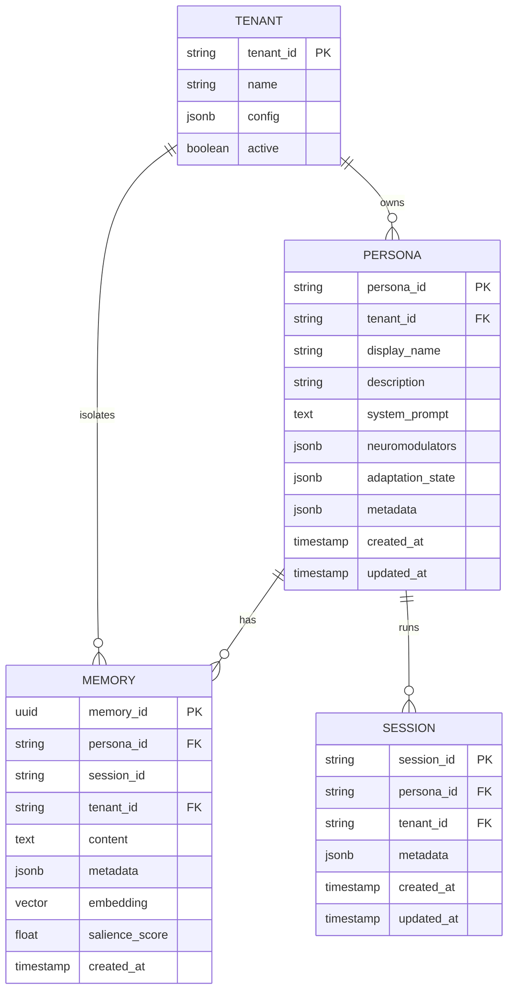
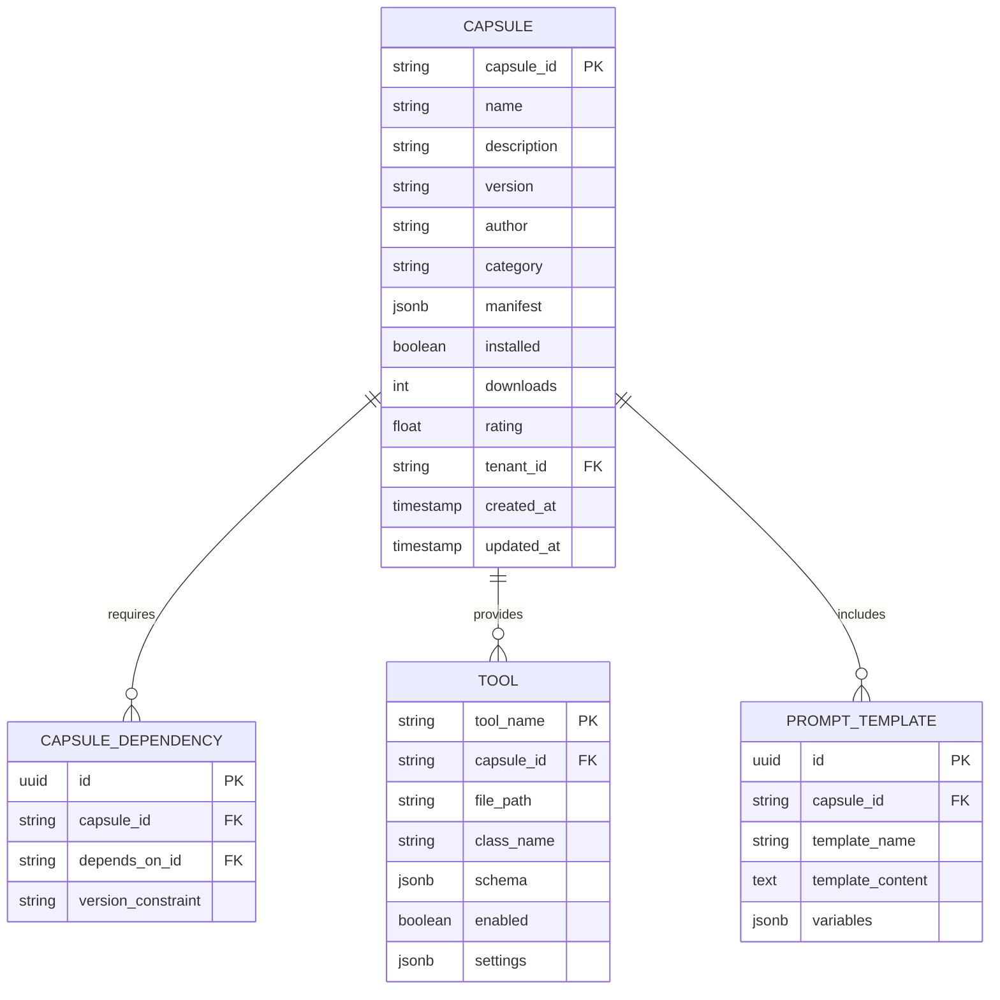
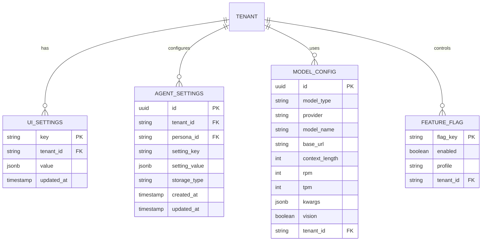
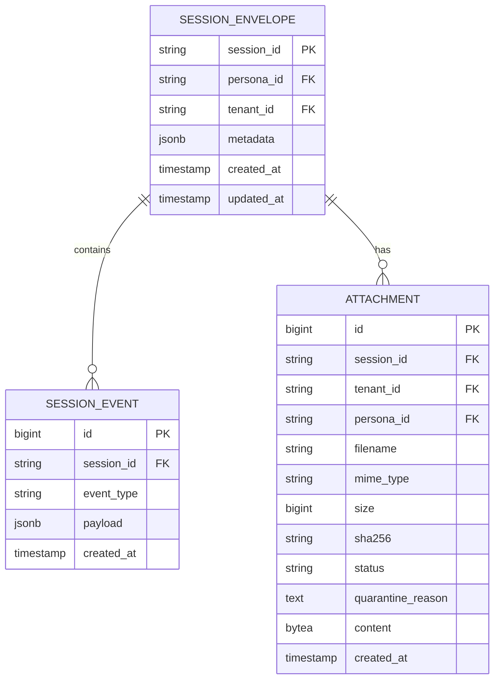
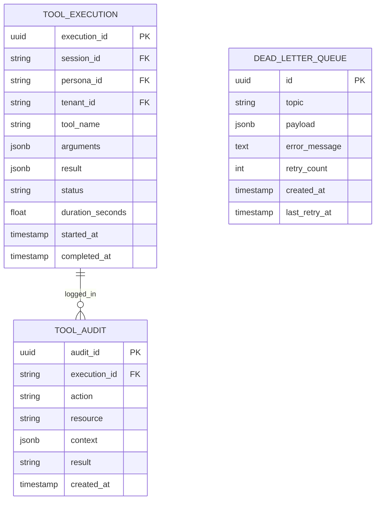
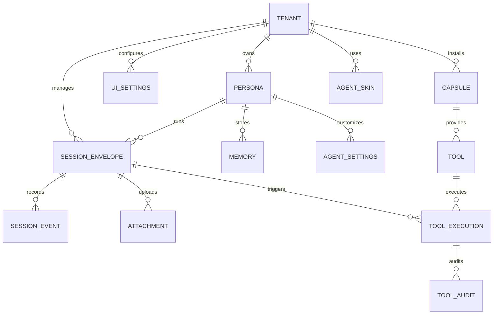

# 📊 COMPLETE DATA MODELS
## All somaAgent01 Entity Relationships

---

## 1. PERSONA SYSTEM

### Persona Entity



---

## 2. CAPSULE SYSTEM

### Capsule Entity



---

## 3. SETTINGS SYSTEM

### Settings Entities



---

## 4. SESSION & EVENTS SYSTEM

### Session Events (Event Sourcing)



---

## 5. TOOL EXECUTION SYSTEM

### Tool Execution Entities



---

## 6. AGENTSKIN SYSTEM

### AgentSkin Entities

```mermaid
erDiagram
    AGENT_SKIN {
        uuid id PK
        string name UNIQUE
        string description
        string version
        string author
        string license
        text[] tags
        jsonb variables
        string preview_url
        int downloads
        decimal rating
        boolean active
        string tenant_id FK
        timestamp created_at
        timestamp updated_at
    }
    
    SKIN_RATING {
        uuid id PK
        uuid skin_id FK
        string user_id
        int rating
        text review
        timestamp created_at
    }
    
    AGENT_SKIN ||--o{ SKIN_RATING : "has"
```

---

## 7. COMPLETE SYSTEM OVERVIEW

### All Systems Integration



---

## 8. STORAGE DISTRIBUTION

### Data Storage by System

| Entity | Storage | Reason |
|--------|---------|--------|
| **Persona** | SomaBrain | Cognitive state, neuromodulation |
| **Memory** | SomaBrain | Vector embeddings, semantic search |
| **Session Events** | PostgreSQL | Event sourcing, full history |
| **Attachments** | PostgreSQL (BYTEA) | Direct blob storage |
| **UI Settings** | PostgreSQL | Non-sensitive config |
| **Agent Settings (secrets)** | Vault | API keys, passwords |
| **Capsules** | In-Memory → PostgreSQL | Plugin metadata |
| **AgentSkins** | PostgreSQL | Theme variables |
| **Tool Executions** | PostgreSQL | Audit trail |
| **Session Cache** | Redis | Fast metadata access |
| **Feature Flags** | Environment | Deployment config |

---

## 9. RELATIONSHIPS SUMMARY

**Total Entities:** 20+  
**Storage Systems:** 4 (PostgreSQL, SomaBrain, Vault, Redis)  
**Key Patterns:**
- Multi-tenancy via `tenant_id`
- Persona isolation via `persona_id`
- Event sourcing for sessions
- Vector storage for memories
- BLOB storage for attachments

**All diagrams use Mermaid ER format for consistency!** 📊
