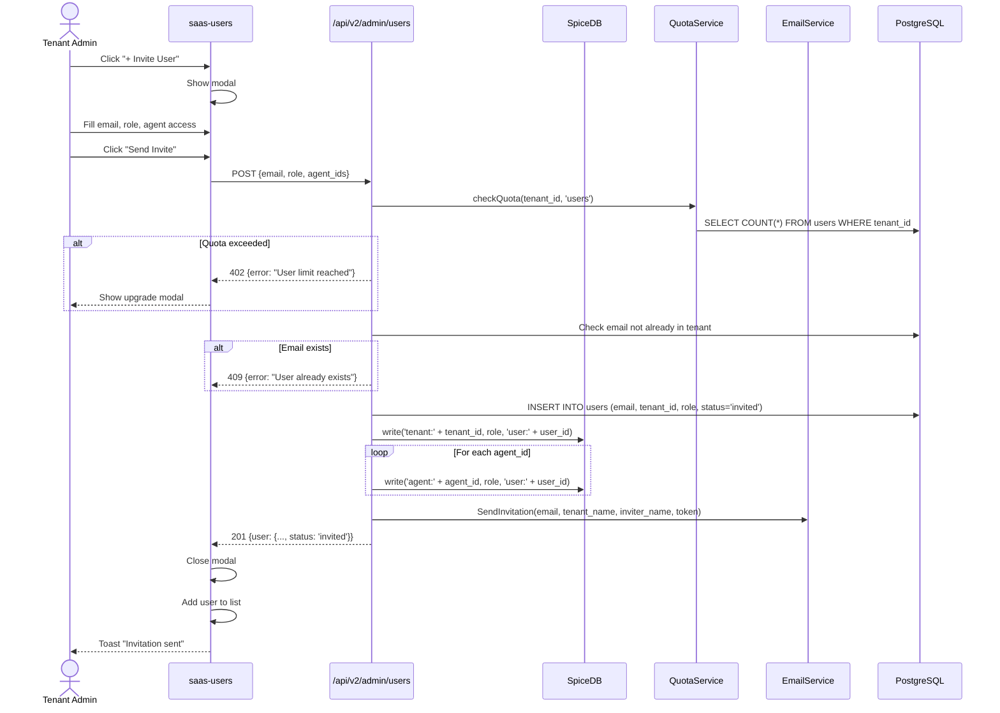
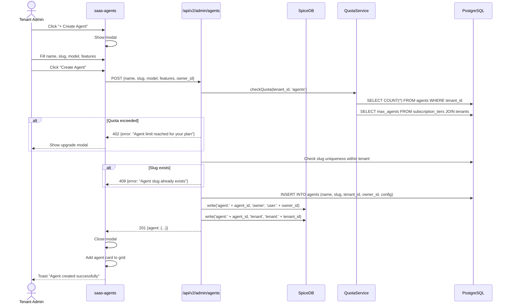

# Tenant Admin — Complete UI SRS

**Document ID:** SA01-TENANT-ADMIN-UI-SRS-2025-12  
**Version:** 1.0  
**Date:** 2025-12-22  
**Status:** CANONICAL  
**Classification:** ENTERPRISE  
**Compliance:** ISO/IEC/IEEE 29148:2018

---

## Document Control

| Field | Value |
|-------|-------|
| Persona | Tenant Administrator |
| Role Codes | `sysadmin`, `admin` |
| SpiceDB Permissions | `tenant->manage`, `tenant->administrate`, `tenant->create_agent` |

---

## 1. Persona Definition

### 1.1 Who is the Tenant Admin?

The **Tenant Administrator** manages a single tenant organization. There are TWO levels:

#### Tenant SysAdmin (Owner)
- Full control over the tenant
- Create/delete agents
- Manage all users
- View billing
- Access tenant-wide settings

#### Tenant Admin
- Manage users (except SysAdmins)
- Configure agents
- View audit logs
- Cannot delete agents

### 1.2 NOT Covered by This Document

- Platform-level administration → See `SAAS_SYSADMIN_UI_SRS.md`
- Agent-level user interactions → See `AGENT_USER_UI_SRS.md`

---

## 2. Complete User Journey

### 2.1 User Flow Diagram

```
┌────────────────────────────────────────────────────────────────────────────────┐
│                         TENANT ADMIN COMPLETE JOURNEY                           │
└────────────────────────────────────────────────────────────────────────────────┘

    ┌─────────────┐
    │   START     │
    └──────┬──────┘
           │
           ▼
    ┌─────────────────────────────────────────────────────────────────────────┐
    │                          AUTHENTICATION PHASE                            │
    │                                                                          │
    │  ┌────────────────┐     ┌────────────────┐     ┌────────────────┐       │
    │  │   /login       │ ──▶ │ Check Role     │ ──▶ │ Token Stored   │       │
    │  │  (Same login)  │     │ (SpiceDB)      │     │                │       │
    │  └────────────────┘     └────────────────┘     └────────┬───────┘       │
    └─────────────────────────────────────────────────────────┬───────────────┘
                                                              │
                                                              ▼
    ┌─────────────────────────────────────────────────────────────────────────┐
    │                          ROLE DETECTION PHASE                            │
    │                                                                          │
    │  Backend: lookup('user:123', 'tenant:acme', 'administrate')             │
    │                                                                          │
    │      ┌─────────────────────────┐                                        │
    │      │ is_tenant_admin?         │                                        │
    │      └────────────┬────────────┘                                        │
    │                   │                                                      │
    │      YES (sysadmin or admin)                                             │
    │                   ▼                                                      │
    │          ┌────────────────┐                                              │
    │          │  /admin        │ (Tenant Dashboard)                          │
    │          └────────┬───────┘                                              │
    └───────────────────┼──────────────────────────────────────────────────────┘
                        │
                        ▼
    ┌─────────────────────────────────────────────────────────────────────────┐
    │                          TENANT ADMIN PHASE                              │
    │                                                                          │
    │  ┌──────────────────────────────────────────────────────────────────┐   │
    │  │                     SIDEBAR NAVIGATION                            │   │
    │  │                                                                   │   │
    │  │  DASHBOARD                                                        │   │
    │  │  📊 Overview ───────────────────▶ /admin                          │   │
    │  │                                                                   │   │
    │  │  MANAGEMENT                                                       │   │
    │  │  👥 Users ──────────────────────▶ /admin/users                    │   │
    │  │  🤖 Agents ─────────────────────▶ /admin/agents                   │   │
    │  │  🎭 Roles ──────────────────────▶ /admin/roles                    │   │
    │  │                                                                   │   │
    │  │  CONFIGURATION                                                    │   │
    │  │  ⚙️ Tenant Settings ────────────▶ /admin/settings                 │   │
    │  │  🔌 Integrations ───────────────▶ /admin/integrations             │   │
    │  │                                                                   │   │
    │  │  MONITORING                                                       │   │
    │  │  📋 Audit Log ──────────────────▶ /admin/audit                    │   │
    │  │  📈 Usage ──────────────────────▶ /admin/usage                    │   │
    │  │  💳 Billing ────────────────────▶ /admin/billing (SysAdmin only)  │   │
    │  │                                                                   │   │
    │  └──────────────────────────────────────────────────────────────────┘   │
    └─────────────────────────────────────────────────────────────────────────┘
```

---

## 3. Screen 1: Tenant Dashboard

### 3.1 Route & Component

| Property | Value |
|----------|-------|
| Route | `/admin` |
| Component | `saas-tenant-dashboard.ts` |
| Permission | `tenant->administrate` |

### 3.2 Wireframe

```
┌─────────────────────────────────────────────────────────────────────────────┐
│ ┌────────────┐ │ Dashboard — Acme Corporation                [John D. ▼]   │
│ │ SomaAgent  │ │────────────────────────────────────────────────────────────│
│ │            │ │                                                            │
│ │ DASHBOARD  │ │ Welcome back, John                                         │
│ │ 📊Overview │◀│ Acme Corporation • Team Plan                               │
│ │            │ │                                                            │
│ │ MANAGEMENT │ │ ┌──────────┐ ┌──────────┐ ┌──────────┐ ┌──────────┐       │
│ │ 👥Users    │ │ │    5     │ │    12    │ │  2.1M    │ │   45%    │       │
│ │ 🤖Agents   │ │ │ Agents   │ │ Users    │ │ Tokens   │ │ Storage  │       │
│ │ 🎭Roles    │ │ │  /10     │ │  /50     │ │ /10M     │ │ /100GB   │       │
│ │            │ │ └──────────┘ └──────────┘ └──────────┘ └──────────┘       │
│ │ CONFIG     │ │                                                            │
│ │ ⚙️Settings │ │ Your Agents                                    [View All →]│
│ │ 🔌Integr.  │ │ ┌────────────────────────────────────────────────────────┐│
│ │            │ │ │ ┌──────────────────┐ ┌──────────────────┐              ││
│ │ MONITORING │ │ │ │ 🤖 Support-AI    │ │ 🤖 Sales-Bot     │              ││
│ │ 📋Audit    │ │ │ │ 🟢 Running       │ │ 🟡 Stopped       │              ││
│ │ 📈Usage    │ │ │ │ GPT-4o • Memory  │ │ Claude-3 • Voice │              ││
│ │ 💳Billing  │ │ │ │ 234 sessions     │ │ 45 sessions      │              ││
│ │            │ │ │ │ [Configure][Stop]│ │ [Configure][Start]│             ││
│ │ ─────────  │ │ │ └──────────────────┘ └──────────────────┘              ││
│ │ [Avatar]   │ │ └────────────────────────────────────────────────────────┘│
│ │ John Doe   │ │                                                            │
│ │ SysAdmin   │ │ Recent Activity                                            │
│ └────────────┘ │ ┌────────────────────────────────────────────────────────┐│
│                │ │ 🟢 Jane invited to team               15 min ago       ││
│                │ │ 🔵 Agent "Sales-Bot" stopped          1 hour ago       ││
│                │ │ 🟢 Bob changed role: User → Developer 2 hours ago      ││
│                │ └────────────────────────────────────────────────────────┘│
└────────────────┴────────────────────────────────────────────────────────────┘
```

---

## 4. Screen 2: User Management

### 4.1 Route & Component

| Property | Value |
|----------|-------|
| Route | `/admin/users` |
| Component | `saas-users.ts` |
| Permission | `tenant->administrate` |

### 4.2 Wireframe

```
┌─────────────────────────────────────────────────────────────────────────────┐
│ [Sidebar]  │ Users                                       [+ Invite User]   │
│            │─────────────────────────────────────────────────────────────────│
│            │                                                                 │
│            │ Using 12 of 50 user seats (Team plan)                          │
│            │ ██████░░░░░░░░░░░░░░░░░░░░░░░░░░░░                             │
│            │                                                                 │
│            │ 🔍 Search users...              [Role ▼] [Status ▼]            │
│            │                                                                 │
│            │ ┌───────────────────────────────────────────────────────────┐ │
│            │ │                                                           │ │
│            │ │  User               Email                Role     Status  │ │
│            │ │ ─────────────────────────────────────────────────────────│ │
│            │ │  👤 John Doe        john@acme.com        SysAdmin 🟢Active│ │
│            │ │                                                    [···]  │ │
│            │ │ ─────────────────────────────────────────────────────────│ │
│            │ │  👤 Jane Smith      jane@acme.com        Admin    🟢Active│ │
│            │ │                                                    [···]  │ │
│            │ │ ─────────────────────────────────────────────────────────│ │
│            │ │  👤 Bob Wilson      bob@acme.com         Developer🟢Active│ │
│            │ │                                                    [···]  │ │
│            │ │ ─────────────────────────────────────────────────────────│ │
│            │ │  👤 Alice Chen      alice@acme.com       Trainer  🟡Invited│ │
│            │ │                                                    [···]  │ │
│            │ │ ─────────────────────────────────────────────────────────│ │
│            │ │  👤 Mike Brown      mike@acme.com        User     🟢Active│ │
│            │ │                                                    [···]  │ │
│            │ │                                                           │ │
│            │ └───────────────────────────────────────────────────────────┘ │
│            │                                                                 │
└────────────┴─────────────────────────────────────────────────────────────────┘
```

### 4.3 Invite User Modal

```
┌─────────────────────────────────────────────────────────┐
│  Invite New User                                     ✕  │
├─────────────────────────────────────────────────────────┤
│                                                         │
│  Email Address *                                        │
│  ┌─────────────────────────────────────────────────┐   │
│  │ newuser@example.com                             │   │
│  └─────────────────────────────────────────────────┘   │
│                                                         │
│  Role *                                                 │
│  ┌─────────────────────────────────────────────────┐   │
│  │ Developer                                   ▼   │   │
│  └─────────────────────────────────────────────────┘   │
│                                                         │
│  ┌─────────────────────────────────────────────────┐   │
│  │ 👨‍💻 DEVELOPER                                    │   │
│  │                                                 │   │
│  │ Can access:                                     │   │
│  │ ✓ DEV mode (debugging, module SDK)              │   │
│  │ ✓ STD mode (chat, memory, tools)                │   │
│  │ ✓ View settings (not edit API keys)             │   │
│  │                                                 │   │
│  │ Cannot access:                                  │   │
│  │ ✗ ADM mode (user management)                    │   │
│  │ ✗ TRN mode (cognitive parameters)               │   │
│  │ ✗ Billing or tenant settings                    │   │
│  └─────────────────────────────────────────────────┘   │
│                                                         │
│  Agent Access                                           │
│  ┌─────────────────────────────────────────────────┐   │
│  │ ☑ Support-AI (developer)                        │   │
│  │ ☑ Sales-Bot (developer)                         │   │
│  │ ☐ Internal-Agent (no access)                    │   │
│  └─────────────────────────────────────────────────┘   │
│                                                         │
├─────────────────────────────────────────────────────────┤
│  [Cancel]                              [Send Invite]    │
└─────────────────────────────────────────────────────────┘
```

### 4.4 Role Hierarchy

| Role | Code | Agent Modes | Can Manage Users | Can Manage Agents |
|------|------|-------------|------------------|-------------------|
| SysAdmin | `sysadmin` | ALL | Yes (all) | Create + Delete |
| Admin | `admin` | STD, ADM | Yes (except SysAdmins) | Configure |
| Developer | `developer` | STD, DEV | No | View config |
| Trainer | `trainer` | STD, TRN | No | View config |
| Member | `member` | STD | No | No |
| Viewer | `viewer` | RO | No | No |

### 4.5 Sequence Diagram - Invite User



---

## 5. Screen 3: Agent Management

### 5.1 Route & Component

| Property | Value |
|----------|-------|
| Route | `/admin/agents` |
| Component | `saas-agents.ts` |
| Permission | `tenant->create_agent` |

### 5.2 Wireframe

```
┌─────────────────────────────────────────────────────────────────────────────┐
│ [Sidebar]  │ Agents                                     [+ Create Agent]   │
│            │─────────────────────────────────────────────────────────────────│
│            │                                                                 │
│            │ Using 5 of 10 agents (Team plan)                               │
│            │ ██████████████████████████░░░░░░░░░░░░░░░░                     │
│            │                                                                 │
│            │ ┌────────────────────────────┐ ┌────────────────────────────┐  │
│            │ │                            │ │                            │  │
│            │ │  🤖 Support-AI             │ │  🤖 Sales-Bot              │  │
│            │ │     [support-ai]           │ │     [sales-bot]            │  │
│            │ │                            │ │                            │  │
│            │ │  Status: 🟢 Running        │ │  Status: 🟡 Stopped        │  │
│            │ │  Model:  GPT-4o            │ │  Model:  Claude-3-Sonnet   │  │
│            │ │                            │ │                            │  │
│            │ │  Features:                 │ │  Features:                 │  │
│            │ │  ✓ Memory (SomaBrain)     │ │  ✓ Memory (SomaBrain)     │  │
│            │ │  ✓ Voice (AgentVoiceBox)  │ │  ✗ Voice                   │  │
│            │ │  ✓ Browser Agent          │ │  ✗ Browser Agent          │  │
│            │ │  ✓ Code Execution         │ │  ✓ Code Execution         │  │
│            │ │                            │ │                            │  │
│            │ │  Sessions: 234 this month  │ │  Sessions: 45 this month   │  │
│            │ │  Tokens:   1.2M used       │ │  Tokens:   340K used       │  │
│            │ │                            │ │                            │  │
│            │ │  ─────────────────────────│ │  ─────────────────────────│  │
│            │ │  [Configure] [Users] [Stop]│ │  [Configure] [Users][Start]│  │
│            │ │                            │ │                            │  │
│            │ └────────────────────────────┘ └────────────────────────────┘  │
│            │                                                                 │
│            │ ┌────────────────────────────┐ ┌────────────────────────────┐  │
│            │ │  🤖 Internal-Agent         │ │  🤖 Research-AI            │  │
│            │ │     [internal-agent]       │ │     [research-ai]          │  │
│            │ │  Status: 🟢 Running        │ │  Status: 🔴 Error          │  │
│            │ │  ...                       │ │  ...                       │  │
│            │ └────────────────────────────┘ └────────────────────────────┘  │
│            │                                                                 │
└────────────┴─────────────────────────────────────────────────────────────────┘
```

### 5.3 Create Agent Modal

```
┌─────────────────────────────────────────────────────────┐
│  Create New Agent                                    ✕  │
├─────────────────────────────────────────────────────────┤
│                                                         │
│  Agent Name *                                           │
│  ┌─────────────────────────────────────────────────┐   │
│  │ Customer Support AI                             │   │
│  └─────────────────────────────────────────────────┘   │
│                                                         │
│  Slug (URL identifier) *                                │
│  ┌─────────────────────────────────────────────────┐   │
│  │ customer-support-ai                             │   │
│  └─────────────────────────────────────────────────┘   │
│  URL: acme.somaagent.io/agent/customer-support-ai       │
│                                                         │
│  Primary Chat Model *                                   │
│  ┌─────────────────────────────────────────────────┐   │
│  │ GPT-4o (OpenAI)                             ▼   │   │
│  └─────────────────────────────────────────────────┘   │
│                                                         │
│  Features                                               │
│  ┌─────────────────────────────────────────────────┐   │
│  │ ☑ Memory Integration (SomaBrain)                │   │
│  │ ☐ Voice Integration (AgentVoiceBox)             │   │
│  │ ☑ Browser Agent                                 │   │
│  │ ☑ Code Execution                                │   │
│  │ ☐ MCP Server Mode                               │   │
│  └─────────────────────────────────────────────────┘   │
│                                                         │
│  Agent Owner *                                          │
│  ┌─────────────────────────────────────────────────┐   │
│  │ john@acme.com (You)                         ▼   │   │
│  └─────────────────────────────────────────────────┘   │
│                                                         │
├─────────────────────────────────────────────────────────┤
│  [Cancel]                              [Create Agent]   │
└─────────────────────────────────────────────────────────┘
```

### 5.4 Sequence Diagram - Create Agent



---

## 6. Screen 4: Agent Configuration

### 6.1 Route & Component

| Property | Value |
|----------|-------|
| Route | `/admin/agents/:id` |
| Component | `saas-agent-config.ts` |
| Permission | `agent->configure` |

### 6.2 Wireframe

```
┌─────────────────────────────────────────────────────────────────────────────┐
│ [Sidebar]  │ ← Back to Agents                                               │
│            │                                                                 │
│            │ Support-AI                                   🟢 Running         │
│            │ support-ai • Created Dec 1, 2024 • Owner: john@acme.com        │
│            │                                                                 │
│            │ [Overview] [Models] [Features] [Users] [Settings] [Logs]       │
│            │─────────────────────────────────────────────────────────────────│
│            │                                                                 │
│            │ Models Tab                                                      │
│            │                                                                 │
│            │ Chat Model *                                                    │
│            │ ┌─────────────────────────────────────────────────────────────┐│
│            │ │ Provider     │ Model           │ Context  │ Vision         ││
│            │ │ OpenAI       │ gpt-4o          │ 128K     │ ✓ Enabled      ││
│            │ └─────────────────────────────────────────────────────────────┘│
│            │ [Change Model]                                                  │
│            │                                                                 │
│            │ Utility Model                                                   │
│            │ ┌─────────────────────────────────────────────────────────────┐│
│            │ │ Provider     │ Model           │ Context  │                 ││
│            │ │ Anthropic    │ claude-3-haiku  │ 200K     │                 ││
│            │ └─────────────────────────────────────────────────────────────┘│
│            │ [Change Model]                                                  │
│            │                                                                 │
│            │ Embedding Model                                                 │
│            │ ┌─────────────────────────────────────────────────────────────┐│
│            │ │ Provider     │ Model           │ Dimensions│                ││
│            │ │ OpenAI       │ text-embed-3-sm │ 1536      │                ││
│            │ └─────────────────────────────────────────────────────────────┘│
│            │ [Change Model]                                                  │
│            │                                                                 │
└────────────┴─────────────────────────────────────────────────────────────────┘
```

### 6.3 Agent User Management Tab

```
┌─────────────────────────────────────────────────────────────────────────────┐
│ [Sidebar]  │ Support-AI › Users                          [+ Add User]      │
│            │─────────────────────────────────────────────────────────────────│
│            │                                                                 │
│            │ Agent-Level Access                                              │
│            │ Users with specific permissions for this agent only            │
│            │                                                                 │
│            │ ┌───────────────────────────────────────────────────────────┐ │
│            │ │                                                           │ │
│            │ │  User               Agent Role        Modes    Actions    │ │
│            │ │ ─────────────────────────────────────────────────────────│ │
│            │ │  👑 John Doe        Owner             ALL      [Remove]   │ │
│            │ │  ⚙️ Jane Smith      Admin             ADM,STD  [Remove]   │ │
│            │ │  👨‍💻 Bob Wilson      Developer         DEV,STD  [Remove]   │ │
│            │ │  🎓 Alice Chen      Trainer           TRN,STD  [Remove]   │ │
│            │ │  👤 Mike Brown      User              STD      [Remove]   │ │
│            │ │  👁️ Lisa Park       Viewer            RO       [Remove]   │ │
│            │ │                                                           │ │
│            │ └───────────────────────────────────────────────────────────┘ │
│            │                                                                 │
│            │ Agent Mode Legend:                                              │
│            │ ADM = Admin Mode • DEV = Developer Mode • TRN = Training Mode  │
│            │ STD = Standard Mode • RO = Read-Only Mode                      │
│            │                                                                 │
└────────────┴─────────────────────────────────────────────────────────────────┘
```

---

## 7. Screen 5: Tenant Settings

### 7.1 Route & Component

| Property | Value |
|----------|-------|
| Route | `/admin/settings` |
| Component | `saas-tenant-settings.ts` |
| Permission | `tenant->manage` (SysAdmin only) |

### 7.2 Wireframe

```
┌─────────────────────────────────────────────────────────────────────────────┐
│ [Sidebar]  │ Tenant Settings                                                │
│            │─────────────────────────────────────────────────────────────────│
│            │                                                                 │
│            │ [General] [Branding] [Security] [API] [Danger Zone]             │
│            │                                                                 │
│            │ General Tab                                                     │
│            │                                                                 │
│            │ Organization Name *                                             │
│            │ ┌─────────────────────────────────────────────────────────────┐│
│            │ │ Acme Corporation                                            ││
│            │ └─────────────────────────────────────────────────────────────┘│
│            │                                                                 │
│            │ Tenant Slug (read-only)                                         │
│            │ ┌─────────────────────────────────────────────────────────────┐│
│            │ │ acme-corp                                      [disabled]   ││
│            │ └─────────────────────────────────────────────────────────────┘│
│            │                                                                 │
│            │ Primary Contact Email *                                         │
│            │ ┌─────────────────────────────────────────────────────────────┐│
│            │ │ admin@acme.com                                              ││
│            │ └─────────────────────────────────────────────────────────────┘│
│            │                                                                 │
│            │ Timezone                                                        │
│            │ ┌─────────────────────────────────────────────────────────────┐│
│            │ │ America/New_York (UTC-5)                                ▼   ││
│            │ └─────────────────────────────────────────────────────────────┘│
│            │                                                                 │
│            │ Default Agent Theme                                             │
│            │ ┌─────────────────────────────────────────────────────────────┐│
│            │ │ Midnight Dark                                           ▼   ││
│            │ └─────────────────────────────────────────────────────────────┘│
│            │                                                                 │
│            │ [Save Changes]                                                  │
│            │                                                                 │
└────────────┴─────────────────────────────────────────────────────────────────┘
```

---

## 8. Screen 6: Tenant Audit Log

### 8.1 Route & Component

| Property | Value |
|----------|-------|
| Route | `/admin/audit` |
| Component | `saas-tenant-audit.ts` |
| Permission | `tenant->administrate` |

### 8.2 Wireframe

```
┌─────────────────────────────────────────────────────────────────────────────┐
│ [Sidebar]  │ Audit Log — Acme Corporation                    [Export CSV]  │
│            │─────────────────────────────────────────────────────────────────│
│            │                                                                 │
│            │ 🔍 Search...    [Action ▼] [User ▼] [Agent ▼] [Date Range ▼]   │
│            │                                                                 │
│            │ ┌───────────────────────────────────────────────────────────┐ │
│            │ │                                                           │ │
│            │ │  Time             User         Action          Resource   │ │
│            │ │ ─────────────────────────────────────────────────────────│ │
│            │ │  14:32:01        john@acme    user.invite     jane@acme   │ │
│            │ │  14:30:45        john@acme    agent.start     Support-AI  │ │
│            │ │  14:15:22        jane@acme    chat.message    Support-AI  │ │
│            │ │  13:55:10        bob@acme     mode.change     DEV→STD     │ │
│            │ │  12:30:00        john@acme    agent.config    Sales-Bot   │ │
│            │ │  11:00:00        alice@acme   memory.write    Support-AI  │ │
│            │ │                                                           │ │
│            │ └───────────────────────────────────────────────────────────┘ │
│            │                                                                 │
│            │ Showing 1-6 of 342 events            [← 1  2  3 ... 58 →]     │
│            │                                                                 │
└────────────┴─────────────────────────────────────────────────────────────────┘
```

---

## 9. Summary: All Tenant Admin Screens

| # | Screen | Route | Component | Permission |
|---|--------|-------|-----------|------------|
| 1 | Dashboard | `/admin` | `saas-tenant-dashboard.ts` | `tenant->administrate` |
| 2 | Users | `/admin/users` | `saas-users.ts` | `tenant->administrate` |
| 3 | Agents | `/admin/agents` | `saas-agents.ts` | `tenant->create_agent` |
| 4 | Agent Config | `/admin/agents/:id` | `saas-agent-config.ts` | `agent->configure` |
| 5 | Roles | `/admin/roles` | `saas-roles.ts` | `tenant->manage` |
| 6 | Settings | `/admin/settings` | `saas-tenant-settings.ts` | `tenant->manage` |
| 7 | Integrations | `/admin/integrations` | `saas-integrations.ts` | `tenant->administrate` |
| 8 | Audit Log | `/admin/audit` | `saas-tenant-audit.ts` | `tenant->administrate` |
| 9 | Usage | `/admin/usage` | `saas-usage.ts` | `tenant->administrate` |
| 10 | Billing | `/admin/billing` | `saas-tenant-billing.ts` | `tenant->manage` |

---

**Document Status:** CANONICAL — Ready for Implementation  
**Previous Document:** `SAAS_SYSADMIN_UI_SRS.md`  
**Next Document:** `AGENT_USER_UI_SRS.md` (Agent modes: STD, TRN, DEV, ADM, RO)
