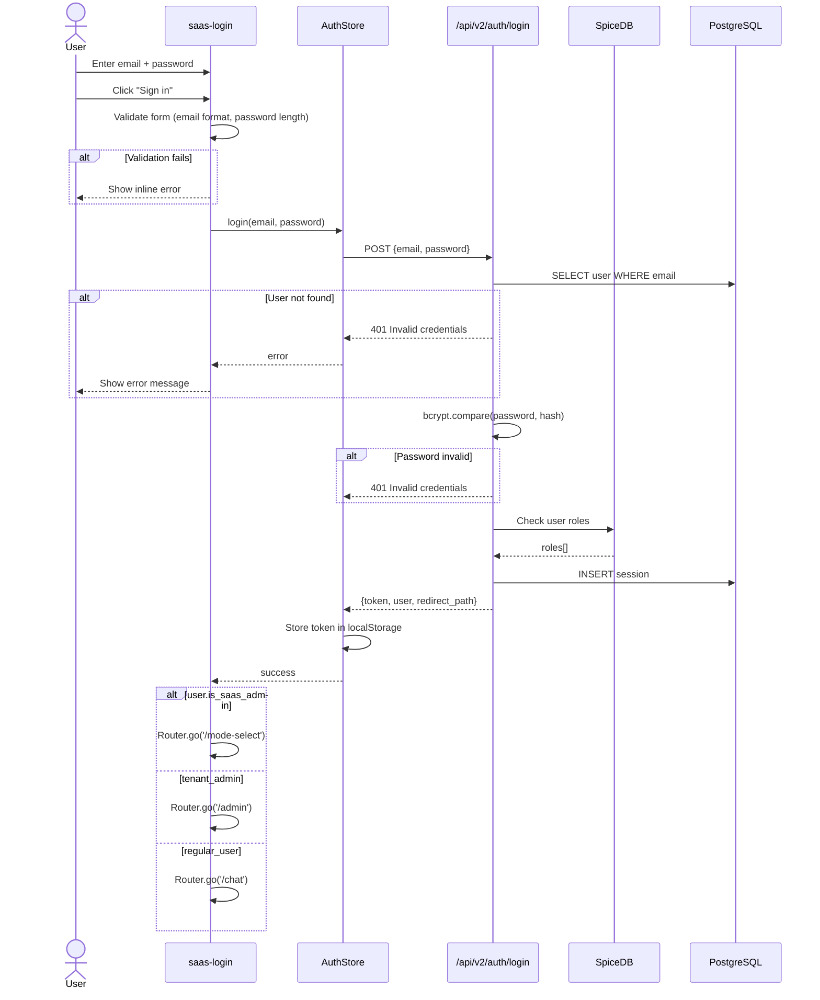
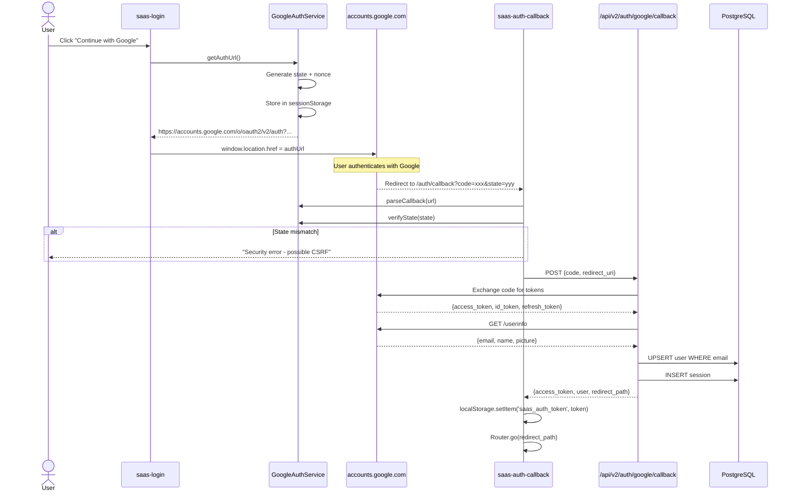
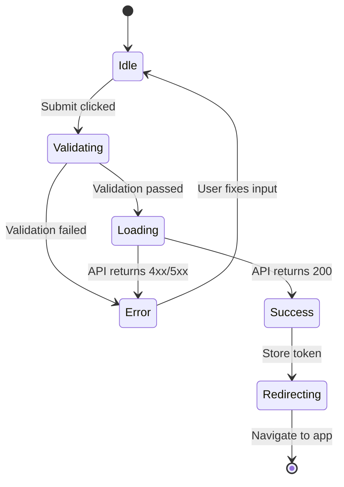
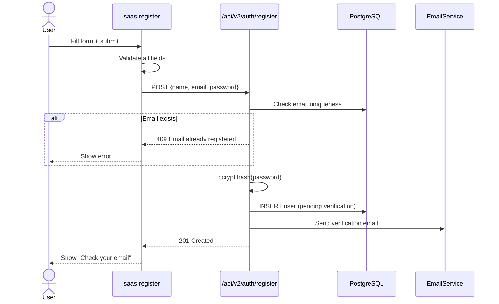
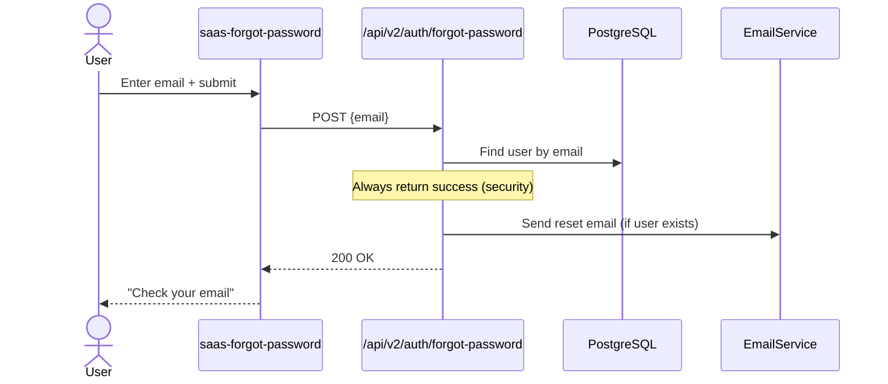
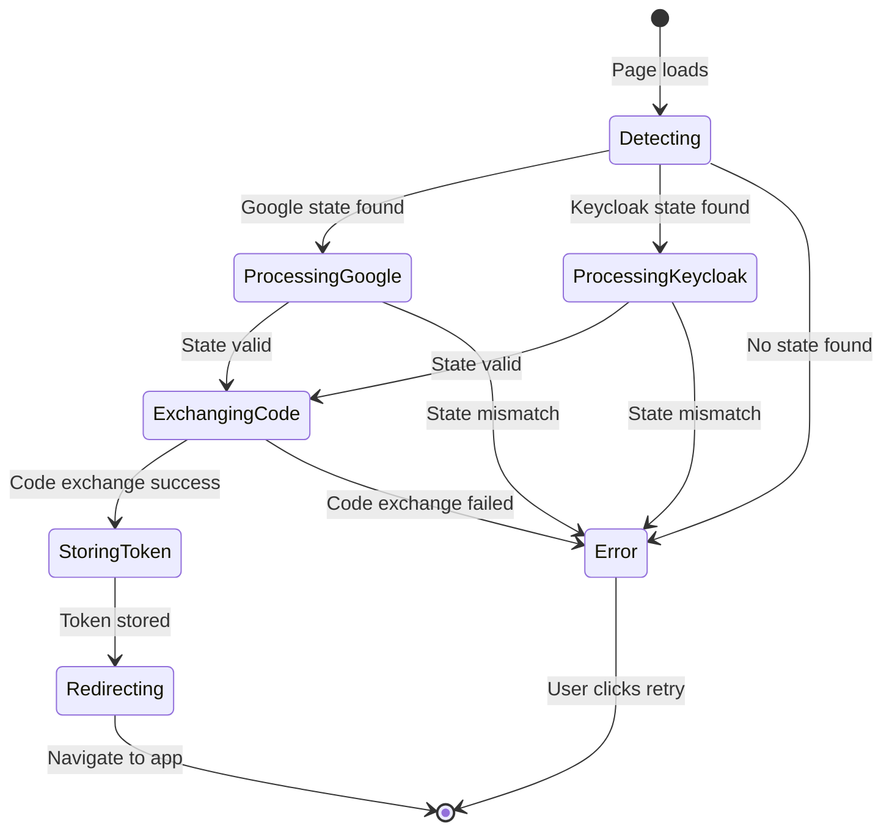
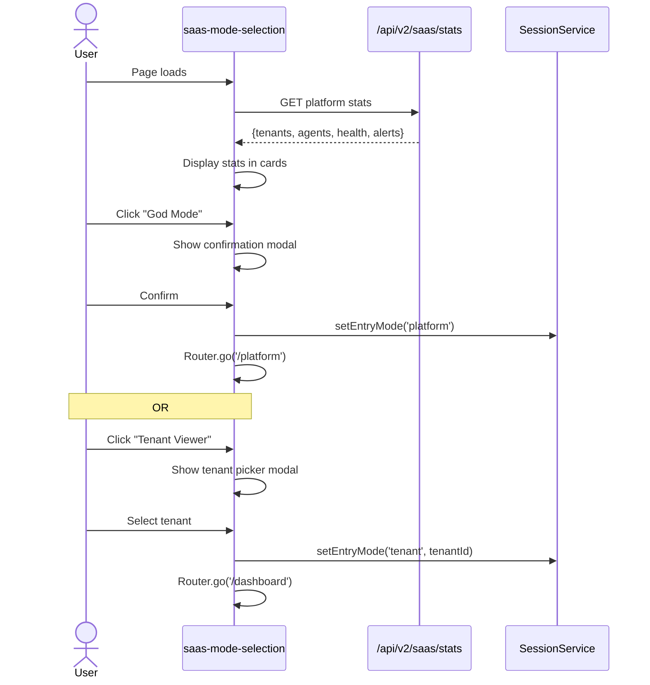
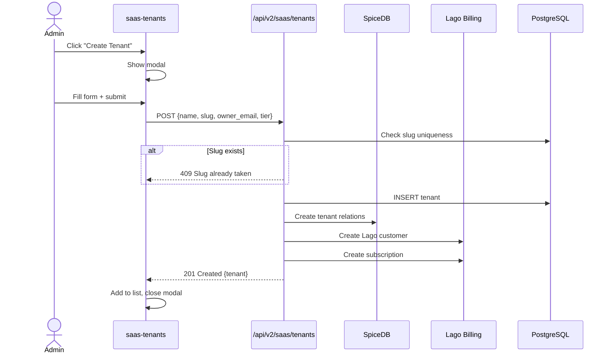
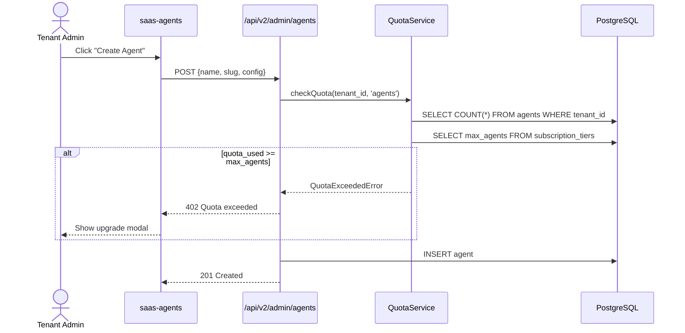
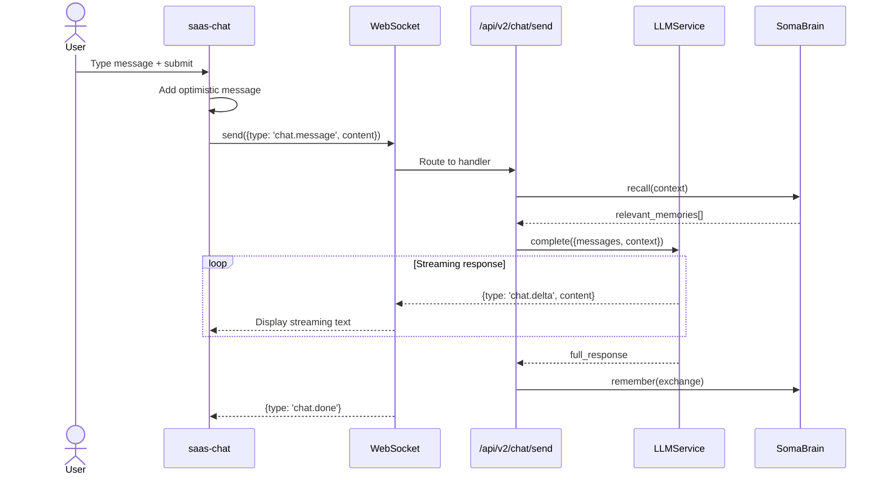

# SomaAgent SaaS — UI Screens SRS

**Document ID:** SA01-UI-SCREENS-SRS-2025-12  
**Version:** 1.0  
**Date:** 2025-12-22  
**Status:** CANONICAL  
**Classification:** ENTERPRISE  
**Compliance:** ISO/IEC/IEEE 29148:2018

---

## Document Control

| Field | Value |
|-------|-------|
| Author | SomaAgent Development Team |
| Approvers | Technical Lead, Product Owner |
| Supersedes | SA01-EOG-UI-ARCH-2025-12 (partial) |

---

## 1. Introduction

### 1.1 Purpose

This document specifies EVERY screen in the SomaAgent SaaS platform with:
- Detailed wireframes and component breakdown
- UML sequence diagrams for user interactions
- State diagrams for complex flows
- API endpoints consumed
- Validation rules
- Accessibility requirements

### 1.2 Scope

**Screens Covered:**
1. Authentication (Login, Register, Forgot Password, Auth Callback)
2. Mode Selection (God Mode users)
3. Platform Admin (Dashboard, Tenants, Billing, Subscriptions)
4. Tenant Admin (Users, Agents, Roles)
5. Core App (Chat, Memory, Tools, Cognitive, Settings)
6. Audit & Security (Audit Log, Security Settings)

---

## 2. Global Navigation

### 2.1 Sidebar Navigation

```
┌────────────────────────────────────────┐
│  [Logo] SomaAgent                      │
│  ◄ ►  (collapse toggle)               │
├────────────────────────────────────────┤
│  STD  TRN  ADM  DEV  RO  (mode tabs)  │
├────────────────────────────────────────┤
│  🔍 Search...                          │
├────────────────────────────────────────┤
│  CORE                                  │
│  💬 Chat                               │
│  📄 Documents              [12]        │
│  🧠 Memory                 [1.2K]      │
├────────────────────────────────────────┤
│  TOOLS                                 │
│  🔧 Tool Catalog           [24]        │
│  🔌 MCP Servers                        │
│  🧬 Cognitive                          │
├────────────────────────────────────────┤
│  PLATFORM                              │
│  📊 Dashboard                          │
│  🏢 Tenants                [5]         │
│  💳 Billing                            │
├────────────────────────────────────────┤
│  ADMIN                                 │
│  👥 Users                  [8]         │
│  🎭 Roles                              │
│  🖥️ Servers                            │
│  📦 Models                             │
├────────────────────────────────────────┤
│  SYSTEM                                │
│  ⚙️ Settings                           │
│  🎨 Themes                             │
│  📋 Audit Log                          │
├────────────────────────────────────────┤
│  [Avatar] SomaAgent                    │
│  Admin • Online                        │
└────────────────────────────────────────┘
```

### 2.2 Top Header

```
┌────────────────────────────────────────────────────────────────────┐
│  🔍 Search                      ⌘ K  │  ❓ Help Center  │ [Avatar] │
└────────────────────────────────────────────────────────────────────┘
```

---

## 3. Authentication Screens

### 3.1 Login Screen

**Route:** `/login`  
**Component:** `saas-login.ts`  
**Permission:** Public

#### 3.1.1 Wireframe

```
┌─────────────────────────────────────────────────────────────────┐
│                          (Page: #f5f5f5)                        │
│                                                                 │
│                    ┌─────────────────────────┐                  │
│                    │     (Card: #ffffff)     │                  │
│                    │                         │                  │
│                    │  ┌───┐ SomaAgent SaaS   │                  │
│                    │  │█▀█│  Admin           │                  │
│                    │  └───┘                  │                  │
│                    │                         │                  │
│                    │  Sign in                │                  │
│                    │  Don't have account?   │                  │
│                    │  [Get started]          │                  │
│                    │                         │                  │
│                    │  ┌─────────────────────┐│                  │
│                    │  │ 🔵 Continue with    ││                  │
│                    │  │    Google           ││                  │
│                    │  └─────────────────────┘│                  │
│                    │                         │                  │
│                    │  ┌─────────────────────┐│                  │
│                    │  │ 🔒 Enterprise SSO   ││                  │
│                    │  └─────────────────────┘│                  │
│                    │                         │                  │
│                    │  ──────── or ────────   │                  │
│                    │                         │                  │
│                    │  Email                  │                  │
│                    │  ┌─────────────────────┐│                  │
│                    │  │ name@company.com    ││                  │
│                    │  └─────────────────────┘│                  │
│                    │                         │                  │
│                    │  Password      [Forgot?]│                  │
│                    │  ┌─────────────────────┐│                  │
│                    │  │ ••••••••            ││                  │
│                    │  └─────────────────────┘│                  │
│                    │                         │                  │
│                    │  ☐ Remember me          │                  │
│                    │                         │                  │
│                    │  ┌─────────────────────┐│                  │
│                    │  │      Sign in        ││ (black btn)     │
│                    │  └─────────────────────┘│                  │
│                    │                         │                  │
│                    │  ─────────────────────  │                  │
│                    │  Powered by SomaTech   │                  │
│                    │                         │                  │
│                    └─────────────────────────┘                  │
│                                                                 │
└─────────────────────────────────────────────────────────────────┘
```

#### 3.1.2 Component Breakdown

| Element | Type | CSS Class | Behavior |
|---------|------|-----------|----------|
| Brand Logo | `<div>` | `.brand-icon` | 40x40px black box with grid icon |
| Brand Name | `<span>` | `.brand-name` | 18px semibold text |
| Title | `<h2>` | `.form-title` | 22px semibold "Sign in" |
| Subtitle | `<p>` | `.form-subtitle` | 14px with link to register |
| Google Button | `<button>` | `.oauth-btn` | Opens Google OAuth popup |
| SSO Button | `<button>` | `.oauth-btn` | Opens Keycloak SSO |
| Divider | `<div>` | `.divider` | "or" with lines |
| Email Input | `<input type="email">` | `.form-input` | Required, autocomplete="email" |
| Password Input | `<input type="password">` | `.form-input` | Required, min 8 chars |
| Remember Checkbox | `<input type="checkbox">` | `.remember-row` | Stores preference |
| Submit Button | `<button type="submit">` | `.submit-btn` | Black, loading state |
| Error Message | `<div>` | `.error-message` | Red background, 1px border |

#### 3.1.3 Sequence Diagram - Email Login



#### 3.1.4 Sequence Diagram - Google OAuth



#### 3.1.5 State Diagram - Login Form



#### 3.1.6 API Endpoints

| Endpoint | Method | Request | Response |
|----------|--------|---------|----------|
| `/api/v2/auth/login` | POST | `{email, password}` | `{token, user, redirect_path}` |
| `/api/v2/auth/google/callback` | POST | `{code, redirect_uri}` | `{token, user, redirect_path}` |

#### 3.1.7 Validation Rules

| Field | Rules |
|-------|-------|
| Email | Required, valid email format |
| Password | Required, min 8 chars |

#### 3.1.8 Accessibility

- All inputs have associated labels
- Focus order: Google → SSO → Email → Password → Remember → Submit
- Error messages linked with `aria-describedby`
- Submit button shows loading state with `aria-busy`

---

### 3.2 Register Screen

**Route:** `/register`  
**Component:** `saas-register.ts`  
**Permission:** Public

#### 3.2.1 Wireframe

```
┌─────────────────────────────────────────────────────────────────┐
│                          (Page: #f5f5f5)                        │
│                                                                 │
│                    ┌─────────────────────────┐                  │
│                    │     (Card: #ffffff)     │                  │
│                    │                         │                  │
│                    │  ┌───┐ SomaAgent SaaS   │                  │
│                    │  │█▀█│  Admin           │                  │
│                    │  └───┘                  │                  │
│                    │                         │                  │
│                    │  Create account         │                  │
│                    │  Already have account? │                  │
│                    │  [Sign in]              │                  │
│                    │                         │                  │
│                    │  ┌─────────────────────┐│                  │
│                    │  │ 🔵 Continue with    ││                  │
│                    │  │    Google           ││                  │
│                    │  └─────────────────────┘│                  │
│                    │                         │                  │
│                    │  ──────── or ────────   │                  │
│                    │                         │                  │
│                    │  Full Name              │                  │
│                    │  ┌─────────────────────┐│                  │
│                    │  │ John Doe            ││                  │
│                    │  └─────────────────────┘│                  │
│                    │                         │                  │
│                    │  Work Email             │                  │
│                    │  ┌─────────────────────┐│                  │
│                    │  │ name@company.com    ││                  │
│                    │  └─────────────────────┘│                  │
│                    │                         │                  │
│                    │  Password               │                  │
│                    │  ┌─────────────────────┐│                  │
│                    │  │ ••••••••            ││                  │
│                    │  └─────────────────────┘│                  │
│                    │  (min 8 chars)          │                  │
│                    │                         │                  │
│                    │  ☐ I agree to Terms    │                  │
│                    │    and Privacy Policy   │                  │
│                    │                         │                  │
│                    │  ┌─────────────────────┐│                  │
│                    │  │   Create account    ││                  │
│                    │  └─────────────────────┘│                  │
│                    │                         │                  │
│                    └─────────────────────────┘                  │
│                                                                 │
└─────────────────────────────────────────────────────────────────┘
```

#### 3.2.2 Component Breakdown

| Element | Type | Validation |
|---------|------|------------|
| Full Name | `<input type="text">` | Required, min 2 chars |
| Work Email | `<input type="email">` | Required, valid email, unique |
| Password | `<input type="password">` | Required, min 8 chars, 1 uppercase, 1 number |
| Terms Checkbox | `<input type="checkbox">` | Required to be checked |
| Submit Button | `<button type="submit">` | Disabled until terms checked |

#### 3.2.3 Sequence Diagram - Registration



#### 3.2.4 API Endpoints

| Endpoint | Method | Request | Response |
|----------|--------|---------|----------|
| `/api/v2/auth/register` | POST | `{name, email, password}` | `{message: "Verification email sent"}` |
| `/api/v2/auth/verify-email` | POST | `{token}` | `{token, user}` |

---

### 3.3 Forgot Password Screen

**Route:** `/forgot-password`  
**Component:** `saas-forgot-password.ts`  
**Permission:** Public

#### 3.3.1 Wireframe

```
┌─────────────────────────────────────────────────────────────────┐
│                          (Page: #f5f5f5)                        │
│                                                                 │
│                    ┌─────────────────────────┐                  │
│                    │     (Card: #ffffff)     │                  │
│                    │                         │                  │
│                    │  ┌───┐ SomaAgent SaaS   │                  │
│                    │  │█▀█│  Admin           │                  │
│                    │  └───┘                  │                  │
│                    │                         │                  │
│                    │  Reset password         │                  │
│                    │  Enter your email and   │                  │
│                    │  we'll send reset link  │                  │
│                    │                         │                  │
│                    │  Email                  │                  │
│                    │  ┌─────────────────────┐│                  │
│                    │  │ name@company.com    ││                  │
│                    │  └─────────────────────┘│                  │
│                    │                         │                  │
│                    │  ┌─────────────────────┐│                  │
│                    │  │   Send reset link   ││                  │
│                    │  └─────────────────────┘│                  │
│                    │                         │                  │
│                    │  ← Back to login        │                  │
│                    │                         │                  │
│                    └─────────────────────────┘                  │
│                                                                 │
└─────────────────────────────────────────────────────────────────┘
```

#### 3.3.2 Sequence Diagram



---

### 3.4 Auth Callback Screen

**Route:** `/auth/callback`  
**Component:** `saas-auth-callback.ts`  
**Permission:** Public

#### 3.4.1 Wireframe

```
┌─────────────────────────────────────────────────────────────────┐
│                          (Page: #f5f5f5)                        │
│                                                                 │
│                                                                 │
│                         ┌──────────┐                            │
│                         │  ◠◡◠    │ (spinning)                 │
│                         └──────────┘                            │
│                                                                 │
│                   Processing authentication...                   │
│                   Please wait while we complete                 │
│                   your sign-in                                  │
│                                                                 │
│   [Error state:]                                                │
│                         Authentication Failed                    │
│                   ┌─────────────────────────┐                   │
│                   │ Invalid state parameter │                   │
│                   └─────────────────────────┘                   │
│                   [Return to Login]                             │
│                                                                 │
└─────────────────────────────────────────────────────────────────┘
```

#### 3.4.2 State Diagram



---

## 4. Mode Selection Screen

**Route:** `/mode-select`  
**Component:** `saas-mode-selection.ts`  
**Permission:** `saas_admin` only

### 4.1 Wireframe

```
┌─────────────────────────────────────────────────────────────────┐
│                   (Page: Dark #0f172a gradient)                 │
│                                                                 │
│                   Select Interface Mode                         │
│                   Access your specialized workspace             │
│                                                                 │
│   ┌─────────────────────────────┐  ┌─────────────────────────── │
│   │  ⚡ God Mode                │  │  🏢 Tenant Viewer          │
│   │     [SUPER ADMIN]           │  │     [STANDARD VIEW]        │
│   ├─────────────────────────────┤  ├─────────────────────────── │
│   │  Full infrastructure        │  │  Focused workspace for     │
│   │  control, multi-tenant      │  │  agent management and      │
│   │  oversight, and system-     │  │  conversation flows.       │
│   │  wide configuration.        │  │                            │
│   ├─────────────────────────────┤  ├─────────────────────────── │
│   │  Tenants    │  Agents       │  │  Last Viewed │  Role       │
│   │  124        │  4502         │  │  Acme Corp   │  Owner      │
│   │  Uptime     │  Alerts       │  │  Agents      │  Events     │
│   │  99.9%      │  2            │  │  5           │  12         │
│   ├─────────────────────────────┤  ├─────────────────────────── │
│   │  Access: Tier 0 (Root)      │  │  Context: Single Tenant    │
│   │          Configure System → │  │          Enter Workspace → │
│   └─────────────────────────────┘  └─────────────────────────── │
│                                                                 │
└─────────────────────────────────────────────────────────────────┘
```

### 4.2 Sequence Diagram



---

## 5. Platform Admin Screens (God Mode)

### 5.1 Platform Dashboard

**Route:** `/platform`  
**Component:** `saas-platform-dashboard.ts`  
**Permission:** `saas_admin`

#### 5.1.1 Wireframe

```
┌─────────────────────────────────────────────────────────────────────────────┐
│ [Sidebar]  │  Platform Dashboard                          [Brian F. ▼]     │
│            │─────────────────────────────────────────────────────────────────│
│ CORE       │                                                                 │
│ 💬 Chat    │  ┌─────────┐  ┌─────────┐  ┌─────────┐  ┌─────────┐           │
│ 📄 Docs    │  │  124    │  │  4,502  │  │ $24.5K  │  │  99.9%  │           │
│ 🧠 Memory  │  │ Tenants │  │ Agents  │  │   MRR   │  │ Uptime  │           │
│            │  └─────────┘  └─────────┘  └─────────┘  └─────────┘           │
│ PLATFORM   │                                                                 │
│ 📊 Dashboard│  Revenue Overview                              [This Month ▼] │
│ 🏢 Tenants │  ┌─────────────────────────────────────────────────────────┐   │
│ 💳 Billing │  │                    📈 Revenue Chart                     │   │
│            │  │     $30K ─────────────────────────┐                     │   │
│ ADMIN      │  │     $20K ───────────────┐        │                     │   │
│ 👥 Users   │  │     $10K ─────┐         │        │                     │   │
│ 🎭 Roles   │  │           Jan  Feb  Mar  Apr  May                       │   │
│            │  └─────────────────────────────────────────────────────────┘   │
│ SYSTEM     │                                                                 │
│ ⚙️ Settings │  Recent Activity                                               │
│ 📋 Audit   │  ┌─────────────────────────────────────────────────────────┐   │
│            │  │ 🟢 Acme Corp        New tenant created      2 min ago   │   │
│ [Avatar]   │  │ 🟡 Globex Inc       Quota warning 80%       15 min ago  │   │
│ SomaAgent  │  │ 🔵 TechStart        Agent deployed          1 hour ago  │   │
│ Admin      │  │ 🟢 DataFlow         Subscription upgraded   2 hours ago │   │
│            │  └─────────────────────────────────────────────────────────┘   │
└─────────────┴───────────────────────────────────────────────────────────────┘
```

#### 5.1.2 Component Breakdown

| Section | Component | Data Source |
|---------|-----------|-------------|
| Stat Cards | `saas-stat-card` × 4 | `GET /api/v2/saas/stats` |
| Revenue Chart | `saas-revenue-chart` | `GET /api/v2/saas/billing/revenue` |
| Activity Feed | `saas-activity-feed` | `GET /api/v2/saas/activity` |
| Health Status | `saas-health-card` | `GET /api/v2/saas/health` |

#### 5.1.3 API Endpoints

| Endpoint | Response |
|----------|----------|
| `GET /api/v2/saas/stats` | `{tenants, agents, mrr, uptime}` |
| `GET /api/v2/saas/billing/revenue` | `{monthly: [{month, revenue}]}` |
| `GET /api/v2/saas/activity` | `{items: [{id, type, tenant, message, time}]}` |

---

### 5.2 Tenant Management

**Route:** `/platform/tenants`  
**Component:** `saas-tenants.ts`  
**Permission:** `saas_admin->manage_tenants`

#### 5.2.1 Wireframe

```
┌─────────────────────────────────────────────────────────────────────────────┐
│ [Sidebar]  │  Tenants                                  [+ Create Tenant]    │
│            │─────────────────────────────────────────────────────────────────│
│            │  🔍 Search tenants...          [Status ▼] [Tier ▼] [Sort ▼]    │
│            │                                                                 │
│            │  ┌───────────────────────────────────────────────────────────┐ │
│            │  │ Name          │ Status  │ Tier      │ Agents │ Created    │ │
│            │  ├───────────────────────────────────────────────────────────┤ │
│            │  │ Acme Corp     │ 🟢 Active│ Enterprise│ 45     │ Dec 1, 24  │ │
│            │  │ Globex Inc    │ 🟢 Active│ Team      │ 12     │ Nov 15, 24 │ │
│            │  │ TechStart     │ 🟡 Pend. │ Starter   │ 3      │ Dec 20, 24 │ │
│            │  │ DataFlow      │ 🔴 Susp. │ Free      │ 1      │ Oct 5, 24  │ │
│            │  └───────────────────────────────────────────────────────────┘ │
│            │                                                                 │
│            │  Showing 1-4 of 124 tenants              [← 1 2 3 ... 32 →]   │
│            │                                                                 │
└─────────────┴───────────────────────────────────────────────────────────────┘
```

#### 5.2.2 Row Actions

| Action | Icon | Permission | Behavior |
|--------|------|------------|----------|
| View Details | 👁️ | `view` | Opens tenant detail panel |
| Edit | ✏️ | `manage_tenants` | Opens edit modal |
| Enter Tenant | ➡️ | `manage_tenants` | Impersonate as tenant admin |
| Suspend | ⏸️ | `manage_tenants` | Sets status to suspended |
| Delete | 🗑️ | `manage_tenants` | Soft delete with confirmation |

#### 5.2.3 Create Tenant Modal

```
┌────────────────────────────────────────────┐
│  Create Tenant                         ✕   │
├────────────────────────────────────────────┤
│                                            │
│  Organization Name *                       │
│  ┌────────────────────────────────────┐   │
│  │ Acme Corporation                   │   │
│  └────────────────────────────────────┘   │
│                                            │
│  Slug (URL identifier) *                   │
│  ┌────────────────────────────────────┐   │
│  │ acme-corp                          │   │
│  └────────────────────────────────────┘   │
│  Will be: app.somaagent.io/acme-corp       │
│                                            │
│  Owner Email *                             │
│  ┌────────────────────────────────────┐   │
│  │ admin@acme.com                     │   │
│  └────────────────────────────────────┘   │
│                                            │
│  Subscription Tier                         │
│  ┌────────────────────────────────────┐   │
│  │ Starter ($49/mo)              ▼   │   │
│  └────────────────────────────────────┘   │
│                                            │
├────────────────────────────────────────────┤
│  [Cancel]                    [Create]      │
└────────────────────────────────────────────┘
```

#### 5.2.4 Sequence Diagram - Create Tenant



---

### 5.3 Billing Dashboard

**Route:** `/platform/billing`  
**Component:** `saas-billing.ts`  
**Permission:** `saas_admin->view_billing`

#### 5.3.1 Wireframe

```
┌─────────────────────────────────────────────────────────────────────────────┐
│ [Sidebar]  │  Billing & Revenue                              [This Year ▼] │
│            │─────────────────────────────────────────────────────────────────│
│            │                                                                 │
│            │  ┌─────────┐  ┌─────────┐  ┌─────────┐  ┌─────────┐           │
│            │  │ $24.5K  │  │  $2.1K  │  │   87    │  │   12    │           │
│            │  │   MRR   │  │  ARPU   │  │ Paying  │  │  Churn  │           │
│            │  │ ↑ 12%   │  │ ↑ 5%    │  │ ↑ 8     │  │ ↓ 3     │           │
│            │  └─────────┘  └─────────┘  └─────────┘  └─────────┘           │
│            │                                                                 │
│            │  Revenue by Tier                    Subscription Distribution   │
│            │  ┌────────────────────────┐        ┌────────────────────────┐ │
│            │  │ Enterprise ████████ 45%│        │    🟢 Enterprise 45%   │ │
│            │  │ Team       █████   32% │        │    🔵 Team 32%         │ │
│            │  │ Starter    ███     18% │        │    🟡 Starter 18%      │ │
│            │  │ Free       █       5%  │        │    ⚪ Free 5%          │ │
│            │  └────────────────────────┘        └────────────────────────┘ │
│            │                                                                 │
│            │  Recent Invoices                                [View All →]   │
│            │  ┌───────────────────────────────────────────────────────────┐ │
│            │  │ Invoice     │ Tenant      │ Amount  │ Status  │ Date      │ │
│            │  │ INV-2024-12 │ Acme Corp   │ $499    │ 🟢 Paid │ Dec 1     │ │
│            │  │ INV-2024-11 │ Globex      │ $199    │ 🟢 Paid │ Dec 1     │ │
│            │  │ INV-2024-10 │ TechStart   │ $49     │ 🟡 Pend │ Dec 1     │ │
│            │  └───────────────────────────────────────────────────────────┘ │
└─────────────┴───────────────────────────────────────────────────────────────┘
```

#### 5.3.2 API Endpoints (Lago Integration)

| Endpoint | Lago API | Purpose |
|----------|----------|---------|
| `GET /api/v2/saas/billing/metrics` | `GET /analytics` | MRR, ARPU, churn |
| `GET /api/v2/saas/billing/revenue` | `GET /analytics/mrr` | Revenue by tier |
| `GET /api/v2/saas/billing/invoices` | `GET /invoices` | Invoice list |
| `GET /api/v2/saas/billing/subscriptions` | `GET /subscriptions` | Subscription breakdown |

---

## 6. Tenant Admin Screens

### 6.1 User Management

**Route:** `/admin/users`  
**Component:** `saas-users.ts`  
**Permission:** `tenant->administrate`

#### 6.1.1 Wireframe

```
┌─────────────────────────────────────────────────────────────────────────────┐
│ [Sidebar]  │  Users                                     [+ Invite User]     │
│            │─────────────────────────────────────────────────────────────────│
│            │  🔍 Search users...                    [Role ▼] [Status ▼]     │
│            │                                                                 │
│            │  ┌───────────────────────────────────────────────────────────┐ │
│            │  │ User              │ Email              │ Role     │Status │ │
│            │  ├───────────────────────────────────────────────────────────┤ │
│            │  │ 👤 John Smith     │ john@acme.com      │ SysAdmin │🟢 Active│ │
│            │  │ 👤 Jane Doe       │ jane@acme.com      │ Admin    │🟢 Active│ │
│            │  │ 👤 Bob Wilson     │ bob@acme.com       │ Developer│🟢 Active│ │
│            │  │ 👤 Alice Chen     │ alice@acme.com     │ Trainer  │🟡 Pending│ │
│            │  │ 👤 Mike Brown     │ mike@acme.com      │ User     │🟢 Active│ │
│            │  └───────────────────────────────────────────────────────────┘ │
│            │                                                                 │
└─────────────┴───────────────────────────────────────────────────────────────┘
```

#### 6.1.2 Invite User Modal

```
┌────────────────────────────────────────────┐
│  Invite User                           ✕   │
├────────────────────────────────────────────┤
│                                            │
│  Email Address *                           │
│  ┌────────────────────────────────────┐   │
│  │ user@example.com                   │   │
│  └────────────────────────────────────┘   │
│                                            │
│  Role *                                    │
│  ┌────────────────────────────────────┐   │
│  │ Developer                     ▼   │   │
│  └────────────────────────────────────┘   │
│                                            │
│  Role Description                          │
│  ┌────────────────────────────────────┐   │
│  │ Can access DEV mode, debug tools,  │   │
│  │ and develop modules/integrations.  │   │
│  └────────────────────────────────────┘   │
│                                            │
├────────────────────────────────────────────┤
│  [Cancel]               [Send Invite]      │
└────────────────────────────────────────────┘
```

#### 6.1.3 Role Definitions

| Role | Code | Permissions |
|------|------|-------------|
| SysAdmin | `sysadmin` | Full tenant control, delete agents, billing access |
| Admin | `admin` | Manage users, configure agents, view audit |
| Developer | `developer` | DEV mode, debugging, module SDK |
| Trainer | `trainer` | TRN mode, cognitive parameters |
| User | `member` | STD mode, chat, memory, tools |
| Viewer | `viewer` | RO mode, read-only access |

---

### 6.2 Agent Management

**Route:** `/admin/agents`  
**Component:** `saas-agents.ts`  
**Permission:** `tenant->create_agent`

#### 6.2.1 Wireframe

```
┌─────────────────────────────────────────────────────────────────────────────┐
│ [Sidebar]  │  Agents                                    [+ Create Agent]    │
│            │─────────────────────────────────────────────────────────────────│
│            │  Using 5 of 10 agents (Team plan)                              │
│            │  ████████░░░░░░░░░░░░                                          │
│            │                                                                 │
│            │  ┌─────────────────────┐  ┌─────────────────────┐              │
│            │  │ SomaAgent-Prod      │  │ SomaAgent-Dev       │              │
│            │  │ 🟢 Running          │  │ 🟡 Stopped          │              │
│            │  │ Chat: GPT-4o        │  │ Chat: Claude-3      │              │
│            │  │ Memory: ✓ Enabled   │  │ Memory: ✓ Enabled   │              │
│            │  │ Voice: ✓ Enabled    │  │ Voice: ✗ Disabled   │              │
│            │  │ Sessions: 1.2K      │  │ Sessions: 45        │              │
│            │  ├─────────────────────┤  ├─────────────────────┤              │
│            │  │ [Configure] [Stop]  │  │ [Configure] [Start] │              │
│            │  └─────────────────────┘  └─────────────────────┘              │
│            │                                                                 │
└─────────────┴───────────────────────────────────────────────────────────────┘
```

#### 6.2.2 Quota Enforcement



---

## 7. Core App Screens

### 7.1 Chat View

**Route:** `/chat`  
**Component:** `saas-chat.ts`  
**Permission:** `tenant->use`

#### 7.1.1 Wireframe

```
┌─────────────────────────────────────────────────────────────────────────────┐
│ [Sidebar]  │  💬 AI Chat                                  [+ New Chat]      │
│            │─────────────────────────────────────────────────────────────────│
│            │                                                                 │
│            │                            You  2 min ago                       │
│            │                     ┌────────────────────────────┐              │
│            │                     │ 🎵 ▶ ●●●|||●●●||●●● 0:23 │              │
│            │                     └────────────────────────────┘              │
│            │                                                                 │
│            │   Eye of God  1 min ago                                         │
│            │   ┌────────────────────────────────────────────────────────┐   │
│            │   │ 🎵 ▶ ●●●|||●●●|||●●●||● 0:45                          │   │
│            │   └────────────────────────────────────────────────────────┘   │
│            │   Generating transcript...                                      │
│            │                                                                 │
│            │                            You  30 sec ago                      │
│            │                     ┌────────────────────────────┐              │
│            │                     │ What's the current status  │              │
│            │                     │ of the server configuration?│              │
│            │                     └────────────────────────────┘              │
│            │                                                                 │
│            │   Eye of God  Just now                                          │
│            │   ┌────────────────────────────────────────────────────────┐   │
│            │   │ ● ● ●                                                  │   │
│            │   └────────────────────────────────────────────────────────┘   │
│            │                                                                 │
│            │─────────────────────────────────────────────────────────────────│
│            │  🔍 Find in...  ▼                                               │
│            │  ┌───────────────────────────────────────────────────────────┐ │
│            │  │ + │ Write message...                       │ 🎤 │ ▲ │    │ │
│            │  └───────────────────────────────────────────────────────────┘ │
│            │  AI can make mistakes. Check important info.                   │
└─────────────┴───────────────────────────────────────────────────────────────┘
```

#### 7.1.2 Chat Input Component

```
┌─────────────────────────────────────────────────────────────────┐
│  ┌─────────────────────────────────────────────────────────┐   │
│  │ Write message...                                        │   │
│  │                                                         │   │
│  └─────────────────────────────────────────────────────────┘   │
│                                                                 │
│  [ + ]  [ ⚙ Tools ]  [ ✏ Normal ]           [ 🎤 Voice ]  [ ▲ ]│
│                                                                 │
│  Tools Menu:                                                    │
│  ┌─────────────────────────┐                                   │
│  │ 🖼️ Create an image      │                                   │
│  │ 🌐 Search the web       │                                   │
│  │ {·} Write code          │                                   │
│  │ 🔬 Run deep research    │                                   │
│  │ 🧠 Think longer         │                                   │
│  └─────────────────────────┘                                   │
└─────────────────────────────────────────────────────────────────┘
```

#### 7.1.3 Sequence Diagram - Send Message



---

## 8. Settings Screen

**Route:** `/settings`  
**Component:** `saas-settings.ts`  
**Permission:** `tenant->view` (edit requires higher)

### 8.1 Wireframe

```
┌─────────────────────────────────────────────────────────────────────────────┐
│ [Sidebar]  │  Account Settings                                              │
│            │─────────────────────────────────────────────────────────────────│
│            │  GENERAL SETTINGS         │  My Profile                        │
│            │  📱 Apps                   │                                    │
│            │  👤 Account        ◄       │  [Avatar] [+ Change] [Remove]     │
│            │  🔔 Notification           │  We support PNGs, JPEGs and GIFs  │
│            │  🌐 Language & Region      │                                    │
│            │                            │  First Name           Last Name   │
│            │  WORKSPACE SETTINGS        │  ┌────────────┐      ┌──────────┐│
│            │  ⚙ General                 │  │ Brian      │      │Frederiksen││
│            │  👥 Members                │  └────────────┘      └──────────┘│
│            │  💳 Billing                │                                    │
│            │                            │  Account Security                  │
│            │                            │                                    │
│            │                            │  Email                             │
│            │                            │  ┌──────────────────────────────┐ │
│            │                            │  │ brian@example.com  [disabled]│ │
│            │                            │  └──────────────────────────────┘ │
│            │                            │                    [Change email] │
│            │                            │                                    │
│            │                            │  Password                          │
│            │                            │  ┌──────────────────────────────┐ │
│            │                            │  │ ••••••••••        [disabled]│ │
│            │                            │  └──────────────────────────────┘ │
│            │                            │               [Change password]   │
│            │                            │                                    │
│            │                            │  2-Step Verification         [ON] │
│            │                            │  Add additional security...       │
│            │                            │                                    │
│            │                            │  Support Access                    │
│            │                            │  Support access          [ON]     │
│            │                            │  Granted until Aug 31, 9:40 PM    │
│            │                            │                                    │
│            │                            │  Log out of all devices           │
│            │                            │  Log out of all other sessions    │
│            │                            │                        [Log out]  │
│            │                            │                                    │
│            │                            │  Delete my account                 │
│            │                            │  Permanently delete account        │
│            │                            │               [Delete Account]    │
└─────────────┴───────────────────────────────────────────────────────────────┘
```

### 8.2 Settings Tabs Structure

| Tab | Sections | Permission |
|-----|----------|------------|
| Apps | Connected apps, OAuth tokens | `tenant->view` |
| Account | Profile, Security, Devices | `tenant->view` |
| Notification | Email, Push, In-app | `tenant->view` |
| Language | Locale, Timezone | `tenant->view` |
| General | Workspace name, logo | `tenant->administrate` |
| Members | User list, invites | `tenant->administrate` |
| Billing | Subscription, invoices | `tenant->administrate` |

---

## 9. Summary - All Screens

| # | Screen | Route | Component | Status |
|---|--------|-------|-----------|--------|
| 1 | Login | `/login` | `saas-login.ts` | ✅ Exists |
| 2 | Register | `/register` | `saas-register.ts` | ❌ Needs creation |
| 3 | Forgot Password | `/forgot-password` | `saas-forgot-password.ts` | ❌ Needs creation |
| 4 | Auth Callback | `/auth/callback` | `saas-auth-callback.ts` | ✅ Exists |
| 5 | Mode Selection | `/mode-select` | `saas-mode-selection.ts` | ✅ Exists |
| 6 | Platform Dashboard | `/platform` | `saas-platform-dashboard.ts` | ✅ Exists |
| 7 | Tenants | `/platform/tenants` | `saas-tenants.ts` | ✅ Exists |
| 8 | Billing | `/platform/billing` | `saas-billing.ts` | ❌ Needs creation |
| 9 | Subscriptions | `/platform/subscriptions` | `saas-subscriptions.ts` | ❌ Needs creation |
| 10 | Users | `/admin/users` | `saas-users.ts` | ❌ Needs creation |
| 11 | Agents | `/admin/agents` | `saas-agents.ts` | ❌ Needs creation |
| 12 | Chat | `/chat` | `saas-chat.ts` | ✅ Exists |
| 13 | Memory | `/memory` | `saas-memory.ts` | ✅ Exists |
| 14 | Tools | `/tools` | `saas-tools.ts` | ✅ Exists |
| 15 | Cognitive | `/cognitive` | `saas-cognitive.ts` | ✅ Exists |
| 16 | Settings | `/settings` | `saas-settings.ts` | ✅ Exists |
| 17 | Themes | `/themes` | `saas-themes.ts` | ✅ Exists |
| 18 | Audit Log | `/audit` | `saas-audit.ts` | ❌ Needs creation |

---

**Document Status:** CANONICAL — Ready for Implementation
