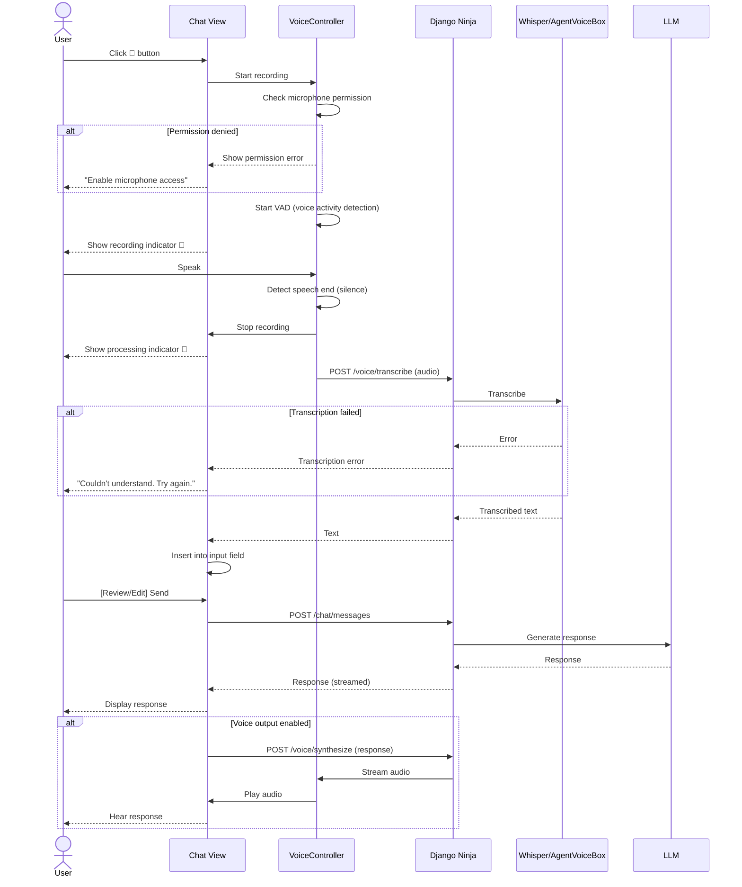
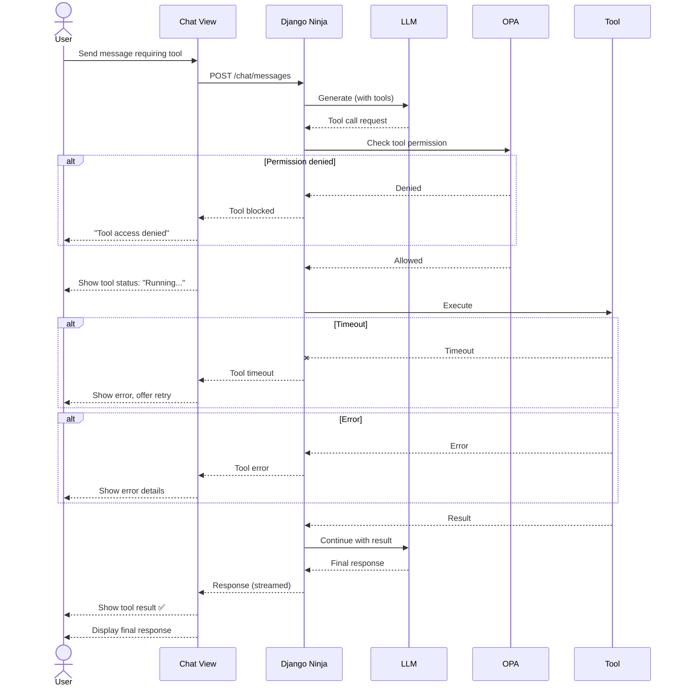

# SRS: Agent User Interface

**Document ID:** SA01-SRS-AGENT-USER-2025-12  
**Roles:** ⚪ User (STD), 🔵 Developer (DEV), 🟣 Trainer (TRN), ⚫ Viewer (RO)  
**Routes:** `/chat/*`, `/memory/*`, `/settings/*`, `/dev/*`, `/trn/*`

---

## 1. Mode Overview

| Mode | Code | Access | Features |
|------|------|--------|----------|
| ⚪ Standard | STD | All users | Chat, Memory, Tools, Settings |
| 🔵 Developer | DEV | Developers | + Debug console, API logs, MCP inspector |
| 🟣 Training | TRN | Trainers | + Cognitive panel, Neuromodulators |
| ⚫ Read-Only | RO | Viewers | View only, no actions |
| ⛔ Degraded | DGR | Auto | Limited functionality |

---

## 2. STD Mode Screens

### 2.1 Chat View (`/chat`)

**Purpose:** Primary agent interaction

**Layout:**
```
┌──────────────┬────────────────────────────────────────────────────┐
│  SIDEBAR     │  MAIN CHAT AREA                                    │
│  ──────────  │  ────────────────────────────────────────────────  │
│  Conversations│  Message history                                   │
│  Quick Access │  Streaming responses                               │
│  Settings     │  Tool execution status                             │
│              │  ────────────────────────────────────────────────  │
│              │  Input area with voice/file attach                  │
└──────────────┴────────────────────────────────────────────────────┘
```

**Elements:**
| Element | Type | Description |
|---------|------|-------------|
| Conversation List | Sidebar | History with search |
| Mode Selector | Dropdown | STD/DEV/TRN/RO |
| Message Bubbles | Chat | User and agent messages |
| Tool Status | Inline | Execution status, results |
| Input Field | Textarea | Message input |
| Voice Button | Icon | Start voice input |
| Attach Button | Icon | File upload |
| Send Button | Icon | Submit message |

**Message Types:**
| Type | Display |
|------|---------|
| User Text | Right-aligned bubble |
| Agent Text | Left-aligned bubble with avatar |
| Agent Streaming | Typing indicator + progressive text |
| Tool Execution | Expandable card with status |
| Code Block | Syntax highlighted, copy button |
| Image | Inline with lightbox |
| Error | Red border with retry button |

**Edge Cases:**
| Scenario | System Response |
|----------|-----------------|
| LLM timeout | 🔴 "Response timed out. [Retry]" |
| LLM rate limit | 🟡 "Rate limited. Waiting 30s..." |
| Tool execution failed | 🔴 Show error in tool card, allow retry |
| Voice transcription failed | 🔴 "Couldn't understand. Try again." |
| File too large | ❌ "File exceeds 10MB limit" |
| Unsupported file type | ❌ "Unsupported format. Use PDF, TXT, MD, etc." |
| SomaBrain down | 🟡 "Memory unavailable. Session-only mode." |
| Connection lost | 🔴 "Connection lost. Reconnecting..." |

**API:**
```
GET /api/v2/chat/conversations
POST /api/v2/chat/conversations
GET /api/v2/chat/conversations/{id}/messages
POST /api/v2/chat/conversations/{id}/messages
WS /api/v2/chat/stream
```

---

### 2.2 Memory Browser (`/memory`)

**Purpose:** Browse and search memories

**Elements:**
| Element | Type | Description |
|---------|------|-------------|
| View Toggle | Buttons | Card/List view |
| Type Filter | Tabs | All/Conversations/Facts/Episodes |
| Search | Input | Semantic search |
| Memory Cards | Grid/List | Content preview |
| Actions Menu | Dropdown | View, Edit tags, Delete |

**Memory Types:**
| Type | Color | Description |
|------|-------|-------------|
| Conversation | 🔵 Blue | Chat history |
| Fact | 🟢 Green | Extracted facts |
| Episode | 🟣 Purple | Experiences |
| Semantic | ⚪ Gray | Embedded content |

**Edge Cases:**
| Scenario | System Response |
|----------|-----------------|
| No memories | 📦 "No memories yet. Start chatting!" |
| Search no results | 📦 "No memories match your search" |
| Delete confirmation | ⚠️ "Delete this memory? Cannot be undone." |
| SomaBrain down | 🟡 "Memory service unavailable. Cached data shown." |
| Large memory count | Pagination + virtual scrolling |

**API:**
```
GET /api/v2/memory?type=&search=&page=
GET /api/v2/memory/{id}
DELETE /api/v2/memory/{id}
POST /api/v2/memory/search
```

---

### 2.3 Settings (`/settings`)

**Tabs:**
| Tab | Sections | Permission |
|-----|----------|------------|
| Agent | Chat Model, Memory | View/Edit per mode |
| External | API Keys, MCP | SysAdmin only edit |
| Connectivity | Voice, Proxy, Health | View/Edit per mode |
| System | Features, Auth, Backup | SysAdmin only edit |

**Voice Settings Detail:**
```
┌─────────────────────────────────────────────────────────────────────┐
│ Settings › Connectivity › Voice                                     │
├─────────────────────────────────────────────────────────────────────┤
│                                                                     │
│ ☑ Enable Voice Input/Output                                        │
│                                                                     │
│ Voice Provider *                                                    │
│ ┌────────────────────────────────────────────────────────────────┐  │
│ │ ○ Local Voice (Whisper + Kokoro)                               │  │
│ │   • On-device processing, full privacy                         │  │
│ │   • Latency: ~300ms                                            │  │
│ │   • Models: tiny/base/small/medium/large                       │  │
│ ├────────────────────────────────────────────────────────────────┤  │
│ │ ● AgentVoiceBox (External)                                     │  │
│ │   • Cloud-optimized, lower latency (~150ms)                    │  │
│ │   • Requires: Network + AgentVoiceBox server                   │  │
│ └────────────────────────────────────────────────────────────────┘  │
│                                                                     │
│ [When AgentVoiceBox selected:]                                      │
│                                                                     │
│ Server URL *                                                        │
│ ┌─────────────────────────────────────────────────────────────────┐ │
│ │ https://voice.somaagent.io                                      │ │
│ └─────────────────────────────────────────────────────────────────┘ │
│ [Test Connection] Status: 🟢 Connected (142ms)                      │
│                                                                     │
│ Voice                     Speed                                     │
│ ┌───────────────────┐    Slow ────●──────── Fast                   │
│ │ am_onyx (Deep)  ▼ │    0.5x    1.0x      2.0x                    │
│ └───────────────────┘                                               │
│ [▶️ Preview Voice]                                                   │
│                                                                     │
│ Audio Devices                                                       │
│ Input:  [Built-in Microphone ▼]  [🎤 Test]                         │
│ Output: [Built-in Speakers ▼]    [🔊 Test]                         │
│                                                                     │
└─────────────────────────────────────────────────────────────────────┘
```

**Edge Cases:**
| Scenario | System Response |
|----------|-----------------|
| Invalid API key | 🔴 "API key invalid" after test |
| AgentVoiceBox unreachable | 🔴 "Cannot connect to voice server" |
| Microphone permission denied | 🔴 "Microphone access denied. Check browser settings." |
| No audio devices | 🟡 "No audio devices detected" |
| Save fails | 🔴 "Failed to save. [Retry]" |

---

## 3. DEV Mode Screens

### 3.1 Debug Console (`/dev/console`)

**Purpose:** View logs, debug agent

**Elements:**
| Element | Type | Description |
|---------|------|-------------|
| Log Stream | Terminal | Real-time logs |
| Log Level Filter | Checkboxes | DEBUG/INFO/WARN/ERROR |
| Source Filter | Dropdown | LLM/Tools/Memory/Voice |
| Pause/Resume | Toggle | Control streaming |
| Export | Button | Download logs |
| Clear | Button | Clear console |

**Log Entry Format:**
```
[2024-12-24 15:45:32.123] [INFO] [LLM] Request to gpt-4o: 234 tokens
[2024-12-24 15:45:33.456] [INFO] [LLM] Response: 512 tokens, 1.33s
[2024-12-24 15:45:33.789] [DEBUG] [Memory] Semantic search: 5 results
[2024-12-24 15:45:34.012] [WARN] [Tools] Tool "database_query" timed out
```

---

### 3.2 MCP Inspector (`/dev/mcp`)

**Purpose:** Debug MCP connections

**Elements:**
| Element | Type | Description |
|---------|------|-------------|
| Server List | Cards | Connected MCP servers |
| Server Status | Badge | Running/Error/Starting |
| Tools List | Table | Available tools per server |
| Tool Test | Modal | Execute tool with params |
| Raw Logs | Expandable | Request/response JSON |

---

## 4. TRN Mode Screens

### 4.1 Cognitive Panel (`/trn/cognitive`)

**Purpose:** Adjust cognitive parameters

**Neuromodulator Sliders:**
| Modulator | Range | Effect |
|-----------|-------|--------|
| Dopamine | 0.0-0.8 | Reward/Motivation |
| Serotonin | 0.0-1.0 | Emotional Stability |
| Norepinephrine | 0.0-0.1 | Alertness/Focus |
| Acetylcholine | 0.0-0.5 | Learning/Memory |

**Actions:**
| Action | Effect |
|--------|--------|
| Trigger Sleep Cycle | Consolidate memories |
| Reset Adaptation | Restore defaults |
| Export Data | Download cognitive state |

**Edge Cases:**
| Scenario | System Response |
|----------|-----------------|
| SomaBrain down | 🔴 "Cognitive service unavailable" |
| Values out of range | Clamp to valid range |
| Sleep cycle in progress | 🔄 "Sleep cycle running... (45s remaining)" |
| Reset confirmation | ⚠️ "Reset all adaptation? This affects learning." |

---

## 5. RO Mode Screens

**Viewer restrictions:**
- ❌ Cannot send messages
- ❌ Cannot execute tools
- ❌ Cannot write/delete memories
- ❌ Cannot change settings
- ✅ Can view chat history
- ✅ Can browse memories
- ✅ Can view settings (read-only)

**UI Changes:**
- Input field disabled: "Read-only mode"
- All action buttons hidden
- Settings fields show values but not editable

---

## 6. DGR Mode (Degraded)

**Automatic triggers:**
| Service Down | Effect |
|--------------|--------|
| SomaBrain | Session-only memory |
| Primary LLM | Fallback to secondary |
| All LLMs | "Service unavailable" |
| Voice | Text-only mode |
| Tools | Tools disabled |

**UI Indicators:**
```
┌─────────────────────────────────────────────────────────────────────┐
│ ⚠️ DEGRADED MODE: Some services unavailable                    [ℹ️] │
├─────────────────────────────────────────────────────────────────────┤
│ 🟡 Memory: Session-only (SomaBrain down)                            │
│ 🟢 LLM: GPT-4o (Primary)                                            │
│ 🔴 Voice: Unavailable                                               │
│ 🔴 Tools: Disabled (external services down)                         │
└─────────────────────────────────────────────────────────────────────┘
```

---

## 7. User Flows

### 7.1 Voice Input Flow



### 7.2 Tool Execution Flow



---

## 8. Accessibility

### 8.1 Keyboard Navigation

| Key | Action |
|-----|--------|
| Tab | Move focus |
| Enter | Send message / Activate button |
| Escape | Close modal / Cancel |
| Ctrl+/ | Focus chat input |
| Ctrl+M | Toggle voice |
| Ctrl+K | Command palette |

### 8.2 Screen Reader

- All messages announced
- Tool status changes announced
- Errors announced with recovery actions
- Focus management on dynamic content

---

**Next:** [SRS-ERROR-HANDLING.md](./SRS-ERROR-HANDLING.md)
