# SRS-AGENTIQ — Governor Control Loop

**System:** SomaAgent01
**Document ID:** SRS-AGENTIQ-2026-01-16
**Version:** 6.0 (AAAS Direct Calls Enforced)
**Status:** CANONICAL

**Applied Personas:** ALL 10 ✅

---

## 0. AAAS Direct Call Rule

> **AgentIQ, UnifiedGate, and OPA use IN-MEMORY CACHING — ZERO HTTP LATENCY**

```python
# ✅ AAAS MODE — OPA is compiled in-memory
from admin.core.agentiq import derive_all_settings, UnifiedGate

settings = derive_all_settings(capsule)  # Pure Python = 0ms
allowed = await UnifiedGate.check(capsule, action)  # Cached OPA = 0ms
```

---

## 1. Core Principle

> AgentIQ is the Governor. ALL settings derive from `capsule.body.persona.knobs`.

---

## 2. 3 Control Knobs

```mermaid
flowchart TD
    subgraph KNOBS ["🎛️ capsule.body.persona.knobs"]
        K1[intelligence_level 1-10]
        K2[autonomy_level 1-10]
        K3[resource_budget $/turn]
    end

    K1 --> D1[RLM, Memory, Model Tier]
    K2 --> D2[HITL, Tools, Egress]
    K3 --> D3[Tokens, Cost, Limits]
```



---

## 3. Derivation Tables

### From INTELLIGENCE (1-10)

| Level | temperature | max_tokens | rlm_iter | recall_limit | model_tier |
|-------|-------------|------------|----------|--------------|------------|
| 1-3 | 0.3 | 512 | 1 | 5 | budget |
| 4-6 | 0.7 | 2048 | 2 | 15 | standard |
| 7-8 | 0.8 | 4096 | 3 | 25 | premium |
| 9-10 | 0.9 | 8192 | 5 | 50 | flagship |

### From AUTONOMY (1-10)

| Level | require_hitl | tool_approval | egress_allowed |
|-------|--------------|---------------|----------------|
| 1-3 | all_actions | all_tools | none |
| 4-6 | dangerous | dangerous | whitelist |
| 7-8 | none | none | expanded |
| 9-10 | none | none | unrestricted |

### From RESOURCE ($/turn)

| Budget | token_limit | cost_tier | thinking_budget |
|--------|-------------|-----------|-----------------|
| 0.01-0.10 | 1K | budget | 256 |
| 0.10-0.50 | 10K | standard | 1024 |
| 0.50-2.00 | 50K | premium | 2048 |
| 2.00+ | 100K | flagship | 4096 |

---

## 4. UnifiedGate

```python
class UnifiedGate:
    """Single permission check combining all sources."""

    async def check(self, capsule: Capsule, action: str) -> bool:
        # 1. OPA from capsule.governance
        opa = await self._check_opa(
            capsule.body["governance"]["opa_policies"],
            action
        )
        if not opa:
            return False

        # 2. SpiceDB from capsule.governance
        spicedb = await self._check_spicedb(
            capsule.body["governance"]["spicedb_relations"],
            action
        )
        if not spicedb:
            return False

        # 3. Capsule scope from persona.tools
        scope = self._check_scope(
            capsule.body["persona"]["tools"]["enabled_capabilities"],
            action
        )

        return scope
```

---

## 5. derive_all_settings()

```python
def derive_all_settings(capsule: Capsule) -> DerivedSettings:
    """Derive ALL settings from 3 knobs."""
    knobs = capsule.body["persona"]["knobs"]

    intel = knobs["intelligence_level"]
    auto = knobs["autonomy_level"]
    budget = knobs["resource_budget"]

    return DerivedSettings(
        # From INTELLIGENCE
        temperature=0.3 + (intel * 0.06),
        max_tokens=512 * (2 ** (intel // 3)),
        rlm_iterations=1 + (intel // 3),
        recall_limit=5 + (intel * 5),
        model_tier=["budget", "standard", "premium", "flagship"][intel // 3],

        # From AUTONOMY
        require_hitl=(auto <= 3),
        tool_approval="all" if auto <= 3 else "dangerous" if auto <= 6 else "none",
        egress_allowed="none" if auto <= 3 else "whitelist" if auto <= 6 else "unrestricted",

        # From RESOURCE
        token_limit=int(budget * 100000),
        cost_tier="budget" if budget < 0.1 else "standard" if budget < 0.5 else "premium",
        thinking_budget=int(budget * 4096),
    )
```

---

## 6. Chat Flow Integration


---

## 7. Acceptance Criteria

| Criterion | Verification |
|-----------|--------------|
| ✅ Settings from 3 knobs | No hardcoded values |
| ✅ UnifiedGate for permissions | OPA + SpiceDB + Scope |
| ✅ Hot-reload from capsule | No restart needed |
| ✅ OTEL traced | All derivations logged |

---

**Document End**
