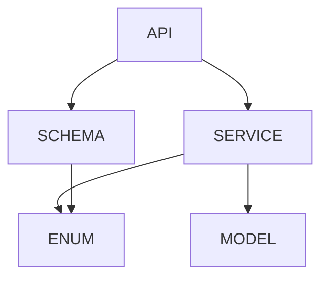

# SRS-ARCHITECTURAL-PATTERNS

## Software Requirements Specification
### Modular Design Patterns for SOMA Stack

| **Document ID** | SRS-ARCH-PATTERNS-2026-001 |
|-----------------|----------------------------|
| **Version** | 1.0.0 |
| **Date** | 2026-01-21 |
| **Status** | APPROVED |
| **Standard** | ISO/IEC 25010:2023 |

---

## ⚠️ MANDATORY: Django Framework Enforcement

> [!CAUTION]
> **ALL SOMA repositories MUST use Django + Django Ninja.**
>
> - **API Framework:** Django Ninja (NOT FastAPI)
> - **ORM:** Django ORM (NOT SQLAlchemy)
> - **Migrations:** Django migrations (NOT Alembic)
> - **Auth:** Django auth + django-ninja AuthBearer
> - **Settings:** Django settings (centralized)

**Prohibited:**
- ❌ FastAPI / Starlette / uvicorn standalone
- ❌ SQLAlchemy models
- ❌ Alembic migrations

---

## 1. Purpose

This document defines the **architectural patterns** enforced across all SOMA repositories to ensure maintainable, testable, and scalable code.

---

## 2. Core Django Patterns

```
┌─────────────────────────────────────┐
│  API Layer (api.py)                 │
│  HTTP routing, auth, serialization  │
├─────────────────────────────────────┤
│  Schema Layer (schemas.py)          │
│  Pydantic models, validation        │
├─────────────────────────────────────┤
│  Service Layer (*_service.py)       │
│  Business logic, orchestration      │
├─────────────────────────────────────┤
│  Model Layer (models/*.py)          │
│  Django ORM, persistence            │
└─────────────────────────────────────┘
```

**Rule:** Dependencies flow downward only.

---

### 2.2 Modular Service Decomposition

Large services are decomposed into focused sub-modules:

```
services/common/
├── chat_service.py         # Facade (orchestrator)
└── chat/
    ├── message_service.py      # Core messaging
    ├── conversation_service.py # CRUD operations
    ├── session_manager.py      # Agent sessions
    └── memory_bridge.py        # Memory delegation
```

---

### 2.3 Schema-Endpoint Separation

**Rule:** Data contracts in `schemas.py`, HTTP handlers in `api.py`.

```python
# schemas.py — Data contracts
class Conversation(BaseModel):
    conversation_id: str
    agent_id: str
    status: str

# api.py — HTTP handlers
@router.get("/")
async def list_conversations(request) -> dict:
    ...
```

---

### 2.4 Domain Model Segregation

Models split by **bounded context**:

```
admin/core/models/
├── __init__.py    # Public exports
├── core.py        # Core domain (Session, Capsule)
└── zdl.py         # Infrastructure (Outbox, DeadLetter)
```

---

### 2.5 Enum Extraction Pattern

Enums and constants in dedicated modules:

```python
# scheduler_enums.py
class TaskState(str, Enum):
    IDLE = "idle"
    RUNNING = "running"
    ERROR = "error"
```

**Benefit:** Avoids circular imports, enables reuse.

---

## 3. Quality Requirements

| Metric | Target |
|--------|--------|
| Max lines per file | 650 (VIBE Rule 245) |
| Cyclomatic complexity | ≤10 per function |
| Test coverage | ≥80% |

---

## 4. Dependency Rules



**No upward dependencies allowed.**

---

## 5. Applies To

- **SomaAgent01** — All `admin/` modules
- **SomaBrain** — All `api/` and `saas/` modules
- **SomaFractalMemory** — Already compliant
