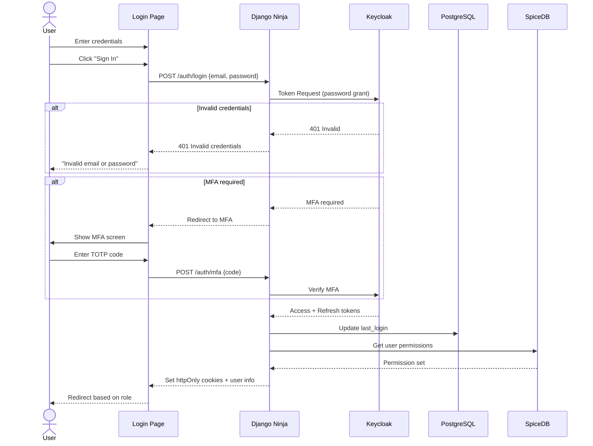
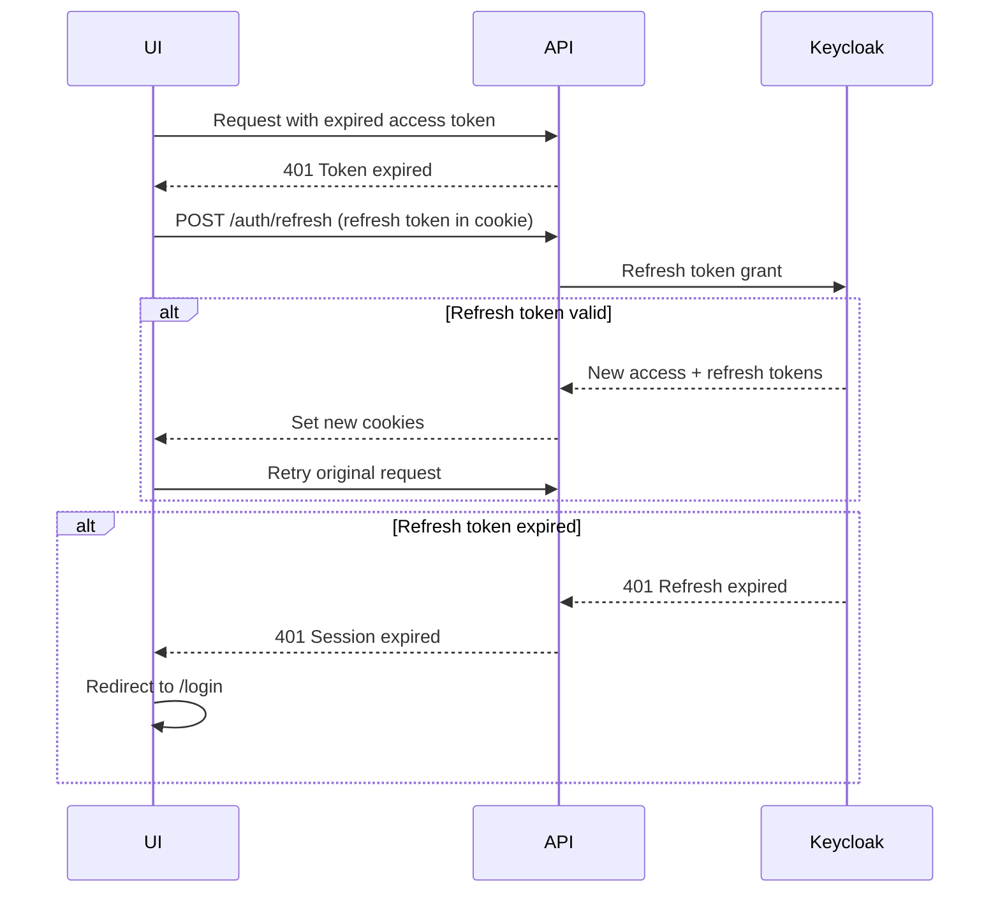
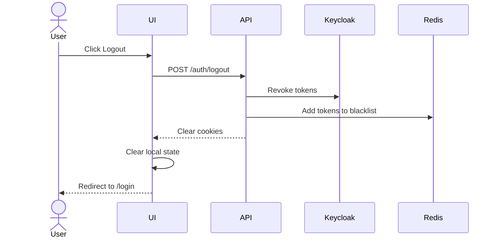

# SRS: Authentication & Authorization

**Document ID:** SA01-SRS-AUTH-2025-12  
**Stack:** Keycloak + SpiceDB + Django Ninja  
**Classification:** SECURITY CRITICAL

---

## 1. Authentication Architecture

```
┌─────────────────────────────────────────────────────────────────────────────┐
│                         AUTHENTICATION FLOW                                  │
├─────────────────────────────────────────────────────────────────────────────┤
│                                                                             │
│  User                   Frontend                Backend               Auth  │
│   │                        │                      │                    │    │
│   │────Login Request──────▶│                      │                    │    │
│   │                        │────OAuth Redirect───▶│───Keycloak Auth───▶│    │
│   │                        │                      │◀──Access Token─────│    │
│   │                        │◀───JWT Cookie────────│                    │    │
│   │                        │                      │                    │    │
│   │────API Request─────────│───Bearer Token──────▶│                    │    │
│   │                        │                      │───Verify JWT──────▶│    │
│   │                        │                      │◀──Claims───────────│    │
│   │                        │                      │                    │    │
│   │                        │                      │───SpiceDB Check───▶│    │
│   │                        │◀──Response───────────│◀──Allow/Deny──────│    │
│   │                        │                      │                    │    │
└─────────────────────────────────────────────────────────────────────────────┘
```

---

## 2. Login Screen (`/login`)

### 2.1 UI Layout

```
┌─────────────────────────────────────────────────────────────────────────────┐
│                                                                             │
│                        ┌────────────────────────────┐                       │
│                        │        SomaAgent           │                       │
│                        │                            │                       │
│                        │  ┌──────────────────────┐  │                       │
│                        │  │ Email                │  │                       │
│                        │  │ user@example.com     │  │                       │
│                        │  └──────────────────────┘  │                       │
│                        │                            │                       │
│                        │  ┌──────────────────────┐  │                       │
│                        │  │ Password             │  │                       │
│                        │  │ ••••••••••••   👁️    │  │                       │
│                        │  └──────────────────────┘  │                       │
│                        │                            │                       │
│                        │  ☐ Remember me             │                       │
│                        │                            │                       │
│                        │  [     Sign In          ]  │                       │
│                        │                            │                       │
│                        │  ─────── or ───────        │                       │
│                        │                            │                       │
│                        │  [🔵 Sign in with Google]  │                       │
│                        │  [⬛ Sign in with GitHub]  │                       │
│                        │                            │                       │
│                        │  Forgot password?          │                       │
│                        │                            │                       │
│                        └────────────────────────────┘                       │
│                                                                             │
└─────────────────────────────────────────────────────────────────────────────┘
```

### 2.2 Login Flow



### 2.3 Edge Cases

| Scenario | Handling |
|----------|----------|
| Keycloak down | Show "Authentication service unavailable" |
| Wrong password 5x | Lock account for 15 min |
| Account locked | Show "Account locked. Contact admin." |
| Unverified email | Show "Verify email to continue" |
| Pending invitation | Complete signup flow |
| Expired invitation | Show "Invitation expired. Request new one." |
| OAuth error | Show "SSO failed. Try email login." |

---

## 3. MFA Setup (`/settings/security/mfa`)

### 3.1 UI Layout

```
┌─────────────────────────────────────────────────────────────────────────────┐
│ Settings › Security › Two-Factor Authentication                             │
├─────────────────────────────────────────────────────────────────────────────┤
│                                                                             │
│ Two-Factor Authentication                                                   │
│                                                                             │
│ ☐ Enable 2FA (recommended)                                                  │
│                                                                             │
│ ─────────────────────────────────────────────────────────────────────────── │
│                                                                             │
│ Setup Authenticator App                                                     │
│                                                                             │
│ 1. Install an authenticator app (Google Authenticator, Authy, 1Password)   │
│                                                                             │
│ 2. Scan this QR code:                                                       │
│                                                                             │
│    ┌─────────────┐                                                          │
│    │ █▀▀▀▀▀▀▀█   │                                                          │
│    │ █ ▄▄▄ █    │                                                          │
│    │ █ ███ █    │   Can't scan? Enter manually:                            │
│    │ █▄▄▄▄▄█    │   JBSW Y3DP EHPK 3PXP                                    │
│    └─────────────┘                                                          │
│                                                                             │
│ 3. Enter the 6-digit code from your app:                                    │
│                                                                             │
│    ┌─────┬─────┬─────┬─────┬─────┬─────┐                                   │
│    │  4  │  7  │  2  │  8  │  3  │  1  │                                   │
│    └─────┴─────┴─────┴─────┴─────┴─────┘                                   │
│                                                                             │
│    [Verify and Enable]                                                      │
│                                                                             │
│ ─────────────────────────────────────────────────────────────────────────── │
│                                                                             │
│ Backup Codes                                                                │
│ Save these codes in a safe place. Each can be used once.                    │
│                                                                             │
│ [Generate Backup Codes]                                                     │
│                                                                             │
└─────────────────────────────────────────────────────────────────────────────┘
```

---

## 4. Permission Model (SpiceDB)

### 4.1 Schema

```zed
// Platform
definition platform {}

definition saas_admin {
    relation platform: platform
    permission manage = platform
    permission manage_tenants = platform
    permission view_billing = platform
    permission configure = platform
    permission impersonate = platform
}

// Tenant
definition tenant {
    relation sysadmin: user
    relation admin: user
    relation developer: user
    relation trainer: user
    relation member: user
    relation viewer: user
    relation subscription: subscription_tier
    
    permission manage = sysadmin
    permission administrate = sysadmin + admin
    permission create_agent = sysadmin + admin
    permission develop = sysadmin + admin + developer
    permission train = sysadmin + admin + trainer
    permission use = sysadmin + admin + developer + trainer + member
    permission view = sysadmin + admin + developer + trainer + member + viewer
}

// Agent
definition agent {
    relation tenant: tenant
    relation owner: user
    relation admin: user
    relation developer: user
    relation trainer: user
    relation user: user
    relation viewer: user
    
    permission configure = owner + admin + tenant->administrate
    permission activate_adm = owner + admin
    permission activate_dev = owner + admin + developer
    permission activate_trn = owner + admin + trainer
    permission activate_std = owner + admin + developer + trainer + user
    permission activate_ro = owner + admin + developer + trainer + user + viewer
    permission view = activate_ro
}
```

### 4.2 Permission Checks in Django

```python
from spicedb import Client as SpiceDBClient

async def check_permission(
    user_id: str,
    permission: str,
    resource_type: str,
    resource_id: str
) -> bool:
    """
    Check permission via SpiceDB.
    
    Example: check_permission("user:123", "configure", "agent", "abc")
    """
    result = await spicedb_client.check_permission(
        subject=ObjectReference(object_type="user", object_id=user_id),
        permission=permission,
        resource=ObjectReference(object_type=resource_type, object_id=resource_id)
    )
    return result.permissionship == Permissionship.HAS_PERMISSION
```

### 4.3 Django Ninja Permission Decorator

```python
def require_permission(permission: str, resource_type: str, resource_id_param: str):
    """Decorator to enforce SpiceDB permission on endpoint."""
    async def decorator(func):
        async def wrapper(request, **kwargs):
            resource_id = kwargs.get(resource_id_param)
            user_id = request.auth.user_id
            
            if not await check_permission(user_id, permission, resource_type, resource_id):
                raise PermissionDeniedError(
                    f"Permission '{permission}' required on {resource_type}:{resource_id}"
                )
            
            return await func(request, **kwargs)
        return wrapper
    return decorator

# Usage
@router.put("/agents/{agent_id}")
@require_permission("configure", "agent", "agent_id")
async def update_agent(request, agent_id: str, data: AgentUpdateSchema):
    pass
```

---

## 5. Session Management

### 5.1 Token Configuration

| Token | Type | Lifetime | Storage |
|-------|------|----------|---------|
| Access Token | JWT | 15 min | httpOnly cookie |
| Refresh Token | Opaque | 7 days | httpOnly cookie |
| CSRF Token | Random | Session | Cookie + Header |

### 5.2 Token Refresh Flow



### 5.3 Logout Flow



---

## 6. Security Headers

### 6.1 Response Headers

```python
# Django middleware
SECURE_HEADERS = {
    "X-Content-Type-Options": "nosniff",
    "X-Frame-Options": "DENY",
    "X-XSS-Protection": "1; mode=block",
    "Strict-Transport-Security": "max-age=31536000; includeSubDomains",
    "Content-Security-Policy": (
        "default-src 'self'; "
        "script-src 'self'; "
        "style-src 'self' 'unsafe-inline'; "
        "img-src 'self' data: https:; "
        "connect-src 'self' wss:; "
        "font-src 'self'; "
        "frame-ancestors 'none'"
    ),
    "Referrer-Policy": "strict-origin-when-cross-origin"
}
```

---

## 7. Audit Logging

### 7.1 Logged Events

| Event | Data Captured |
|-------|---------------|
| auth.login | user_id, ip, user_agent, method |
| auth.logout | user_id, reason |
| auth.password_change | user_id |
| auth.mfa_enable | user_id |
| auth.mfa_disable | user_id |
| auth.failed_login | email, ip, reason |
| auth.lockout | email, duration |
| permission.denied | user_id, resource, permission |

### 7.2 Audit Log Format

```json
{
  "timestamp": "2024-12-24T15:45:32.123Z",
  "event": "auth.login",
  "user_id": "user_123",
  "tenant_id": "tenant_456",
  "ip": "192.168.1.1",
  "user_agent": "Mozilla/5.0...",
  "metadata": {
    "method": "google_oauth",
    "mfa_used": true
  }
}
```

---

**Next:** [SRS-API-CATALOG.md](./SRS-API-CATALOG.md)
