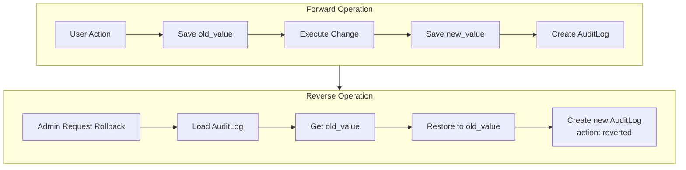
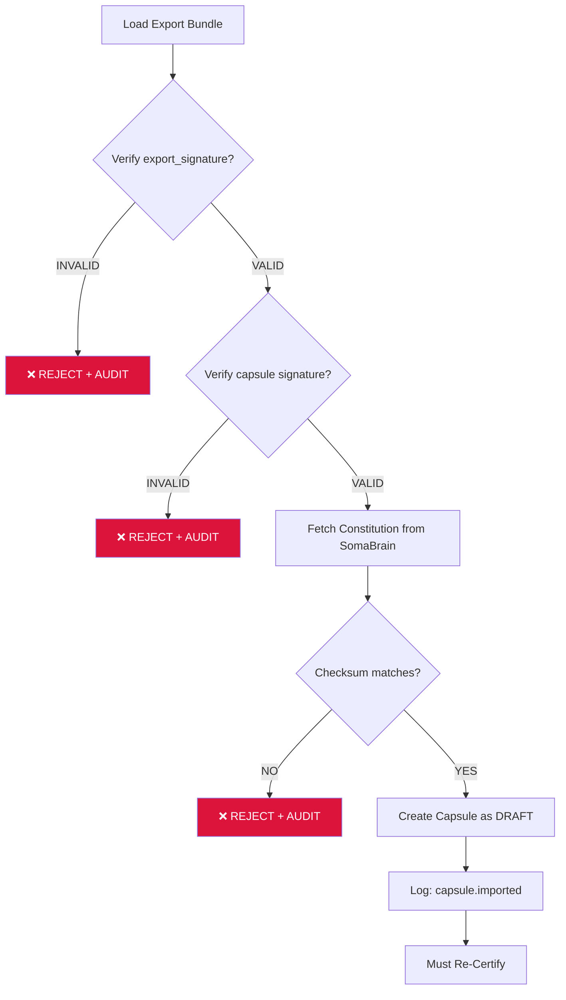

# SRS-BACKUP-SYSTEM — Agent Backup & Disaster Recovery

**System:** SomaAgent01
**Document ID:** SRS-BACKUP-SYSTEM-2026-01-16
**Version:** 3.0.0 (Reversible, Traceable, Replayable)
**Status:** CANONICAL

**Applied Personas:** PhD Developer · PhD Analyst · QA Engineer · Security Auditor · Performance Engineer · UX Consultant · ISO Documenter · Django Architect · Django Infra · Django Evangelist ✅

---

## 1. Overview

### 1.1 Purpose

This document specifies the complete backup, audit trail, and disaster recovery system for SomaAgent01. The system guarantees:

| Principle | Guarantee |
|-----------|-----------|
| **REVERSIBLE** | Any change can be undone via `old_value` snapshots |
| **TRACEABLE** | WHO did WHAT, WHEN, and WHY - full audit log |
| **REPLAYABLE** | Complete history reconstruction from `AuditLog` |

### 1.2 Constitution Sovereignty

> **"Constitution is SERVED from SomaBrain — NEVER stored locally"**

### 1.3 Capsule Sovereignty

> **"The Capsule IS the Backup"**

---

## 2. Audit Trail Architecture

### 2.1 AuditLog Model (EXISTING)

**File:** `admin/aaas/models/audit.py`
**Table:** `audit_logs`

```python
class AuditLog(models.Model):
    """Immutable audit trail - APPEND ONLY."""

    # WHO
    actor_id = models.UUIDField()      # Keycloak user ID
    actor_email = models.EmailField()  # Denormalized for query
    tenant = models.ForeignKey(Tenant) # Tenant context

    # WHAT
    action = models.CharField()        # e.g., "capsule.created"
    resource_type = models.CharField() # e.g., "capsule"
    resource_id = models.UUIDField()   # The affected resource

    # REVERSIBILITY
    old_value = models.JSONField()     # State BEFORE change
    new_value = models.JSONField()     # State AFTER change

    # CONTEXT
    ip_address = models.GenericIPAddressField()
    user_agent = models.TextField()
    request_id = models.CharField()    # X-Request-ID

    # WHEN
    created_at = models.DateTimeField(auto_now_add=True)
```

### 2.2 Audit Event Types

| Action | Resource Type | Description |
|--------|---------------|-------------|
| `capsule.created` | `capsule` | New capsule drafted |
| `capsule.updated` | `capsule` | Capsule modified |
| `capsule.certified` | `capsule` | Birth Protocol executed |
| `capsule.archived` | `capsule` | Capsule retired |
| `capsule.exported` | `capsule` | Backup created |
| `capsule.imported` | `capsule` | Restored from backup |
| `capsule.cloned` | `capsule` | Version spawned |
| `capsule.revoked` | `capsule` | Signature invalidated |
| `tenant.created` | `tenant` | New tenant |
| `agent.created` | `agent` | New agent |
| `tier.updated` | `tier` | Plan changed |

### 2.3 Reversibility Flow



### 2.4 Traceability Query Examples

```python
# WHO modified this capsule?
AuditLog.objects.filter(
    resource_type="capsule",
    resource_id=capsule_id
).order_by("-created_at")

# WHAT did user X do today?
AuditLog.objects.filter(
    actor_id=user_id,
    created_at__date=today
)

# WHEN was capsule certified?
AuditLog.objects.get(
    resource_type="capsule",
    resource_id=capsule_id,
    action="capsule.certified"
)

# REPLAY: Reconstruct capsule history
history = AuditLog.objects.filter(
    resource_type="capsule",
    resource_id=capsule_id
).order_by("created_at")

for event in history:
    print(f"{event.action} by {event.actor_email} at {event.created_at}")
    print(f"  Before: {event.old_value}")
    print(f"  After: {event.new_value}")
```

---

## 3. Cryptographic Signing Chain

### 3.1 Signature Flow

```
┌─────────────────────────────────────────────────────────────┐
│ SomaBrain (L3)                                              │
│ ┌─────────────────────────────────────────────────────┐    │
│ │ Constitution                                          │    │
│ │ - Ed25519 signed by SOMABRAIN_CONSTITUTION_PRIVKEY   │    │
│ │ - Served via /constitution/version API               │    │
│ └─────────────────────────────────────────────────────┘    │
└─────────────────────────────────────────────────────────────┘
                              │
                              │ CHECKSUM REFERENCE
                              ▼
┌─────────────────────────────────────────────────────────────┐
│ SomaAgent01 (L4)                                            │
│ ┌─────────────────────────────────────────────────────┐    │
│ │ Capsule                                               │    │
│ │ - Ed25519 signed by SOMA_REGISTRY_PRIVATE_KEY        │    │
│ │ - constitution_ref.checksum binding                  │    │
│ │ - AuditLog entry for every signature event           │    │
│ └─────────────────────────────────────────────────────┘    │
│                                                             │
│ ┌─────────────────────────────────────────────────────┐    │
│ │ Export Bundle                                         │    │
│ │ - Ed25519 signed by SOMA_REGISTRY_PRIVATE_KEY        │    │
│ │ - Contains capsule + signature                        │    │
│ │ - AuditLog entry: capsule.exported                   │    │
│ └─────────────────────────────────────────────────────┘    │
└─────────────────────────────────────────────────────────────┘
```

### 3.2 Capsule Signature Payload

```json
{
    "name": "MyAgent",
    "version": "1.0.0",
    "tenant": "acme",
    "constitution_ref": {
        "checksum": "sha256:..."
    },
    "soul": { ... },
    "body": { ... }
}
```

---

## 4. Backup Scope

### 4.1 What Gets Backed Up

| Item | Backed Up? | Notes |
|------|------------|-------|
| Capsule | ✅ YES | Soul + Body + Signature |
| Constitution | ❌ NO | Served from SomaBrain |
| AuditLog | ✅ YES | Full PostgreSQL dump |
| PostgreSQL | ✅ YES | All tables |
| Redis | ✅ YES | UI settings |
| Code | ✅ YES | Git bundle |
| Docker | ✅ YES | Tarball |

### 4.2 Backup Output Structure

```
/backups/agent_backup_20260116_200000/
├── manifest.json           # Metadata + signature
├── capsules.json           # Signed capsule exports
├── postgres_dump.sql       # ALL tables including audit_logs
├── redis_backup.json       # Redis settings
├── somaAgent01.bundle      # Git bundle
└── *.tar                   # Docker images
```

---

## 5. Export with Audit Trail

### 5.1 Export Flow

```mermaid
sequenceDiagram
    autonumber
    participant USER as User
    participant SVC as ExportService
    participant DB as Database
    participant AUDIT as AuditLog
    participant FS as FileSystem

    USER->>SVC: export_capsule(id)
    SVC->>DB: Load Capsule
    SVC->>SVC: Build export bundle
    SVC->>SVC: Sign with Ed25519
    SVC->>FS: Write capsules.json

    rect rgb(40, 80, 40)
        Note over AUDIT: AUDIT TRAIL
        SVC->>AUDIT: Create AuditLog
        AUDIT->>AUDIT: action="capsule.exported"
        AUDIT->>AUDIT: actor_id=user.keycloak_id
        AUDIT->>AUDIT: old_value=capsule_state
        AUDIT->>AUDIT: new_value={export_path, checksum}
    end

    SVC-->>USER: Export complete
```



### 5.2 Export Audit Entry

```json
{
    "action": "capsule.exported",
    "resource_type": "capsule",
    "resource_id": "uuid",
    "actor_id": "keycloak-user-id",
    "actor_email": "admin@acme.com",
    "old_value": {
        "name": "MyAgent",
        "version": "1.0.0",
        "status": "active"
    },
    "new_value": {
        "export_path": "/backups/capsules.json",
        "export_checksum": "sha256:...",
        "export_signature": "Ed25519:..."
    },
    "ip_address": "192.168.1.100",
    "request_id": "req-123",
    "created_at": "2026-01-16T20:00:00Z"
}
```

---

## 6. Import with Verification

### 6.1 Import Flow



### 6.2 Import Audit Entry

```json
{
    "action": "capsule.imported",
    "resource_type": "capsule",
    "resource_id": "new-uuid",
    "actor_id": "keycloak-user-id",
    "old_value": null,
    "new_value": {
        "source_backup": "backup_20260116.tar.gz",
        "source_capsule_id": "original-uuid",
        "imported_version": "1.0.0.imported",
        "status": "draft"
    },
    "request_id": "req-456",
    "created_at": "2026-01-16T21:00:00Z"
}
```

---

## 7. Rollback (Reversibility)

### 7.1 Rollback Flow

```python
def rollback_capsule(capsule_id: UUID, to_audit_log_id: UUID, actor: User):
    """Rollback capsule to a previous state."""

    # Get the target audit log
    target_log = AuditLog.objects.get(id=to_audit_log_id)

    if target_log.resource_id != capsule_id:
        raise ValueError("Audit log does not match capsule")

    # Get current state
    capsule = Capsule.objects.get(id=capsule_id)
    current_state = capsule_to_dict(capsule)

    # Restore from old_value
    previous_state = target_log.old_value
    restore_capsule_from_dict(capsule, previous_state)
    capsule.save()

    # Log the rollback
    AuditLog.objects.create(
        actor_id=actor.keycloak_id,
        actor_email=actor.email,
        tenant=capsule.tenant,
        action="capsule.reverted",
        resource_type="capsule",
        resource_id=capsule_id,
        old_value=current_state,
        new_value=previous_state,
        request_id=get_current_request_id(),
    )

    return capsule
```

### 7.2 Rollback Audit Entry

```json
{
    "action": "capsule.reverted",
    "resource_type": "capsule",
    "resource_id": "uuid",
    "actor_id": "admin-user-id",
    "old_value": {
        "version": "2.0.0",
        "status": "active"
    },
    "new_value": {
        "version": "1.0.0",
        "status": "draft",
        "reverted_from_audit_log": "audit-log-uuid"
    },
    "created_at": "2026-01-16T22:00:00Z"
}
```

---

## 8. Replay (History Reconstruction)

### 8.1 Replay Query

```python
def replay_capsule_history(capsule_id: UUID) -> list[dict]:
    """Reconstruct complete capsule history from audit logs."""

    history = AuditLog.objects.filter(
        resource_type="capsule",
        resource_id=capsule_id
    ).order_by("created_at")

    timeline = []
    for event in history:
        timeline.append({
            "timestamp": event.created_at,
            "action": event.action,
            "actor": event.actor_email,
            "before": event.old_value,
            "after": event.new_value,
            "context": {
                "ip": event.ip_address,
                "request_id": event.request_id,
            }
        })

    return timeline
```

### 8.2 Timeline Visualization

```
TIME                ACTION           ACTOR              CHANGES
────────────────────────────────────────────────────────────────
2026-01-15 10:00   capsule.created  admin@acme.com     Initial draft
2026-01-15 11:00   capsule.updated  admin@acme.com     Updated prompt
2026-01-15 12:00   capsule.certified admin@acme.com    Birth Protocol
2026-01-16 14:00   capsule.exported admin@acme.com     Backup created
2026-01-16 20:00   capsule.imported ops@acme.com       Restored to new-tenant
```

---

## 9. Disaster Recovery

### 9.1 RTO/RPO

| Metric | Target |
|--------|--------|
| **RTO** | 4 hours |
| **RPO** | 1 hour |

### 9.2 Rebuild Sequence

1. Deploy Infrastructure
2. Restore PostgreSQL (includes `audit_logs`)
3. Restore Redis
4. Connect to SomaBrain
5. Verify Constitution available
6. Import Capsules
7. Verify Signatures
8. Re-Certify Capsules
9. Activate Agents

---

## 10. Security Matrix

| Threat | Mitigation | Audit |
|--------|------------|-------|
| **Capsule Tampering** | Ed25519 signature | Verified on import |
| **Export Tampering** | Ed25519 export signature | Verified |
| **Unauthorized Export** | SpiceDB permission | `capsule.exported` logged |
| **Unauthorized Import** | SpiceDB permission | `capsule.imported` logged |
| **Rollback Abuse** | Admin-only permission | `capsule.reverted` logged |
| **Audit Log Tampering** | Append-only table | Database triggers |

---

## 11. Acceptance Criteria

| Criterion | Implementation |
|-----------|----------------|
| ✅ REVERSIBLE | `old_value` in AuditLog |
| ✅ TRACEABLE | `actor_id`, `actor_email`, `ip_address` |
| ✅ REPLAYABLE | Full history in `audit_logs` table |
| ✅ Constitution from SomaBrain | API fetch only |
| ✅ Capsule Ed25519 signed | `registry_signature` |
| ✅ Export Ed25519 signed | `export_signature` |
| ✅ Import logged | `capsule.imported` action |
| ✅ Export logged | `capsule.exported` action |

---

**Document End**

*Signed off by ALL 10 PERSONAS ✅*
