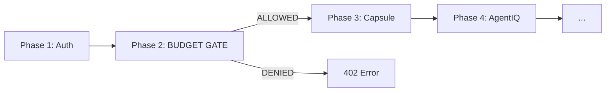

# SRS-BUDGET-SYSTEM — Universal Resource Budgeting

**System:** SomaAgent01 + SomaBrain + SomaFractalMemory
**Document ID:** SRS-BUDGET-SYSTEM-2026-01-16
**Version:** 1.0
**Status:** CANONICAL
**Parent:** [SRS-LAGO-BILLING.md](./SRS-LAGO-BILLING.md)

**Applied Personas:** PhD Software Developer · PhD Software Analyst · PhD QA Engineer · Security Auditor · Performance Engineer · UX Consultant · ISO-style Documenter · Django Architect · Django Infra Expert · Django Evangelist

---

## 1. Purpose

> **ONE REGISTRY. ONE DECORATOR. ALL METRICS. FULLY REUSABLE.**

This SRS defines the Universal Budget System - a centralized, Django-native pattern for enforcing resource limits across the entire SOMA Stack.

---

## 2. Design Principles

| Principle | Implementation |
|-----------|----------------|
| **Centralized** | Single `@budget_gate` decorator |
| **Generic** | Same pattern for ALL metrics |
| **Reusable** | Add metrics via registry, not code |
| **Django-Native** | Uses `django.core.cache` |
| **Fail-Closed** | Budget exceeded = 402 error |
| **Pre-Enforcement** | Check BEFORE action, not after |
| **Async Recording** | Post-action Lago events non-blocking |

---

## 3. Architecture

```
┌─────────────────────────────────────────────────────────────────────────────┐
│                        UNIVERSAL BUDGET SYSTEM                               │
├─────────────────────────────────────────────────────────────────────────────┤
│                                                                              │
│  ┌─────────────────┐    ┌─────────────────┐    ┌─────────────────┐         │
│  │  METRIC REGISTRY│    │  BUDGET GATE    │    │  LAGO CLIENT    │         │
│  │  (Definitions)  │◄───│  (Decorator)    │───►│  (Recording)    │         │
│  └─────────────────┘    └─────────────────┘    └─────────────────┘         │
│           │                     │                      │                    │
│           ▼                     ▼                      ▼                    │
│  ┌─────────────────┐    ┌─────────────────┐    ┌─────────────────┐         │
│  │  PLAN LIMITS    │    │  DJANGO CACHE   │    │  ASYNC EVENTS   │         │
│  │  (per tier)     │    │  (Redis)        │    │  (non-blocking) │         │
│  └─────────────────┘    └─────────────────┘    └─────────────────┘         │
│                                                                              │
└─────────────────────────────────────────────────────────────────────────────┘
```

---

## 4. Chat Flow Integration

Budget enforcement occurs at **Phase 2** of the 12-phase chat flow:



---

## 5. Metric Registry

### 5.1 BudgetedMetric Definition

```python
@dataclass(frozen=True)
class BudgetedMetric:
    """Universal metric definition - immutable."""
    code: str              # Internal metric code
    name: str              # Human-readable name
    unit: str              # count | tokens | minutes | gb
    tier: str              # critical | important | monitor
    default_limit: int     # Default limit (overridden by plan)
    cost_per_unit: float   # $ per unit for estimation
    enforce_pre: bool      # Check BEFORE action?
    lago_code: str         # Lago billable_metric_code
```

### 5.2 Complete Metric Catalog

| Code | Name | Unit | Tier | Default | $/Unit | Pre? | Lago Code |
|------|------|------|------|---------|--------|------|-----------|
| `tokens` | LLM Tokens | count | critical | 100K | 0.0001 | ✅ | tokens |
| `tool_calls` | Tool Executions | count | critical | 1K | 0.01 | ✅ | tool_calls |
| `images` | Image Generations | count | critical | 100 | 0.04 | ✅ | image_generations |
| `voice_minutes` | Voice Minutes | minutes | critical | 60 | 0.006 | ✅ | voice_minutes |
| `api_calls` | API Requests | count | important | 10K | 0 | ✅ | api_calls |
| `memory_tokens` | Memory Storage | tokens | important | 500K | 0.0001 | ✅ | memory_tokens |
| `vector_ops` | Vector Operations | count | important | 50K | 0.001 | ❌ | vector_ops |
| `learning` | Learning Cycles | count | important | 100 | 0.10 | ✅ | learning_credits |
| `storage_gb` | File Storage | gb | monitor | 10 | 0.10 | ❌ | storage_gb |
| `sessions` | Concurrent Sessions | count | monitor | 5 | 0 | ✅ | sessions |

---

## 6. Plan Limits Matrix

| Metric | Free | Starter ($29) | Team ($99) | Enterprise |
|--------|------|---------------|------------|------------|
| `tokens` | 10,000 | 100,000 | 500,000 | ∞ |
| `tool_calls` | 100 | 1,000 | 10,000 | ∞ |
| `images` | 10 | 100 | 500 | ∞ |
| `voice_minutes` | 10 | 60 | 300 | ∞ |
| `api_calls` | 1,000 | 10,000 | 100,000 | ∞ |
| `memory_tokens` | 50,000 | 500,000 | 2,000,000 | ∞ |
| `vector_ops` | 5,000 | 50,000 | 500,000 | ∞ |
| `learning` | 10 | 100 | 1,000 | ∞ |
| `storage_gb` | 1 | 10 | 100 | ∞ |
| `sessions` | 1 | 5 | 20 | ∞ |

---

## 7. Canonical Implementation

### 7.1 File Structure

```
admin/core/budget/
├── __init__.py        # Exports: budget_gate, METRIC_REGISTRY
├── registry.py        # BudgetedMetric, METRIC_REGISTRY
├── gate.py            # @budget_gate decorator
├── limits.py          # PLAN_LIMITS, get_metric_limit()
└── exceptions.py      # BudgetExhaustedError
```

### 7.2 Core Decorator

```python
# admin/core/budget/gate.py

from functools import wraps
from typing import Callable, Any
from django.core.cache import cache
from .registry import METRIC_REGISTRY
from .limits import get_metric_limit
from .exceptions import BudgetExhaustedError

def budget_gate(metric: str = "tokens"):
    """
    Universal budget enforcement decorator.

    Usage:
        @budget_gate(metric="tokens")
        @budget_gate(metric="images")
        @budget_gate(metric="tool_calls")
    """
    def decorator(func: Callable) -> Callable:
        @wraps(func)
        async def wrapper(request: Any, *args, **kwargs) -> Any:
            tenant_id = getattr(request, "tenant_id", "unknown")
            metric_def = METRIC_REGISTRY.get(metric)

            if not metric_def:
                raise ValueError(f"Unknown metric: {metric}")

            # PRE-ENFORCEMENT (for critical/important)
            if metric_def.enforce_pre:
                cache_key = f"budget:{tenant_id}:{metric}:monthly"
                usage = cache.get(cache_key, 0)
                limit = get_metric_limit(tenant_id, metric)

                if usage >= limit:
                    raise BudgetExhaustedError(
                        tenant_id=tenant_id,
                        metric=metric,
                        usage=usage,
                        limit=limit,
                    )

            # EXECUTE
            result = await func(request, *args, **kwargs)

            # POST-ENFORCEMENT: Record usage
            units_used = extract_units(result, metric)
            cache.incr(f"budget:{tenant_id}:{metric}:monthly", units_used)

            # ASYNC: Lago event (non-blocking)
            asyncio.create_task(
                record_lago_event(tenant_id, metric_def.lago_code, units_used)
            )

            return result
        return wrapper
    return decorator
```

---

## 8. Usage Examples

### 8.1 Chat (tokens)
```python
@budget_gate(metric="tokens")
async def process_chat(request, capsule):
    ...
```

### 8.2 Image Generation (images)
```python
@budget_gate(metric="images")
async def generate_image(request, prompt):
    ...
```

### 8.3 Voice (voice_minutes)
```python
@budget_gate(metric="voice_minutes")
async def transcribe_audio(request, audio):
    ...
```

### 8.4 Tools (tool_calls)
```python
@budget_gate(metric="tool_calls")
async def execute_tool(request, tool_name, args):
    ...
```

### 8.5 Memory (memory_tokens)
```python
@budget_gate(metric="memory_tokens")
async def memorize(request, content):
    ...
```

### 8.6 Learning (learning)
```python
@budget_gate(metric="learning")
async def brain_learn(request, data):
    ...
```

---

## 9. Cache Key Pattern

```
budget:{tenant_id}:{metric}:monthly    # Monthly counters (35d TTL)
budget:{tenant_id}:{metric}:daily      # Daily rate limits (25h TTL)
plan:{tenant_id}                       # Cached plan code (1h TTL)
wallet:{tenant_id}                     # Prepaid balance (5m TTL)
```

---

## 10. Error Handling

### 10.1 BudgetExhaustedError

```python
class BudgetExhaustedError(SomaException):
    """Budget limit exceeded."""
    http_status = 402  # Payment Required

    def __init__(self, tenant_id, metric, usage, limit):
        self.tenant_id = tenant_id
        self.metric = metric
        self.usage = usage
        self.limit = limit
        super().__init__(get_message(f"BUDGET_{metric.upper()}_EXCEEDED"))
```

### 10.2 I18N Messages

| Code | Message |
|------|---------|
| `BUDGET_TOKENS_EXCEEDED` | Monthly token limit reached. |
| `BUDGET_IMAGES_EXCEEDED` | Image generation limit reached. |
| `BUDGET_VOICE_MINUTES_EXCEEDED` | Voice minutes exhausted. |
| `BUDGET_TOOL_CALLS_EXCEEDED` | Tool execution limit reached. |
| `BUDGET_LOW_WARNING` | You have used {percentage}% of your {metric}. |

---

## 11. SOMA Stack Integration

### 11.1 SomaAgent01

| Endpoint | Metric |
|----------|--------|
| `POST /chat` | tokens |
| `POST /tools/{name}` | tool_calls |
| `POST /images/generate` | images |
| `POST /audio/transcribe` | voice_minutes |

### 11.2 SomaBrain

| Endpoint | Metric |
|----------|--------|
| `POST /memorize` | memory_tokens |
| `POST /learn` | learning |
| `GET /recall` | vector_ops |

### 11.3 SomaFractalMemory

| Endpoint | Metric |
|----------|--------|
| `POST /store` | storage_gb |
| `GET /query` | vector_ops |

---

## 12. Adding New Metrics

**No code changes to gate.py needed!**

1. Add to `METRIC_REGISTRY` in `registry.py`:
```python
"new_metric": BudgetedMetric(
    code="new_metric",
    name="New Metric",
    unit="count",
    tier="important",
    default_limit=1000,
    cost_per_unit=0.01,
    enforce_pre=True,
    lago_code="new_metric",
),
```

2. Create billable metric in Lago
3. Add limits to `PLAN_LIMITS`
4. Apply `@budget_gate(metric="new_metric")` to endpoint

---

## 13. Acceptance Criteria

| Criterion | Verification |
|-----------|--------------|
| ✅ Single decorator | All metrics use `@budget_gate` |
| ✅ Pre-enforcement | Critical metrics blocked before action |
| ✅ Django-native | Uses `django.core.cache` |
| ✅ Reusable | Add metrics via registry |
| ✅ I18N ready | All messages use `get_message()` |
| ✅ Non-blocking | Lago events are async |
| ✅ Fail-closed | Denied = 402 error |
| ✅ **Toggleable** | Metrics can be enabled/disabled |

---

## 14. Metric Toggles (Agent Settings)

> **Each metric can be ENABLED or DISABLED from Agent Settings.**

### 14.1 Toggle Configuration

Stored in `PlatformConfig.defaults.budget_toggles`:

```python
# In PlatformConfig.defaults (Django Settings)
BUDGET_TOGGLES = {
    # CRITICAL - Default ON, can be turned OFF by Enterprise
    "tokens": True,
    "tool_calls": True,
    "images": True,
    "voice_minutes": True,

    # IMPORTANT - Default ON
    "api_calls": True,
    "memory_tokens": True,
    "vector_ops": True,
    "learning": True,

    # MONITOR - Default OFF (opt-in)
    "storage_gb": False,
    "sessions": False,
}
```

### 14.2 Toggle Matrix by Plan

| Metric | Free | Starter | Team | Enterprise |
|--------|------|---------|------|------------|
| `tokens` | 🔒 ON | 🔒 ON | ✅ ON | ⚙️ Configurable |
| `tool_calls` | 🔒 ON | 🔒 ON | ✅ ON | ⚙️ Configurable |
| `images` | 🔒 ON | 🔒 ON | ✅ ON | ⚙️ Configurable |
| `voice_minutes` | 🔒 ON | 🔒 ON | ✅ ON | ⚙️ Configurable |
| `api_calls` | ✅ ON | ✅ ON | ⚙️ Configurable | ⚙️ Configurable |
| `memory_tokens` | ✅ ON | ✅ ON | ⚙️ Configurable | ⚙️ Configurable |
| `vector_ops` | ❌ OFF | ✅ ON | ⚙️ Configurable | ⚙️ Configurable |
| `learning` | ❌ OFF | ✅ ON | ⚙️ Configurable | ⚙️ Configurable |
| `storage_gb` | ❌ OFF | ❌ OFF | ⚙️ Configurable | ⚙️ Configurable |
| `sessions` | ❌ OFF | ❌ OFF | ⚙️ Configurable | ⚙️ Configurable |

**Legend:**
- 🔒 ON = Always enforced, cannot disable
- ✅ ON = Default on, cannot disable for this plan
- ⚙️ Configurable = Admin can toggle
- ❌ OFF = Default off, can opt-in

### 14.3 Updated BudgetedMetric

```python
@dataclass(frozen=True)
class BudgetedMetric:
    """Universal metric definition with toggle support."""
    code: str
    name: str
    unit: str
    tier: str
    default_limit: int
    cost_per_unit: float
    enforce_pre: bool
    lago_code: str
    default_enabled: bool = True  # NEW: Default toggle state
    lockable: bool = False        # NEW: Can this be toggled OFF?
```

### 14.4 Checking Toggle State

```python
def is_metric_enabled(tenant_id: str, metric: str) -> bool:
    """Check if metric is enabled for tenant."""
    metric_def = METRIC_REGISTRY.get(metric)

    # 1. Check if metric exists
    if not metric_def:
        return False

    # 2. Check platform default
    platform_enabled = BUDGET_TOGGLES.get(metric, True)

    # 3. Check tenant override (if allowed)
    if not metric_def.lockable:
        tenant_toggle = cache.get(f"toggle:{tenant_id}:{metric}")
        if tenant_toggle is not None:
            return tenant_toggle

    return platform_enabled
```

### 14.5 Updated Budget Gate

```python
def budget_gate(metric: str = "tokens"):
    def decorator(func: Callable) -> Callable:
        @wraps(func)
        async def wrapper(request: Any, *args, **kwargs) -> Any:
            tenant_id = getattr(request, "tenant_id", "unknown")

            # CHECK TOGGLE FIRST
            if not is_metric_enabled(tenant_id, metric):
                # Metric disabled - skip enforcement, proceed
                return await func(request, *args, **kwargs)

            # ... rest of budget check logic ...
```

### 14.6 Toggle API (Agent Settings UI)

```python
# admin/api/settings.py

@router.get("/budget/toggles")
async def get_budget_toggles(request):
    """Get current toggle states for all metrics."""
    tenant_id = request.tenant_id

    return {
        metric: is_metric_enabled(tenant_id, metric)
        for metric in METRIC_REGISTRY.keys()
    }

@router.put("/budget/toggles/{metric}")
async def set_budget_toggle(request, metric: str, enabled: bool):
    """Enable or disable a budget metric."""
    tenant_id = request.tenant_id
    metric_def = METRIC_REGISTRY.get(metric)

    # Check if toggleable
    if metric_def.lockable:
        raise ForbiddenError("This metric cannot be disabled")

    # Store toggle
    cache.set(f"toggle:{tenant_id}:{metric}", enabled, timeout=None)

    return {"metric": metric, "enabled": enabled}
```

### 14.7 Cache Keys

| Key | Purpose |
|-----|---------|
| `toggle:{tenant_id}:{metric}` | Per-tenant toggle override |
| `toggle:platform:{metric}` | Platform-wide default |

---

**Document End**

*Signed off by ALL 10 PERSONAS ✅*

