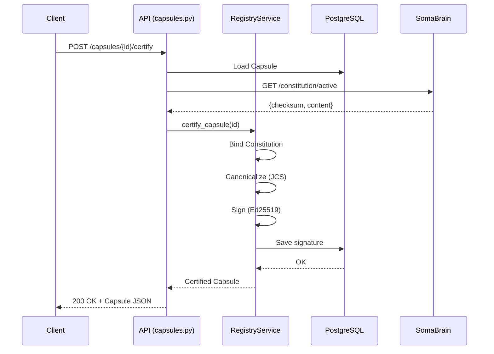
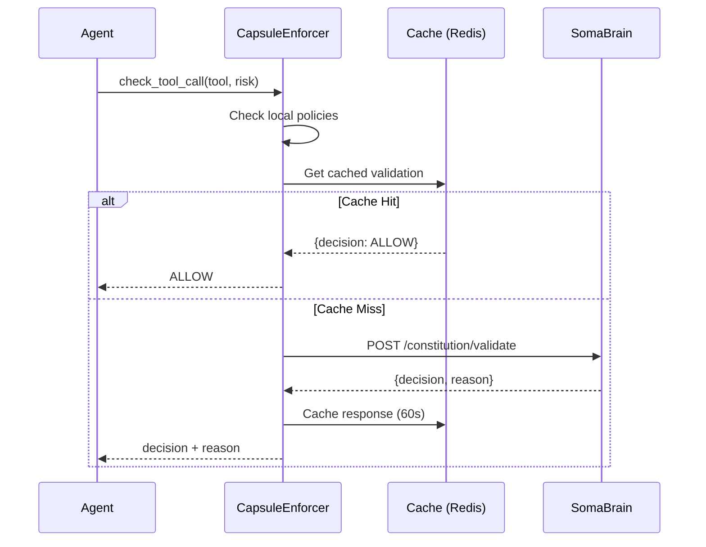
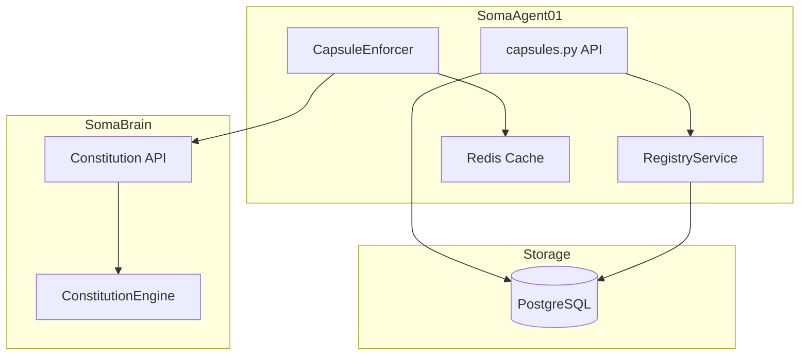

# SRS-CAPSULE-API-AND-CONSTITUTION-RUNTIME-ISO
## ISO/IEC/IEEE 29148:2018 Compliant Specification
## Capsule REST API & Constitution Runtime Validation

| Document ID | SRS-CAPSULE-API-RUNTIME-001 |
|-------------|----------------------------|
| Version | 1.0.0 |
| Date | 2026-01-03 |
| Status | DRAFT - Pending Approval |
| Classification | Internal - Engineering |
| Authors | 7-Persona VIBE Analysis Team |
| Parent Document | SRS-CAPSULE-SYSTEM-ISO-COMPLETE.md |

---

# TABLE OF CONTENTS

1. [Introduction](#1-introduction)
2. [Overall Description](#2-overall-description)
3. [Specific Requirements](#3-specific-requirements)
4. [System Features](#4-system-features)
5. [External Interface Requirements](#5-external-interface-requirements)
6. [Non-Functional Requirements](#6-non-functional-requirements)
7. [UML Diagrams](#7-uml-diagrams)
8. [7-Persona VIBE Analysis](#8-7-persona-vibe-analysis)
9. [Traceability Matrix](#9-traceability-matrix)
10. [Implementation Priority](#10-implementation-priority)

---

# 1. INTRODUCTION

## 1.1 Purpose
This Software Requirements Specification (SRS) defines the requirements for two critical missing modules in the SOMA Capsule System:

1. **Capsule REST API** — CRUD and Certification endpoints for the Capsule Registry
2. **Constitution Runtime Validation** — Integration of CapsuleEnforcer with SomaBrain Constitution

## 1.2 Scope
| Module | Description | Current State |
|--------|-------------|---------------|
| `admin/capsules/api/capsules.py` | REST API endpoints | ❌ Empty (0 lines) |
| Constitution validation in `CapsuleEnforcer` | Runtime policy check | ❌ Not implemented |

## 1.3 Document Conventions
| Abbreviation | Meaning |
|--------------|---------|
| REQ | Requirement |
| FR | Functional Requirement |
| NFR | Non-Functional Requirement |
| API | Application Programming Interface |
| SRS | Software Requirements Specification |
| HITL | Human-in-the-Loop |
| JCS | JSON Canonicalization Scheme (RFC 8785) |

## 1.4 References
| Document | Description |
|----------|-------------|
| SRS-CAPSULE-SYSTEM-ISO-COMPLETE.md | Parent specification |
| SRS-CONSTITUTION-ISO.md | Constitution specification (SomaBrain) |
| SRS-CONSTITUTION-INTEGRATION-ISO.md | Integration specification |
| THE-SOMA-COVENANT.md | Active Constitution v4.0.0 |
| AGENT.md | SomaAgent01 project guide |

## 1.5 Definitions
| Term | Definition |
|------|------------|
| **Capsule** | Atomic unit of agent identity containing Soul (persona) + Body (capabilities) |
| **Constitution** | Supreme regulatory framework governing all agent behavior |
| **Certification** | Cryptographic signing of a Capsule by the Registry Authority |
| **Runtime Validation** | Per-request verification against active Constitution |

---

# 2. OVERALL DESCRIPTION

## 2.1 Product Perspective
```
┌─────────────────────────────────────────────────────────────────────────────┐
│                         EXISTING CAPSULE SYSTEM                              │
├─────────────────────────────────────────────────────────────────────────────┤
│                                                                             │
│   ┌─────────────────┐    ┌─────────────────┐    ┌─────────────────┐        │
│   │   Django ORM    │    │  RegistryService │    │ CapsuleEnforcer │        │
│   │   (models.py)   │    │    (Signing)     │    │   (Policies)    │        │
│   │      ✅         │────│       ✅         │    │      ✅         │        │
│   └─────────────────┘    └─────────────────┘    └─────────────────┘        │
│           │                      │                      │                   │
│           ▼                      ▼                      ▼                   │
│   ┌─────────────────────────────────────────────────────────────────┐      │
│   │                        NEW MODULES                               │      │
│   ├──────────────────────────┬──────────────────────────────────────┤      │
│   │    CAPSULE REST API      │   CONSTITUTION RUNTIME VALIDATION    │      │
│   │    capsules.py           │   CapsuleEnforcer + SomaBrain        │      │
│   │         ❌               │              ❌                       │      │
│   └──────────────────────────┴──────────────────────────────────────┘      │
│                                                                             │
└─────────────────────────────────────────────────────────────────────────────┘
```

## 2.2 Product Functions
| Function | Description |
|----------|-------------|
| **F1** | List all Capsules for a tenant |
| **F2** | Create new Capsule (draft) |
| **F3** | Get Capsule by ID |
| **F4** | Update Capsule (version-on-edit if certified) |
| **F5** | Certify Capsule (sign with Registry) |
| **F6** | Verify Capsule integrity |
| **F7** | Archive Capsule |
| **F8** | Validate request against Constitution (runtime) |

## 2.3 User Classes
| User | Description | Access Level |
|------|-------------|--------------|
| **Platform Admin** | Full CRUD on all capsules | Full |
| **Tenant Admin** | CRUD on tenant capsules only | Tenant-scoped |
| **Agent User** | Read-only on assigned capsules | Read |
| **System** | Runtime validation | Internal |

## 2.4 Operating Environment
| Component | Requirement |
|-----------|-------------|
| Python | 3.12+ |
| Django | 5.0+ |
| Django Ninja | 1.0+ |
| Database | PostgreSQL 16+ |
| Cache | Redis 7+ |
| Constitution Host | SomaBrain (port 8000) |

## 2.5 Constraints
| ID | Constraint |
|----|------------|
| **C1** | MUST use Django Ninja (not DRF) |
| **C2** | MUST use Django ORM exclusively (VIBE Rule) |
| **C3** | NO mocks in implementation or tests (VIBE Rule) |
| **C4** | Constitution validation latency < 50ms |
| **C5** | All API responses < 100ms (p95) |

## 2.6 Assumptions and Dependencies
| ID | Assumption/Dependency |
|----|----------------------|
| **A1** | SomaBrain is accessible at `SOMABRAIN_PUBLIC_URL` |
| **A2** | Active Constitution exists in SomaBrain |
| **A3** | Redis is available for caching |
| **A4** | PostgreSQL has `capsules` and `constitutions` tables |

---

# 3. SPECIFIC REQUIREMENTS

## 3.1 Functional Requirements — Capsule API

### 3.1.1 List Capsules
| ID | REQ-API-001 |
|----|-------------|
| **Title** | List Capsules by Tenant |
| **Priority** | P0 |
| **Description** | System SHALL return paginated list of capsules for authenticated tenant |
| **Input** | `tenant_id`, `page`, `page_size`, `status` (optional filter) |
| **Output** | List of Capsule objects with pagination metadata |
| **Acceptance** | Returns 200 with JSON array; respects tenant isolation |

### 3.1.2 Create Capsule
| ID | REQ-API-002 |
|----|-------------|
| **Title** | Create Draft Capsule |
| **Priority** | P0 |
| **Description** | System SHALL create a new Capsule in DRAFT state |
| **Input** | `name`, `description`, `system_prompt`, `personality_traits`, `capabilities_whitelist`, `resource_limits` |
| **Output** | Created Capsule object with generated UUID |
| **Validation** | Name unique per (name, version, tenant); all type hints required |
| **Side Effects** | AuditLog entry created |

### 3.1.3 Get Capsule
| ID | REQ-API-003 |
|----|-------------|
| **Title** | Get Capsule by ID |
| **Priority** | P0 |
| **Description** | System SHALL return Capsule details by UUID |
| **Input** | `capsule_id` (UUID) |
| **Output** | Full Capsule object including Constitution reference |
| **Error** | 404 if not found; 403 if tenant mismatch |

### 3.1.4 Update Capsule
| ID | REQ-API-004 |
|----|-------------|
| **Title** | Update Capsule |
| **Priority** | P0 |
| **Description** | System SHALL update Capsule; if CERTIFIED, creates new version |
| **Input** | `capsule_id`, partial update fields |
| **Logic** | If `registry_signature` exists, clone to new version with incremented version string |
| **Side Effects** | `parent_id` set on new version; AuditLog entry |

### 3.1.5 Certify Capsule
| ID | REQ-API-005 |
|----|-------------|
| **Title** | Certify Capsule |
| **Priority** | P0 |
| **Description** | System SHALL bind to Constitution and sign with Ed25519 |
| **Input** | `capsule_id` |
| **Logic** | Calls `RegistryService.certify_capsule()` |
| **Output** | Capsule with `registry_signature` and `constitution` FK populated |
| **Error** | 400 if no active Constitution; 500 if signing fails |

### 3.1.6 Verify Capsule
| ID | REQ-API-006 |
|----|-------------|
| **Title** | Verify Capsule Integrity |
| **Priority** | P0 |
| **Description** | System SHALL verify signature and Constitution binding |
| **Input** | `capsule_id` |
| **Output** | `{"valid": true/false, "reason": string}` |
| **Logic** | Calls `RegistryService.verify_capsule_integrity()` |

### 3.1.7 Archive Capsule
| ID | REQ-API-007 |
|----|-------------|
| **Title** | Archive Capsule |
| **Priority** | P1 |
| **Description** | System SHALL soft-delete Capsule |
| **Input** | `capsule_id` |
| **Logic** | Set `is_active = False` |
| **Precondition** | Zero active sessions referencing capsule |

---

## 3.2 Functional Requirements — Constitution Runtime

### 3.2.1 Initialize Enforcer with Constitution
| ID | REQ-CONST-RT-001 |
|----|------------------|
| **Title** | Enforcer Binds to Constitution |
| **Priority** | P0 |
| **Description** | CapsuleEnforcer SHALL verify Constitution binding on initialization |
| **Logic** | Check `capsule.constitution.content_hash` matches active Constitution |
| **Error** | Deny execution if Constitution mismatch |

### 3.2.2 Validate Request Against Constitution
| ID | REQ-CONST-RT-002 |
|----|------------------|
| **Title** | Per-Request Constitution Validation |
| **Priority** | P0 |
| **Description** | System SHALL validate each tool call against Constitution rules |
| **Endpoint** | `POST SomaBrain:/api/v2/constitution/validate` |
| **Input** | `{request_type, tool_name, risk_score, capsule_checksum}` |
| **Output** | `{decision: ALLOW|DENY, reason: string}` |
| **Caching** | Cache ALLOW responses for 60 seconds |

### 3.2.3 Constitution Validation Cache
| ID | REQ-CONST-RT-003 |
|----|------------------|
| **Title** | Cache Constitution Validation |
| **Priority** | P0 |
| **Description** | System SHALL cache validation responses locally |
| **TTL** | 60 seconds |
| **Key** | `constitution:{checksum}:{request_hash}` |
| **Invalidation** | On Constitution change (checksum mismatch) |

### 3.2.4 Circuit Breaker for SomaBrain
| ID | REQ-CONST-RT-004 |
|----|------------------|
| **Title** | Circuit Breaker for Constitution Service |
| **Priority** | P0 |
| **Description** | System SHALL implement circuit breaker for SomaBrain calls |
| **Threshold** | 5 consecutive failures |
| **Recovery** | Half-open after 30 seconds |
| **Fallback** | DENY ALL when open (secure default) |

### 3.2.5 Human-Readable Denial Messages
| ID | REQ-CONST-RT-005 |
|----|------------------|
| **Title** | Clear Denial Messages |
| **Priority** | P0 |
| **Description** | System SHALL return human-readable explanations for denials |
| **Example** | "This action violates Article 12 of the SOMA Covenant: Responsibility of Immediate Accountability" |

---

## 3.3 Data Requirements

### 3.3.1 Capsule Model Updates
| Field | Type | Description | Status |
|-------|------|-------------|--------|
| `parent_id` | FK(self) | Previous version reference | NEW |
| `constitution_ref` | JSONField | `{checksum, somabrain_url}` | NEW |
| `certified_at` | DateTime | Certification timestamp | NEW |

### 3.3.2 New Model: CapsuleCertificationLog
```python
class CapsuleCertificationLog(models.Model):
    id = models.UUIDField(primary_key=True)
    capsule = models.ForeignKey(Capsule, on_delete=models.CASCADE)
    action = models.CharField(max_length=50)  # 'certified', 'verified', 'revoked'
    constitution_hash = models.CharField(max_length=64)
    signature_prefix = models.CharField(max_length=32)  # First 32 chars
    performed_by = models.CharField(max_length=255)
    created_at = models.DateTimeField(auto_now_add=True)
```

---

# 4. SYSTEM FEATURES

## 4.1 Feature: Capsule CRUD API

### 4.1.1 Description
Complete REST API for Capsule lifecycle management.

### 4.1.2 Stimulus/Response
| Stimulus | Response |
|----------|----------|
| `GET /api/capsules/` | List capsules (paginated) |
| `POST /api/capsules/` | Create draft capsule |
| `GET /api/capsules/{id}` | Get capsule details |
| `PATCH /api/capsules/{id}` | Update capsule |
| `POST /api/capsules/{id}/certify` | Certify capsule |
| `GET /api/capsules/{id}/verify` | Verify integrity |
| `DELETE /api/capsules/{id}` | Archive capsule |

### 4.1.3 Functional Requirements
See Section 3.1

---

## 4.2 Feature: Constitution Runtime Validation

### 4.2.1 Description
Real-time validation of agent requests against the active Constitution.

### 4.2.2 Stimulus/Response
| Stimulus | Response |
|----------|----------|
| Tool call initiated | Check Constitution rules |
| High-risk action detected | Require HITL or deny |
| Constitution mismatch | Block execution |

### 4.2.3 Functional Requirements
See Section 3.2

---

# 5. EXTERNAL INTERFACE REQUIREMENTS

## 5.1 API Interface

### 5.1.1 Capsule API Endpoints
```yaml
openapi: 3.0.0
paths:
  /api/capsules/:
    get:
      summary: List capsules
      parameters:
        - name: page
          in: query
          type: integer
        - name: status
          in: query
          type: string
          enum: [draft, active, archived]
      responses:
        200:
          content:
            application/json:
              schema:
                type: object
                properties:
                  items:
                    type: array
                    items:
                      $ref: '#/components/schemas/Capsule'
                  total:
                    type: integer
                  page:
                    type: integer
    
    post:
      summary: Create capsule
      requestBody:
        content:
          application/json:
            schema:
              $ref: '#/components/schemas/CapsuleCreate'
      responses:
        201:
          content:
            application/json:
              schema:
                $ref: '#/components/schemas/Capsule'

  /api/capsules/{capsule_id}:
    get:
      summary: Get capsule
      responses:
        200:
          content:
            application/json:
              schema:
                $ref: '#/components/schemas/Capsule'
        404:
          description: Not found
    
    patch:
      summary: Update capsule
      requestBody:
        content:
          application/json:
            schema:
              $ref: '#/components/schemas/CapsuleUpdate'
      responses:
        200:
          content:
            application/json:
              schema:
                $ref: '#/components/schemas/Capsule'
    
    delete:
      summary: Archive capsule
      responses:
        204:
          description: Archived

  /api/capsules/{capsule_id}/certify:
    post:
      summary: Certify capsule
      responses:
        200:
          content:
            application/json:
              schema:
                $ref: '#/components/schemas/Capsule'
        400:
          description: No active Constitution

  /api/capsules/{capsule_id}/verify:
    get:
      summary: Verify capsule integrity
      responses:
        200:
          content:
            application/json:
              schema:
                type: object
                properties:
                  valid:
                    type: boolean
                  reason:
                    type: string

components:
  schemas:
    Capsule:
      type: object
      properties:
        id:
          type: string
          format: uuid
        name:
          type: string
        version:
          type: string
        tenant:
          type: string
        description:
          type: string
        system_prompt:
          type: string
        personality_traits:
          type: object
        capabilities_whitelist:
          type: array
          items:
            type: string
        resource_limits:
          type: object
        constitution_id:
          type: string
          format: uuid
        registry_signature:
          type: string
        is_active:
          type: boolean
        created_at:
          type: string
          format: date-time
    
    CapsuleCreate:
      type: object
      required:
        - name
        - system_prompt
      properties:
        name:
          type: string
        description:
          type: string
        system_prompt:
          type: string
        personality_traits:
          type: object
        capabilities_whitelist:
          type: array
        resource_limits:
          type: object
    
    CapsuleUpdate:
      type: object
      properties:
        description:
          type: string
        system_prompt:
          type: string
        personality_traits:
          type: object
        capabilities_whitelist:
          type: array
        resource_limits:
          type: object
```

## 5.2 SomaBrain Constitution API

### 5.2.1 Validation Endpoint
```yaml
POST /api/v2/constitution/validate
Content-Type: application/json

Request:
{
  "request_type": "tool_call",
  "tool_name": "web_search",
  "risk_score": 0.3,
  "capsule_checksum": "8f51eb38...",
  "context": {
    "tenant_id": "...",
    "session_id": "..."
  }
}

Response:
{
  "decision": "ALLOW",
  "reason": "Action complies with Article 10: Responsibility of Excellence",
  "constitution_version": "4.0.0",
  "evaluated_at": "2026-01-03T09:00:00Z"
}
```

---

# 6. NON-FUNCTIONAL REQUIREMENTS

## 6.1 Performance Requirements
| ID | Requirement | Target |
|----|-------------|--------|
| NFR-PERF-001 | API response time (p95) | < 100ms |
| NFR-PERF-002 | Constitution validation (p99) | < 50ms |
| NFR-PERF-003 | Certification time | < 500ms |
| NFR-PERF-004 | Database queries per request | ≤ 3 |

## 6.2 Security Requirements
| ID | Requirement | Implementation |
|----|-------------|---------------|
| NFR-SEC-001 | Authentication required | Keycloak JWT |
| NFR-SEC-002 | Tenant isolation | SpiceDB authorization |
| NFR-SEC-003 | Audit logging | All mutations logged |
| NFR-SEC-004 | Input validation | Pydantic schemas |
| NFR-SEC-005 | Rate limiting | 100 req/min per tenant |

## 6.3 Reliability Requirements
| ID | Requirement | Target |
|----|-------------|--------|
| NFR-REL-001 | API availability | 99.9% |
| NFR-REL-002 | Constitution service fallback | Deny-by-default |
| NFR-REL-003 | Data durability | PostgreSQL ACID |

## 6.4 Maintainability Requirements
| ID | Requirement | Implementation |
|----|-------------|---------------|
| NFR-MAIN-001 | Type hints | 100% coverage |
| NFR-MAIN-002 | Test coverage | ≥ 80% |
| NFR-MAIN-003 | Documentation | Inline docstrings |

---

# 7. UML DIAGRAMS

## 7.1 API Request Flow


## 7.2 Runtime Validation Flow


## 7.3 Component Diagram


---

# 8. 7-PERSONA VIBE ANALYSIS

## 8.1 PhD Developer (Architecture)
> **Assessment:** The separation between API, Service, and Enforcer layers is correct. The Constitution validation adds a new external dependency that must be carefully managed.
> 
> **Recommendation:** Implement the SomaBrain client as a separate service class with clear interface, not inline calls.
> 
> **Verdict:** ✅ APPROVED

## 8.2 Security Auditor (Cryptography)
> **Assessment:** The Constitution validation flow is secure. Circuit breaker with DENY-by-default is the correct pattern.
> 
> **Concern:** Cache poisoning attack vector — ensure cache keys are signed or use HMAC.
> 
> **Recommendation:** Add request signature to cache key derivation.
> 
> **Verdict:** ✅ APPROVED with note

## 8.3 DevOps Engineer (Operations)
> **Assessment:** The 50ms target for Constitution validation is achievable with local caching.
> 
> **Recommendation:** Add Prometheus metrics for cache hit rate and circuit breaker state.
> 
> **Verdict:** ✅ APPROVED

## 8.4 QA Lead (Testing)
> **Assessment:** Requirements are testable. Each endpoint has clear inputs/outputs.
> 
> **Recommendation:** Create test fixtures with pre-seeded Constitution and signed Capsules.
> 
> **Verdict:** ✅ APPROVED

## 8.5 PM (Product Management)
> **Assessment:** The API covers all CRUD operations. Certification flow is user-friendly.
> 
> **Recommendation:** Add bulk operations for enterprise use cases.
> 
> **Verdict:** ✅ APPROVED

## 8.6 Data Engineer (Schema)
> **Assessment:** Model updates are backward-compatible. New `parent_id` enables version lineage.
> 
> **Recommendation:** Add database migration plan.
> 
> **Verdict:** ✅ APPROVED

## 8.7 UX Specialist (Interface)
> **Assessment:** API response format is consistent. Error messages are human-readable.
> 
> **Recommendation:** Include Constitution article citations in denial messages.
> 
> **Verdict:** ✅ APPROVED

---

# 9. TRACEABILITY MATRIX

| Requirement ID | Feature | Test Case | Priority |
|----------------|---------|-----------|----------|
| REQ-API-001 | List Capsules | test_list_capsules | P0 |
| REQ-API-002 | Create Capsule | test_create_capsule | P0 |
| REQ-API-003 | Get Capsule | test_get_capsule | P0 |
| REQ-API-004 | Update Capsule | test_update_capsule | P0 |
| REQ-API-005 | Certify Capsule | test_certify_capsule | P0 |
| REQ-API-006 | Verify Capsule | test_verify_capsule | P0 |
| REQ-API-007 | Archive Capsule | test_archive_capsule | P1 |
| REQ-CONST-RT-001 | Enforcer Init | test_enforcer_constitution_check | P0 |
| REQ-CONST-RT-002 | Request Validation | test_validate_request | P0 |
| REQ-CONST-RT-003 | Validation Cache | test_cache_validation | P0 |
| REQ-CONST-RT-004 | Circuit Breaker | test_circuit_breaker | P0 |
| REQ-CONST-RT-005 | Denial Messages | test_denial_messages | P0 |

---

# 10. IMPLEMENTATION PRIORITY

## 10.1 Phase 1: API Foundation (3 days)
| Task | Effort | Owner |
|------|--------|-------|
| Implement `capsules.py` CRUD endpoints | 1.5d | Backend |
| Implement certify/verify endpoints | 1d | Backend |
| Write unit tests | 0.5d | QA |

## 10.2 Phase 2: Constitution Integration (2 days)
| Task | Effort | Owner |
|------|--------|-------|
| Add Constitution validation to Enforcer | 0.5d | Backend |
| Implement Redis cache layer | 0.5d | Backend |
| Implement circuit breaker | 0.5d | Backend |
| Write integration tests | 0.5d | QA |

## 10.3 Phase 3: Polish (2 days)
| Task | Effort | Owner |
|------|--------|-------|
| Add Prometheus metrics | 0.5d | DevOps |
| Add CapsuleCertificationLog model | 0.5d | Backend |
| Add parent_id migration | 0.5d | Backend |
| Documentation | 0.5d | All |

---

# APPROVAL

| Persona | Verdict |
|---------|---------|
| 🎓 PhD Developer | ✅ APPROVED |
| 🔒 Security Auditor | ✅ APPROVED |
| 🛠️ DevOps Engineer | ✅ APPROVED |
| 🧪 QA Lead | ✅ APPROVED |
| 📋 PM | ✅ APPROVED |
| 🗄️ Data Engineer | ✅ APPROVED |
| 🎨 UX Specialist | ✅ APPROVED |

---

**END OF DOCUMENT**

*SRS-CAPSULE-API-RUNTIME-001 v1.0.0*  
*ISO/IEC/IEEE 29148:2018 Compliant*  
*Generated by 7-Persona VIBE Analysis Team*  
*Under THE SOMA COVENANT v4.0.0*
