# SRS-CAPSULE-LIFECYCLE-COMPLETE
## ISO/IEC/IEEE 29148:2018 Compliant Specification
## Complete Capsule Registry, Lifecycle, Security, and UI Architecture

| Document ID | SRS-CAPSULE-LIFECYCLE-001 |
|-------------|---------------------------|
| Version | 2.0.0 |
| Date | 2026-01-03 |
| Status | DRAFT |
| Classification | Internal - Engineering |
| Compliance | ISO/IEC/IEEE 29148:2018 |

---

# TABLE OF CONTENTS

1. [Introduction](#1-introduction)
2. [System Overview](#2-system-overview)
3. [Data Models](#3-data-models)
4. [Lifecycle State Machine](#4-lifecycle-state-machine)
5. [Flow 1: Capsule Creation](#5-flow-1-capsule-creation)
6. [Flow 2: Capsule Certification](#6-flow-2-capsule-certification)
7. [Flow 3: Runtime Verification](#7-flow-3-runtime-verification)
8. [Flow 4: Tool Execution](#8-flow-4-tool-execution)
9. [Flow 5: Capsule Update](#9-flow-5-capsule-update)
10. [Flow 6: Capsule Archival](#10-flow-6-capsule-archival)
11. [Security Architecture](#11-security-architecture)
12. [Screen Specifications](#12-screen-specifications)
13. [API Specification](#13-api-specification)
14. [Requirements Matrix](#14-requirements-matrix)
15. [Implementation Roadmap](#15-implementation-roadmap)

---

# 1. INTRODUCTION

## 1.1 Purpose
Complete specification for the SOMA Capsule System covering all lifecycle flows, security architecture, and user interface screens.

## 1.2 Scope
| Component | Description |
|-----------|-------------|
| **Capsule** | Atomic unit of agent identity (Soul + Body) |
| **Registry** | Certification authority for capsules |
| **Constitution** | Supreme regulatory framework |
| **Enforcer** | Runtime policy enforcement |
| **UI** | AgentCapsuleCreator screens |

## 1.3 Compliance
This document follows ISO/IEC/IEEE 29148:2018 for:
- Requirements elicitation
- Stakeholder requirements specification
- System requirements specification
- Software requirements specification

---

# 2. SYSTEM OVERVIEW

## 2.1 System Context Diagram


## 2.2 Component Diagram


---

# 3. DATA MODELS

## 3.1 Entity Relationship Diagram


## 3.2 Capsule Components


---

# 4. LIFECYCLE STATE MACHINE

## 4.1 State Diagram


## 4.2 State Transition Table
| Current State | Event | Next State | Conditions |
|---------------|-------|------------|------------|
| - | create() | Draft | Valid schema |
| Draft | update() | Draft | - |
| Draft | submit() | Validating | - |
| Draft | delete() | - | No dependencies |
| Validating | validation_passed() | Certifying | Schema valid |
| Validating | validation_failed() | Draft | Return errors |
| Certifying | sign_success() | Active | Constitution active |
| Certifying | sign_failed() | Draft | Return error |
| Active | edit() | Draft | Creates new version |
| Active | archive() | Archived | Zero sessions |
| Archived | restore() | Active | Admin approval |
| Archived | hard_delete() | - | Zero references |

---

# 5. FLOW 1: CAPSULE CREATION

## 5.1 Flowchart


## 5.2 Sequence Diagram


## 5.3 Screen: Capsule Creator - Step 1

```mermaid
graph TD
    subgraph Screen1["Step 1: Basic Information"]
        direction TB
        H1[/"🧬 Create New Agent Capsule"\]
        
        subgraph Form1["Form Fields"]
            F1["Name: [________________]"]
            F2["Version: [1.0.0_________]"]
            F3["Description: [__________]<br/>[________________________]"]
        end
        
        subgraph Actions1["Actions"]
            B1["[ Cancel ]"]
            B2["[ Next → ]"]
        end
    end
```


## 5.4 Screen: Capsule Creator - Step 2 (Soul)

```mermaid
graph TD
    subgraph Screen2["Step 2: Define Soul (Identity)"]
        direction TB
        H2[/"🧠 Soul Configuration"\]
        
        subgraph Prompt["System Prompt"]
            P1["You are a helpful assistant that...<br/>[________________________________]<br/>[________________________________]"]
        end
        
        subgraph Personality["Personality Traits (Big 5)"]
            T1["Openness:          ○○○○●○○○○○ 0.5"]
            T2["Conscientiousness: ○○○○○○●○○○ 0.7"]
            T3["Extraversion:      ○○○●○○○○○○ 0.4"]
            T4["Agreeableness:     ○○○○○○○●○○ 0.8"]
            T5["Neuroticism:       ○○●○○○○○○○ 0.2"]
        end
        
        subgraph Neuro["Neuromodulators"]
            N1["Dopamine:       ○○○○●○○○○○ 0.5"]
            N2["Serotonin:      ○○○○○●○○○○ 0.6"]
            N3["Norepinephrine: ○○○●○○○○○○ 0.4"]
            N4["Acetylcholine:  ○○○○○○●○○○ 0.7"]
        end
        
        B3["[ ← Back ]  [ Next → ]"]
    end
```


## 5.5 Screen: Capsule Creator - Step 3 (Body)

```mermaid
graph TD
    subgraph Screen3["Step 3: Define Body (Capabilities)"]
        direction TB
        H3[/"💪 Body Configuration"\]
        
        subgraph Tools["Capabilities Whitelist"]
            T1["☑ web_search"]
            T2["☑ code_execution"]
            T3["☐ file_system"]
            T4["☐ terminal"]
            T5["☑ database_query"]
        end
        
        subgraph Limits["Resource Limits"]
            L1["Max Wall Clock: [300___] seconds"]
            L2["Max Concurrent: [10____] operations"]
            L3["Max Tokens:     [4096__] per request"]
        end
        
        subgraph Egress["Egress Policy"]
            E1["Mode: (●) Open  ( ) Restricted  ( ) None"]
            E2["Blocked: [*.malware.com, *.phishing.net]"]
        end
        
        subgraph HITL["HITL Policy"]
            H4["Mode: ( ) None  (●) Optional  ( ) Required"]
            H5["Risk Threshold: [0.7___]"]
        end
        
        B4["[ ← Back ]  [ Next → ]"]
    end
```


---

# 6. FLOW 2: CAPSULE CERTIFICATION

## 6.1 Flowchart


## 6.2 Sequence Diagram

```mermaid
sequenceDiagram
    actor User
    participant UI as CapsuleDetailPage
    participant API as POST /capsules/{id}/certify
    participant RS as RegistryService
    participant Brain as SomaBrain
    participant DB as PostgreSQL
    participant Log as CertificationLog
    
    User->>UI: Click "Certify"
    UI->>API: POST /capsules/{id}/certify
    
    API->>DB: SELECT * FROM capsules WHERE id=?
    DB-->>API: capsule (status=draft)
    
    API->>RS: certify_capsule(capsule_id)
    
    RS->>Brain: GET /api/v2/constitution/active
    Brain-->>RS: {id, content_hash, content}
    
    RS->>RS: Bind constitution_ref
    RS->>RS: Build payload (soul + body + constitution_ref)
    RS->>RS: jcs.canonicalize(payload)
    RS->>RS: signing_key.sign(canonical_bytes)
    RS->>RS: base64.encode(signature)
    
    RS->>DB: UPDATE capsule SET registry_signature=?, status='active'
    DB-->>RS: OK
    
    RS->>Log: INSERT (action='certified', constitution_hash)
    Log-->>RS: OK
    
    RS-->>API: capsule (status=active, signature=xxx)
    API-->>UI: 200 OK {capsule}
    UI-->>User: "✓ Capsule Certified!"
```


## 6.3 Screen: Certification Confirmation

```mermaid
graph TD
    subgraph Screen4["Certification Preview"]
        direction TB
        H4[/"🔏 Certify Capsule"\]
        
        subgraph Preview["Capsule Summary"]
            P1["Name: agent-alpha"]
            P2["Version: 1.0.0"]
            P3["Tools: 5 capabilities"]
            P4["Status: DRAFT"]
        end
        
        subgraph Constitution["Constitution Binding"]
            C1["📜 THE SOMA COVENANT v4.0.0"]
            C2["Checksum: 8f51eb38..."]
            C3["Articles: 31"]
        end
        
        subgraph Warning["⚠️ Warning"]
            W1["Once certified, this capsule<br/>becomes IMMUTABLE.<br/>Edits will create a new version."]
        end
        
        B5["[ Cancel ]  [ 🔏 Certify Now ]"]
    end
```


## 6.4 Screen: Certification Success

```mermaid
graph TD
    subgraph Screen5["Certification Complete"]
        direction TB
        H5[/"✅ Capsule Certified Successfully"\]
        
        subgraph Details["Certification Details"]
            D1["Capsule ID: uuid-1234..."]
            D2["Status: ACTIVE"]
            D3["Signature: abc123...xyz"]
            D4["Certified At: 2026-01-03 09:00:00"]
        end
        
        subgraph Binding["Constitution Binding"]
            B1["📜 THE SOMA COVENANT v4.0.0"]
            B2["✓ Cryptographically Bound"]
        end
        
        B6["[ View Capsule ]  [ Create Another ]"]
    end
```


---

# 7. FLOW 3: RUNTIME VERIFICATION

## 7.1 Flowchart


## 7.2 Sequence Diagram


---

# 8. FLOW 4: TOOL EXECUTION

## 8.1 Flowchart


## 8.2 Sequence Diagram


---

# 9. FLOW 5: CAPSULE UPDATE

## 9.1 Flowchart


## 9.2 Sequence Diagram


---

# 10. FLOW 6: CAPSULE ARCHIVAL

## 10.1 Flowchart
```mermaid
flowchart TD
    Start([Delete Request]) --> A[Load Capsule]
    A --> B{Has Active Sessions?}
    B -->|Yes| Error1[/"Error: Active Sessions Exist"/]
    B -->|No| C{Current Status?}
    C -->|Draft| D[Hard Delete]
    D --> E[Remove from DB]
    E --> F[Log Deletion]
    F --> End1([204 No Content])
    
    C -->|Active| G[Soft Delete]
    G --> H[Set status = archived]
    H --> I[Set is_active = false]
    I --> J[Set archived_at = now]
    J --> K[Log Archival]
    K --> End2([204 No Content])
    
    C -->|Archived| L{Force Delete?}
    L -->|No| Error2[/"Error: Already Archived"/]
    L -->|Yes| M{Has Child Versions?}
    M -->|Yes| Error3[/"Error: Has Children"/]
    M -->|No| D
```

## 10.2 Sequence Diagram
```mermaid
sequenceDiagram
    actor User
    participant API as DELETE /capsules/{id}
    participant DB as PostgreSQL
    participant Sessions as SessionStore
    participant Log as AuditLog
    
    User->>API: DELETE
    API->>DB: SELECT * FROM capsules WHERE id=?
    DB-->>API: capsule
    
    API->>Sessions: COUNT active sessions for capsule
    Sessions-->>API: count
    
    alt count > 0
        API-->>User: 409 Conflict (active sessions)
    else count = 0
        alt status = 'draft'
            API->>DB: DELETE FROM capsules WHERE id=?
            API->>Log: INSERT (action='deleted')
        else status = 'active'
            API->>DB: UPDATE SET status='archived', is_active=false
            API->>Log: INSERT (action='archived')
        end
        API-->>User: 204 No Content
    end
```

---

# 11. SECURITY ARCHITECTURE

## 11.1 Cryptographic Flow
```mermaid
flowchart LR
    subgraph Constitution
        CONST[/"Constitution JSON"/]
        HASH[SHA-256]
        CONST --> HASH
        HASH --> CHASH[/"content_hash"/]
    end
    
    subgraph Capsule
        SOUL[/"Soul JSON"/]
        BODY[/"Body JSON"/]
        REF[/"constitution_ref"/]
        PAYLOAD[/"Signing Payload"/]
        
        SOUL --> PAYLOAD
        BODY --> PAYLOAD
        CHASH --> REF
        REF --> PAYLOAD
    end
    
    subgraph Signing
        JCS[JCS Canonicalize]
        SIGN[Ed25519 Sign]
        B64[Base64 Encode]
        
        PAYLOAD --> JCS
        JCS --> SIGN
        SIGN --> B64
        B64 --> SIG[/"registry_signature"/]
    end
```

## 11.2 Key Management
```mermaid
flowchart TD
    subgraph Development
        ENV[Environment Variable]
        ENV --> SK1[Signing Key]
    end
    
    subgraph Staging
        VAULT[HashiCorp Vault]
        VAULT --> SK2[Signing Key]
    end
    
    subgraph Production
        AWS[AWS Secrets Manager]
        AWS --> SK3[Signing Key]
        HSM[Hardware Security Module]
        AWS -.-> HSM
    end
```

## 11.3 Attack Vectors and Mitigations
```mermaid
mindmap
  root((SECURITY))
    Signature Forgery
      Mitigation: Ed25519 256-bit
    Payload Tampering
      Mitigation: JCS determinism
    Constitution Swap
      Mitigation: Hash binding
    Key Extraction
      Mitigation: Vault storage
    Replay Attack
      Mitigation: Timestamps + nonce
    Cache Poisoning
      Mitigation: HMAC on keys
```

---

# 12. SCREEN SPECIFICATIONS

## 12.1 Screen: Capsule List
```mermaid
graph TD
    subgraph CapsuleListPage["Capsule List Page"]
        direction TB
        
        subgraph Header["Header"]
            H1["🧬 Agent Capsules"]
            B1["[ + Create New ]"]
        end
        
        subgraph Filters["Filters"]
            F1["Status: [All ▼]"]
            F2["Search: [__________]"]
        end
        
        subgraph Table["Capsule Table"]
            TH["Name | Version | Status | Created | Actions"]
            R1["agent-alpha | 1.0.0 | ✅ Active | 2026-01-03 | [View] [Archive]"]
            R2["agent-beta  | 2.1.0 | 📝 Draft  | 2026-01-02 | [Edit] [Certify] [Delete]"]
            R3["agent-gamma | 1.0.0 | 📦 Archived| 2026-01-01 | [Restore]"]
        end
        
        subgraph Pagination["Pagination"]
            P1["← Previous | Page 1 of 5 | Next →"]
        end
    end
```

## 12.2 Screen: Capsule Detail
```mermaid
graph TD
    subgraph CapsuleDetailPage["Capsule Detail Page"]
        direction TB
        
        subgraph Header2["Header"]
            H2["🧬 agent-alpha v1.0.0"]
            Status["Status: ✅ ACTIVE"]
            Actions["[Edit] [Archive] [Export]"]
        end
        
        subgraph Soul["🧠 Soul"]
            S1["System Prompt:<br/>You are a helpful assistant..."]
            S2["Personality: O:0.8 C:0.7 E:0.4 A:0.8 N:0.2"]
        end
        
        subgraph Body2["💪 Body"]
            B2["Tools: web_search, code_exec, db_query"]
            B3["Limits: 300s wall clock, 10 concurrent"]
            B4["Egress: Open (blocked: *.malware.com)"]
        end
        
        subgraph Governance["📜 Governance"]
            G1["Constitution: THE SOMA COVENANT v4.0.0"]
            G2["Checksum: 8f51eb38..."]
            G3["Signature: abc123...xyz ✓"]
            G4["Certified: 2026-01-03 09:00:00"]
        end
        
        subgraph Lineage["📊 Version History"]
            L1["v1.0.0 (current) ← v0.9.0 ← v0.8.0"]
        end
    end
```

## 12.3 Screen: AgentCapsuleCreator Wizard
```mermaid
flowchart LR
    subgraph Wizard["AgentCapsuleCreator Wizard"]
        S1["1️⃣ Basic Info"]
        S2["2️⃣ Soul"]
        S3["3️⃣ Body"]
        S4["4️⃣ Review"]
        S5["5️⃣ Certify"]
        
        S1 --> S2 --> S3 --> S4 --> S5
    end
```

---

# 13. API SPECIFICATION

## 13.1 Endpoints
```mermaid
flowchart LR
    subgraph API["Capsules API"]
        GET1["GET /api/capsules/"]
        POST1["POST /api/capsules/"]
        GET2["GET /api/capsules/{id}"]
        PATCH1["PATCH /api/capsules/{id}"]
        DELETE1["DELETE /api/capsules/{id}"]
        POST2["POST /api/capsules/{id}/certify"]
        GET3["GET /api/capsules/{id}/verify"]
        POST3["POST /api/capsules/{id}/clone"]
        GET4["GET /api/capsules/{id}/history"]
    end
```

## 13.2 Request/Response Flow
```mermaid
sequenceDiagram
    participant Client
    participant API
    participant Auth as Keycloak
    participant AuthZ as SpiceDB
    participant DB as PostgreSQL
    
    Client->>API: Request + JWT
    API->>Auth: Validate JWT
    Auth-->>API: User claims
    API->>AuthZ: Check permission
    AuthZ-->>API: ALLOW/DENY
    
    alt Authorized
        API->>DB: Execute query
        DB-->>API: Result
        API-->>Client: 200 OK + JSON
    else Unauthorized
        API-->>Client: 403 Forbidden
    end
```

---

# 14. REQUIREMENTS MATRIX

## 14.1 Functional Requirements
| ID | Requirement | Priority | Diagrams |
|----|-------------|----------|----------|
| REQ-CAP-001 | Capsule contains Soul + Body | P0 | §3.2 |
| REQ-CAP-002 | Certified Capsules immutable | P0 | §4.1 |
| REQ-CAP-003 | Signature required for activation | P0 | §6.2 |
| REQ-CAP-004 | Version-on-edit for active capsules | P0 | §9.1 |
| REQ-API-001 | CRUD endpoints | P0 | §13.1 |
| REQ-API-002 | Certify endpoint | P0 | §6.2 |
| REQ-SEC-001 | Ed25519 signatures | P0 | §11.1 |
| REQ-SEC-002 | Constitution hash binding | P0 | §11.1 |
| REQ-ENF-001 | Runtime policy enforcement | P0 | §8.1 |

---

# 15. IMPLEMENTATION ROADMAP

## 15.1 Timeline
```mermaid
gantt
    title Capsule System Implementation
    dateFormat  YYYY-MM-DD
    
    section Phase 1: API
    CRUD Endpoints           :a1, 2026-01-06, 2d
    Certify/Verify           :a2, after a1, 1d
    Unit Tests               :a3, after a2, 1d
    
    section Phase 2: Constitution
    Enforcer Integration     :b1, after a3, 1d
    Cache Layer              :b2, after b1, 1d
    Circuit Breaker          :b3, after b2, 1d
    
    section Phase 3: UI
    CapsuleCreator Wizard    :c1, after b3, 3d
    List/Detail Pages        :c2, after c1, 2d
    
    section Phase 4: Security
    Vault Migration          :d1, after c2, 1d
    E2E Tests                :d2, after d1, 2d
```

---

**END OF DOCUMENT**

*SRS-CAPSULE-LIFECYCLE-001 v2.0.0*  
*ISO/IEC/IEEE 29148:2018 Compliant*
