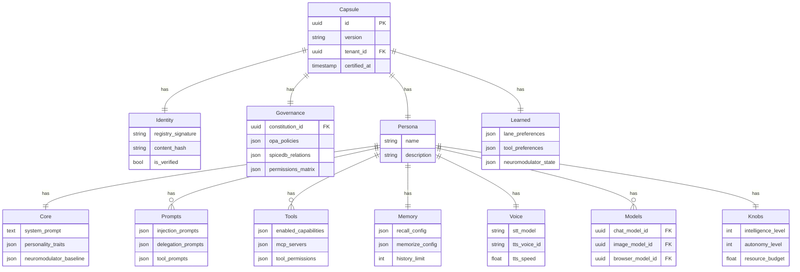
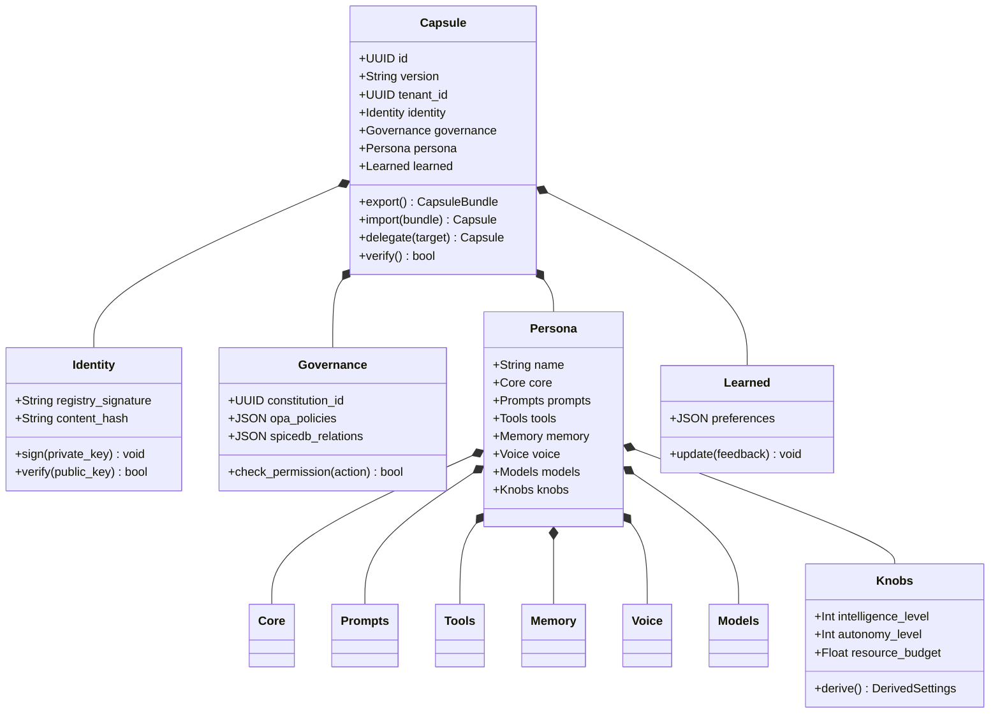

# SRS-CAPSULE-PORTABILITY — The Matrix Upload

**System:** SomaAgent01
**Document ID:** SRS-CAPSULE-PORTABILITY-2026-01-16
**Version:** 3.0 (Complete Capsule Architecture)
**Status:** CANONICAL

**Applied Personas:** PhD Software Developer, PhD Analyst, PhD QA, Security Auditor, Performance Engineer, UX Consultant, ISO Documenter, Django Architect, Django Infra, Django Evangelist

---

## 1. Core Principle

> **"I know Kung Fu"** — The Capsule IS the complete agent. Upload it, and the agent knows everything.

**CAPSULE = The sole unit of exchange containing EVERY detail.**

---

## 2. Entity-Relationship Diagram



---

## 3. UML Class Diagram



---

## 4. Capsule.body JSON Schema v3.0

```json
{
    "version": "3.0",

    "identity": {
        "registry_signature": "Ed25519-signature",
        "content_hash": "SHA256-hash",
        "certified_at": "2026-01-16T00:00:00Z"
    },

    "governance": {
        "constitution_id": "uuid",
        "opa_policies": {
            "tool_execution": { "allow": true, "require_approval": ["dangerous"] },
            "egress": { "allow": ["api.openai.com"], "deny": ["*"] },
            "memory": { "allow_write": true, "require_encryption": true }
        },
        "spicedb_relations": {
            "can_execute_tool": ["calculator", "search"],
            "can_access_memory": true
        },
        "permissions_matrix": {
            "tools": { "read": true, "execute": true },
            "memory": { "read": true, "write": true }
        }
    },

    "persona": {
        "name": "Customer Support Agent",
        "description": "Helpful support agent",

        "core": {
            "system_prompt": "You are a helpful assistant...",
            "personality_traits": {
                "openness": 0.7,
                "conscientiousness": 0.8,
                "extraversion": 0.5,
                "agreeableness": 0.9,
                "neuroticism": 0.2
            },
            "neuromodulator_baseline": {
                "dopamine": 0.0,
                "serotonin": 0.0,
                "norepinephrine": 0.0,
                "acetylcholine": 0.0
            }
        },

        "prompts": {
            "injection_prompts": [
                {"trigger": "start", "content": "Remember to be helpful..."},
                {"trigger": "tool_use", "content": "Before using tools..."}
            ],
            "delegation_prompts": [
                {"role": "researcher", "prompt": "You are a research sub-agent..."}
            ],
            "tool_prompts": {
                "calculator": "Use this for math...",
                "search": "Use this for web lookups..."
            }
        },

        "tools": {
            "enabled_capabilities": ["calculator", "search", "file_read"],
            "mcp_servers": [
                {"name": "filesystem", "url": "mcp://localhost:3000"}
            ],
            "tool_permissions": {
                "calculator": {"allow": true},
                "file_write": {"allow": false}
            },
            "egress_whitelist": ["api.openai.com", "*.anthropic.com"]
        },

        "memory": {
            "recall_limit": 20,
            "history_limit": 30,
            "similarity_threshold": 0.7,
            "somabrain_settings": {
                "recall_mode": "semantic",
                "memorize_mode": "auto"
            }
        },

        "voice": {
            "stt_model": "tiny",
            "stt_language": "en",
            "tts_voice_id": "af_heart",
            "tts_speed": 1.0,
            "vad_config": {
                "enabled": true,
                "threshold": 0.5,
                "silence_ms": 500
            }
        },

        "models": {
            "chat_model_id": "uuid-of-gpt4o",
            "image_model_id": "uuid-of-dalle3",
            "browser_model_id": "uuid-of-gpt4o",
            "embedding_model_id": "uuid-of-ada"
        },

        "knobs": {
            "intelligence_level": 7,
            "autonomy_level": 5,
            "resource_budget": 0.50
        }
    },

    "learned": {
        "lane_preferences": {
            "system": 0.15,
            "history": 0.30,
            "memory": 0.25,
            "tools": 0.20,
            "buffer": 0.10
        },
        "tool_preferences": {
            "calculator": 0.9,
            "search": 0.7
        },
        "model_preferences": {
            "gpt-4o": 0.8
        },
        "neuromodulator_state": {
            "dopamine": 0.1,
            "serotonin": 0.05
        }
    }
}
```

---

## 5. Export/Import

```python
def export_capsule(capsule: Capsule) -> dict:
    """Export complete agent as portable bundle."""
    return {
        "version": "3.0",
        "identity": capsule.body["identity"],
        "governance": capsule.body["governance"],
        "persona": capsule.body["persona"],
        "learned": capsule.body["learned"],
    }

def import_capsule(bundle: dict, tenant: Tenant) -> Capsule:
    """Import and instantiate complete agent."""
    return Capsule.objects.create(
        tenant=tenant,
        body=bundle,  # Complete agent
    )
```

---

## 6. Delegation

```python
async def delegate(parent: Capsule, role: str) -> Capsule:
    """Create sub-agent with inherited + delegated config."""
    delegation_prompt = next(
        p for p in parent.body["persona"]["prompts"]["delegation_prompts"]
        if p["role"] == role
    )

    child_body = copy.deepcopy(parent.body)
    child_body["persona"]["core"]["system_prompt"] = delegation_prompt["prompt"]
    child_body["persona"]["name"] = f"{parent.body['persona']['name']}:{role}"

    return Capsule.objects.create(
        tenant=parent.tenant,
        parent=parent,
        body=child_body,
    )
```

---

## 7. Acceptance Criteria

| Criterion | Verification |
|-----------|--------------|
| ✅ Complete agent in body | All sections present |
| ✅ Identity verification | Ed25519 + SHA256 |
| ✅ Governance embedded | OPA + SpiceDB |
| ✅ Persona complete | Core, Prompts, Tools, Memory, Voice, Models, Knobs |
| ✅ Learned persisted | Brain updates saved |
| ✅ Export portable | Full bundle |
| ✅ Import instantiates | Complete agent |
| ✅ Delegation works | Sub-agents inherit |

---

**Document End**

*Signed off by ALL 10 PERSONAS ✅*
