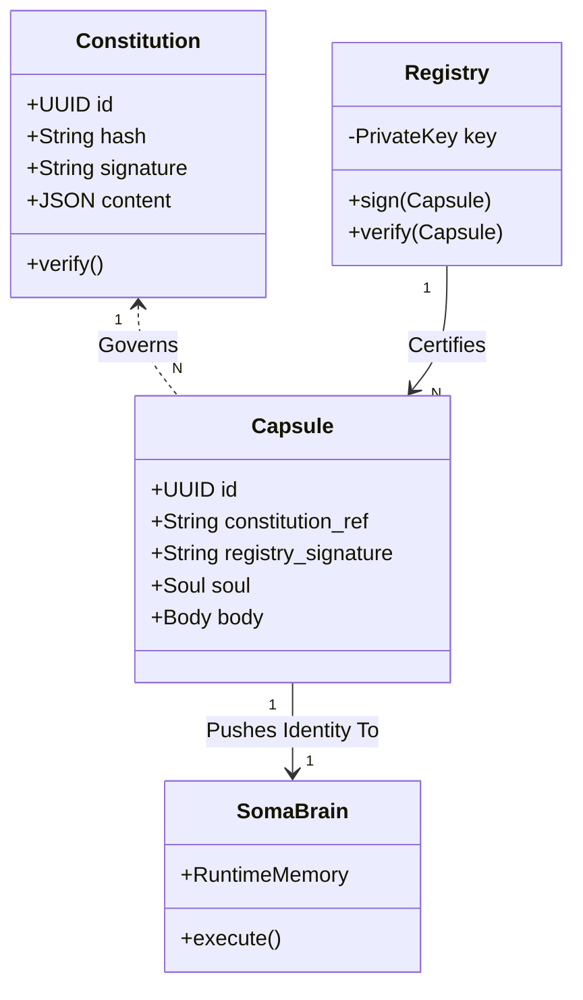
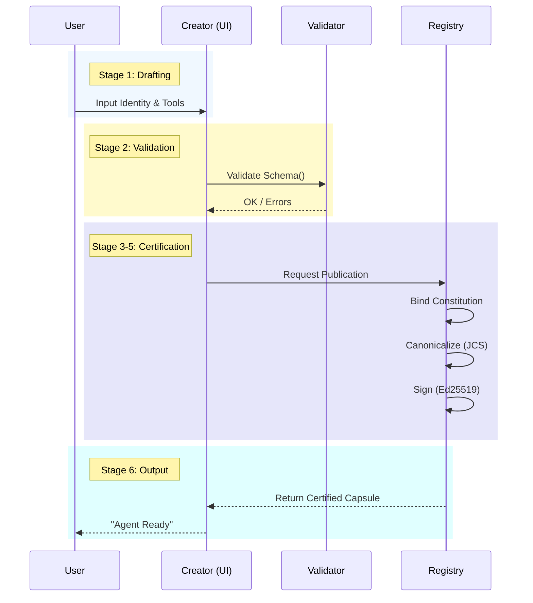
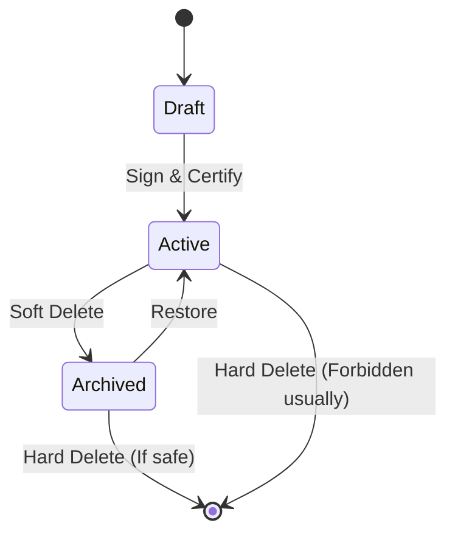
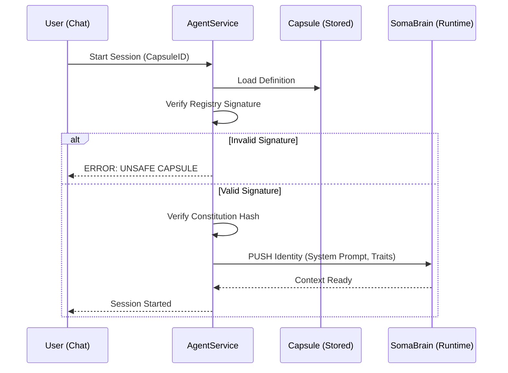

# SRS-CAPSULE-REGISTRY-ISO.md
**Software Requirements Specification (ISO/IEC/IEEE 29148:2018 Compatible)**
**Project:** SomaAgent01 - Capsule Registry & Constitution
**Version:** 2.2.0 (AgentCapsuleCreator Expanded)
**Date:** 2026-01-03
**Status:** DRAFT (Waiting Sign-off)

---

## 1. Introduction

### 1.1 Purpose
The purpose of this document is to definitively specify the architecture, data models, and operational flows for the **SomaAgent01 Capsule Registry** and the **System Constitution**. This specification serves as the binding "Covenant" between the Human Operator and the Artificial Intelligence, establishing the immutable laws and the atomic units (Capsules) that operate under them.

### 1.2 Scope
This standard encompasses:
1.  **The Constitution**: A cryptographic, immutable regulatory framework governing all Agent actions.
2.  **The Capsule**: The atomic, portable unit of Agent Identity (Soul) and Capability (Body).
3.  **The Registry**: The centralized, authoritative, and **cryptographically secured** management system for Capsules.
4.  **The AgentCapsuleCreator**: The Lit 3-based visual administration interface.
5.  **Governance**: The cryptographic signing and enforcement of the Constitution.

---

## 2. Terms and Definitions

*   **Constitution**: The supreme regulatory document (signed JSON) defining the ethical and operational boundaries.
*   **Capsule**: A versioned, portable object composed of a Persona ("Soul") and a Tool/Policy Configuration ("Body").
*   **Registry**: The centralized system responsible for storing, serving, and **Certifying** Capsules.
*   **Certified Capsule**: A Capsule that has been cryptographically signed by the Registry Authority.
*   **Provenance**: The unbreakable chain of trust from Constitution -> Registry -> Capsule.

---

## 3. System Architecture & Models

### 3. Systems Architecture & Models

#### 3.0 Architecture Overview (UML)

### 3.1 The Constitution (The Law)
**REQ-CONST-001 [Supremacy]**: The Constitution SHALL be the supreme regulator.
**REQ-CONST-002 [Immutability]**: The Constitution Object SHALL be immutable once signed.
**REQ-CONST-003 [Integrity]**: The Constitution SHALL be cryptographically signed (SHA-256) to prevent tampering.

### 3.2 The Capsule (The Agent)
**REQ-CAP-001 [Atomicity]**: The Capsule SHALL contain *all* necessary information (Soul + Body + Constitution Ref).
**REQ-CAP-002 [Constitution Integration]**: Every Capsule MUST reference the `constitution_id` and `constitution_hash`.
**REQ-CAP-003 [Portability]**: The Capsule SHALL be exportable as a single JSON file.
**REQ-CAP-004 [Certification]**: Every Capsule MUST bear a `registry_signature` verifying it was issued by an Authorized Registry.

#### 3.2.1 Capsule Model Schema
| Field | Type | Description |
|-------|------|-------------|
| `id` | UUID | Unique Identifier |
| `constitution_ref` | String | Reference to the governing Constitution |
| `registry_signature` | String | **NEW**: Cryptographic signature of the Registry |
| `system_prompt` | String | The "Soul" - Base Instruction Set |
| `allowed_tools` | List | The "Body" - capability whitelist |

---

## 4. Security & Governance

### 4.1 The Unhackable Covenant
**REQ-SEC-001**: The Constitution Hash MUST be validated on every Agent Startup.
**REQ-SEC-002**: If the Constitution Hash does not match, the Agent SHALL REFUSE TO BOOT.

### 4.2 Registry Certification (Root of Trust)
**REQ-SEC-003 [Registry Authority]**: The Registry SHALL possess a private signing key (`REGISTRY_KEY`).
**REQ-SEC-004 [Capsule Signing]**: Upon publication, the Registry SHALL sign the Capsule's content hash with `REGISTRY_KEY`.
**REQ-SEC-005 [Safety Verification]**: Before loading ANY Capsule, the Agent Service SHALL:
1.  Verify the `registry_signature` using the Registry's Public Key.
2.  Verify the `constitution_ref` matches the Active Constitution.
3.  **Reject** any Capsule that fails these checks as "Unsafe".

### 4.2 Capsule Creation Process (The Birth Protocol)

**PRC-CAP-001 [Objective]**: To transform a User's intent into a Certified, Immutable, and Executable Agent Capsule.

**PRC-CAP-002 [Pre-Conditions]**:
1.  System MUST have an **Active Constitution**.
2.  Registry MUST have a loaded **Private Signing Key**.
3.  User MUST be authenticated.

**PRC-CAP-003 [Inputs]**:
*   **Soul Definition**: System Prompt, Traits, Neuromodulators.
*   **Body Definition**: Capability Whitelist, Resource Limits.
*   **Metadata**: Name, Semantic Version.

**PRC-CAP-004 [Process Flow]**:
1.  **Drafting Stage**: User defines Soul and Body in `AgentCapsuleCreator`. State is "Draft".
2.  **Validation Stage**: System validates User Input against the `CapsuleSchema` (JSON Schema). Errors block progress.
3.  **Binding Stage**: System injects the `constitution_ref` (ID + Hash) of the Active Constitution.
4.  **Normalization Stage**: System canonicalizes the JSON (JCS) to strictly order keys and remove whitespace.
5.  **Signing Stage**: Registry computes SHA-256 of the normalized payload and signs it with `REGISTRY_KEY` (Ed25519).
6.  **Certification Stage**: System appends `registry_signature` and sets status to "Active".

**PRC-CAP-005 [Outputs]**:
*   A **Certified Capsule Object** (JSON).
*   An **Audit Log Entry** (Process Completion).

**PRC-CAP-006 [Visual Flow]**:

### 4.3 Capsule Lifecycle Management (Update & Deletion Protocols)

**PRC-LIF-001 [Immutability Principle]**:
A Certified Capsule (`registry_signature` present) is **IMMUTABLE**. It cannot be modified.
*   **Update Flow**: Editing a Capsule creates a new **Version** (e.g., v1.0.0 -> v1.1.0).
*   **Version Chain**: The new version references the `parent_id` of the original.

**PRC-LIF-002 [Soft Deletion (Archive)]**:
*   **Action**: User clicks "Delete" on an Active Capsule.
*   **System Behavior**: Sets `is_active = False`.
*   **Consequence**: Capsule is hidden from "New Session" lists but remains valid for historical audit.
*   **Reversibility**: Can be un-archived.

**PRC-LIF-003 [Hard Deletion (Purge)]**:
*   **Condition**: Only allowed if the Capsule has **Zero Runtime Sessions** OR User has "Eye of God" permission.
*   **Action**: Permanent removal from Registry and Disk.
*   **Constraint**: Cannot delete a Capsule referenced as a `parent` by others.

**PRC-LIF-004 [Visual Lifecycle]**:

### 4.4 Runtime Execution (The Life)

1.  **Load**: Agent Service loads `Capsule` from Registry.

### 4.4 Audit Trail
**REQ-AUD-001**: All Capsule creations, modifications, and deletions SHALL be logged to the immutable `AuditLog`.

### 4.5 Data Provenance & Inheritance Protocol

**PRC-DAT-001 [The Pull Protocol]**:
*   **Source**: The **Registry** is the only entity authorized to "Pull" data into a Capsule Definition.
*   **Content**: Registry pulls standard schemas (e.g., Tool Definitions) from the **Master Library** to ensure compatibility.
*   **Modification**: The Registry *copies* this data into the Capsule. Future changes to the Master Library do **NOT** affect certified Capsules (Version Locking).

**PRC-DAT-002 [The Push Protocol]**:
*   **Direction**: **One-Way (Registry -> Agent)**.
*   **Content**: The **Registry** pushes the *Identity* (Soul) and *Constitution* to the Agent at Runtime.
*   **Constraint**: The Agent CANNOT push data back to modify its own Capsule Definition. Runtime learning is stored in **SomaBrain Memory**, not the Capsule.

**PRC-DAT-003 [Verification & Control]**:
*   **Verifier**: The **Agent Service Bootloader**.
*   **Mechanism**:
    1.  **Integrity**: Validates `Capsule.registry_signature` (Ed25519) to ensure no bits flipped.
    2.  **Legality**: Validates `Capsule.constitution_ref` matches the Active Constitution Hash.
*   **Failure**: If verification fails, the boot process **HALTS** immediately with `SECURITY_VIOLATION`.

This document represents the COMPLETE and FINAL architectural specification for the Soma Capsule Registry.

### 5.1 Overview
The **AgentCapsuleCreator** is the designated User Interface for the creation, modification, validation, and publication of Soma Agent Capsules. It serves as the primary touchpoint for defining the "Soul" and "Body" of an agent.

### 5.2 Technology Stack
**REQ-UI-TECH-001**: All components SHALL be built using **Lit 3** (Web Components).
**REQ-UI-TECH-002**: State management SHALL use signals/observables to ensure reactivity without heavy framework overhead.
**REQ-UI-TECH-003**: The interface SHALL default to the "Clean Light Theme" VIBE standard.

### 5.3 Functional Requirements

#### 5.3.1 Creator Canvas (The Workspace)
**REQ-ACC-001 [Layout]**: The Canvas SHALL present a unified view of the Capsule being drafted, split into logical domains (Identity, Capability, Governance).
**REQ-ACC-002 [Real-time Validation]**: The Canvas SHALL validate fields in real-time against the Schema (REQ-CAP-001) and provide immediate visual feedback.
**REQ-ACC-003 [Draft Persistence]**: The Canvas SHALL automatically save the current state to LocalStorage (`capsule_draft_{id}`) to prevent data loss.

#### 5.3.2 The Soul Editor (Identity)
**REQ-ACC-SOUL-001 [Prompt Engineering]**: The Creator SHALL provide a multi-line, syntax-highlighted editor for the `system_prompt`.
**REQ-ACC-SOUL-002 [Personality Matrix]**: The Creator SHALL provide visual sliders (0.0 - 1.0) for the Big Five personality traits (Openness, Conscientiousness, Extraversion, Agreeableness, Neuroticism).
**REQ-ACC-SOUL-003 [Neuromodulators]**: The Creator SHALL allow configuration of baseline chemical states (Dopamine, Serotonin) via visual gauges.

#### 5.3.3 The Body Editor (Capabilities)
**REQ-ACC-BODY-001 [Tool Selector]**: The Creator SHALL display a searchable list of available Tools and MCP Servers (fetched from Registry).
**REQ-ACC-BODY-002 [Whitelist Logic]**: The user SHALL be able to explicitly `Allow` or `Deny` specific tools. Default state is `Deny All`.
**REQ-ACC-BODY-003 [Resource Limits]**: The Creator SHALL provide numeric inputs for `max_wall_clock_seconds` and `max_concurrent_nodes`.

#### 5.3.4 Governance & Publication: The Secure Protocol
**REQ-ACC-GOV-001 [Constitution Binding]**: 
The Creator SHALL display the *Active Constitution* (ID and SHA-256 Hash) that the Capsule will be bound to. This field is Read-Only and serves as the cryptographic anchor for the Agent's legality.

**REQ-ACC-GOV-002 [Secure Publication Pipeline]**: 
The "Publish" action SHALL trigger the Registry API to execute a strict **Canonicalization-Hashing-Signing** pipeline:
1.  **Normalization (JCS)**: The Capsule Payload (Identity + Capabilities) is normalized using **RFC 8785 (JSON Canonicalization Scheme)** to ensure byte-for-byte consistency.
2.  **Constitution Check**: The system validates that `constitution_ref` points to the currently Active Constitution.
3.  **Binding Hash**: A `binding_hash` is computed: `SHA256(NormalizedCapsule + ConstitutionHash)`. This legally binds the Agent to the Law.
4.  **Signing**: The Registry signs the `binding_hash` using its private **Ed25519** key.
5.  **Certification**: The final Capsule Object is sealed with the `registry_signature` and immutable `version`.

**REQ-ACC-GOV-003 [Export Artifact]**: 
The "Export" action SHALL download the full, certified JSON object (`{name}-{version}.capsule.json`). This file MUST contain the `registry_signature` to be valid in any Soma environment.

### 5.4 Component Architecture (Lit 3)
*   `<agent-capsule-creator>`: Root Orchestrator.
*   `<capsule-identity-panel>`: Soul Editor (Prompts/Traits).
*   `<capsule-capability-panel>`: Body Editor (Tools/Limits).
*   `<capsule-governance-panel>`: Constitution & Signing Status.
*   `<capsule-preview-card>`: Visual summary of the Agent.

---

## 6. Implementation Plans

1.  **Phase 1: Foundation**: Create `Constitution` Model.
2.  **Phase 2: Registry Upgrade**: Implement `Capsule` Model with `registry_signature` field.
3.  **Phase 3: Security**: Implement Crypto-Signing Logic (Ed25519 or RSA) in Registry.
4.  **Phase 4: Creator**: Build the Lit 3 `AgentCapsuleCreator` module adhering to Section 5.

This document represents the COMPLETE and FINAL architectural specification for the Soma Capsule Registry.
