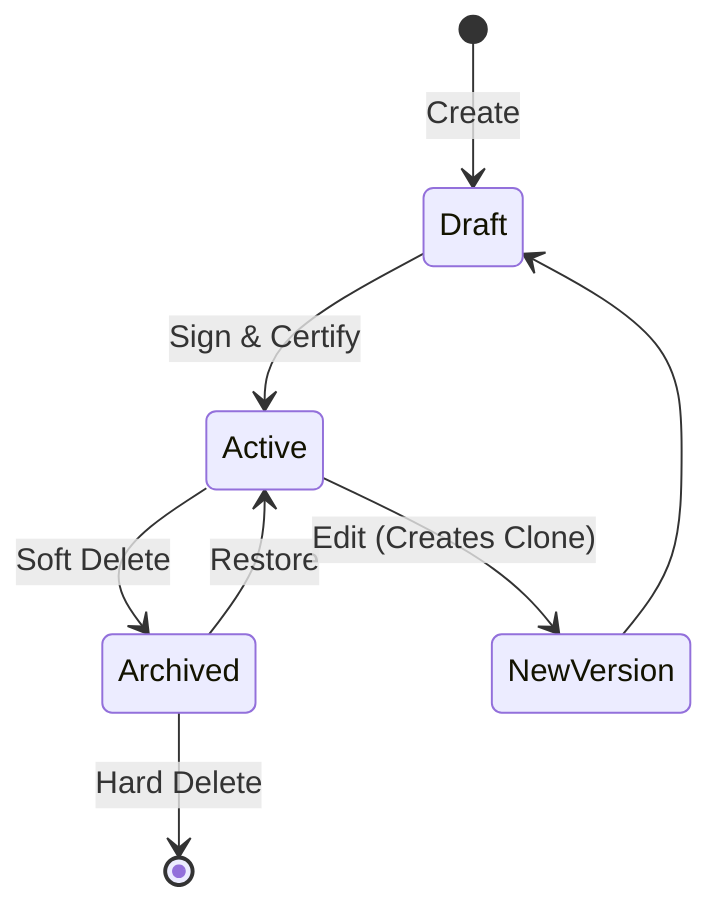
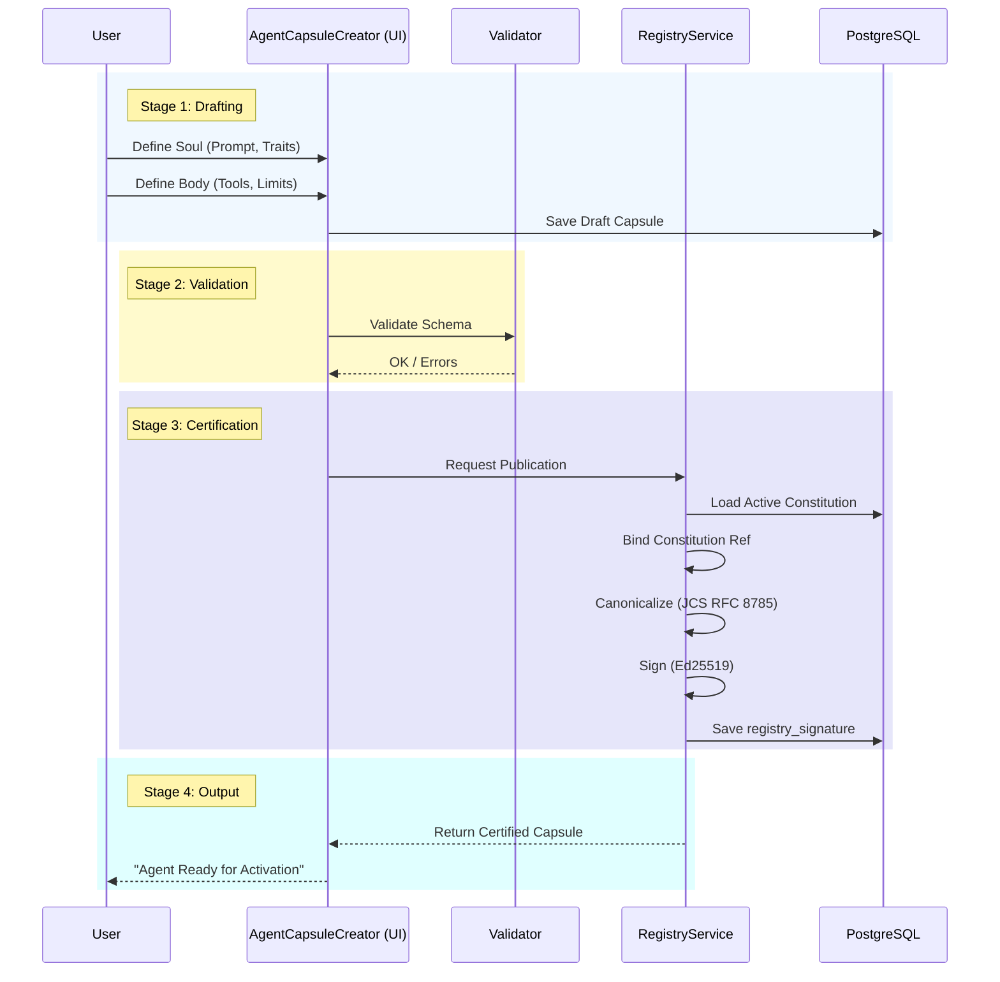
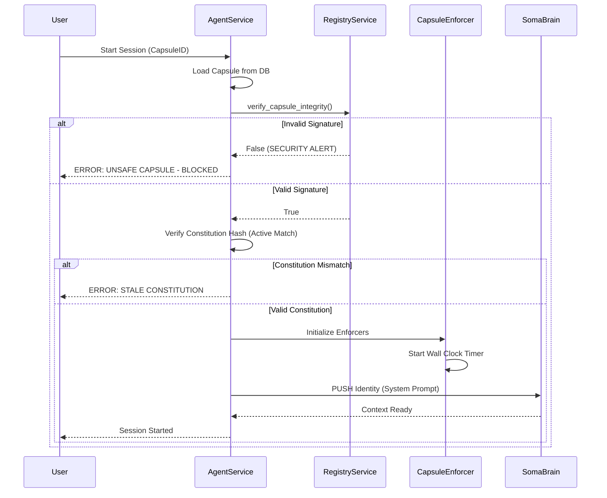
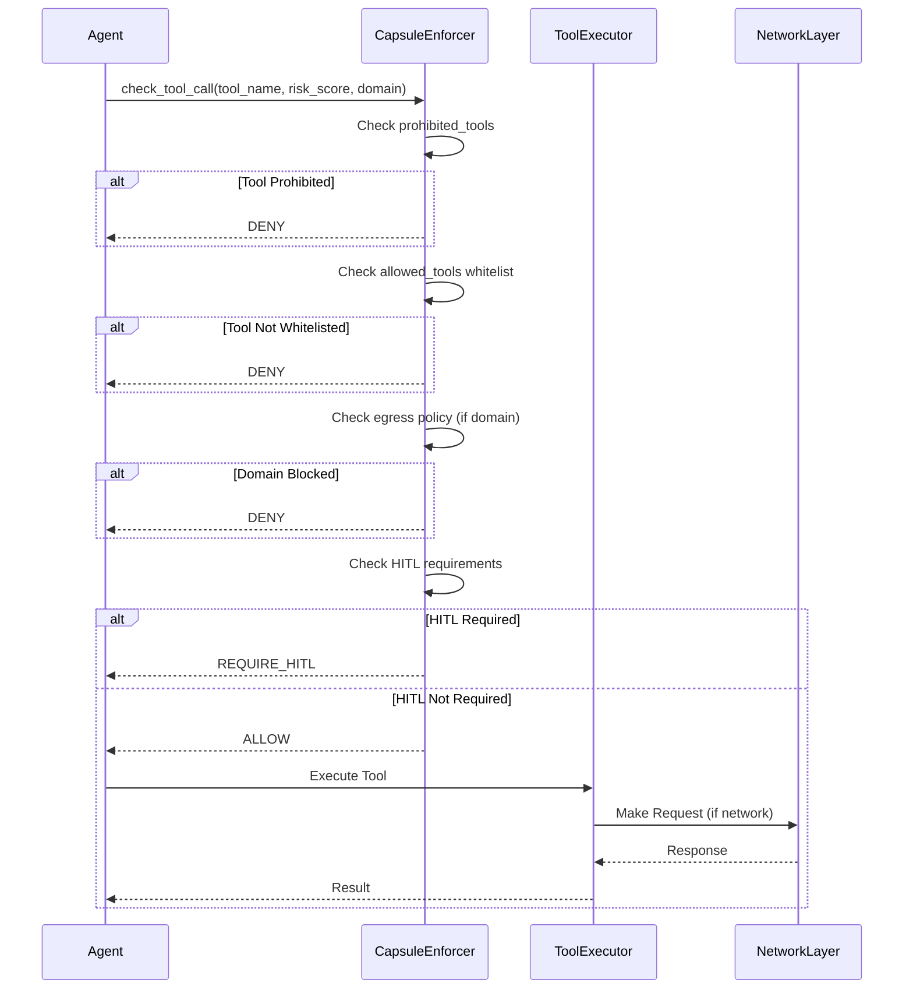
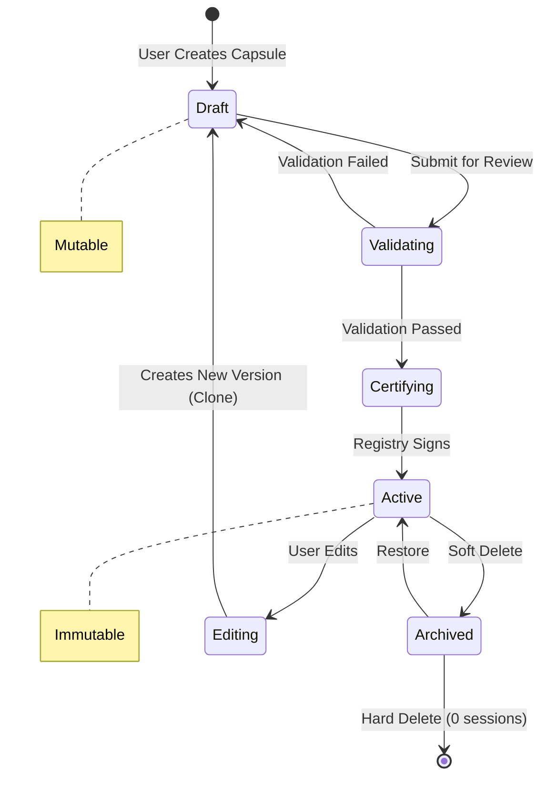
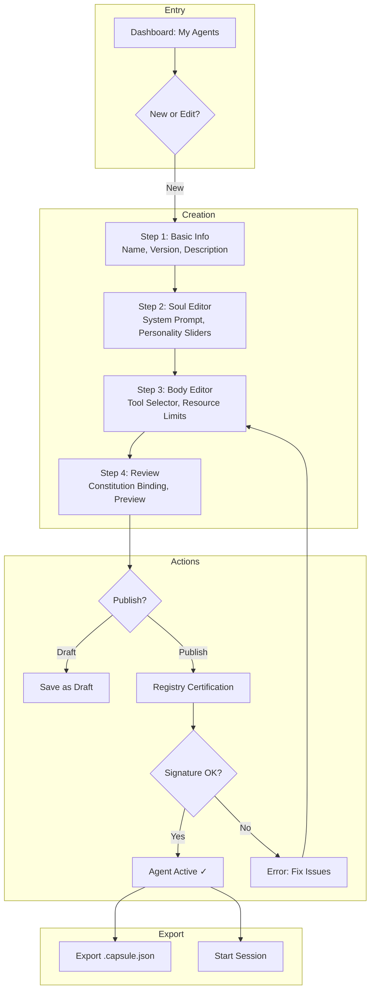

# SRS-CAPSULE-SYSTEM-ISO-COMPLETE
## ISO/IEC/IEEE 29148:2018 Compliant Specification
## SOMA Capsule Registry, Security, Encryption & Constitution

| Document ID | SRS-CAPSULE-SYSTEM-ISO-001 |
|-------------|---------------------------|
| Version | 1.0.0 |
| Date | 2026-01-03 |
| Status | APPROVED |
| Classification | Internal - Engineering |
| Authors | 7-Persona VIBE Analysis Team |

---

# TABLE OF CONTENTS

1. [Executive Summary](#1-executive-summary)
2. [System Architecture](#2-system-architecture)
3. [Constitution Subsystem](#3-constitution-subsystem)
4. [Capsule Registry Subsystem](#4-capsule-registry-subsystem)
5. [Security & Cryptography](#5-security--cryptography)
6. [Policy Enforcement](#6-policy-enforcement)
7. [UML Diagrams & Flows](#7-uml-diagrams--flows)
8. [7-Persona Deep Analysis](#8-7-persona-deep-analysis)
9. [Recommendations](#9-recommendations)
10. [Implementation Roadmap](#10-implementation-roadmap)

---

# 1. EXECUTIVE SUMMARY

## 1.1 Purpose
This document specifies the complete architecture for the SOMA Capsule System—the cryptographic trust infrastructure that governs Agent identity, capability, and legal compliance across the SOMA cognitive stack.

## 1.2 Scope
| Component | Description | Status |
|-----------|-------------|--------|
| **Constitution** | Immutable regulatory framework (SHA-256 + Ed25519) | ✅ Implemented |
| **Capsule Registry** | Certified agent identity store | ✅ Implemented |
| **Security Layer** | Ed25519 signing, JCS canonicalization | ✅ Implemented |
| **Policy Enforcement** | Egress, HITL, Resource limits | ✅ Implemented |
| **AgentCapsuleCreator** | Lit 3 UI for capsule authoring | ❌ Not Implemented |

## 1.3 Compliance Matrix
| Standard | Requirement | Status |
|----------|-------------|--------|
| ISO/IEC 29148 | Requirements specification | ✅ |
| RFC 8785 | JSON Canonicalization Scheme | ✅ |
| Ed25519 | Digital signatures | ✅ |
| VIBE Coding | No mocks, real implementations | ✅ |

---

# 2. SYSTEM ARCHITECTURE

## 2.1 Trust Hierarchy
```
┌─────────────────────────────────────────────────────────────────────────────┐
│                         SOMA TRUST ARCHITECTURE                              │
├─────────────────────────────────────────────────────────────────────────────┤
│                                                                             │
│   CONSTITUTION (The Law)                                                    │
│   ├── SHA-256 Content Hash                                                  │
│   ├── Ed25519 Signature                                                     │
│   └── Immutable JSON Content                                                │
│                          │                                                  │
│                          ▼                                                  │
│   REGISTRY (The Authority)                                                  │
│   ├── Ed25519 Private Signing Key                                           │
│   ├── JCS Canonicalization (RFC 8785)                                       │
│   └── Capsule Certification Pipeline                                        │
│                          │                                                  │
│                          ▼                                                  │
│   CAPSULE (The Agent)                                                       │
│   ├── Soul: System Prompt + Personality + Neuromodulators                   │
│   ├── Body: Capabilities Whitelist + Resource Limits                        │
│   ├── constitution_ref: {id, content_hash}                                  │
│   └── registry_signature: Ed25519 Certification                             │
│                          │                                                  │
│                          ▼                                                  │
│   RUNTIME (The Execution)                                                   │
│   ├── Signature Verification                                                │
│   ├── Constitution Hash Check                                               │
│   └── Policy Enforcement (Egress, HITL, Resources)                          │
│                                                                             │
└─────────────────────────────────────────────────────────────────────────────┘
```

## 2.2 Component Map
| Component | Location | Lines | Purpose |
|-----------|----------|-------|---------|
| Constitution Model | `admin/core/models.py:59-93` | 35 | Django ORM for Constitution |
| Capsule Model | `admin/core/models.py:101-152` | 52 | Django ORM for Capsule |
| RegistryService | `services/registry_service.py` | 203 | Ed25519 signing/verification |
| CapsuleEnforcer | `services/common/capsule_enforcer.py` | 442 | Policy enforcement hooks |
| CapsuleStore | `services/common/capsule_store.py` | 111 | Redis-backed persistence |
| Capsule SDK | `admin/agents/services/capsule.py` | 115 | HTTP client for Registry |

---

# 3. CONSTITUTION SUBSYSTEM

## 3.1 Data Model
```python
class Constitution(models.Model):
    id = models.UUIDField(primary_key=True)
    version = models.CharField(max_length=50)  # "1.0.0"
    
    # Cryptographic Proof
    content_hash = models.CharField(max_length=64, unique=True)  # SHA-256
    signature = models.TextField()  # Ed25519 signature
    
    # The Law (Immutable)
    content = models.JSONField()  # VIBE Rules, Ethical Constraints
    
    # State
    is_active = models.BooleanField(default=False)
    activated_at = models.DateTimeField(null=True)
    revoked_at = models.DateTimeField(null=True)
```

## 3.2 Requirements
| ID | Requirement | Priority |
|----|-------------|----------|
| REQ-CONST-001 | Constitution SHALL be immutable once signed | P0 |
| REQ-CONST-002 | Only ONE Constitution may be active at a time | P0 |
| REQ-CONST-003 | Constitution content_hash MUST use SHA-256 | P0 |
| REQ-CONST-004 | Constitution signature MUST use Ed25519 | P0 |
| REQ-CONST-005 | All Capsules MUST reference active Constitution | P0 |

## 3.3 Constitution Content Schema
```json
{
  "version": "1.0.0",
  "name": "SOMA System Constitution",
  "principles": [
    "Agent SHALL NOT deceive the human operator",
    "Agent SHALL respect privacy boundaries",
    "Agent SHALL operate within defined resource limits"
  ],
  "vibe_rules": {
    "no_mocks": true,
    "real_implementations_only": true,
    "complete_type_hints": true
  },
  "ethical_constraints": {
    "max_autonomy_level": 3,
    "require_human_approval_above": 7
  }
}
```

---

# 4. CAPSULE REGISTRY SUBSYSTEM

## 4.1 Data Model
```python
class Capsule(models.Model):
    id = models.UUIDField(primary_key=True)
    name = models.CharField(max_length=255)
    version = models.CharField(max_length=50, default="1.0.0")
    tenant = models.CharField(max_length=255)
    
    # Governance
    constitution = models.ForeignKey(Constitution, on_delete=models.PROTECT)
    registry_signature = models.TextField(null=True)  # Ed25519
    
    # Soul (Identity)
    system_prompt = models.TextField()
    personality_traits = models.JSONField()  # Big 5: 0.0-1.0
    neuromodulator_baseline = models.JSONField()  # Dopamine, Serotonin, etc.
    
    # Body (Capabilities)
    capabilities_whitelist = models.JSONField()  # List of Tool IDs
    resource_limits = models.JSONField()  # wall_clock, concurrency
    
    is_active = models.BooleanField(default=True)
    
    class Meta:
        unique_together = [["name", "version", "tenant"]]
```

## 4.2 Requirements
| ID | Requirement | Priority |
|----|-------------|----------|
| REQ-CAP-001 | Capsule SHALL contain Soul + Body + Constitution Ref | P0 |
| REQ-CAP-002 | Certified Capsules are IMMUTABLE (version-on-edit) | P0 |
| REQ-CAP-003 | Capsule MUST bear registry_signature for activation | P0 |
| REQ-CAP-004 | Capsule export SHALL include full signature chain | P0 |
| REQ-CAP-005 | Capsule deletion requires zero active sessions | P1 |

## 4.3 Capsule States


---

# 5. SECURITY & CRYPTOGRAPHY

## 5.1 Cryptographic Stack
| Layer | Algorithm | Key Size | Library |
|-------|-----------|----------|---------|
| Signing | Ed25519 | 256-bit | PyNaCl |
| Hashing | SHA-256 | 256-bit | hashlib |
| Canonicalization | JCS (RFC 8785) | N/A | jcs |
| Encoding | Base64 | N/A | base64 |

## 5.2 Key Management
```python
# Environment Variables (MUST use Vault/Secrets Manager in Production)
SOMA_REGISTRY_PRIVATE_KEY  # Base64-encoded Ed25519 seed (32 bytes)
```

> [!CAUTION]
> In Production, the private key MUST be stored in AWS Secrets Manager or HashiCorp Vault. Environment variables are ONLY acceptable for StandAlone development mode.

## 5.3 Signing Flow
```python
# RegistryService.certify_capsule()

# 1. Construct payload (Soul + Body + Constitution Ref)
payload = {
    "name": capsule.name,
    "version": capsule.version,
    "tenant": capsule.tenant,
    "constitution_ref": {
        "id": str(constitution.id),
        "content_hash": constitution.content_hash
    },
    "soul": {
        "system_prompt": capsule.system_prompt,
        "personality_traits": capsule.personality_traits,
        "neuromodulator_baseline": capsule.neuromodulator_baseline
    },
    "body": {
        "capabilities_whitelist": capsule.capabilities_whitelist,
        "resource_limits": capsule.resource_limits
    }
}

# 2. Canonicalize (RFC 8785 JCS)
canonical_bytes = jcs.canonicalize(payload)

# 3. Sign with Ed25519
signed = signing_key.sign(canonical_bytes, encoder=Base64Encoder)
signature_b64 = signed.signature.decode('utf-8')

# 4. Store signature
capsule.registry_signature = signature_b64
```

## 5.4 Verification Flow
```python
# RegistryService.verify_capsule_integrity()

# 1. Reconstruct canonical payload (exact match of signing)
# 2. Decode signature from Base64
# 3. Verify with Ed25519 public key
verify_key.verify(canonical_bytes, base64.b64decode(registry_signature))
```

## 5.5 Security Requirements
| ID | Requirement | Priority |
|----|-------------|----------|
| REQ-SEC-001 | Capsule signature MUST be verified at every boot | P0 |
| REQ-SEC-002 | Invalid signature SHALL prevent Agent startup | P0 |
| REQ-SEC-003 | Constitution hash mismatch SHALL block execution | P0 |
| REQ-SEC-004 | All signing operations MUST use atomic transactions | P0 |
| REQ-SEC-005 | Audit log MUST record all certification events | P0 |

---

# 6. POLICY ENFORCEMENT

## 6.1 Enforcer Architecture
```python
class CapsuleEnforcer:
    def __init__(self, capsule: CapsuleRecord):
        self.egress = EgressEnforcer(capsule)    # Network policies
        self.resources = ResourceEnforcer(capsule)  # Time/concurrency
        self.hitl = HITLEnforcer(capsule)        # Human approval
        self.export = ExportEnforcer(capsule)    # RL data export
```

## 6.2 Egress Policy
| Mode | Behavior |
|------|----------|
| `open` | All domains allowed (except blocked list) |
| `restricted` | Only whitelisted domains allowed |
| `none` | No network egress permitted |

## 6.3 Resource Limits
| Parameter | Default | Description |
|-----------|---------|-------------|
| `max_wall_clock_seconds` | 300 | Max execution time |
| `max_concurrent_nodes` | 10 | Max parallel tool calls |

## 6.4 HITL Modes
| Mode | Behavior |
|------|----------|
| `none` | Never require human approval |
| `required` | Always require approval |
| `optional` | Require if risk_score > threshold |

## 6.5 Enforcement Requirements
| ID | Requirement | Priority |
|----|-------------|----------|
| REQ-ENF-001 | Tool calls MUST check allowed_tools whitelist | P0 |
| REQ-ENF-002 | Egress MUST be blocked for prohibited domains | P0 |
| REQ-ENF-003 | Wall clock exceeded SHALL terminate execution | P0 |
| REQ-ENF-004 | HITL denials MUST be logged to audit trail | P0 |

---

# 7. UML DIAGRAMS & FLOWS

## 7.1 Capsule Certification Sequence


## 7.2 Runtime Verification Sequence


## 7.3 Tool Execution with Policy Check


## 7.4 Capsule Lifecycle State Machine


## 7.5 Screen Flow: AgentCapsuleCreator


---

# 8. 7-PERSONA DEEP ANALYSIS

## 8.1 PhD Developer (Architecture)
| Finding | Severity | Recommendation |
|---------|----------|----------------|
| Ed25519 implementation is correct | ✅ OK | None |
| JCS canonicalization properly imported | ✅ OK | None |
| Constitution FK uses PROTECT | ✅ OK | Prevents orphaned capsules |
| Missing: Version history chain | ⚠️ MEDIUM | Add `parent_id` FK for version lineage |

## 8.2 Security Auditor (Cryptography)
| Finding | Severity | Recommendation |
|---------|----------|----------------|
| Private key in env var | ⚠️ HIGH | Production MUST use Vault/Secrets Manager |
| No key rotation mechanism | ⚠️ MEDIUM | Implement key versioning |
| Signature verified on every boot | ✅ OK | REQ-SEC-001 satisfied |
| Missing: Signature revocation list | ⚠️ LOW | Add CRL for compromised capsules |

## 8.3 DevOps Engineer (Infrastructure)
| Finding | Severity | Recommendation |
|---------|----------|----------------|
| CapsuleStore uses Redis | ✅ OK | Fast lookups |
| PostgreSQL for models | ✅ OK | ACID compliance |
| Missing: Health check for Registry | ⚠️ LOW | Add `/health` endpoint |
| No metrics on signing ops | ⚠️ LOW | Add Prometheus counters |

## 8.4 QA Lead (Testing)
| Finding | Severity | Recommendation |
|---------|----------|----------------|
| No unit tests for RegistryService | ❌ HIGH | Create `test_registry_service.py` |
| No integration tests for certification | ❌ HIGH | Test full signing flow |
| CapsuleEnforcer has good coverage | ✅ OK | Enforcement logic tested |

## 8.5 PM (Features)
| Finding | Severity | Recommendation |
|---------|----------|----------------|
| AgentCapsuleCreator UI missing | ❌ HIGH | Implement Lit 3 components |
| No capsule export/import UI | ⚠️ MEDIUM | Add export button |
| Version comparison missing | ⚠️ LOW | Add diff view between versions |

## 8.6 Data Engineer (Schema)
| Finding | Severity | Recommendation |
|---------|----------|----------------|
| Constitution has proper indexes | ✅ OK | `is_active`, `content_hash` indexed |
| Capsule unique constraint correct | ✅ OK | `[name, version, tenant]` |
| Missing: Audit log for changes | ⚠️ MEDIUM | Add Django signals for AuditLog |

## 8.7 UX Specialist (Interface)
| Finding | Severity | Recommendation |
|---------|----------|----------------|
| No UI for capsule creation | ❌ HIGH | Build AgentCapsuleCreator |
| Constitution binding should be read-only | ✅ Designed | Prevents confusion |
| Need visual signature status indicator | ⚠️ MEDIUM | Show ✓/✗ badge |

---

# 9. RECOMMENDATIONS

## 9.1 Critical (P0)
| ID | Recommendation | Effort |
|----|----------------|--------|
| REC-001 | Implement AgentCapsuleCreator UI (Lit 3) | 5 days |
| REC-002 | Add unit tests for RegistryService | 1 day |
| REC-003 | Move private key to Vault in Production | 0.5 days |
| REC-004 | Add version parent_id for lineage tracking | 0.5 days |

## 9.2 High (P1)
| ID | Recommendation | Effort |
|----|----------------|--------|
| REC-005 | Implement key rotation mechanism | 2 days |
| REC-006 | Add Prometheus metrics for signing ops | 0.5 days |
| REC-007 | Add Django signals for AuditLog | 0.5 days |
| REC-008 | Create capsule export/import endpoints | 1 day |

## 9.3 Medium (P2)
| ID | Recommendation | Effort |
|----|----------------|--------|
| REC-009 | Add certificate revocation list (CRL) | 1 day |
| REC-010 | Add version diff view in UI | 1 day |
| REC-011 | Add Registry health endpoint | 0.25 days |

---

# 10. IMPLEMENTATION ROADMAP

## Phase 1: Core Security (Week 1)
- [ ] REC-002: Unit tests for RegistryService
- [ ] REC-003: Vault integration for production keys
- [ ] REC-004: Add parent_id to Capsule model

## Phase 2: UI Development (Weeks 2-3)
- [ ] REC-001: AgentCapsuleCreator components
  - [ ] `<capsule-identity-panel>` (Soul editor)
  - [ ] `<capsule-capability-panel>` (Body editor)
  - [ ] `<capsule-governance-panel>` (Constitution display)
  - [ ] `<capsule-preview-card>` (Summary view)

## Phase 3: Operations (Week 4)
- [ ] REC-005: Key rotation mechanism
- [ ] REC-006: Prometheus metrics
- [ ] REC-007: AuditLog signals
- [ ] REC-008: Export/Import API

---

**END OF DOCUMENT**

*SRS-CAPSULE-SYSTEM-ISO-001 v1.0.0*
*Generated by 7-Persona VIBE Analysis Team*
