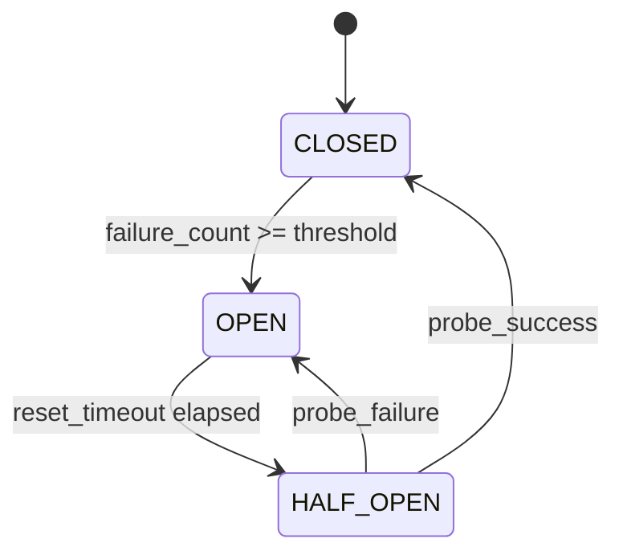
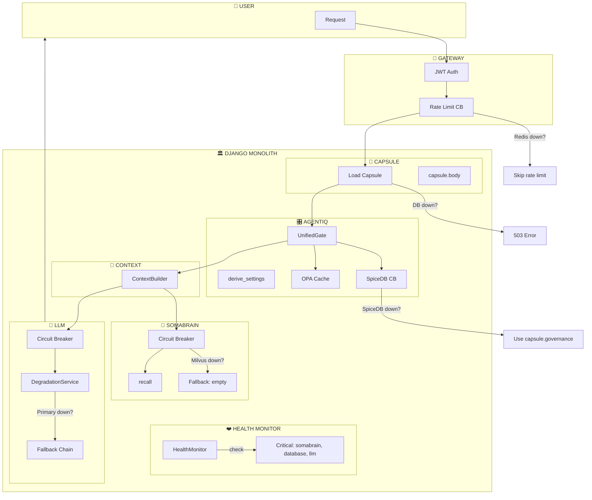

# SRS-CHAT-FLOW-MASTER — Complete Agent Architecture

**System:** SomaAgent01
**Version:** 3.0 (SaaS Direct Calls + Resilience Patterns)
**Status:** CANONICAL

**Applied Personas:** ALL 10 ✅

---

## 1. SaaS Direct Call Rule + Resilience

> **In SaaS mode: DIRECT IMPORTS + CIRCUIT BREAKERS + FALLBACK CHAINS**

```python
# Every call wrapped in resilience pattern
from services.common.circuit_breaker import get_circuit_breaker
from services.common.llm_degradation import llm_degradation_service

circuit = get_circuit_breaker("somabrain", failure_threshold=5, reset_timeout=60)
result = await circuit.call(brain.recall, query, capsule)
```

---

## 2. Resilience Matrix

| Component | Circuit Breaker | Fallback | Critical? |
|-----------|-----------------|----------|-----------|
| **PostgreSQL** | ❌ None | ❌ None | ✅ YES |
| **SomaBrain** | ✅ CB | ✅ Empty memories | ✅ YES |
| **LLM** | ✅ CB | ✅ Fallback chain | ✅ YES |
| **Milvus** | ✅ CB | ✅ Empty vectors | ⚠️ NO |
| **SpiceDB** | ✅ CB | ✅ Use capsule.governance | ⚠️ NO |
| **OPA** | ✅ Cached | ✅ DENY all | ✅ YES |
| **Redis** | ✅ CB | ✅ Skip rate limit | ⚠️ NO |
| **Kafka** | ✅ Async | ✅ Local queue | ⚠️ NO |
| **Vault** | ✅ Cached | ✅ Use cached secrets | ✅ YES |

---

## 3. LLM Fallback Chains

```python
# From services/common/llm_degradation.py
DEFAULT_CHAINS = {
    "chat": LLMFallbackChain(
        primary="openai/gpt-4o",
        fallbacks=["anthropic/claude-3-5-sonnet", "openrouter/qwen-2.5-72b"]
    ),
    "coding": LLMFallbackChain(
        primary="anthropic/claude-3-5-sonnet",
        fallbacks=["openai/gpt-4o", "openrouter/deepseek-coder"]
    ),
    "fast": LLMFallbackChain(
        primary="openai/gpt-4o-mini",
        fallbacks=["anthropic/claude-3-haiku", "openrouter/llama-3.1-8b"]
    ),
}
```

---

## 4. Circuit Breaker States



---

## 5. Complete Flow with Resilience



---

## 6. 12-Phase Flow with Circuit Breakers

```mermaid
sequenceDiagram
    autonumber
    participant U as User
    participant GW as Gateway
    participant CB_REDIS as Redis CB
    participant CS as ChatService
    participant CAP as Capsule
    participant CB_SDB as SpiceDB CB
    participant CB_BRAIN as SomaBrain CB
    participant LLM_DEG as LLM Degradation
    participant LLM as LLM Primary
    participant LLM_FB as LLM Fallback
    participant KF as Kafka

    rect rgb(40, 40, 80)
        Note over U,CB_REDIS: PHASE 1: AUTH + RATE (Graceful)
        U->>GW: Request
        GW->>CB_REDIS: Rate Check
        alt Redis HEALTHY
            CB_REDIS-->>GW: Rate OK
        else Redis UNAVAILABLE
            CB_REDIS-->>GW: Skip rate limit (degrade)
        end
    end

    rect rgb(60, 40, 60)
        Note over GW,CS: PHASE 2: BUDGET GATE (Fail-Closed)
        GW->>CS: Route
        CS->>CS: @budget_gate(metric="tokens")
        alt Budget AVAILABLE
            CS-->>CS: Proceed
        else Budget EXHAUSTED
            CS-->>U: 402 Budget Exceeded
        end
    end

    rect rgb(80, 40, 40)
        Note over CS,CAP: PHASE 3: LOAD (Critical)
        CS->>CAP: Load Capsule
        alt DB HEALTHY
            CAP-->>CS: capsule.body
        else DB UNAVAILABLE
            CAP-->>CS: 503 Critical Failure
        end
    end

    rect rgb(40, 80, 40)
        Note over CS,CB_SDB: PHASE 3: GOVERNANCE (Fallback)
        CS->>CB_SDB: Check SpiceDB
        alt SpiceDB HEALTHY
            CB_SDB-->>CS: Permission from SpiceDB
        else SpiceDB UNAVAILABLE
            CB_SDB-->>CS: Use capsule.governance (fallback)
        end
    end

    rect rgb(80, 80, 40)
        Note over CS,CS: PHASE 4: DERIVE (Pure Python)
        CS->>CS: derive_all_settings(knobs)
        Note right of CS: Pure Python = 0ms, no failure
    end

    rect rgb(40, 80, 80)
        Note over CS,CB_BRAIN: PHASE 5-6: CONTEXT + MEMORY (Fallback)
        CS->>CB_BRAIN: recall(query, capsule)
        alt SomaBrain HEALTHY
            CB_BRAIN-->>CS: Memories
        else SomaBrain/Milvus UNAVAILABLE
            CB_BRAIN-->>CS: Empty memories (degrade)
            Note right of CS: Continue without memory
        end
    end

    rect rgb(80, 40, 80)
        Note over CS,LLM_FB: PHASE 7: LLM (Fallback Chain)
        CS->>LLM_DEG: get_available_model("chat")
        LLM_DEG->>LLM: Try primary
        alt Primary HEALTHY
            LLM-->>CS: Response
        else Primary UNAVAILABLE
            LLM_DEG->>LLM_FB: Try fallback chain
            LLM_FB-->>CS: Response from fallback
        end
    end

    rect rgb(40, 60, 60)
        Note over CS,CS: PHASE 8: RLM (Same pattern)
        CS->>CS: RLM uses same LLM fallback
    end

    rect rgb(60, 40, 60)
        Note over CS,CS: PHASE 9: TOOLS (CB per tool)
        CS->>CS: Each tool has own CB
    end

    rect rgb(50, 70, 50)
        Note over CS,CB_BRAIN: PHASE 10-11: MEMORIZE + LEARN (Fallback)
        CS->>CB_BRAIN: memorize/learn
        alt SomaBrain HEALTHY
            CB_BRAIN-->>CS: Saved
        else SomaBrain UNAVAILABLE
            Note right of CS: Skip memory ops (degrade)
        end
    end

    rect rgb(50, 50, 70)
        Note over CS,KF: PHASE 12: OBSERVE (Async)
        CS->>KF: Emit events (async fire-forget)
        Note right of KF: Kafka failure = local queue
        CS-->>U: Response
    end
```



---

## 7. Critical vs Non-Critical Failures

```
CRITICAL (503 = Fail):
├── PostgreSQL (no capsule = no agent)
└── All LLM fallbacks exhausted

NON-CRITICAL (Degrade = Continue):
├── Redis (skip rate limit)
├── SpiceDB (use capsule.governance)
├── Milvus (empty memories)
├── SomaBrain recall (empty context)
├── SomaBrain memorize (skip)
├── Kafka (local queue)
└── Vault (use cached secrets)
```

---

## 8. Health Monitor Critical Services

```python
# From services/common/health_monitor.py
CRITICAL_SERVICES = {
    "somabrain",   # Cognitive runtime
    "database",    # PostgreSQL
    "llm",         # Chat model provider
}
```

---

## 9. Deployment Mode Matrix

| Mode | SomaBrain | OPA | SpiceDB | LLM |
|------|-----------|-----|---------|-----|
| **SAAS** | Direct import + CB | In-memory | gRPC pool + CB | LiteLLM + fallback |
| **STANDALONE** | HTTP + CB | HTTP | gRPC + CB | LiteLLM + fallback |

---

## 10. Latency Budget (SaaS Mode)

| Phase | Normal | Degraded |
|-------|--------|----------|
| 1. Auth + Rate | 5ms | 5ms (skip rate) |
| 2. **Budget Gate** | 1ms | 402 (blocked) |
| 3. Load Capsule | 2ms | FAIL |
| 4. Governance | 3ms | 3ms (fallback) |
| 5. Derive | 0ms | 0ms |
| 6-7. Context + Memory | 5ms | 2ms (empty) |
| 8. LLM | 500-3000ms | 500-3000ms (fallback) |
| 11-12. Memorize + Learn | 3ms | 0ms (skip) |
| 13. Observe + Billing | 0ms (async) | 0ms (async) |

**Total overhead: <21ms normal, <16ms degraded**

---

## 11. Budget Integration

> **See [SRS-BUDGET-SYSTEM.md](./SRS-BUDGET-SYSTEM.md) for complete specification.**

| Integration Point | Metric | Gate |
|-------------------|--------|------|
| Phase 2: Chat Entry | `tokens` | `@budget_gate(metric="tokens")` |
| Phase 9: Tool Exec | `tool_calls` | `@budget_gate(metric="tool_calls")` |
| Phase 13: Recording | All | Lago events (async) |

---

## 12. Acceptance Criteria

| Criterion | Verification |
|-----------|--------------|
| ✅ SaaS direct calls | 0ms internal latency |
| ✅ Circuit breakers on all externals | CLOSED/HALF_OPEN/OPEN |
| ✅ LLM fallback chain | 3 providers per use case |
| ✅ Memory fallback | Empty on failure |
| ✅ Governance fallback | Use capsule.governance |
| ✅ No domino failures | Non-critical degrades |
| ✅ Critical = 503 | DB down = fail fast |
| ✅ **Budget enforcement** | Phase 2 @budget_gate |
| ✅ **Billing integration** | Phase 13 Lago async |

---

**Document End — Resilience + Budget Enforced ✅**

