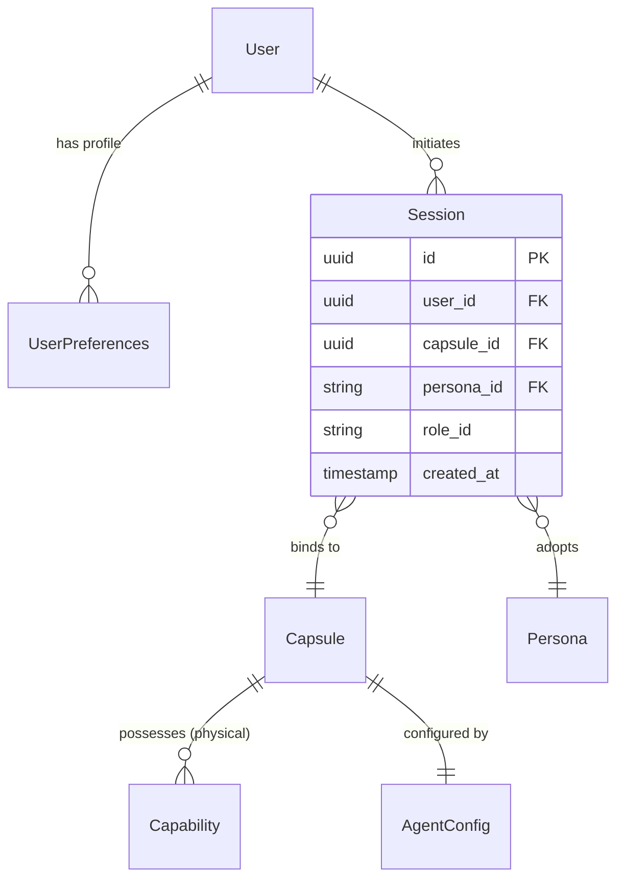
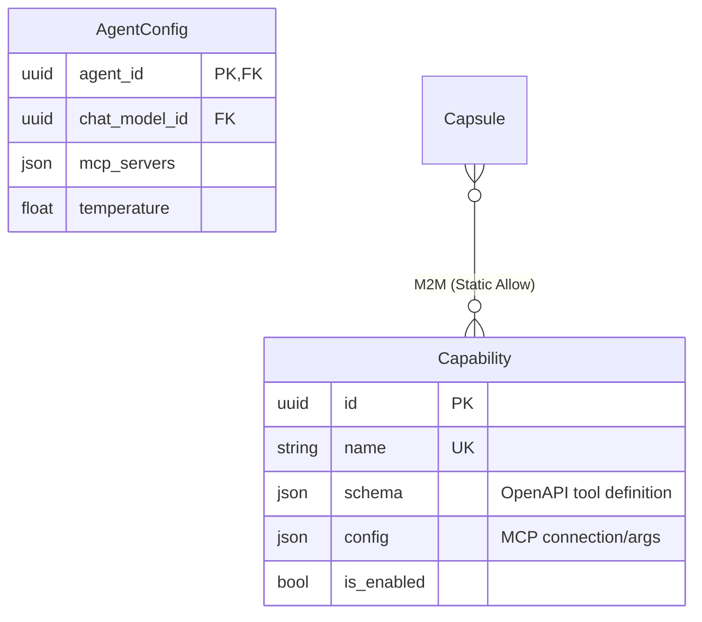
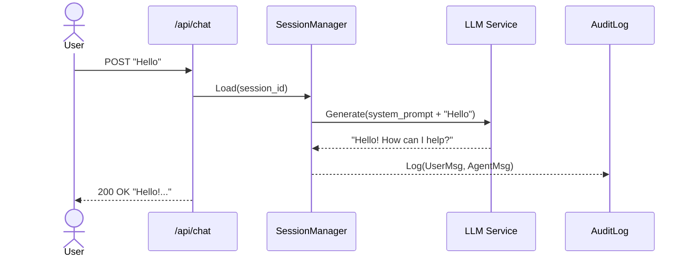
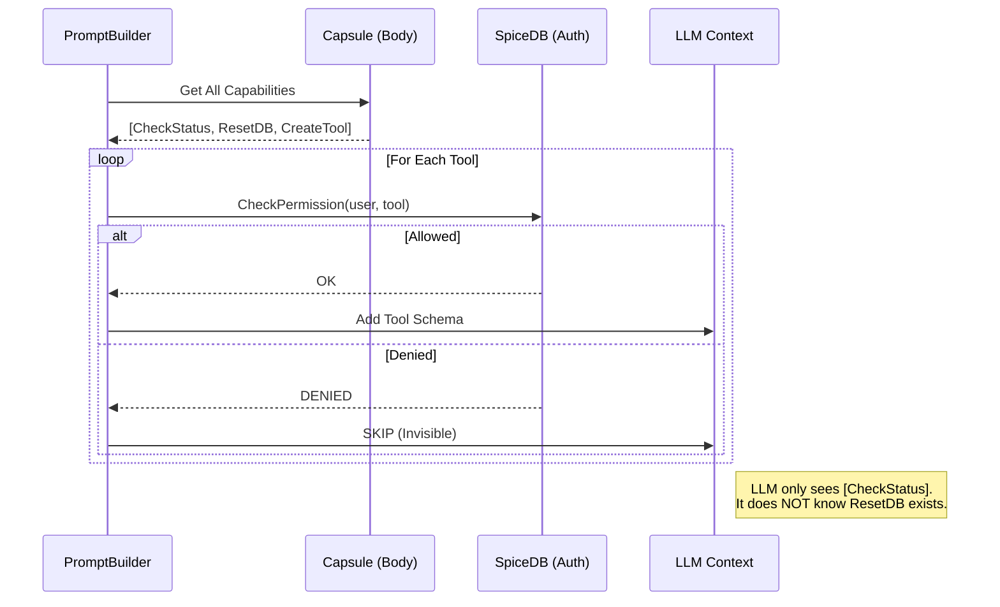
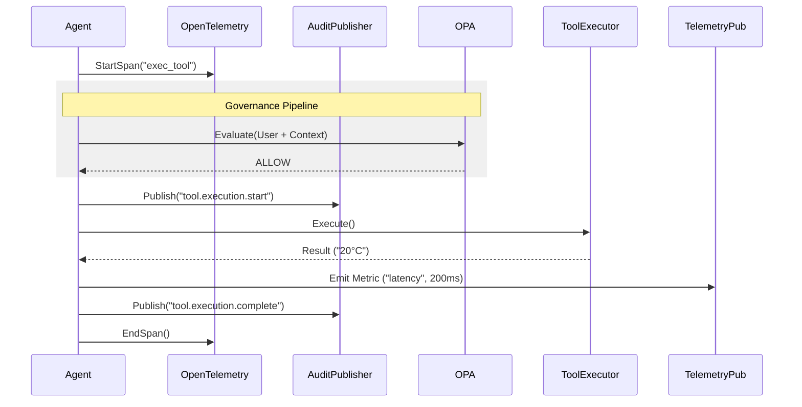
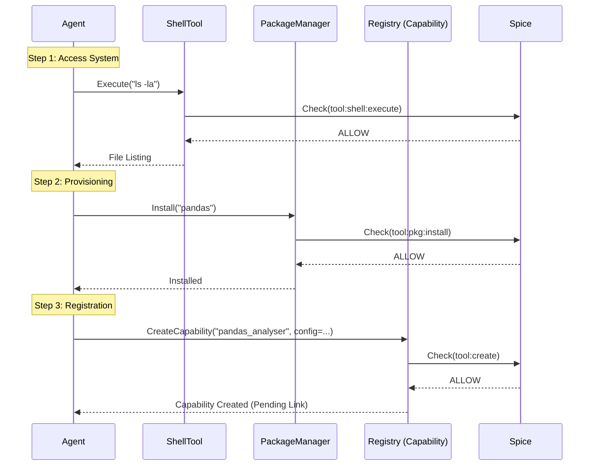

# SRS: Chat Flow & Granular Governance V.0.1

**Document ID:** SA01-SRS-CHAT-FLOW-2026-01
**Version:** 0.1
**Status:** DRAFT (Canonical Reference)
**Compliance:** ISO/IEC 29148:2018

---

## 1. Scope

This Software Requirements Specification (SRS) defines the end-to-end flow of the **SomaAgent01 Chat System**, strictly enforcing the **Granular Governance** architecture. It details the runtime interaction between the User, Agent, Capsule, and the underlying Permission System (SpiceDB/OPA), ensuring that every action is Observably Traceable ("Zero-Loss") and Granularly Permitted.

---

## 2. Data Architecture (ER Diagrams)

### 2.1 The "Granular Trinity" & Runtime Session

The runtime context is formed by the intersection of **User (Profile)**, **Agent (Capsule)**, and **Identity (Persona/Role)**.

### 2.2 Configuration Sovereignty (Agent & Tools)

Configuration is strictly database-driven (Rule 91).

---

## 3. Functional Flows (Sequence Diagrams)

### 3.1 Phase 1: The Simple Message Loop
**Scenario**: User sends "Hello".

---

### 3.2 Phase 2: Granular Discovery (The "Hidden" Layer)
**Scenario**: User asks "What tools do you have?".
**Rule**: Tools forbidden to the User are *removed* from the context.

---

### 3.3 Phase 3: Tool Execution (The "Panopticon" Loop)
**Scenario**: Agent tries to call `weather_tool`.
**Rule**: Must pass 4-Phase pipeline + observability.

---

### 3.4 Phase 4: Dynamic Evolution (The "Genesis" Cycle)
**Scenario**: Agent wants to *create* a new tool `pandas_analyser`.
**Rule**: Requires OS-level permissions first.

---

## 4. Multimodal Integration
(See `SRS-MULTIMODAL-2025-12` for full specs)

The Agent's Multimodal Model is defined in `Capsule.image_model`, `Capsule.voice_model`, etc.

**Execution Flow**:
1.  **Request**: `GenerateImage("Sunset")`
2.  **Lookup**: `Capsule.image_model_id` -> `LLMModelConfig`
3.  **Execute**: Via `MultimodalExecutor` (governed by same Trace/Audit loop).

---

## 5. Security & Governance Matrix

| Action | Resource | Permission Required | Failure Mode |
|--------|----------|---------------------|--------------|
| **See Tool** | Tool Definition | `view` (Implicitly checked at discovery) | Tool Hidden (Invisible) |
| **Run Tool** | Tool Execution | `execute` | PermissionDenied Audit Event |
| **Run Shell** | OS Shell | `tool:shell:execute` | Execution Blocked |
| **Install Pkg** | PackageManager | `tool:package_manager:install` | Installation Blocked |
| **Create Tool** | Capability Registry | `tool:create` | Creation Denied |

---

## 6. Observability Requirements

Every interaction MUST produce:
1.  **Trace ID**: Propagated from API -> Agent -> Tool -> Audit.
2.  **Audit Record**: Stored in Kafka (`audit.events`) or fallback DB.
3.  **Telemetry**: Metrics for billing and usage monitoring.

**End of Specification**
