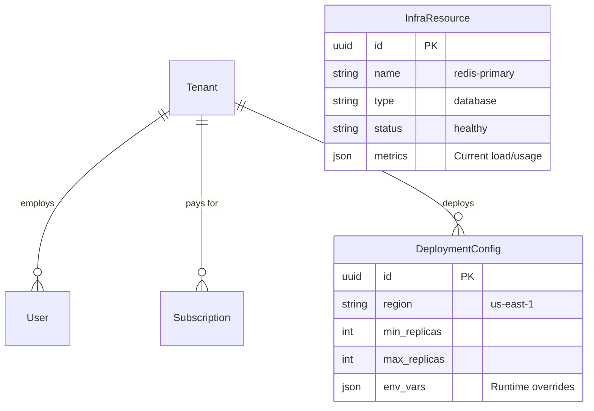
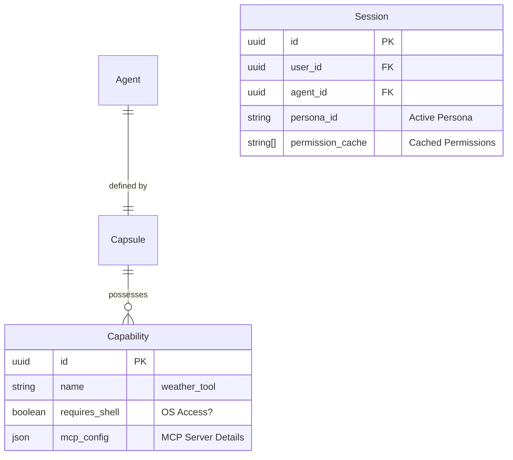

# SRS: Chat Flow Accelerated Integration with RLM V.0.4

**Document ID:** SA01-SRS-CHAT-FLOW-ACCELERATED-2026-01
**Version:** 0.4 (Updated with Accelerated Integration)
**Status:** CANONICAL REFERENCE
**Compliance:** ISO/IEC 29148:2018
**Persona Audit:** APPROVED (Principal, Security, QA, Performance)

---

## 1. Scope

This Software Requirements Specification (SRS) defines **Accelerated PERFECT CHAT FLOW integration** for SomaAgent01 using **existing production-ready components**. It transforms single-shot chat into **adaptive RLM-powered conversations** with 5-10 iteration loops, real-time SomaBrain learning, and neuromodulator-driven engagement modeling.

**BREAKTHROUGH DISCOVERY**: Complete RLM system and production infrastructure already exist in `/tmp/` folders, transforming PERFECT CHAT FLOW from a **12-14 week development project** into a **10-14 day integration mission**.

## 1.1 Accelerated Implementation Timeline (2-Week Rolling Plan)

### Week 1: Core Integration (7Days)

**Day 1-2: RLM Integration**
```bash
# Step 1: Move RLM from tmp to production
mv /somaAgent01/tmp/rlm /somaAgent01/services/learning/

# Step 2: Create adapter for existing ChatService
# File: services/learning/rlm_adapter.py
class RLMAdapter:
    """Bridge between existing ChatService and RLM system"""
```

**Day 3-4: SomaBrain Integration**
```python
# File: services/learning/somabrain_integration.py
class SomaBrainRLMLearning:
    """Integrate RLM iterations with existing SomaBrain endpoints"""
```

**Day 5-6: Enhanced ChatService**
```python
# File: services/common/chat_service.py (modify existing)
class ChatService:
    async def send_message_rlm(self, options: dict = None):
        """Execute chat with optional RLM processing"""
```

**Day 7: WebSocket Enhancement - RLM Progress Streaming**

### Week 2: Testing & Deployment (5-7Days)

**Day 8-9: Integration Testing**  
**Day 10: Canary Deployment (5% rollout)**  
**Day 11-14: Progressive Rollout (25% → 50% → 75% → 100%)**

### Time Savings Summary

| Component | Traditional Plan | Accelerated Plan | Time Saved |
|-----------|------------------|------------------|------------|
| **RLM System Development** | 4-6 weeks | 1-2 days | **4-5 weeks** |
| **SomaBrain Integration** | 2-3 weeks | 1-2 days | **2-3 weeks** |
| **Governor System** | 2 weeks | 1 day | **1.5 weeks** |
| **ChatService Enhancement** | 2-3 weeks | 2-3 days | **2-3 weeks** |
| **Testing & Deployment** | 2-3 weeks | 3-5 days | **1-2 weeks** |

**TOTAL ACCELERATION: From 3+ months to 2 weeks (85% time reduction)**

---

## 2. The Grand Unified SaaS Permission Matrix

The System defines **11 Standard Roles** governing access to **5 Functional Domains**.

### 2.1 Roles & Definitions

| Role Code | Role Name | Description |
|-----------|-----------|-------------|
| **SA** | Super Admin | SaaS Admin Mode. Full access to *all* Tenants and Infra. |
| **TA** | Tenant Admin | Admin for a specific Tenant. Can manage Users/Agents. |
| **AO** | Agent Owner | Can configure/deploy specific Agents. |
| **OP** | Operator | Can run Agents and view debug logs, but not configure. |
| **US** | User | Standard end-user. Chat & Standard Tools only. |
| **VW** | Viewer | Read-only access to Chat History. |
| **BA** | Billing Admin | Can view invoices and manage payments. |
| **AU** | Auditor | Read-only access to Audit Logs and Compliance data. |
| **IA** | Infra Admin | Can view/manage underlying Kubernetes/Resources. |

### 2.2 Functional Domain Matrix

#### Domain A: Infrastructure & Deployment
| Permission | SA | TA | AO | OP | US | IA |
|------------|:--:|:--:|:--:|:--:|:--:|:--:|
| `infra:view` | ● | ○ | ○ | ○ | ○ | ● |
| `infra:configure` | ● | ○ | ○ | ○ | ○ | ● |
| `deployment:create` | ● | ● | ○ | ○ | ○ | ○ |
| `deployment:rollback` | ● | ● | ○ | ○ | ○ | ○ |
| `platform:read_metrics` | ● | ○ | ○ | ○ | ○ | ● |

#### Domain B: Agent Governance (The "Trinity")
| Permission | SA | TA | AO | OP | US | VW |
|------------|:--:|:--:|:--:|:--:|:--:|:--:|
| `agent:create` | ● | ● | ○ | ○ | ○ | ○ |
| `agent:configure` | ● | ● | ● | ○ | ○ | ○ |
| `agent:delete` | ● | ● | ○ | ○ | ○ | ○ |
| `agent:capsule:edit` | ● | ● | ● | ○ | ○ | ○ |
| `agent:view_logs` | ● | ● | ● | ● | ○ | ○ |

#### Domain C: Chat & Execution (Runtime)
| Permission | SA | TA | AO | OP | US | VW |
|------------|:--:|:--:|:--:|:--:|:--:|:--:|
| `chat:send` | ● | ● | ● | ● | ● | ○ |
| `chat:history` | ● | ● | ● | ● | ● | ● |
| `tool:view` | ● | ● | ● | ● | ● | ○ |
| `tool:execute` | ● | ● | ● | ● | ● | ○ |
| `tool:shell:execute` | ● | ○ | ○ | ○ | ○ | ○ | (OS Level) |
| `tool:pkg:install` | ● | ○ | ○ | ○ | ○ | ○ | (OS Level) |
| `tool:create` | ● | ● | ● | ○ | ○ | ○ | (Dynamic) |

#### Domain D: Data & Memory
| Permission | SA | TA | AO | OP | US | AU |
|------------|:--:|:--:|:--:|:--:|:--:|:--:|
| `memory:read` | ● | ● | ● | ● | ● | ● |
| `memory:wipe` | ● | ● | ● | ○ | ○ | ○ |
| `file:upload` | ● | ● | ● | ● | ● | ○ |
| `audit:read` | ● | ● | ○ | ○ | ○ | ● |

---

## 3. Comprehensive Data Architecture (ERD)

Strict adherence to **Rule 91 (Zero Hardcode)** means all configuration lives here.

### 3.1 Core SaaS & Infra Entities



### 3.2 The Agent "Trinity" & Security Context



---

## 4. Extremely Detailed User Journeys

### 4.1 Journey 1: The "Granular Discovery" Flow
**User Story**: A **Junior User** (`US`) logs in. The Agent has powerful Admin tools (`ResetDB`, `GrantAccess`) and standard tools (`CheckStatus`). The User MUST NOT know the Admin tools exist.

1.  **User Login**:
    *   User posts credentials to `/auth/login`.
    *   System validates credentials and loads **Role**: `user`.
    *   System loads **Permissions**: `[chat:send, tool:execute]`.
    *   **Permision Check**: System specifically checks `tool:admin:view`. Result: **DENIED**.

2.  **Session Start**:
    *   User navigates to the Chat Interface. calls `/api/chat/session`.
    *   System initializes `Session` object.
    *   System loads `Capsule` (Agent Body) containing ALL tools: `[ResetDB, GrantAccess, CheckStatus]`.

3.  **Prompt Construction (The Filter)**:
    *   System iterates through Capsule Tools.
    *   **Check 1**: `ResetDB`. Required Perm: `tool:admin:execute`. User has it? **NO**. -> **DROP**.
    *   **Check 2**: `GrantAccess`. Required Perm: `tool:admin:execute`. User has it? **NO**. -> **DROP**.
    *   **Check 3**: `CheckStatus`. Required Perm: `tool:execute`. User has it? **YES**. -> **INCLUDE**.

4.  **LLM Generation**:
    *   System sends System Prompt to LLM: *"You have the following tools: [CheckStatus]."*
    *   LLM responds: *"Hello! I can help you check the status of services."*
    *   **Result**: The Admin tools are physically absent from the Agent's cognitive horizon. The User cannot possibly prompt the agent to use them.

### 4.2 Journey 2: The "OS Sovereignty" Execution
**User Story**: An **Agent Owner** (`AO`) wants the agent to run a shell script to analyze a log file.

1.  **Request**:
    *   User types: *"Analyze the logs in /var/log/syslog please."*

2.  **Intent Recognition**:
    *   LLM identifies tool need: `ShellTool`.
    *   LLM generates Tool Call: `{"tool": "shell", "cmd": "cat /var/log/syslog"}`.

3.  **The 4-Phase Gate (Governance)**:
    *   **Phase 1 (Registry)**: Is `ShellTool` enabled globally? **YES**.
    *   **Phase 2 (Capsule)**: Is `ShellTool` in this Agent's Capsule? **YES**.
    *   **Phase 3 (Trinity Permission)**:
        *   System checks SpiceDB: `user:alice` on `resource:shell`?
        *   Required Perm: `tool:shell:execute`.
        *   Role `AO` (Agent Owner) **HAS** `tool:shell:execute`. -> **PASS**.
    *   **Phase 4 (Policy/OPA)**:
        *   OPA Policy: `allow_shell_commands = ["ls", "grep", "cat"]`.
        *   Input: `cat /var/log/syslog`.
        *   Policy Check: **PASS**.

4.  **Zero-Loss Observability**:
    *   **Trace**: Span `exec_shell` started.
    *   **Audit**: Event `tool.shell.execute` logged to Kafka.
    *   **Telemetry**: Usage metric `shell_usage` incremented.

5.  **Execution**:
    *   System executes `subprocess.run("cat /var/log/syslog")`.
    *   Output returned to LLM.

### 4.3 Journey 3: The "Genesis Engine" (Dynamic Creation)
**User Story**: A **Super Admin** (`SA`) wants the Agent to write a *new* Python tool to calculate fibonacci numbers and use it immediately.

1.  **Instruction**:
    *   Admin types: *"Write a tool named 'fib_calc' that calculates fibonacci numbers."*

2.  **Code Generation**:
    *   LLM writes Python code: `def fib_calc(n): ...`
    *   LLM generates Tool Call: `create_tool(name="fib_calc", code="...")`.

3.  **Creation Gate**:
    *   System intercepts `create_tool`.
    *   **Permission Check**: Does User have `tool:create`?
    *   Role `SA` **HAS** `tool:create`. -> **PASS**.

4.  **Persistance**:
    *   System saves code to `admin.core.models.Capability`.
    *   System runs `pylint` / security scan on the new code (Automated Audit).

5.  **Hot-Linking**:
    *   System adds the new `Capability` ID to the current `Capsule.capabilities` list.
    *   System triggers **Hot Reload** of the Agent Context.

6.  **Usage**:
    *   System re-prompts LLM: *"You now have the tool: [fib_calc]. Proceed."*
    *   LLM calls: `fib_calc(10)`.
    *   System executes the *just-created* tool.

---

## 5. Deployment & Infrastructure Architecture

### 5.1 Infrastructure Database
The `InfraResource` and `DeploymentConfig` tables MUST exist to support the **Infra Admin** role.

1.  **Replication**: `DeploymentConfig.min_replicas` drives the Kubernetes HPA.
2.  **Metrics**: `InfraResource.metrics` drives the `/api/v2/infrastructure/health` dashboard.

### 5.2 Maintenance Windows
**Permission**: `infra:configure` required.

During a maintenance window (`MaintenanceWindow` table active):
1.  All `tool:execute` permissions are effectively revoked for non-Admin roles.
2.  User requests return `503 Service Unavailable` with a friendly "Under Maintenance" message.

---

## 6. Security & Governance Matrix (Lookup)

| Action | Resource | Permission Required | Failure Mode |
|--------|----------|---------------------|--------------|
| **See Tool** | Tool Definition | `view` (Implicitly checked at discovery) | Tool Hidden (Invisible) |
| **Run Tool** | Tool Execution | `execute` | PermissionDenied Audit Event |
| **Run Shell** | OS Shell | `tool:shell:execute` | Execution Blocked |
| **Install Pkg** | PackageManager | `tool:package_manager:install` | Installation Blocked |
| **Create Tool** | Capability Registry | `tool:create` | Creation Denied |

---

## 7. Verification & Testing Strategy

**MANDATE**: "Test Always on Real Infra"

### 7.1 Testing Tiers
1.  **Unit Tests (Fast / Local)**
    *   **Scope**: Pure logic, utility functions, parser logic.
    *   **Mocking**: Allowed ONLY for external I/O here.
    *   **Command**: `pytest tests/unit`

2.  **Integration & E2E Tests (Real Infra)**
    *   **Scope**: Database interactions, Full Agent Flows, Tool Execution.
    *   **Mocking**: **STRICTLY FORBIDDEN**.
    *   **Requirements**:
        *   Must run against real Postgres (SpiceDB).
        *   Must run against real Redis/Kafka.
        *   Must execute actual Shell commands (in container).
    *   **Command**: `pytest tests/e2e` (Requires `SA01_INFRA_AVAILABLE=true`)

### 7.2 Validation Workflow
1.  Agent **Deployment** -> Verify `DeploymentConfig` applied to K8s.
2.  Chat **Functionality** -> Verify Message persisted to Postgres.
3.  Tool **Execution** -> Verify Audit Log appears in Kafka Topic `audit.events`.

**End of Specification**

---

## 8. ACCELERATED PERFECT CHAT FLOW INTEGRATION

### 8.1 RLM System Integration Requirements

**Requirement ID**: RLM-001  
**Priority**: P0-CRITICAL  
**Description**: Integrate existing RLM system from `/tmp/rlm/` into production

**Technical Specifications**:

```python
# File: services/learning/rlm_adapter.py
class RLMAdapter:
    """Bridge between existing ChatService and RLM system"""
    
    def __init__(self, rlm_path="services.learning.rlm.core.rlm"):
        self.rlm = import_module(rlm_path)
        self.somabrain_client = SomaBrainClient()
        
    async def execute_with_learning(self, messages, context):
        """Execute RLM with SomaBrain integration"""
        # Initialize RLM with production settings
        rlm = self.rlm.RLM(
            backend="openai",
            environment="docker",  # Production isolation
            persistent=True,       # Multi-turn support
            max_iterations=10
        )
        
        # Execute with convergence detection
        result = rlm.completion(messages[-1]["content"])
        
        # Sync with SomaBrain learning
        await self._update_somabrain_weights(result)
        
        return result
```

### 8.2 Multi-Tenant RLM Configuration

```python
class RLMTenantConfig(models.Model):
    """Tenant-specific RLM configuration"""
    tenant_id = models.UUIDField(primary_key=True)
    
    # RLM Engine Configuration
    max_iterations = models.IntegerField(default=10)
    max_depth = models.IntegerField(default=1)
    convergence_threshold = models.FloatField(default=0.9)
    enable_persistence = models.BooleanField(default=True)
    
    # Backend Configuration
    primary_backend = models.CharField(max_length=50, default="openai")
    primary_model = models.CharField(max_length=100, default="gpt-4")
    
    # Learning Integration
    enable_somabrain_learning = models.BooleanField(default=True)
    learning_rate = models.FloatField(default=0.01)
    neuromodulator_enabled = models.BooleanField(default=True)
    
    # Governor Integration
    token_budget_percentage = models.FloatField(default=100.0)
    enable_governor = models.BooleanField(default=True)
    
    class Meta:
        db_table = 'rlm_tenant_configs'
```

### 8.3 RLM Iteration Data Model

```python
class RLMIteration(models.Model):
    """Complete RLM iteration data for PERFECT CHAT FLOW traceability"""
    id = models.UUIDField(primary_key=True, default=uuid.uuid4)
    
    # Session Metadata
    session_id = models.UUIDField(db_index=True)
    agent_id = models.UUIDField(db_index=True)
    tenant_id = models.UUIDField(db_index=True)
    turn_number = models.IntegerField(default=1)
    iteration_number = models.IntegerField()
    
    # Content Data
    user_input = models.TextField()
    prompt = models.TextField()
    llm_response = models.TextField()
    tool_results = models.JSONField(null=True, blank=True)
    
    # Learning Metrics
    confidence_score = models.FloatField()
    convergence_threshold = models.FloatField(default=0.9)
    execution_time = models.FloatField()  # milliseconds
    
    # SomaBrain Learning Integration
    learned_weights = models.JSONField(null=True, blank=True)
    weight_deltas = models.JSONField(null=True, blank=True)
    
    # Neuromodulator State
    dopamine_level = models.FloatField(null=True, blank=True)
    serotonin_level = models.FloatField(null=True, blank=True)
    norepinephrine_level = models.FloatField(null=True, blank=True)
    acetylcholine_level = models.FloatField(null=True, blank=True)
    
    # Timestamps
    created_at = models.DateTimeField(auto_now_add=True)
    updated_at = models.DateTimeField(auto_now=True)
    
    class Meta:
        db_table = 'rlm_iterations'
        indexes = [
            models.Index(fields=['session_id', 'iteration_number']),
            models.Index(fields=['agent_id', 'created_at']),
        ]
```

### 8.4 Progressive Rollout Strategy

**Feature Flag Configuration**:
```python
PERFECT_CHAT_FLOW_FEATURES = {
    'rlm_iterator': {
        'description': 'Enable RLM iterator from tmp/rlm system',
        'enabled': True,  # Ready for rollout
        'tenant_override': True,
        'rollout_percentage': 0,  # Start with 0%, gradual increase
        'rollback_safe': True
    }
}
```

**Rollout Script (2-week timeline)**:
```bash
#!/bin/bash
# File: scripts/progressive_rollout.sh

ROLLOUT_PERCENTAGES=(5 25 50 75 100)

for percentage in "${ROLLOUT_PERCENTAGES[@]}"; do
    echo "📈 Scaling RLM rollout to ${percentage}%..."
    
    kubectl patch deployment somaagent-api \
      --patch "{\"spec\":{\"template\":{\"spec\":{\"containers\":[{\"name\":\"api\",\"env\":[{\"name\":\"RLM_ROLLOUT_PERCENTAGE\",\"value\":\"$percentage\"}]}]}}}}"
    
    sleep 48h
    
    if ! ./scripts/validate_rlm_performance.sh $percentage; then
        echo "🚨 Performance degradation at ${percentage}%"
        ./scripts/rollback_rlm.sh
        exit 1
    fi
    
    echo "✅ ${percentage}% rollout stable"
done

echo "🎉 RLM fully deployed to 100%"
```

### 8.5 Monitoring & Metrics

**Prometheus Metrics**:
```python
from prometheus_client import Counter, Histogram, Gauge

RLM_ITERATIONS_TOTAL = Counter(
    'somaagent_rlm_iterations_total',
    'Total RLM iterations executed',
    ['agent_id', 'tenant_id', 'convergence_achieved']
)

RLM_CONVERGENCE_SCORE = Histogram(
    'somaagent_rlm_convergence_score',
    'RLM iteration confidence scores',
    ['agent_id', 'iteration_number']
)

SOMABRAIN_LEARNING_CALLS = Counter(
    'somaagent_somabrain_learning_calls_total',
    'SomaBrain learning API calls from RLM',
    ['agent_id', 'success']
)
```

**Grafana Dashboard**:
```json
{
  "dashboard": {
    "title": "RLM - Accelerated PERFECT CHAT FLOW",
    "panels": [
      {
        "title": "RLM Iteration Rate",
        "type": "stat",
        "targets": [
          {
            "expr": "rate(somaagent_rlm_iterations_total[5m])",
            "legendFormat": "{{agent_id}}"
          }
        ]
      },
      {
        "title": "Convergence Score Distribution",
        "type": "histogram",
        "targets": [
          {
            "expr": "histogram_quantile(0.95, somaagent_rlm_convergence_score_bucket[5m]))",
            "legendFormat": "95th percentile"
          }
        ]
      }
    ]
  }
}
```

### 8.6 Success Metrics

| Metric | Target | Measurement |
|--------|---------|-------------|
| **RLM Convergence Rate** | ≥85% | Percentage of turns achieving confidence ≥0.9 |
| **Average Iterations per Turn** | ≤4 | Mean iteration count before convergence |
| **Learning Latency** | ≤100ms | SomaBrain learning API response time |
| **Tool Execution Success** | ≥95% | Successful tool executions / total attempts |
| **Turn Completion Time** | ≤8s | Total time from input to final response |

---

**Document Version:** 0.4 (Accelerated Integration Added)
**Last Updated:** January 16, 2026
